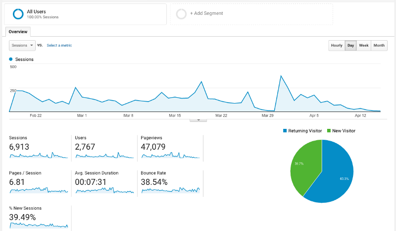
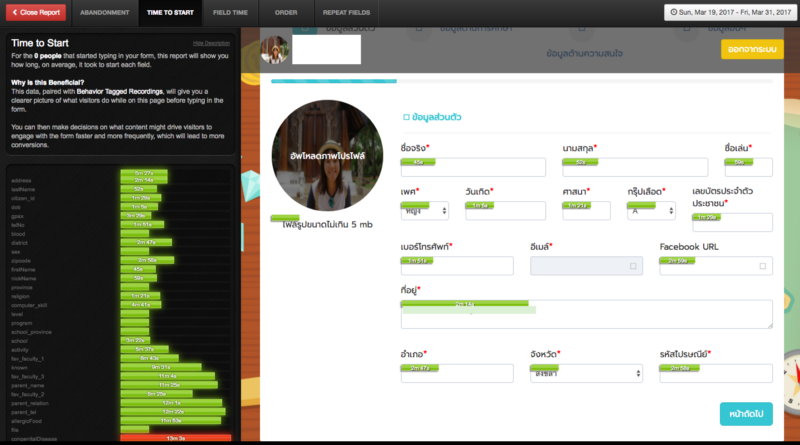

ประโยคสั้น ๆ ที่กึ่งคำถามกึ่งอุทานของพี่ชายคนหนึ่ง ชื่อ พี่อู๋ (นามสมมุติ) กับผม ใช่ครับ ประโยคนี้มันเกิดขึ้นหลังเราคุยว่าปีนี้ WIP Camp #9 ทีมระบบอย่างชาวเราจะทำอะไรบ้างดี ?

ย้อนกลับไปสมัยเป็นปีหนึ่ง ตอนเข้ามาเป็นทีมเดฟใหม่ ๆ เรารับผิดชอบในส่วนของหน้าเว็บ แล้วระบบรับสมัครเป็นของพี่ปีสองจะช่วยกันทำ ตอนนั้นก็คิดนะ เชี้ย หน้าเว็บแม่งต้องสุดว่ะ แล้วมันก็สุดจริงๆ ตอนนั้น

อันนี้เป็นอันปัจจุบันค้าบบ ของ **WIP Camp #8** กระตุกนิดหน่อย เพราะยัดหลาย ๆ อย่างลงไปมากมายเลยฮะ : )

ไม่รู้เหมือนกันว่าทำไปได้ยังไง แต่ก็นะ เวลาผ่านเลยไปจนถึงวันหนึ่งที่เราต้องขึ้นมาเป็นพี่บ้าง : ) เรื่องราวมันก็เข้มข้นขึ้น (มากเลยล่ะ)

---

### KICK OFF.

**ช่วงกลางพฤศจิกายน 2559** ตอนนั้น **WIP Camp #9** ยังไม่ได้ตกลงกันเลยว่าจะเริ่มวางแผนกันยังไงเมื่อใร ? .. แต่ไม่ได้แหละ ถ้าช้ากว่านี้ ทีมเราทำงานไม่ทันแน่ๆ .. ปกติมันเปิดรับสมัครช่วงกุมภาฯ ไง (เชี้ย!!) เราเองก็ผ่านทีมเดฟมาแล้วปีหนึ่ง ปีที่แล้วเว็บที่เราทำก็เผา ไม่ได้นะ! เราจะต้องไม่เผาอีก แล้วระบบสมัครข้างในมันเป็นยังไง ก็ยังไม่รู้เลย ต้องรีบคุยแล้ววว ไม่ได้และ

**งั้นประชุมเหอะ -..-** ใช่ แล้วเราก็นัดคุยกับทีม ว่าในวิปแคมป์ ทีมเดฟเราต้องทำอะไรบ้าง ?

โอเค รู้และ มันต้องมีระบบสมัครสมาชิก ให้น้องเข้ามาสมัครค่าย

ใช่ นั่นระบบแรก และระบบเดียวที่เราเห็นและสัมผัสได้จากตอนอยู่ปี 1 .. แต่ไม่ มันยังมีอะไรอยู่ใต้ **Iceberg** อีกเยอะ

เช่น ระบบตรวจคำถาม ตรวจข้อมูลส่วนตัวและยืนยันเอกสาร หน้าประกาศผลคัดเลือกน้องค่าย ระบบจัดการภายในค่าย ระบบ Check-in ระบบแต้มในค่าย เกมส์ที่ใช้ IT ในค่าย $\*@#%)! และอีกเป็นสิบที่เรานับได้ ในการประชุมนั้น

](./asset-3.png)

ทั้งหมดคือ ภาพรวมที่จะเกิดขึ้นในค่าย ที่เราจะ(ต้อง)ทำมันขึ้นมา : )

### WE ARE BACKEND DEVELOPER.

ในช่วงนี้ พวกเราเลือกโฟกัสกับ 2 ระบบหลักก่อน นั่นคือ

-   **ระบบสมัครสมาชิก** **:** ให้น้องเข้ามาสมัครสมาชิก
-   **ระบบจัดการค่าย** **:** เป็นระบบที่ใช้จัดการต่างๆ ภายในค่าย ในช่วงนี้ เราจะทำแค่ **3 Features** ก่อน คือ ตรวจข้อมูลและเอกสาร, ตรวจคำถาม, และ ยืนยันสิทธ์สำหรับคนที่ผ่านการคัดเลือก

แบ่งออกเป็น **3 Phases** ใหญ่ๆ .. มาดูกันฮะ ผมจะเล่าให้ฟังว่าพวกเราเจออะไรมาบ้าง ..

#### **OPENING / ช่วงเปิดรับสมัคร**

มันเป็น First Impression ของน้องที่จะได้สมัครสมาชิก มันเป็นงานใหญ่งานแรกของทีมเดฟ และมันต้องทำให้มันออกมาดีที่สุด

ช่วงนี้เป็นช่วงที่กดดันมาก เพราะระบบใกล้เสร็จแล้ว แต่มันก็ยังไม่เสร็จดี ยังมีบัคอยู่ ยังมีนั่นนู่นนี่ที่ยังไม่ได้เทส UI ก็ยังไม่นิ่ง ไม่ลงรอยกันของบางหน้า เพราะเราทำแยกส่วนแล้วเอามาประกอบกัน เราเปิดรับสมัครกันในตอนเที่ยง ของวันอาทิตย์ที่ 18 กุมภาพันธ์ 2560 ซึ่งวันนั้นเป็นวันที่พี่ๆ ส่วนใหญ่ และทีมเดฟของผม เข้างาน Agile Workshop ด้วย

และสิ่งที่เกิดขึ้นก็คือ ตอนบ่ายสามโมง มันบัคครับ -..- บึ้มจนเข้าเว็บไม่ได้ไปหนึ่งชั่วโมงเต็ม ! (เคยเขียนโค้ดทั้งน้ำตามั้ยล่ะ) ใช่ครับ ปัญหามันเกิดจาก พอเว็บเป็น https แล้วตอนเราทำมันอยู่บน local และ stagging server มันเป็น http .. แล้วเราไม่ได้ใช้ uri ที่เป็น https ใน facebook apps ให้เป็น Valid Domain เท่านั้นแหละ เละเทะครับผม แต่เราก็หาเจอนะ -..- แต่เวลามันก็นานพอที่จะทำให้เราใจเสียไปแล้วว (สำหรับคนที่อ่านไม่รู้เรื่อง เอาเป็นว่ามันพังนั่นแหละ T^T)

บทเรียนราคาแพงนั้น ทำให้เราเองก็รัดกุมขึ้น ไม่ pull ลง production server มั่วซั่ว และทีม Infra ก็ลบ User ที่เราใช้ออกจาก production server เลยด้วย (เศร้า) และแล้วตั้งแต่เราก็เอาขึ้น stagging server ก่อนเสมอ

> เรื่องนี้สอนให้รู้ว่า ..​   
> “ การที่ต้องเอาขึ้น Dev Server ก่อน จะทำให้เรารู้ว่า ใครเป็นฝ่ายผิด ! เพราะถ้าหากมันรันบน Dev Server ได้ฉลุย แต่ขึ้น Production แล้วพัง โดยที่ Dev Server กับ Production Server ต้องเหมือนกันทุกประการ ดังนั้นมันไม่ใช่ความผิดของเราแล้วล่ะ มันจะทำให้ระบุปัญหาง่ายขึ้นอีกเยอะเลย ”  
>  — พี่อู๋(นามสมมุติ) ได้สั่งสอนผมเอาไว้

จากข้างบน สมมุติว่าเรามี Dev Server และ Production Server ก็จริง .. แต่ทั้งคู่มี Environment ไม่เหมือนกัน มันจะทำให้เราเหนื่อยคูณ 2 เพราะอัพขึ้น Dev เสร็จเช็คทีนึง แล้วขึ้น Production อีกก็เช็คอีกทีนึง แบบนี้ มุงไม่ต้องมี Dev Server ก็ล่ายจ้า

แต่หลังจากนั้นหนึ่งอาทิตย์ ระบบตรวจข้อมูลและเอกสารก็ขึ้น Production มา ให้ฝ่าย PR และ ฝ่ายทะเบียนลงมือตรวจสอบข้อมูลเอกสารของน้องกันจ้าาา

เราก็แอบมีทำสถิติด้วยน้า >< ว่าตอนนี้คนสมัครแล้วทั้งหมดกี่คน คนสมัครสมบูรณ์กี่คน อะไรยังไง แต่ก็โดนคอมเม้นว่ายังไม่ตรงจุดเท่าไหร่ ปีหน้าน่าจะพัฒนาได้มากกว่านี้แหละ

#### **EVALUATION / ช่วงปิดรับสมัครและตรวจคำถาม**

มาถึงช่วงปิดรับสมัครเราก็วุ่นเช่นเคยครับ ปิดรับสมัครวันอาทิตย์ปุ๊บ ระบบต้องปรับเป็นโหมดปิดรับสมัคร และปรับเว็บจัดการค่ายให้เป็นโหมดตรวจคำถาม แถมเราเอง ต้องจัดการ Role พี่ค่ายในระบบที่ต้องเข้าไปตรวจคำถามแต่ละข้อด้วย ว่าคนนี้ตรวจข้อนี้ คนนั้นตรวจข้อนั้น มันส์สุด ..

เวลา 20:00 น. วันพุธ เราระบบสมองสองมือ สามสิบชีวิต ตรวจคำถามน้อง ตรวจข้อมูลส่วนตัวรอบที่สองกัน ในห้องเรียนที่คณะ กว่าจะแล้วเสร็จและได้น้อง 100 คน โดยผ่านการตรวจจากประธานค่ายแล้วก็ปาไปตีสาม : )

มันก็เป็นโมเม้นที่สนุกดีนะ ชอบ ทุกคนดูอินกับการตรวจ .. ที่สำคัญคำตอบของน้องแต่ละคนก็เกรียนเหลือเกินนน น ~ // แต่พวกพี่ก็ชอบนะ

---

#### **ASSERT / ช่วงยืนยันสิทธิ์**

ช่วงนี้ไม่วุ่นน ช่วงนี้สบายย ~ เพราะไม่มีบัคมากวนใจเลย เริ่มคล่อง จะมีกวนก็แค่ ตอนเปิดให้น้องอัพโหลดสลิป ตอนนั้นเราอยู่สนามบิน เป็นการโค้ดตรงเกตที่สุวรรณภูมิที่มันส์มาก เด็กๆ แห่มาดู พี่ทำไรอยู่ เหมือน hacker โลยยย ..

พูดถึงเรื่องการโอนเงิน จริงๆ ตอนแรกเราวางแผนว่าจะใช้ Omise ในการตัดบัตรเครติด/เดบิต ให้น้องๆ สะดวกในการโอนเงินมากขึ้นนะ แต่.. ด้วยความปลอดภัยของ Omise เค้าขอสำเนาบัตรประชาชนคณบดีเพื่อมายืนยัน ด้วยความที่มันใกล้จะต้องให้น้องโอนแล้ว กลัวไม่ทันการ ไหนจะต้องมา Code ยิง Hook ไปหา Omise อีก ยังไม่ได้ศึกษาเลยว่า API เป็นยังไง ใช่ครับ .. และแล้วทีมเราเองก็เลยเป็นอันต้องยอมจำนนไป

ถ้ารอบหน้าถ้ามีโอกาส สัญญาครับ เราจะไปขอใช้อีก ! (ได้ไม่ได้อีกเรื่องนะฮ้าฟ)

---

### ABOUT OUR CODE.

จะไม่พูดถึง Code ก็ไม่ได้ ก็เราทีมเดฟนี่เนอะ : )

ในระบบรับสมัครรวมถึงระบบจัดการค่าย เรามีทั้งหมด 4 Server ครับ

**ITIM APP :** ระบบรับสมัครค่าย ที่น้อง ๆ ม. ปลายจะเข้ามาสมัครกัน ก็จะผ่านเว็บแอพตัวนี้นี่แหละ

**WIPPO APP :** ระบบจัดการค่าย เป็นส่วนจัดการค่ายทั้งหมด พี่ค่ายฝ่ายต่าง ๆ ก็จะเข้ามาใช้ระบบตัวนี้ในการทำงานของตัวเอง ซึ่งในช่วงนี้ เราจะทำแค่ **3 Features** ก่อน คือ ตรวจข้อมูลและเอกสาร, ตรวจคำถาม, และ ยืนยันสิทธิ์สำหรับคนที่ผ่านการคัดเลือก

**API Server** : เป็น API Server เชื่อมต่อโดยตรงกับฐานข้อมูล (DB Server) ทำหน้าที่แค่รับและส่งข้อมูล โดยจะไม่สามารถเข้าถึงจากภายนอกได้ ต้องเข้าผ่าน **ITIM APP** หรือ **WIPPO APP** เท่านั้น

**DB Server** : เป็น DB Server ใช้ MariaDB ครับผวมมม

ทั้ง 3 ตัวแรกเราใช้ **Laravel** ทั้งหมด โดยที่ **ITIM APP, WIPPO APP** จะไม่มีการเชื่อมต่อ Database เลย แต่เราจะใช้ **GuzzleHTTP** ในการยิง Request มาขอข้อมูลจากฝั่ง API Server แทน ซึ่งแต่ละเครื่องก็จะถือ Access Token เพื่อคุยกันเอาไว้อยู่ ซึ่งเป็นรหัสที่ถูก Generate ไว้ยาวพอสมควร .. และเป็นความลับบ :)

#### ความท้าทายของทั้งสามระบบที่ต่างกัน

**ITIM APP** — ระบบรับสมัครค่าย ความท้าทายของมันคือ ทำให้มันง่ายที่สุด เท่าที่จะง่ายได้ และต้องสวยด้วย เพราะน้องที่จะสมัครจะต้องใช้เว็บแอพนี้ ที่สำคัญมันจะต้อง Auth ได้ทั้ง facebook และ email โดยที่ข้อมูลถูกเก็บไว้ในฝั่ง API เราคิดกันนานมากว่าจะเก็บยังไง แล้วจะ auth ยังไง แล้วจะ check ยังไง เขียน middleware แบบไหน ด้วยความมวยวัดของเรา ก็ทำมันเสร็จจนได้ (ฮา)

**WIPPO APP** — ระบบจัดการค่าย ความท้าทายคือ LDAP นี่แหละครับ และต้อง Check ด้วยว่าเป็นคนที่เราอนุญาตให้เข้าได้หรือเปล่า ? และเป็น Role ไหนที่เข้ามา จะเป็นคนตรวจข้อมูลน้อง หรือ เป็นคนตรวจคำถาม หน้าตาเว็บที่เค้าใช้จะต้องออกมาคนละแบบกัน

**API Server **— ความท้าทายมันสุดแสนจะเรียบง่าย เขียนยังไงให้คนเอาไปใช้แล้วไม่งง และ Reuse ได้ .. จากใจเลยครับ โคตรยาก

นั่นสิ แต่เราก็ผ่านมาได้ ถ้าถามว่าทำไมต้องทำแบบนี้ เหตุผลแรกคือ มันใกล้เคียงกับการทำงานจริงๆ ที่ต้องเจอในอนาคต เหตุผลที่สองคือ มัน Scale ง่าย :D ตัวไหน Load ก็ Scale ออก API งี้ เหตุผลที่สามคือ ในค่ายเรายังมีส่วนของวิชาการ กิจกรรมสันทนาการ อาจจะต้องใช้ข้อมูลน้อง แล้วไงก็ทำ App ใหม่ ใช้ API ตัวเดิม สบายเรา : )

และในปีหน้า ถ้าปีนี้เราเขียนไว้ดี รัดกุมพอ ปีหน้าก็คิดกันต่อว่าควรจะปรับอะไร แก้อะไร แล้วทำในส่วนทีอยากจะแก้ก็พอ ส่วน API ตัวไหนอยากแก้หรือทำเพิ่มก็ทำเป็น v2 ถ้าดีอยู่แล้วก็คง v1 ไว้ หรือจะโละใหม่หมดก็ไม่เป็นไร : )

> สำคัญที่สุดของการอยู่ตรงนี้ ทำตรงนี้ คือ “ การที่เราได้เรียนรู้อะไรจากมันมากกว่า จริงมั้ย : ) ”

เพราะกว่าจะได้เว็บแต่ละอัน : ) มันต้องผ่านอะไรมาเยอะมากจริง ๆ

---

นอกจากนี้เราก็ยังคงเก็บสถิติต่างๆ ที่เกิดขึ้นในระบบทั้งหมด ไม่ว่าจะเป็นการเข้าเว็บไซต์ของเรา ด้วยอะไรก็ตามแต่ หรือ คนที่เข้ามาใช้เวลากับเว็บไซต์เรานานแค่ไหน หรือจะเป็นการไหลของ Form ในด้านของ UX ว่าเราคิดถูกไหม ก็มีตัวจับครับ โดยเราจะใช้ 2 ตัวนี้เป็นหลักๆ คือ

**I. Google Analytics : Tools สุดฮ๊อต ! ที่ใช้ Analytics และ Tracking เว็บเพื่อเก็บข้อมูลลลล**

ผมใช้ตัวนี้เป็นประจำ กับทุกเว็บไซต์ครับ : ) ทีมเราหัดใช้ GA กันมาเรื่อยๆ เรียนรู้ความสามารถมันกันมาเรื่อยๆ จากที่เมื่อก่อนดูแค่ Stat ต่างๆ ทั้ง คนเข้า, Session, Operation System, เวลาที่คนเข้าเยอะที่สุด

เราก็เริ่มมาดูอย่างอื่นกันบ้าง และที่เราชอบที่สุด คงจะเป็น Behavior Flow / Event Flow

จาก Tool นี้ทำให้ทีมเราสามารถเสียเวลาเป็นวันๆ มานั่งคิดวิเคราะห์ว่า คนส่วนใหญ่ ไหลตาม Flow ที่เราวางไว้หรือเปล่า ? ใช้เวลากับแต่ละหน้า Page นานไหม นานเท่าไหร่ ? อะไรยังไง ..

ข้อมูลทั้งหมดเราเก็บไว้เพื่อพัฒนาเว็บไซต์ของเราในอนาคตนั่นแหละครับ เพราะตอนนี้เราแก้ไขอะไรไม่ได้แล้ววว : ) _อดีตนั้นเป็นบทเรียนสู่อนาคตที่สวยงามในวันข้างหน้า_เน้อะ

**II. LuckyOrange : เป็น Analytics Tools มีฟังก์ชั่นที่น่าสนใจอีกตัว ที่เราเลือกมาใช้ร่วมกับ Google Analytics**

](./asset-7.png)

**ย้ำอีกที** เราใช้ร่วมกับ Google Analytics นะครับ ! ซึ่งตัว Luckyorange นั้นมีความเจ๋งตรงที่ว่า มันจะ **Record การใช้งานเว็บไซต์ของ User** ได้เลย ทำให้รู้ว่า ตั้งแต่เข้าเว็บไซต์ของเรามา ใช้งาน ใช้งาน ใช้งาน กดนู่นนั่นนี่ จนออกจากเว็บ เราจะเห็นได้หมดเลย

ตรงนี้จะทำให้เราวิเคราห์ได้มากขึ้นว่า จริงๆ แล้วหน้าเว็บ และฟอร์มกรอกข้อมูล ฟอร์มตอบคำถาม หรืออะไรที่เราออกแบบ User Experience นั้น ผู้ใช้เค้าเข้าใจจริงๆ หรือเปล่า .. ปุ่มที่เราออกแบบไว้ตรงนั้น เค้ารู้รึเปล่าว่ามันกดได้ แล้วเค้ากดมันหรือเปล่า มันทำให้เรารู้ปัญหากับการออกแบบหน้าเว็บแบบคิดไปเอง ว่ามันถูกจริงๆ หรือเปล่า

~ โคตรจะว้าวสุดๆ !

**แถม !** เราสามารถดู Live ได้ด้วย ว่าตอนนี้ใครใช้งานเว็บไซต์เราอยู่บ้าง แล้วอยู่หน้าไหน กำลังทำอะไรอยู่ คลิกตรงไหนอยู่ / แต่ผมไม่สามารถแคปมาให้ดูได้นะครับ :) พอดีลั่นกด Unsupscribe ไปแล้ว .

อีกอย่าง เราสามารถ Analytics Form ได้ด้วยยย วิเคราห์ได้ลึกมากๆ ได้เป็น Form ต่อ Form เลยทีเดียว ~

โดยรวมมีความสุขดีครับ กันเงินที่เสียไป 10$ ต่อเดือน ซึ่งเราใช้ไปสองเดือนครับ ก็ตก ~ 660 บาท .. กับความรู้ที่ได้กลับมา มันคุ้มค่าจริงๆ

ทิ้งท้ายไว้ คือพอผมและทีมใช้มาประมานเดือนนึง พี่ในทีมก็ไปเจอ [Hotjar.com](https://www.hotjar.com) (จริงๆ รู้จักนานแล้ว แต่ลืมไปเพราะเราไม่ได้ใช้นานมากก กับพวก Analytics Tools ที่เสียเงิน) เลยกะว่าเดี๋ยวรอบหน้าถ้ามีงานจะไปใช้ Hotjar ดูบ้าง ~ ว่าจะดีกว่า Luckyorange ขนาดไหน

---

อ๊ะๆ ลืมไปอย่างนึง แม้เราจะเก็บสถิติแล้ว แต่อย่างนึงที่เรา**ห้ามลืมเลย ! คือการ Error Tracking**

เราเลือกใช้ **Sentry.io** เพราะ**ฟรี ง่าย และ Powerful !**

เรา Tracking ทุกแอพของเราเลยครับ ทั้ง **ITIM , WIPPO , API** ทำให้ไม่ว่าจะเกิด Error ที่ตัวไหน แล้วมันเกิด Chain ไปหาตัวอื่น เราจะรู้ทั้งหมดเลยครับ : )

แล้วเมื่อ Error ก็ให้มันวิ่งไปแจ้งเราทำ Slack ซะ เท่านี้ เราก็แก้ปัญหาได้ทันท่วงทีแล้วค้าบบบ / แต่จะดีมากๆ ถ้ามันไม่เกิด Error เลย (ฮา)

ในตอนนี้เราก็ทำมาเยอะพอสมควรแล้ว ทั้ง Analytics เก็บ Stat ที่เกิดขึ้นในระบบเราก็แล้ว เก็บ User Flow / Event Flow ก็แล้ว ทำ Error Tracking ก็แล้ว ในครั้งต่อไปพวกเราวางแผนกันแล้วว่า อยากจะทำ Unit Test/Automate Test รวมไปถึงทำ CI/CD ให้ โดยใช้ Docker ซึ่ง(น่าจะ)ช่วยให้มันง่ายขึ้นด้วย และที่สำคัญ ถ้าไม่เกินความสามารถของเราพวก เราก็อยากจะทำ A/B Testing สำหรับเว็บรับสมัครของเราด้วยค้าบบบ ~

ถึงตอนนั้นแล้ว ถ้ามันเป็นยังไง เกิดอะไรขึ้นกับพวกเราบ้าง พวกเราจะกลับมาเล่าให้นะคร้าบบ : )

---

### **เห็นมั้ย? มันก็แค่เว็บค่ายเฉยๆ เท่านั้นเอง**

และวันนี้ ตอนนี้ที่ผมนั่งเขียนบทความอยู่ในห้องนอนที่บ้าน กับโคมไฟเล็ก ๆ วันนี้เป็นวันที่เราได้**น้องที่ยืนยันสิทธ์ครบแล้ว 100 คนถ้วน** ก็จากใจหนึ่งในทีมเดฟ ก็ขอขอบคุณน้อง ๆ ที่ให้ความสนใจกับค่ายเรามากๆ เลยนะ : )

-   **ขอบคุณผู้ใหญ่ใจดีทุกท่าน**ที่ให้การสนับสนุนเราเป็นอย่างดี ไม่ว่าจะเป็น Server , VPN , LDAP, AWS , Jenkins ก็สรรหามาให้ใช้กันอย่างสนุกสนาน
-   **ขอบคุณพี่อู๋ IT13** (ไม่หลอกแล้ว นี่แหละชื่อจริงเค้า) กราบเช้า กราบกลางวัน กราบเย็น พูดมาเยอะแล้ว ถ้าไม่มีพี่ผมคงมาไม่ถึงวันนี้ : )
-   **ขอบคุณพี่ออฟ IT20** (ไม่หลอกแล้ว นี่ก็ชื่อจริงเค้าเหมือนกัน) สั้นๆ อีกเน้อะ ไม่มีพี่ ผมไม่มีวันนี้อะ !
-   **ขอบคุณพี่ชนิน พี่กอล์ฟ พี่แฮม และพี่คนอื่นๆ** ที่เข้ามาคอยให้คำปรึกษาต่างๆ นานา คอยสั่งคอยสอนพวกผมให้ปรับปรุงแก้ไขอะไรเยอะมากๆ ได้อะไรเยอะมากๆ เช่นกันครับ
-   **ขอบคุณพี่ซัน พี่เจา และพี่ปี 3 ทุกคน**ที่คอยมาเป็นกำลังใจ(ฮา) คอยมาติ มาชม อยู่ด้วยกันดึกดื่น ไม่ได้กลับ ไม่ได้นอน
-   **ขอบคุณปอง ฮวก IT21** อยู่กับพวกมึงแล้วอุ่นใจ มึงสองคนแม่งโคตรเจ๋ง : ) ดีใจที่ได้เขียนโค้ดกับพวกมึงนะ ขอบคุณที่อยู่จนงานเสร็จ อย่าพึ่งทิ้งกูจนกว่าจะจบค่ายนะ เส้นทางนี้แม่งพึ่งผ่านมาแค่โค้งแรก
-   **ขอบคุณทีมเดฟปี 2 ทุกคน** ขอโทษที่บางครั้งอาจจะทำผิดไปบ้าง ทำให้เคืองใจไปบ้าง แล้วก็ขอบคุณที่ไม่ทิ้งเลา ไม่ทิ้งทีม พวกนายแม่งยอดคนจริง ๆ อะ
-   **ขอบคุณทีมฟ้อนเอ็นทุกคน** ทั้งที่ไปอยู่กับทีมหัวเขียวเอย ทีม Backend เอยย ที่พวกมึงทำเว็บ WIP Camp #9 ออกมาโคตรเท่ห์ และดีมาก ๆ ทั้งยังเว็บ Game Center อีก ดีใจที่มีพวกมึงเป็นน้อง ต่อจากนี้ก็อย่าพึ่งถอยนะ ยังมีอะไรอีกมากมายรออยู่
-   **ขอบคุณทีมเดฟปี 1 ทุกคน** ขอบคุณที่มาสร้างตำนานทีมเดฟไปด้วยกัน

และสุดท้ายขอขอบคุณ **SIT** ที่ทำให้เราได้มาเจอกัน.

> แล้วเจอกันวันค่ายนะครับ : )**  
>  Kanisorn Sutham   
>  — Developer of WIP Camp #9**
