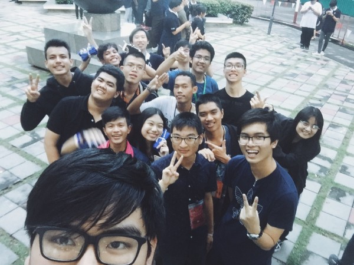
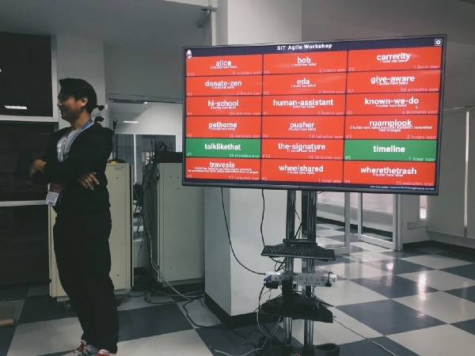
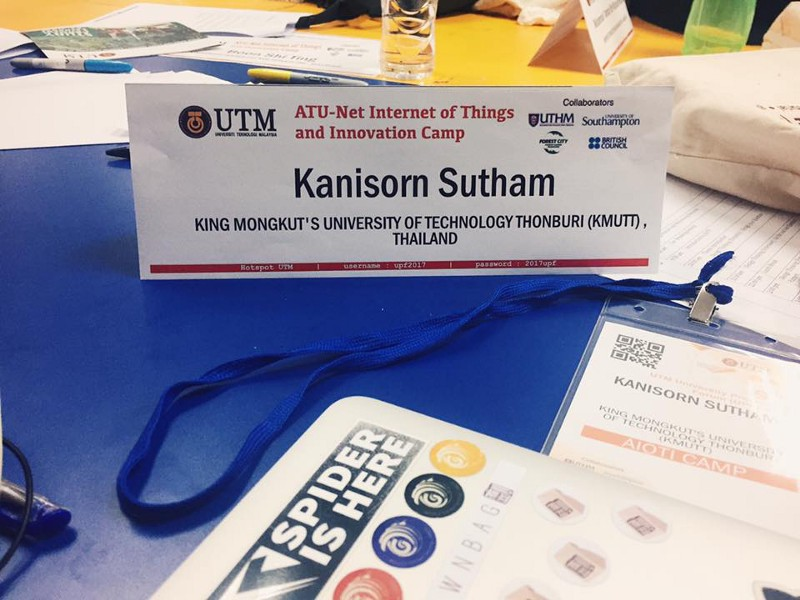
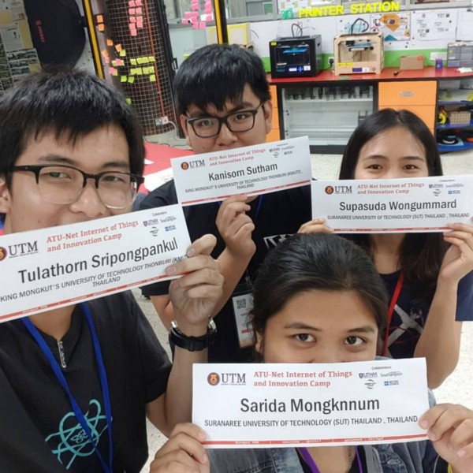
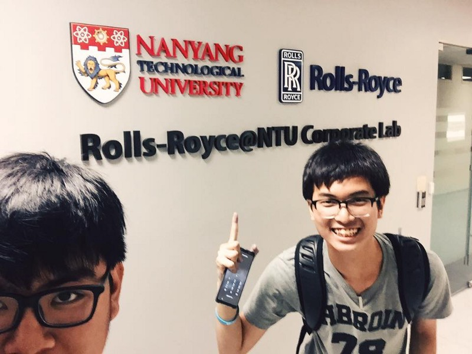
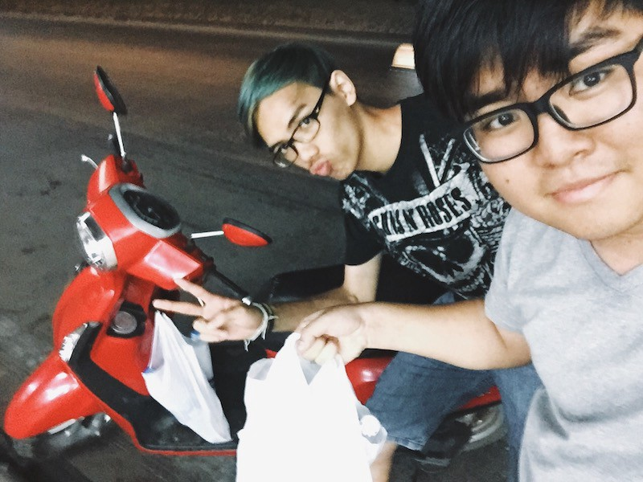
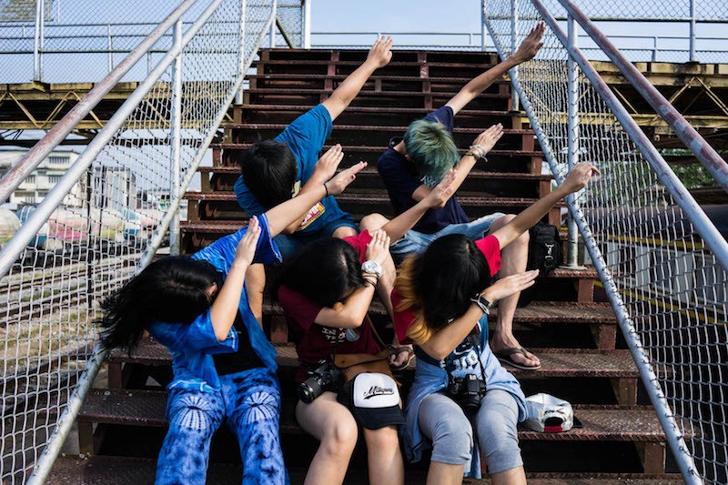
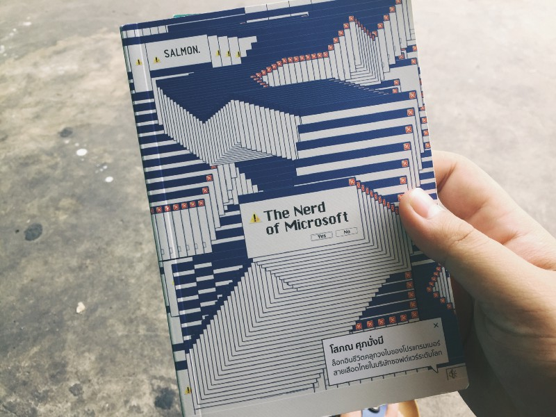
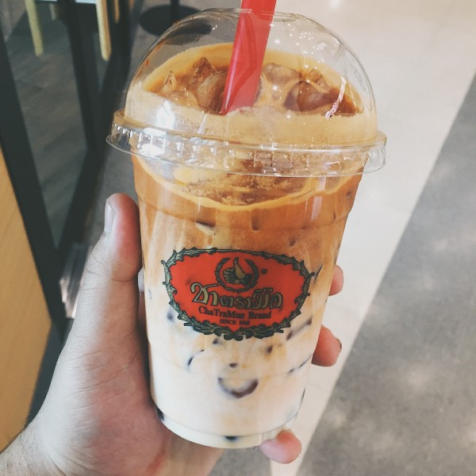

วันนี้เป็นวันที่ 1 มกราคม ตามภาษาแถวบ้านผมเรียกว่า วันขึ้นปีใหม่ ถามว่ามันเป็นธรรมเนียมไหมที่ต้องมาเขียนอะไรแบบนี้ ? ก็ไม่เชิงหรอก แต่ผมเองรู้สึกว่ามันเป็นการ Reflect ตัวเอง ทั้งเรื่องที่ดีและเรื่องที่ไม่ดีตลอดทั้งปีที่ผ่านมา เป็นบทเรียนที่มีค่าและควรส่งต่อ อย่างน้อยก็ส่งต่อให้ตัวเองในอนาคต ถ้าวันนึงผมกลับมาอ่านมันอะนะ : )  
   
ปีที่แล้วโน่น ปี 2016. ผมก็[เขียนบันทึก](https://blog.ks.in.th/%E0%B8%9B%E0%B8%B5-2016-%E0%B8%97%E0%B8%B5%E0%B9%88%E0%B8%9C%E0%B9%88%E0%B8%B2%E0%B8%99%E0%B8%A1%E0%B8%B2-%E0%B9%82%E0%B8%9B%E0%B8%A3%E0%B9%81%E0%B8%81%E0%B8%A3%E0%B8%A1%E0%B9%80%E0%B8%A1%E0%B8%AD%E0%B8%A3%E0%B9%8C%E0%B9%80%E0%B8%94%E0%B9%87%E0%B8%81%E0%B8%99%E0%B9%89%E0%B8%AD%E0%B8%A2%E0%B8%AD%E0%B8%A2%E0%B9%88%E0%B8%B2%E0%B8%87%E0%B9%80%E0%B8%A3%E0%B8%B2%E0%B8%9C%E0%B9%88%E0%B8%B2%E0%B8%99%E0%B8%AD%E0%B8%B0%E0%B9%84%E0%B8%A3%E0%B8%A1%E0%B8%B2%E0%B8%9A%E0%B9%89%E0%B8%B2%E0%B8%87%E0%B8%99%E0%B8%B0-185e5df72e6e)เอาไว้เหมือนกัน ปีนี้ก็คงเช่นเคย

### In Student Life 🎒

-   คงไม่เหมือนชาวบ้านเค้าเท่าไหร่ ที่เข้ามาในมหาวิทยาลัยจะเล่าถึงเรื่องชีวิตการเรียนของตัวเอง
-   คือมันก็มีแหละเรื่องการเรียนที่หนักหนาสาหัดเอามากๆ ในปีที้ แต่ก็เป็นปีที่หนักพอสมควรเรื่องของกิจกรรมเช่นกัน มันคงพอๆ กันเลยมั้ง ตื่นเช้ามาเรียน เรียนเสร็จทำกิจกรรมต่อ วนเป็นวัฏจักรแบบนี้แทบทั้งปี
-   กิจกรรมทุกอย่างถาโถมเข้ามาตั้งแต่ต้นปียันท้ายปี เริ่มด้วย **Alchemist on the Beach** ที่เราจัดสัมมนากันเพื่อไปเรียนรู้การทำงาน และแน่นอน แลกของขวัญด้วย : )

-   ต่อมาก็คงเป็นงานประจำปีคุ้นเคยอย่าง **WIP Camp #9** เข้าปีที่สามแล้วสำหรับค่ายที่เป็นน้องและกลายเป็นพี่และตอนนี้เป็นพี่ใหญ่ที่ต้องดูแลน้องอีกที คงเล่าได้ไม่ลึกมาก เพราะเขียนความในใจไว้ในนี้หมดแล้วในนี้

[**มันก็แค่เว็บค่ายเฉยๆ ปะวะ? ทำไมต้องทำขนาดนี้!**  
_ประโยคสั้น ๆ ที่กึ่งคำถามกึ่งอุทานของพี่ชายคนหนึ่ง ชื่อ พี่อู๋ (นามสมมุติ) กับผม ใช่ครับ ประโยคนี้มันเกิดขึ้นหลังเราคุ…_alchemist.itbangmod.in.th](https://alchemist.itbangmod.in.th/%E0%B8%A1%E0%B8%B1%E0%B8%99%E0%B8%81%E0%B9%87%E0%B9%81%E0%B8%84%E0%B9%88%E0%B9%80%E0%B8%A7%E0%B9%87%E0%B8%9A%E0%B8%84%E0%B9%88%E0%B8%B2%E0%B8%A2%E0%B9%80%E0%B8%89%E0%B8%A2%E0%B9%86-%E0%B8%9B%E0%B8%B0%E0%B8%A7%E0%B8%B0-%E0%B8%97%E0%B8%B3%E0%B9%84%E0%B8%A1%E0%B8%95%E0%B9%89%E0%B8%AD%E0%B8%87%E0%B8%97%E0%B8%B3%E0%B8%82%E0%B8%99%E0%B8%B2%E0%B8%94%E0%B8%99%E0%B8%B5%E0%B9%89-cb0dce7e3206 "https://alchemist.itbangmod.in.th/%E0%B8%A1%E0%B8%B1%E0%B8%99%E0%B8%81%E0%B9%87%E0%B9%81%E0%B8%84%E0%B9%88%E0%B9%80%E0%B8%A7%E0%B9%87%E0%B8%9A%E0%B8%84%E0%B9%88%E0%B8%B2%E0%B8%A2%E0%B9%80%E0%B8%89%E0%B8%A2%E0%B9%86-%E0%B8%9B%E0%B8%B0%E0%B8%A7%E0%B8%B0-%E0%B8%97%E0%B8%B3%E0%B9%84%E0%B8%A1%E0%B8%95%E0%B9%89%E0%B8%AD%E0%B8%87%E0%B8%97%E0%B8%B3%E0%B8%82%E0%B8%99%E0%B8%B2%E0%B8%94%E0%B8%99%E0%B8%B5%E0%B9%89-cb0dce7e3206")

-   หลังจากนั้นมาได้เป็นประธานกลุ่ม **Alchemist** จนได้และทำงานไปสองงานคือ ระบบลงทะเบียนวันแรกพบมดน้อย, ระบบสมัครชุมนุมในวันเปิดโลกกิจกรรมอย่าง KMUTT Passport
-   **SPIDER CAMP Echo** as a staff. ปีนี้มาในฐานะของสตาฟค่าย ที่ช่วยแบ่งเบาภาระพี่ๆ ในค่ายทั้งเขียนโค้ดระบบจับเวลา, แว้นไปซื้อของที่จำเป็นในค่าย ทำนั่นโน่นนี่จิปาถะ เพื่อหวังว่าโตขึ้นอีกนิด จะมาช่วยแทนพี่ชาครีได้ เย้ [Chakree Kaewchai](https://medium.com/u/3d92d7ecec54) // พอเป็น Staff แล้วก็ทำให้มองเห็นภาพรวมมากขึ้น โฟกัสกับงานน้องค่ายทุกกลุ่ม เรียนรู้จาก Comment ของกรรมการ หยิบจับข้อดีข้อเสียมาใช้งานต่อได้ดีมากขึ้นจริงๆ

> ถ้าอยากทำโปรเจคให้ออกมาดี ควรหาเรื่องไปเจอโปรเจครอบตัวให้เยอะๆ .. จะได้หยิบจับเอาข้อดีข้อเสียมาประยุกค์กับโปรเจคของเราได้  
>  — สมมุติว่าผมเข้า**ค่าย SPIDER CAMP** ทุกปีตลอดเรียนมหาลัย แสดงว่าผมจะได้เห็นโปรเจคต่างๆ จากค่ายนี้อย่างน้อย 10 ชิ้น/ปี รวม 40+โปรเจค . ทำให้ในปีสุดท้ายที่จะทำโปรเจคจบ ผมจะมีคลังข้อมูลโปรเจคเกือบครึ่งร้อยที่เป็นโปรเจคที่ถูก Comment มาแล้ว ทั้งข้อดี ข้อเสีย จุดที่ควรจะไปต่อ  
>  — อย่างว่า **จะเป็นนักเขียนต้องอ่านให้เยอะ.. จะทำโปรเจคก็ต้องเจอมาให้เยอะ**เช่นกันนะจ๊ะ

-   **SIT CRAFT CAMP** ครั้งนึงได้สอนน้องมัธยมปลายเก่งๆ จากหลายๆ โรงเรียน มาร่วมกันสอน Software Development Process ให้กับเด็กๆ เหล่านี้ กับค่าย 8 วันเต็ม สอนตั้งแต่ Define Requirement, แตกงานลง ADAPT Blueprint, แตก Task เพื่อลง Todo / Doing / Done, มี Daily Meeting, Retrospective .. ไม่รู้ว่าเป็นทางที่ใช่ไหม แต่ก็ดีใจที่มีน้องดีๆ ที่อนาคตอาจจะเข้ามาอยู่ในวงการเดียวกันก็ได้ รออยู่ ~

-   ปิดท้ายด้วย **Give’n Take | Agile Workshop** ส่งท้ายเทอม เหมือนดั่งกิจกรรมบังคับที่ต้องเข้าก่อนเพื่อเป็นพื้นฐานของ Process ในการทำโปรเจคจบ .. โดยทีมที่อยู่ด้วยกันคือ ชาย 2 หญิง 4 จากกลุ่มวิชา **INT202**: Software Development Process ที่เรียนด้วยกันมาเทอมนึง .. สุดท้ายก็ได้บทเรียนสำคัญมาหลายอย่าง

> **Make it work, make it right, make it fast**  
>  — คำพูดที่พี่หนุ่ม ยืมมาจาก Kent Beck, การทำงานมันก็ควรเป็นแบบนี้

> **May the test be with you.**  
>  — การเขียนเทสมันไม่ได้ยาก และมันจะช่วยได้มาก เมื่อทำ Product ที่ต้องพัฒนาต่อไปเรื่อย ๆ

> **Java is Great Choice.**  
>  — เริ่มมองว่า Java มันไม่ได้ยาก และมันดีกว่าและเร็วกว่าที่เราคิดเยอะ ถ้ามีโอกาศก็อยากจะลองทำ Side Project ด้วย ​Java สักครั้ง

ยังมีอีกมากมายกับความรู้ที่ได้จาก Give’n Take | Agile Workshop คิดไว้ว่าจะสรุปเอาไว้ใน Medium ถ้ามีพลังพอ ~ ใช่ครับ หลังจากนั้นความรู้สึกการทำ Software ผมก็เปลี่ยนไป มันสนุกขึ้นกว่าแต่ก่อนเยอะแยะเลย. 😁

-   ส่งท้ายปีสุดๆ ก็คงหนีไม่พ้นเรื่องราวภาคต่อของ WIP Camp นั่นคือ WIP Camp #10 นั่นเอง ~ ปีนี้ก็คงไม่เว้นเอาเทคโนโลยีใหม่ๆ มาลองเล่นกันในค่ายเช่นเคย ในท้ายปีนี้มันก็คงหมดยุคเราไปแล้วจริงๆ ก็คงต้องส่งต่อให้กับ [Tae Keerati](https://medium.com/u/d6b5b770cbcd) ที่มาจะมาแทนในตำแหน่งประธานทีมเดฟของ WIP Camp ในปีนี้

> สู้ๆ นะ. (ตบไหล่)  
>  — [Kunchai Sodhom](https://medium.com/u/fa84c5a2d64b) said, [Kanisorn S.](https://medium.com/u/9bfdc36b130) said

---

### Works 👨🏻‍💻

-   บอกเลยมันเป็นปีที่ระห่ำที่สุดแล้วครับ ดูได้จาก Stats ใน [GitHub ผมเอง](http://github.com/firstziiz) ~

](./asset-7.png)

-   ปีนี้เป็นปีที่ผมกล้าพูดได้ว่า ผม Break limits ของตัวเองได้ ในสมัยก่อน เมื่อปี 2016 ตัวผมเองเป็นคนปิดกั้นตัวเองมากๆ คนหนึ่งที่คอยบอกเสมอว่า..  
    _“กูชอบ Front End นะ เนี่ย HTML, CSS, Js เนี่ย เราทำได้ดีที่สุดนั่นแหละ”_
-   แต่ด้วยภาระและฝันที่ต้องเดินต่อ เลยจำเป็นต้องก้าวเข้าสู่ด้านมืด เอ้ย ด้าน Backend
-   พอเท้าก้าวขึ้นมาเหยียบ Back End แล้วก็จะเบือนหน้าหนีตลอด ให้มากที่สุดก็คเป็น [Laravel](https://laravel.com), Framework ในภาษา PHP ไม่กล้าจะลองอะไรใหม่ๆ เลย
-   จนปีนี้เป็นพี่ขึ้นมาบ้าง ลองนั่น ลองนี่เต็มไปหมด อยากทำไรทำ อยากเปิดไรเปิด Jenkins, DigitalOcean, AWS (EC2, S3), Docker พยายามเปิดใจลองทุกอย่างแต่ก็ยังไม่กล้าที่จะเอามาใช้จริง ได้แค่แตะๆ ผิวๆ
-   ด้วยเหตุการณ์บางอย่างเกิดขึ้นทำให้ผมจำเป็นต้องเขียน React, GraphQL, MongoDB และด้วยความจำเป็นนั้น เลยทำให้ตัวเองจำเป็นต้องลองหัดเขียนดู และพยายามกับมันจริงๆ จังๆ
-   แล้วภายใน 6 เดือนผมกล้าพูดว่าตอนนี้ก็เขียน React ได้ดีระดับนึงแล้ว : ) ได้ทำ Side Project อยู่หลายชิ้นที่ใช้ React อยู่บ้าง
-   งานนึงที่ตื่นเต้นและภูมิใจมากๆ คือ เว็บไซต์ค่าย [YWC15](https://ywc15.ywc.in.th) .. สำหรับผมค่ายนี้มันเปลี่ยนชีวิตผมไปตั้งนานแล้ว ตั้งแต่สมัยเป็นน้องอยู่ JWC5 ผ่านมาแทบห้าปีที่ได้รู้จักสายงานดิจิทอลเพราะค่ายพี่ค่ายน้องแห่งนี้ ก็ถึงโอกาสที่เราได้มาทำมันบ้างเพื่อส่งต่อโอกาสให้คนอื่นๆ // เว็บนี้ทำอยู่สองคนเอง ตัวผมกับพี่เบ๊น [Tananan Tangthanachaikul](https://medium.com/u/836178ddda69) มันส์สุดๆ

 YWC15 Website ตามนี้เลยจ้า](./asset-8.png)

[**391 Commits = YWC#15 Website**  
_ในท้ายสุดเว็บไซต์ของค่าย YWC#15 ก็เดินทางมาถึงจุดหมายสุดท้ายแล้ว เพราะเพิ่งประกาศผลผู้ผ่านการคัดเลือกค่ายเมื่อสองวันก่…_microbenz.in.th](https://microbenz.in.th/391-commits-ywc-15-website-4dc7c745e9ca "https://microbenz.in.th/391-commits-ywc-15-website-4dc7c745e9ca")

-   อีกงานที่ตื่นเต้นมากพอๆ กัน เพราะเวลาน้อยมากๆ คือ SIT CRAFT CAMP ซึ่งคนทำเว็บก็มีอยู่หยิบมือนึง ขอบคุณน้องบาส [Supawit R](https://medium.com/u/44ab3d8ff183) มากๆ ที่เป็นคนมาเก็บรายละเอียดให้ น้องแนนที่วาดรูปให้ภายในเวลาอันสั้นมากๆ สนุกนะ แล้วมันก็ผ่านมาได้ด้วยดีเช่นเคย

 SIT CRAFT CAMP Website.](./asset-9.png)

[**16 ชั่วโมงกับการทำเว็บไซต์ SIT CRAFT Camp.**  
_อยากมาแชร์เล่าสั้นๆ พอดีเป็นงานด่วนๆ ที่เข้ามาช่วงสอบวันสุดท้ายพอดีเลย! ถืออารมณ์มันจะประมาณนี้ครับ ประมานวันศุกร์ที่แ…_alchemist.itbangmod.in.th](https://alchemist.itbangmod.in.th/16-%E0%B8%8A%E0%B8%B1%E0%B9%88%E0%B8%A7%E0%B9%82%E0%B8%A1%E0%B8%87%E0%B8%81%E0%B8%B1%E0%B8%9A%E0%B8%81%E0%B8%B2%E0%B8%A3%E0%B8%97%E0%B8%B3%E0%B9%80%E0%B8%A7%E0%B9%87%E0%B8%9A%E0%B9%84%E0%B8%8B%E0%B8%95%E0%B9%8C-sit-craft-camp-9f6decb46bc1 "https://alchemist.itbangmod.in.th/16-%E0%B8%8A%E0%B8%B1%E0%B9%88%E0%B8%A7%E0%B9%82%E0%B8%A1%E0%B8%87%E0%B8%81%E0%B8%B1%E0%B8%9A%E0%B8%81%E0%B8%B2%E0%B8%A3%E0%B8%97%E0%B8%B3%E0%B9%80%E0%B8%A7%E0%B9%87%E0%B8%9A%E0%B9%84%E0%B8%8B%E0%B8%95%E0%B9%8C-sit-craft-camp-9f6decb46bc1")

-   จนท้ายปีได้ทำ Portfolio ตัวเองแต่ก็ยังไม่เสร็จ แต่สิ่งที่ได้ลองก็คือ CircleCI ซึ่งปลื้มมากที่มันสามารถ Build และ Deploy เข้า GitHub Page ได้เลย ~

[**firstziiz/KS-portfolio**  
_KS-portfolio - KS Portfolio with NextJS & Github Pages_github.com](https://github.com/firstziiz/KS-portfolio "https://github.com/firstziiz/KS-portfolio")

> ลองดูในนี้ก็ได้นะ [https://firstziiz.github.io/KS-portfolio](https://firstziiz.github.io/KS-portfolio) สงสัยอะไรถามผมได้เลย  
> เย้ 🌹

-   ถ้าถามว่าตอนนี้ถนัด Stack ไหนมากที่สุด ก็คงจะเป็น Bootstrap/Semantic UI React with NextJS, Apollo/RESTful with ExpressJS, MariaDB/MongoDB , AWS (EC2 + S3 + DB), CircleCI คงเป็นทางที่ใช่ที่สุดแล้ว
-   CircleCI ของจริง! ดั่งใจที่สุดตั้งแต่ใช้มาจริงๆ ข้อดีที่เจอที่แตกต่างจาก CI ตัวอื่นๆ คือ **มันง่าย!**
-   ปีหน้าก็จะพยายามให้มากกว่านี้ คงจะหนักไปเรื่องของการเขียน Test, Clean Code, Design Pattern, Software Process Development ต่างๆ นานา คงด้วยหลักการที่ว่าพื้นฐานมันสำคัญ .. แต่เทคโนโลยีนั้นมันมีมามีไปครับผมม

---

### Go Aboard 🛫

-   เป็นปีที่ได้ไปตั้ง 2 ประเทศแหน่ะ แต่ไม่ใช่เพื่อไปเที่ยว แต่ไปเพื่อการศึกษาน่ะ : ) ขอบคุณโอกาสเจ๋งๆ จาก SIT นะครับที่ทำให้ผมไปได้ไปเป็นตัวแทนของมหาลัยไปร่วม Camp ที่มาเลเซีย

#### [AIOTI 2017, UTM Johor, Malaysia](http://www.utm.my/international/aioti/) 🇲🇾

-   เป็นครั้งแรกที่ได้เข้าค่ายนานาชาติ
-   บอกตรงๆ ว่า มันเป็นเหมือนนรก! ผมไม่กล้าพูดกับใครเลย เราเองเคยมั่นใจว่าภาษาอังกฤษเราก็พอใช้ได้นะ แต่พอเอาเข้าจริงๆ เราไม่รู้จะตอบเค้ายังไงเลย
-   นรกกว่านั้นคือ เค้าจับแยกห้องกับคนไทยด้วยกันด้วยอีก เชี้ย ~ เป็นจุดที่กลัวที่สุดครั้งนึง จากนิสัยที่เป็นคนกล้าพูดกล้าคุย แทบจะเงียบไปเลย
-   แต่สุดท้ายก็ผ่านค่ายมาได้ด้วยดี **ขอบคุณทุกคนที่ให้เรากล้าใช้ภาษาอังกฤษนะ** ขอบคุณที่ทำให้รู้ว่าการใช้ภาษาอังกฤษคุยกันมันไม่ได้ยากอย่างที่คิดจริงๆ!

-   ในค่ายเราทำ Project เกี่ยวกับ UTM Cafe ซึ่งมันคือคาเฟ่ที่ขายกับข้าวในเขตมหาวิทยาลัย เราจะ Improve มันด้วยเทคโนโลยียังไงดี? ซึ่งค่ายสอนให้เราทำ Design Thinking และออกไปเจอ User จริงๆ เลย
-   เราปั่นจักรยานทั่วมหาลัยเลย (ซึ่งใหญ่พอๆ กับ มช. รวมเขตสวนดอก) ไปนั่งสัมภาษณ์กับคนมาเลเซียเกือบยี่สิบคนและตกตะกอนมาเป็นระบบสั่งอาหารแบบจองโต๊ะได้ก่อนมา เพราะคนส่วนใหญ่ที่มากินเป็นนักศึกษาที่ต้องมากินข้าวและรีบเรียนต่อ
-   ผมใช้ Firebase เป็น Database เชื่อมกับ ExpressJS เป็น Backend โดยเปิดเป็น ​RESTful API ออกไป โดยมีเพื่อนชาวมาเลเซียสองคนเป็นคนทำในส่วนของ [MIT App Inventor](http://appinventor.mit.edu/), Arduino Board
-   ที่แลปมีทุกอย่างให้ใช้ ไม่ว่าจะเป็นไม้ โฟม เทปกาว ต่างๆ นานา ยันเครื่องปริ้น 3D .. มันส์มากกกกกกกกกกกกกก

-   สิ่งที่พีคที่สุดในค่ายคือ อาหารมาเล ซึ่งคล้ายๆ อาหารใต้ของเรานั่นแหละครับ
-   เพื่อนผมเอง [Tulathorn Sripongpankul](https://medium.com/u/6f8ae1246aca) เป็นคนไม่กินเผ็ด .. มันบอกว่า **จบค่ายนี้กูกินเผ็ดได้แล้วล่ะเพื่อน!** กินข้าวกันทุกๆ 3 ชั่วโมง
-   ผมมีโอกาศได้คุยกับเพื่อนมาเลคนที่เคร่งศาสนาอิสลามมากๆ คนหนึ่ง เรานั่งคุยและเปิดใจคุยกับในเรื่องขนบธรรมเนียมของชาวอิสลาม เพื่อนคนนี้ก็ได้อธิบายหลายอย่างที่สำคัญ หลายๆ คำถามก็ทำให้ผมรู้ว่าชาวอิสลามก็มีเหตุผลของเขาเช่นกัน สิ่งที่ผมยังจำได้ดีในสิ่งที่เค้าอธิบายคือ คำว่า**ฮาลาล**นั้น มันไม่ใช่แค่อาหารนะ แต่มันคือการกระทำ
-   เที่ยวห้างมาเลเซียครั้งแรก เจอคนไทยเป็นเจ้าของร้านอาหาร เค้าลดราคาให้ด้วย **เยี่ยมจริงๆ !**
-   อ้อ! ลืมไปอีกอย่าง วันแรกเค้าพาเราไปเที่ยวในเมือง Johor หนึ่งในทริปที่เค้าพาไปคือ ล่องเรือไปกลางแม่น้ำที่เป็นชายแดนมาเลเซีย-สิงคโปร์ บอกเลยว่าโหดสุดๆ เพราะไปอยู่ตรงกลางแม่น้ำจริงๆ ขนาดสัญญาณมือถือยังจับของมาเลบ้าง จับของสิงคโปร์บ้างเลย

#### NTU, SINGAPORE 🇸🇬

-   หลังจากค่ายได้แอบโดดเรียนอีกสามวันเพื่อข้ามฝั่งไปสิงคโปร์
-   พอดีที่น้องชายของพี่เวคินเจ้าของร้าน [Appresso.Cafe](https://www.facebook.com/APPRESSO.Cafe/) เค้ามาเรียนต่อ Nanyang พอดีเลยรบกวนพี่เวเค้าติดต่อให้พี่ตี๋ น้องชายมาช่วยนำเที่ยวในมหาวิทยาลัยให้ -0- Exclusive Trip สุดๆ มาดูกันเลยว่ามหาวิทยาลัยเทคโนโลยีอันดับต้นๆ ของเอเชีย(หรือระดับโลก)เค้าเป็นอยู่กันยังไง!
-   บอกก่อนว่า [Nanyang Technological University, Singapore](http://www.ntu.edu.sg/) (NTU) เป็นมหาวิทยาลัยในฝันของผมตั้งแต่สมัยมัธยมแล้วนะครับ ครั้งแรกที่ผมมองว่าน่าจะไปเรียนต่างประเทศนะ ก้มีที่นี่แหละที่เตะตาและอยากไปมากๆ เคยดูแต่ในรูป และครั้งนี้เป็นครั้งแรกที่ผมมาเห็นมหาวิทยาลัยโหดนี้กับตาตัวเอง
-   ตื่นเต้นสุดคงเป็นห้อง Student Lounge ที่ข้างในมีตั้งแต่โต้ะติว ไวท์บอร์ด ยัน PS4 ยันโต๊ะปิงปอง โหดสุดคงเป็นโต๊ะพูล และโต๊ะสนุกเกอร์ บรรยากาศแบบนี้คงหายากในมหาวิทยาลัยในเมืองไทย บอกเลยว่าตื่นเต้นมาก

-   อีกอย่างนึงที่ตื่นเต้น และคิดว่าเป็นสิ่งที่ไม่คิดว่าจะเกิดขึ้นในไทย คือ มินิมาร์ทในมหาลัยขายเหล้าเบียร์เพียบ มี Jack Daniels ที่ผมชอบด้วย :) คงเป็นปกติสำหรับเมืองนอกเนอะ แต่สำหรับผมนี่เป็นครั้งแรกที่เห็นสถานศึกษาเปิดกว้างแก่ผู้ที่มีวุติภาวะแล้วแบบนี้ ดีใจจริงๆ

-   ขอบคุณพี่รุ่ง, พี่เวคิน ที่แนะนำน้องชายของพี่, พี่ตี๋ พี่นักศึกษาทุนปริญญาเอกที่ NTU ให้รู้จักนะครับ.. แล้วก็ขอบคุณพี่ตี๋และเพื่อนๆ มากๆ นะครับ ที่พาเยี่ยมชม NTU แล้วก็พาเข้าห้องแลป Robotics พาไปชมหุ่นยนต์ตัวเป้งๆ ที่ใช้งาน ที่วิจัยกันจริงๆ ให้เห็นกับตา
-   ถ้ามันไม่ได้ไกลเกินฝัน สักวันผมจะไปให้ได้บ้าง แต่ก็อย่างคำคมที่พี่ตี๋บอกไว้   
    “No free launch” ของมันไม่ได้ได้มาง่ายๆ คงต้องพยายามอย่างหนักเลยทีเดียว นั่นแหละ แต่ก็ไม่ใช่ว่ามันเป็นไปไม่ได้นี่นา
-   นี่ก็เคยไปเหยียบข้างในมหาลัยแล้วครั้งนึงแล้วนิ่เนอะ

---

### TRAVEL IN THAILAND 🇹🇭

-   **ทริปสุราษฎร์ฯ** #เชี่ยวหลานใครอะ เป็นครั้งแรกที่ออกไปเที่ยวต่างจังหวัดกับเพื่อนๆ มหาลัย ตั้งแต่เข้าเรียนมา
-   #เชี่ยวหลานใครอะ มาจากเพื่อนมิวที่พูดขึ้นมาว่า เชี่ยวหลานใครอะ ใช่ นั่นสิ.. เชี่ยว หลานใครอะ ??
-   ไกลมากที่สุดตั้งแต่เคยไปมา แน่นอน**สุราษฎร์ฯ**คงไกลจากเชียงใหม่บ้านเกิดผมมากจริงๆ ~
-   เป็นโอกาสที่ดีมากๆ ที่ได้ลงวิชา GEN ท่องเที่ยว ทำให้จำเป็นต้องไปเที่ยวที่ไหนก็ได้ที่ไกลกว่า กทม. 200 กิโลเมตรอย่างต่ำ

 อ่านต่อที่นี่เลยนะฮับบ 🚤](./asset-18.jpeg)

-   คอนเซปมันคือ **Low cost Travel** แน่นอน รถไฟชั้นสามครั้งแรก นอนแพกลางเขื่อนที่ไม่มีแม้แต่ไฟฟ้า เดินเป็นกิโลๆ เพราะไม่อยากเสียค่าตุ๊กๆ
-   มันคือการไป**สุราษฎร์ฯ** ครั้งแรกของผมเอง ซึ่งก็ตื่นเต้นดีนะ ไม่เคยเห็นเมืองใต้เลย ราคาค่าครองชีพพอๆ กับเชียงใหม่ ซึ่งผมรับได้ ไม่แพงจนเกินไป
-   ทริปนี้เป็นทริปที่โชคดีเอามากๆ ทริปนึง .. เราเจอคนดีๆ ตั้งแต่ลงจากรถไฟ มีคนพาไปร้านอาหารใต้อร่อยๆ เป็นเจ้าถิ่นแถวนั้นเลย
-   เจอการ์ดที่แพในเขื่อนเชี่ยวหลานที่เฮฮา ขอแค่มีดเอามาหั่นมะนาว เค้าแถมให้ทั้งมะนาว ทั้งเกลือ ทั้งแก้วป้อกให้ด้วย **เยี่ยม!**
-   โฮสเทลบรรยากาศดี ใกล้แหล่งท่องเที่ยวในราคาที่ไม่ได้แพง พร้อมเป็นเด็กแว้นที่สุราษฐครั้งแรก เพราะยืมรถน้าที่ Counter โรงแรมไปซื้อน้ำที่เซเว่น

-   โดยรวมเป็นทริปที่มีเสน่ห์ และสนุกมากๆ ทริปนึงเลยล่ะ
-   เป็นประสบการณ์ที่ดีมากครั้งนึงในปีนี้ ปีหน้าเอาอีกนะ ~ ขอบคุณเพื่อมร่วมทางดีๆ ทั้งห้าคน(แตน โอติส มิว เต๋า และเราเองเฟิส) .. ขอบคุณนะ.

---

-   ทริปส่งท้ายปี #CNXTrip #ลำพูนไม่ลำพัง #ชายฉกรรจ์ อะไรไม่รู้แหละ แต่เป็นทริปกลุ่มเล็กๆ ของเราที่หาเงินกันมาแรมปี เพื่อมาถลุงที่เชียงใหม่กันทุกบาททุกสตางค์
-   ตั้งแต่ลำพูน > อินทนนท์ > ข้าวซอยลำไย > เชียงใหม่ > ดอยสุเทพ (วัดพระธาตุ, วัดผาลาด) > ถนนคนเดินเชียงใหม่ > ถนนนิมมานเหมินท์ > ลำพูน > กลับ กทม.
-   ทริปนี้มีแต่กินเที่ยวกินเที่ยว ผมขับรถกะบะคันนึง ทุกคนก็อยู่ท้ายกระบะ ขับกันวนเที่ยวเชียงใหม่ยาวๆ 3 วันเต็ม

---

### OTHER 🎮

-   เป็นปีที่อ่านหนังสือเยอะมากๆ ปีหนึ่งเลยล่ะ ทั้ง NEW YORK 1ST TIME, FULL-TIME DIRECTOR, PART-TIME LOSER และอีกเป็นสิบเล่มนับตั้งแต่ต้นปีที่ผ่านมา .. แต่ถ้าถามว่าเล่มที่ชอบที่สุดในปีนี้คงเป็น [The Nerd of Microsoft](https://store.minimore.com/salmonbooks/items/nerd-microsoft)

-   ใช้ Netflix ครั้งแรกและตอนนี้ก็ชอบมันมากๆ ~ ล่าสุดตอนกำลังเขียนบล็อกนี้ก็ดูเรื่อง Bright อยู่ .. ไม่มีแล้วผิดกฏหมายดูหนังเถื่อน ลาขาดเลยจ้า
-   ชอบ Madam Secretary ที่สุดใน TV Series ทุกๆ เรื่องที่ดูมาในปีนี้
-   พึ่งรู้ว่า Jack Daniels ไม่ได้นุ่มเท่า Black Label นะ 🥃
-   มี Board Game เป็นของตัวเองแล้วจ้า ปีนี้ตัวเองซื้อทั้งมี Avalon กับ Monopoly Debt ปีหน้าเล็งไว้ว่าจะซื้อ [I’m the Boss!](https://boardgamegeek.com/boardgame/115/im-boss)
-   พึ่งเคยได้เล่น [Cities Skylines](http://store.steampowered.com/app/255710/Cities_Skylines/) (มันลดราคาใน Steam) หวังว่าถ้าปีหน้าจัดการชีวิตตัวเองดีๆ อาจจะมีเวลาเล่นก็ได้
-   เริ่มเห็นความสำคัญของ Bot มากขึ้น เริ่มลองเขียน แต่ก็ยังไม่มากเท่าไหร่ : ) หวังว่าปีหน้าจะออก Bot ใช้เองซักตัวนึง ถ้าทำได้ เริ่มจากในทีม WIP Camp 10 ก่อนแล้วกันเน้อะ 🍦
-   ด้วยความชอบชาเย็นกว่าอะไรอื่นโดยเฉพาะกาแฟ ปีนี้เลยเป็นปีที่กินชาตรามือเยอะมากที่สุด รวมกันน่าจะได้ 150+ แก้วได้แล้วสิ ปีหน้าจะหาวิธีนับแล้วว่ากินไปกี่แล้ว

-   ใช้ Spotify ครั้งแรก และอ่าน Blog [https://labs.spotify.com/](https://labs.spotify.com/) ไปด้วย, สนุกดีนะเวลาเราใช้ Product อะไรบางอย่างแล้วเราก็ศึกษามันไปพร้อมๆ กันด้วย
-   จากปีที่แล้ว ปีนี้ก็ดู [Star Trek](http://www.imdb.com/title/tt0796366/) วนไปอีกเป็น 20–30 รอบ ภาคหนึ่ง ภาคสอง และภาคสาม วนไปเรื่อย ๆ
-   และพอมี Netflix ก็ทำให้ติด Star Trek เข้าไปอีก .. ติดตามทุกตอนเลย [Star Trek: Discovery](http://www.imdb.com/title/tt5171438/) แม้จะออกทะเลไปนิด แต่ก็สนุกมากๆ แนะนำให้ไปดู
-   มีความขี้เล่นขี้ลอง ปีหน้าหวังว่าอยากได้ Keyboard ดีๆ สักอัน ไว้เขียน Code ตามรอยพี่ๆ ที่ Pronto Tools
-   ได้เสื้อ ​GitHub แล้ว : ) ตัวแรกในชีวิต .. หวังว่าต่อไปที่กลับ กทม. เสื้อ Hacktoberfest จะมาถึงแล้วนะ

-   ความดันมาแล้ว ต่อไปก็คงน้ำตาล .. ต้องดูแลสุขภาพแล้วสิ๊
-   แด่เพื่อนกลุ่มเราทั้ง 8 คน ปีนี้เราสองนิ้วแล้วนะ แด่ปีสองที่ผ่านพ้นไป ปีหน้าเราจะก้าวข้ามโปรเจคจบไปด้วยกัน 👨🏻‍💻 รออยู่นะวันที่เราทุกคนใส่ชุดครุยแดงแล้วชูห้านิ้วบ้ายบายกันและกันไปตามฝันของตัวเอง

ถามว่าปีหน้าหวังอะไรไหม ? ก็คงมีเยอะมากพอตัว แต่ที่แน่ๆ ก็คงเป็น**ลดน้ำหนัก** และกลับมาสุขภาพดีดังเดิม 👟 วิ่งเข้าไปจ้า วิ่งเข้าไปป !

และแน่นอน พอเป็นผู้ใหญ่ขึ้นอีกปีแล้ว อย่างที่ว่าโตขึ้นอิสระมันก็มากขึ้น ความรับผิดชอบมันก็ตามมาเช่นกัน .. อะไรที่แย่ก็ระลึกไว้เป็นบทเรียนและประสบการณ์ อะไรที่ดีก็เก็บไว้เป็นกำลังใจต่อไป

ขอให้เป็นปีที่ดี ~ สวัสดีปีใหม่ครับ 🎉

> Happy new year, 2018

> — KS.
