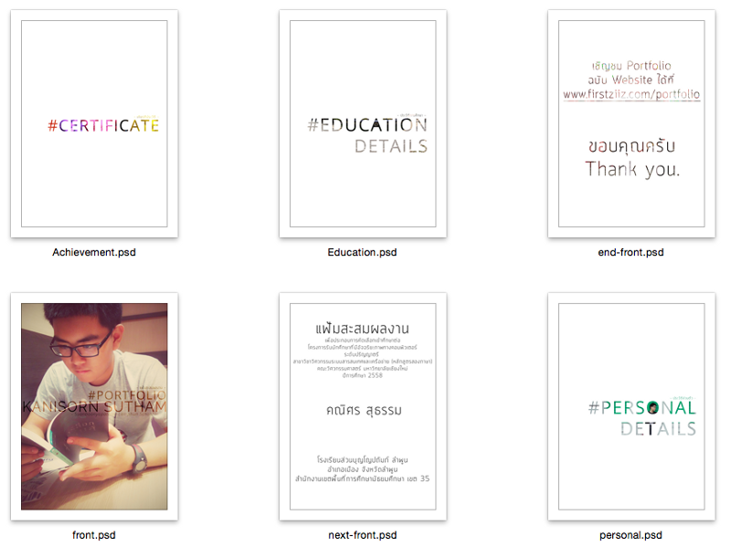

ผมจะมาแชร์เทคนิคและวิธีการทั้งหมดในการทำ _Portfolio_ ที่ทำให้ผมติดคณะที่ผมใฝ่ฝัน : )

ก่อนจะมาเริ่มกันก็ขอเกริ่นอะไรซักนิดนึงนะครับ ..

> Portfolio มันคือสิ่งที่จะพูดแทนตัวเรากับผู้อ่าน ว่าเราเป็นใคร? มาจากไหน? เคยทำอะไรมาบ้าง? ..สรุป มันไม่จำเป็นต้องมีแต่ผลงานอย่างเดียว โอเคนะ

ก็.. มันไม่มีไรมากมายหรอก คือตัวผมเองเนี่ย ให้สัญญากับตัวเองไว้ว่าว่าถ้าสอบติดในที่ที่อยากเข้าแล้ว ก็จะมาเขียนบทความเรื่องเกี่ยวกับ **_Portfolio_** ในแบบฉบับของผมให้อ่านกัน เผื่อเป็นแนวทางให้หลายคนที่ยังไม่ได้ทำ และใกล้จะสอบเข้ามหาลัยกันแล้วด้วย

มาเริ่มเล่ยยย…

### 3 สิ่งที่ควรรู้ก่อนเริ่มทำ Portfolio

- **_Portfolio_** มันก็คือ _“แฟ้มสะสมผลงานของตัวเอง”_ ควร ทำมันด้วยตัวเอง ถึงจะจับนู่น หยิบนี่ จากพอร์ทฯของคนอื่นแล้วมาทำเป็นพอร์ทฯตัวเอง แต่เชื่อผมเถอะ ถ้าทำจากใจเราเองเนี่ย สุดท้ายแล้วมันจะออกมาในแบบที่เป็นเราอย่างแน่นอน ผมรับรอง : )
- **_Portfolio_** มันไม่มีไรหรอก แค่แฟ้มหรือสมุดหรือหนังสือหรือนิตยสารหรืออะไรก็แล้วแต่ ที่มันรวมประวัติ ผลงาน กิจกรรม ต่าง ๆ ของเราเอาไว้ ให้คนที่อ่านรู้ว่าเราเป็นใครมาจากไหนทำอะไรได้บ้าง แค่นั้น .. แค่นั้นจริง ๆ ~
- **_Portfolio_** ของผม ทำขึ้นโดยใช้โปรแกรม Photoshop กับ Pages แค่นี้ครับ ~

---

### 7 ส่วนประกอบสำคัญของ Portfolio

..ต้องบอกก่อนเลยว่า**_Portfolio_** ในสไตล์ของผมจะเน้นให้อ่านง่าย ให้การอ่านมันเข้าใจง่ายที่สุด ! อ่านแล้วเก็ตเลย ไม่ปวดตา ไม่ล้า น้อยเน้น ๆ

### 1\. หน้าปก

ตามที่บอกก็ต้องให้มันสะดุดตา น่าค้นหา ~ พูดง่ายทำยากครับ แต่ถ้าจะถามว่าทำยังไงให้น่าสนใจหรอ ? สำหรับผมก็หารูปตัวเองมาทำเป็นปกหน้าเลย เย้! มั่นใจในหน้าตาครับ ผลงานของตัวเองทั้งที เอารูปคนอื่นมาใส่มันก็คงไม่ใช่นะจริงมั้ย ? รูปเรานี่แหละครับ น่าสนใจกว่าตัวอักษรหรือฟอนต์สวย ๆ เยอะครับ

### 2\. คำนำ & คำนิยม

สำหรับในส่วนของคำนำ ก็เขียนให้เขารู้ว่า Portfolio นี้ของใคร? ทำเพื่อคณะอะไร? โครงการไหน? มีวัตถุประสงค์อะไร? ในพอร์ทฯ มีอะไรบ้าง? ถ้าใครยังมองไม่ออกเดี๋ยวดูของผมเป็นตัวอย่างอยู่ข่างล่างนะ แล้วในส่วนของคำนิยมก็ให้คุณครูเขียนให้ครับ เกี่ยวกับตัวเราสอดต่อคำนำเลย

> ..Portfolio ของผมไม่มีสารบัญนะ เพราะอาจารย์ทุกท่านควรจะเปิดพอร์ทฯของเราทุกหน้าทุกแผ่น เรามีหน้าที่ทำให้พอร์ทฯหน้าสนใจ เพื่อที่เค้าจะได้อ่านไปเรื่อย ๆ ไม่มีสะดุด จะทำให้พอร์ทฯของเรามีเสน่ห์นะครับ : )

### 3\. ประวัติส่วนตัว & ประวัติการศึกษา

ส่วนนี้ก็มีประวัติส่วนตัวทั่วไปของตัวเราครับ ไว้ให้อาจารย์รู้ว่าเราเป็นใครมาจากไหนงี้ อาจแนบใบสำเนาทะเบียนบ้าน สำเนาบัตรประจำตัวประชาชนไว้ด้วยจะเหมาะมาก : ) ส่วนประวัติการศึกษานั้นก็ไล่มาเลยครับ ว่าเราเรียนจบจากที่ไหนมาบ้าง แต่ส่วนของหลักฐานนั้นใช้ใบ ปพ.1 ของมัธยมต้ม-ปลาย ก็พอครับ .

### 4\. เกียรติประวัติ

เอาละครับถึงตรงนี้แล้วเริ่มยาวหน่อย ..ส่วนของเกียรติประวัติเนี่ย คือให้ใส่เกียรติบัตรที่เคยได้รับมาจากการแข่งขันต่างๆ ส่วนนี้เป็นส่วนที่สำคัญมากเลยนะครับ จะวัดกันเลยว่าเรามีความสนใจในสาขาวิชานี้หรือไม่ มากน้อยเพียงใด อาจารย์ก็ดูจากส่วนนี้แหละครับ อย่าลืมจัดลำดับให้ดีด้วยนะครับ

### 5\. ผลงานและกิจกรรม

ส่วนนี้เป็นส่วนที่สำคัญที่สุดใน Portfolio ครับ ทั้งผลงานที่เคยทำ กิจกรรมที่เราเคยเข้าร่วม มีรูปใส่รูป อย่าลืมใส่บรรยายใต้ภาพไปด้วยน้าา ~ ข้อควรระวังคือการจัดลำดับให้ดีครับ เพราะหากผลงานเรามีมาก ควรจัดให้เป็นหมวดหมู่เรียงให้ง่ายต่อการอ่าน อย่างนี้จะเพิ่มเสน่ห์ให้กรรมการติดใจได้อย่างมากเลยครับ : )

## My Portfolio

จุดนี้ก็เพื่อเป็นแนวทางให้ดูกันคร่าว ๆ ว่าผมทำ Portfolio ฉบับของผมนั้นเป็นยังไงกัน ?

นี่เป็นหน้าปกบางส่วนที่ผมทำขึ้นไว้ในพอร์ทนะครับ ทั้งปกใน ปกนอก หรือปกบท~

พอจะมองภาพออกแล้วใช่มั้ยครับ : ) อย่างหน้าปกที่บอก ผมก็เอาหน้าตัวเองเลยมาเป็นปก สำหรับผมเนี่ยเด่นกว่านี้คงไม่มีอีกแล้ว ~

---

### ดู Portfolio ของผมได้ที่นี่นะ

เข้าไปดู เข้าไปโหลด **ได้ที่** [**A**rchive.ks.in.th/SIT_portfolio.pdf](https://archive.ks.in.th/SIT_portfolio.pdf) ก็ลองเข้าไปชมเป็นแนวทางในการทำพอร์ทของตัวเองก็ได้น้า เพราะเล่มนี้คือเล่มที่ผมใช้ไปสอบอยู่สองที่และผ่านการคัดเลือกด้วย : )

และ! **Portfolio ฉบับเว็บไซต์** ที่ผมใช้ในการร่วมเข้าสัมภาษณ์ในทุก ๆ ครั้ง ที่ [**A**rchive.ks.in.th/Portfolio](https://archive.ks.in.th/portfolio)

---

## บทส่งท้าย..

ก็ต้องขอขอบคุณบทความดี ๆ ของพี่[@natdanai](http://blog.appmodish.com/%E0%B8%A7%E0%B8%B4%E0%B8%98%E0%B8%B5%E0%B8%81%E0%B8%B2%E0%B8%A3%E0%B8%97%E0%B8%B3%E0%B9%81%E0%B8%9F%E0%B9%89%E0%B8%A1%E0%B8%AA%E0%B8%B0%E0%B8%AA%E0%B8%A1%E0%B8%9C%E0%B8%A5%E0%B8%87%E0%B8%B2%E0%B8%99-%E0%B8%97%E0%B8%B5%E0%B9%88%E0%B9%80%E0%B8%A3%E0%B8%B5%E0%B8%A2%E0%B8%81%E0%B8%81%E0%B8%B1%E0%B8%99%E0%B8%A7%E0%B9%88%E0%B8%B2-portfolio/) และ [@kopskyz’s](http://kopskyz.exteen.com/20120901/kopskyz-s-portfolio) ที่ทำให้ Portfolio ผมเป็นจริงขึ้นมาได้ : ) และขอขอบคุณพี่ตู่ [@tudtu](https://www.facebook.com/tudtu.tachaiwong) ที่ปริ้นพอร์ทนี้มาให้ผมก่อนไปสอบได้ทันแล้วให้จ่ายเงินทีหลังได้อีก ~ ไม่มีพี่ในวันนั้นคงไม่ติดในวันนี้ ..ขอกราบขอบพระคุณอย่างสุดซึ้ง

และในตอนนี้ผมก็เป็นนักศึกษาชั้นปีที่ 2 คณะเทคโนโลยีสารสนเทศ หลักสูตรเทคโนโลยีสารสนเทศ มหาวิทยาลัยพระจอมเกล้าธนบุรี และผมเองก็เขียนบทความนี้มาเมื่อสองปีก่อนแล้ว แต่ติดปัญหานิดหน่อย ทำให้ต้องลบ*บล็อก*เก่าทิ้งไป และตอนนี้ตัวผมเองชอบ [Medium](https://medium.com/) มาก ๆ เลยตัดสินใจย้าย*บล็อก*ของตัวเองมาเขียนในนี้แทน

สำหรับน้องๆ คนไหนสงสัยหรือติดใจอะไรในการทำ Portfolio อยากปรึกษาก็ทักมาได้เลยน้า : ) ถ้าสนใจเข้าไอทีบางมดก็ทักได้เหมือนกัน เดี๋ยวช่วยย : )

ขอให้น้องที่ตั้งใจและใส่ใจสมหวังในคณะที่ใฝ่ฝันนะครับ พี่เป็นกำลังใจให้
