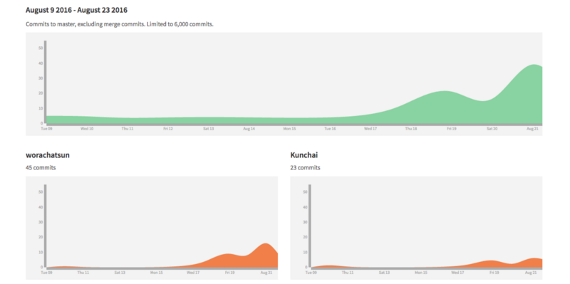
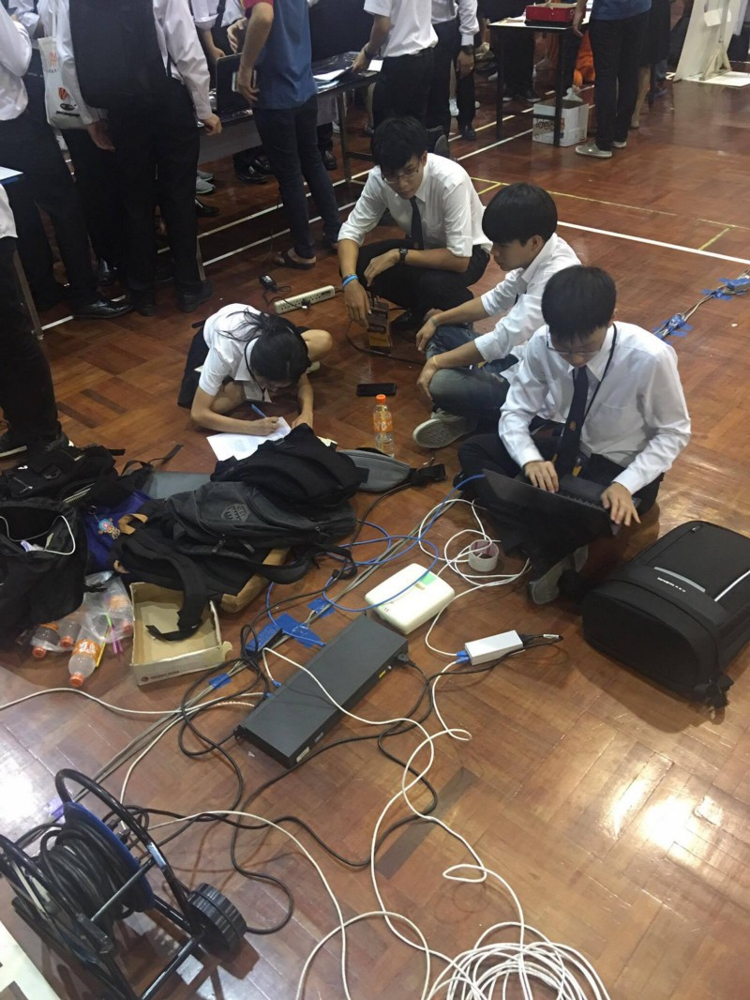

ในบทความนี้ ผมจะมาเปิดเผยเส้นทางของการวางแผนและลงมือทำ _ระบบลงทะเบียนเพื่อสมัครเข้าชมรม สำหรับ_ใช้ในวันเปิดโลกกิจกรรมของ มหาวิทยาลัยเทคโนโลยีพระจอมเกล้าธนบุรีครับ

ทุกอย่างมันเริ่มต้นโดยที่มีพี่คนหนึ่งมาชวนคุยกันว่า_จะใช้ไอทีแก้ปัญหาระบบลงทะเบียนชมรมเปิดโลกกิจกรรมยังไงดี ? .._ ด้วยความที่มีผมยังมีไฟจาก[งานปฐมนิเทศของคณะ](http://srm.sit.kmutt.ac.th/situpdate/issue5.pdf)เอง ทั้งงานแรกพบมดน้อยที่ไปช่วยพี่ๆ ดูแลระบบ เราก็เลยอยากลองอีกรอบ ก็เลยตัดสินใจไปว่า _‘‘ ทำครับพี่ ! ’’_

พวกเราเริ่มต้นทำโปรเจคนี้ เพราะว่าปัญหาที่เจอในปีที่แล้ว ที่ขัดใจนักไอทีอย่างชาวเรามากๆ เพราะใช้เป็นกระดาษ แล้วเวลาเอากระดาษที่น้องๆ ลงทะเบียน มากรอกใน Excel อีกรอบ :( .. ไม่นะ! มันควรง่ายกว่านี้ มันจึงเป็นจุดที่เราตัดสินใจเริ่มวางโครงทำระบบนี้ขึ้นมาครับ

### เริ่มลงมือทำระบบ !

หลังจากได้ปัญหาที่ชัดเจนมาแล้ว ต่อมาเรามาวิเคราะห์ผู้ใช้ว่ามีใครกันบ้าง ก็มีอยู่ 3 กลุ่ม

-   **นักศึกษา:** ที่ต้องไปลงทะเบียนชมรม
-   **ชมรม:** ที่ต้องเปิดรับลงทะเบียน และสรุปรายชื่อ
-   **องค์การนักศึกษา:** ที่ต้องการสรุปรายชื่อทุกชมรม

ทีมพัฒนาของเราเลยแบ่งทีมออกตามกลุ่มผู้ใช้ แล้วเริ่มทำงานกันเป็นส่วน ๆ แล้วเอามารวมกันครับ

แล้วก็ทำ User Story กันครับ ว่าใคร จะทำอะไร เพื่ออะไร .. คิดกันออกมาให้หมด เท่าที่จะคิดกันออก ณ ตอนนั้นครับ

เราเล่นบัดดี้กันครับ โดยทีม Developer เรามี 8 คน จับคู่กับ 2 คน คนเคยเขียนมาก่อน กับ คนไม่เคยเขียนมาก่อน .. กลายเป็น 4 คู่ โดยที่ 4 คู่นี้ จะเลือกรับงานว่าคู่ไหนจะทำอะไรเป็นหลัก เสร็จแล้วแยกย้าย นัดกันลงมือทำเลยครับ !

---

### เบื้องหลังการทำระบบให้รองรับ User กว่า 3000 คน !

แต่ที่น่าสนใจคือ Vendor ที่ลงเอาไว้ให้ใช้กันนี่แหละครับ ผมเองเขียน Node.js มาตลอด มีงานนี้งานแรกที่ได้ใช้ Laravel ตื่นเต้นกับมันมาก ๆ เลยครับ

มีชูโรงสามตัว ที่ทำให้ชีวิตดีทันทีเมื่อเริ่มเขียนครับ

-   Repository นี่ทำขึ้นมาเองครับ เป็นส่วนจัดการ Model ที่ช่วยให้ชีวิตง่ายขึ้น
-   Theme by Teeplus ที่ช่วยให้เรา Scale ส่วน View ของ Laravel ได้ง่ายขึ้น
-   Debugbar จะมีแถบข้างล่างช่วยให้เราสามารถ Debug อะไรต่อมิอะไรที่เกิดขึ้นใน Laravel ได้สะดวกมากขึ้น

สามตัวนี้เป็นพระเอกของผมเลยครับ ชอบมากก ๆ

#### ตัวหลักของงานนี้คือ LDAP !

งานนี้เราใช้ตัว LDAP ของมหาวิทยาลัยเลย ชีวิตดีไปอีกก .. ทำให้น้องๆ และชมรมต่างๆ สามารถ Login ด้วย User/Password ของมหาวิทยาลัยเองได้เลย ไม่ต้องสมัครสมาชิกให้วุ่นวายเลยครับ _อื้อหือออ !_

#### เทคนิคอื่นๆ ล่ะ

-   เราใช้ Git flow ในการทำงานครับ เพราะในทีมมีอยู่ทั้งหมด 8+ คน Code คงจะวุ่นวายมากๆ ถ้าก๊อบแล้วโยนไปโยนมา
-   เราทำ Code Review ทุกสัปดาห์ครับ โดยให้ทุกทีมมาประชุมกัน เปิด Code กันและกัน มานำเสนอว่าอาทิตย์นี้ทำอะไรไปบ้าง แล้วจะมีพี่รุ่นใหญ่มาค่อยช่วยดูว่าเราควรเขียนยังไงดี ไปทางไหนดีให้ถูกหลัก แล้วครอบคลุมที่สุดครับ

_แต่เฮ้ เดี่ยวก่อน ! มันไม่ใช่การประจาน Code นะ แต่ให้มองมันเป็นการเรียนรู้ไปด้วยกันแทน เพราะสุดท้ายงานที่ออกมามันเป็นของทุกคนในทีมครับ : )_

-   เรื่อง Code Standard ที่พี่รุ่นใหญ่พร่ำสอนตลอดทั้งงาน วิธีที่จะเขียนยังไงให้คนอื่นที่เขียนต่อเรา เข้าใจ Code เราดีขึ้น !
-   และในส่วนของ Infrastructure มีพี่ๆ ปีสามและพี่ศิษย์เก่าและอาจารย์ช่วยจัดการให้และช่วยแก้ปัญหาต่าง ๆ ครับ ผมอยู่ Dev ซะส่วนใหญ่เลยจะอินกับทางนี้กว่า ><

### รอบคอบคือดีที่สุด !

เราอะ รู้มาว่าคนจะใช้ระบบนี้อย่างต่ำ 3000 คน และแน่นอน เราลองให้เค้ามาใช้ก่อนไม่ได้หรอก ต้องทดสอบเอง เราทำทุกวิถีทางที่จะทำให้มั่นใจว่าวันงานจะต้องรอดแน่ๆ ครับ

-   ทำ Load Balance ใช้ Server 2 ตัวครับ แต่ละเครื่อง spec ก็เด็ดดวงเอามากๆ
-   ใช้ JMeter ยิง Load Test ไป 30000 User ครับ ไม่บึ้มด้วย ดีใจ ><
-   ปัญหาจากการทำ Load Balance คือ มันแชร์ Session ต่าง server กันไม่ได้ .. เลยทำ Redis Server ไว้เก็บ Session กัน

ดูแล้วเหมือนเป็นงานที่ปล่อยของกันเต็มที่เลยครับ : ) แฮ่ะ

#### เรา Track Exception ด้วยนะ

เราจัดการ Log ด้วย Sentry ครับ เพราะมันง่ายและฟรี แถมยิงตรงเข้า Telegram ทำให้เวลามี Error ตรงไหน ตอนไหนพวกเราจะรู้กันทันทีครับ

_วันงานมีคนแอบสุ่ม route สุ่ม path ของเราด้วยนะ : ) เราเห็นนะ sentrylog แจ้งเราด้วย ถึงจะแค่ 404 not found >< มือบอนจริงๆ_

### เมื่อถึงวันจริง !

เราเตรียมตัวกันตั้งแต่ 8 โมงเช้าครับ .. และนอกจากจะมีทีม Developer ทีม Infrastructure ที่ปั่นงานกันมาตั้งนานแล้ว เรายังมีทีม Network ของคณะ SIT เราเอง นำทีมโดย อาจารย์กิตติพันธุ์ พัวพลเทพ(อ.พี่บาส) ที่ช่วยกันออกแบบ Network บนโรงยิม

#### ทำไมถึงต้องมีทีม Network ?

เพราะโรงยิมที่เป็นที่จัดกิจกรรม ‘‘งานเปิดโลกกิจกรรม’’ นั้น ไม่ได้ออกแบบ Network มาให้รับรองคน 3000 คนพร้อมๆ กัน ทีม Network ของเราเลยต้องออกโรงทำหน้าที่ปั้นฝันทุกคนให้เป็นจริง ทำ Internet ทำ Wifi ให้ทุกคนสามารถใช้ Internet ได้ครับ

เราเริ่มด้วยทีม Network มาทำงานเซทระบบก่อนเลยครับ เพราะต้องมาทำเซทนู่นนี่นั่น วางจุด Access Point ลากสาย Lan , เช็คสัญญาณ Wifi ไม่ให้ทับกัน และอื่น ๆ อีกมากมาย มากมายจริง ๆ ครับ ทีมนี้สุดยอดสุดจริงมากครับ

และถ้าใครที่สนใจ หรืออยากรู้เกี่ยวกับการทำงานของทีม Infrastructure และ Network ว่าเค้าพบผ่านอะไรมาบ้าง .. ทางทีมเองก็มีบทความจาก พี่คีทาโร่ [Ketaro](https://medium.com/u/36b61c760b3e) รับรองเลยว่าสุด ! สุดยอด สุดจริ งสุดพลัง ไม่แพ้ทีม Developer แน่นอน!

[**First time Infrastructure and Network @KMUTT CLUB**  
_สำหรับบทความนี้เราจะมาแชร์ระบบ Infrastructure และระบบ Network ของงานเปิดโลกกิจกรรม มหาวิทยาลัยเทคโนโลยีพระจอมเกล้าธนบุ…_medium.com](https://medium.com/@taro_taro16/first-time-infrastructure-and-network-kmutt-club-da1320a476fa "https://medium.com/@taro_taro16/first-time-infrastructure-and-network-kmutt-club-da1320a476fa")

ผมเองดีใจมากที่ระบบมันไม่ล่มจริงๆ และคิดว่าคนในทีมเองก็เช่นกัน เพราะวางแผนกันมามาก เหนื่อยกันก็มาก และให้ใจกับมันไปเยอะมาก ๆ เช่นกันครับ

#### ALCHEMIST DASHBOARD !

เราทำหน้า Dashboard ไว้ในงานด้วย เอาขึ้นจอทีวีหน้างานเลย เดินเข้างานมาจะเจอทันทีเลย

-   ตัว Dashboard เองจะประกอบด้วย​ New​s Feed แสดงสิ่งที่เกิดขึ้นล่าสุดว่าใครคนนี้ ได้ลงทะเบียนชมรมอะไรไป และจัดอับดับ 5 ชมรมที่มียอดคนสมัครสูงสุดแบบ Realtime กันเลยครับ

#### สถิติวันในงานเปิดโลกกิจกรรม

เนื่องด้วยข้อมูลความเคลื่อนไหวทุกอย่างอยู่ในมือนักไอทีอย่างชาวเรา มันเลยง่ายที่เราจะนำข้อมูลมาใช้ให้เป็นประโยชน์ต่อครับ

เราได้รวบรวมสถิติที่เกิดขึ้นวันในงานเปิดโลกกิจกรรมที่ Post ขึ้น Facebook ของกลุ่ม Alchemist ด้วยที่นี่เลย

และในอนาคต ผมเชื่อว่าเราจะพัฒนาต่อยอดอะไรได้มากขึ้นครับ เช่น _ชมรมไหนที่มีคนสนใจมากขึ้น ,ชมรมไหนที่มียอดสมาชิกสูงขึ้น ,ชมรมไหนเป็นชมรมยอดฮิตแห่งปี ,คณะไหนสนใจลงชมรมอะไรกันบ้าง_ หรือแม้แต่ช่วงไหนที่มีคนมาลงทะเบียนชมรมมากที่สุดเราก็สามารถวิเคราะห์ข้อมูลออกมาได้ครับ: ) นี่แหละพลังของนักไอทีอย่างชาวเรา

---

### ปัญหาที่พบเจอ..

> ทุกงานย่อมมีปัญหา ไม่ว่าจะเล็กหรือใหญ่ พวกเราก็พยายามแก้ปัญหาเฉพาะหน้าและมาประชุมสรุปงานกันทุกครั้งเสมอๆ ครับ .

มันเป็นธรรมเนียมที่ต้องทำทุกครั้งหลังจากจบงาน คือการทำ Retrospective ครับ

เราจะมานั่งประชุมกันด้วย 3 หัวข้อหลัก .. คือ Good, Bad, Try ครับ

-   **Good** คือ สิ่งที่ดีที่เกิดขึ้นในงานนี้ สิ่งที่ควรมีต่อไป
-   **Bad** คือ สิ่งที่แย่ที่เกิดขึ้นในงานนี้ สิ่งที่ต้องแก้ไข
-   **Try** คือ สิ่งที่จะลองทำในงานต่อไป .. อะไรก็ได้ที่อยากจะลองทำในครั้งหน้า เพื่อให้งานดีขึ้น
-   มีกฏเหล็กว่าต้องพูดกันตรงๆ ไม่ว่าสิ่งที่เกิดมันจะเกิดขึ้นเพราะทีมเอง เพราะทุกคน หรือเพราะตัวบุคคลใดบุคคลหนึ่งเองเลย เพราะถ้าไม่พูดก็จะไม่มีการรับรู้ จะไม่มีแก้ไข

> ทีมที่ไม่สามารถให้ Feedback กันได้ สักวันทีมนั้นหายนะจะมาเยือน ..  
>  — พี่อู๋ ,Nathawat Thumthiwong (ศิษย์เก่าหลักสูตร IT)

ปัญหาส่วนใหญ่ที่พบคือ_เรายังคุยกันน้อยไป_ จนทำให้หลายคนเข้าใจในตัวงานไม่เท่ากัน จนหลงลืมบางสิ่งบางอย่างที่ควรจะมีในระบบกันไปพอสมควร และทำให้บางคนในทีมมองภาพรวมของระบบไม่ออกมากันพักใหญ่เลยครับ ทำให้กว่าจะแก้ปัญหาได้ คือวันที่ทุกคนมานั่งทำงานด้วยกันพร้อมหน้ากันครับ

และสิ่งที่ผมได้เรียนรู้ในครั้งนี้ คือไม่ว่าจะงานไหนๆ ทุกๆ ทีม หรือแม้คนในทีมเดียวกัน ก็ต้องคุยกัน สื่อสารกันให้มากๆ แล้วไม่ว่าจะอยู่ที่ไหนก็จะสามารถทำงานได้ตรงตามจุดมุ่งหมายของพวกเราทุกคนครับ : )

### เมื่อการทำเว็บไซต์มันไม่ใช่แค่ Frontend — Backend

เมื่อก่อนผมเป็นคนหนึ่งที่คิดว่าทำเว็บก็มี HTML,CSS,JS ก็จบละ .. แต่พอเริ่มหัดเขียน Backend อย่างเช่น Nodejs , PHP อะไรแบบนี้ก็คิดว่า เห้ยย Frontend-Backend สุดยอดด เริ่มทำอะไรได้หลายอย่างแล้ว.. แต่ไม่ !! ไม่เลย .. พอโตขึ้น มันไม่ใช่แค่นั้นอะ มันยังมีทั้งส่วนของ Infrastrucure (หรือเรียกง่าย ๆ ว่า Server) , ส่วนของ Network , ส่วนของการ Test ต่างๆ นานาที่จะทำให้มั่นใจว่าจะระบบใช้ได้จริงๆ

.. มันไม่ใช่เขียนเฉยๆ แล้วจบ ! นะ ใต้ภูเขาน้ำแข็งนั้นยังมีอะไรซ่อนอยู่อีกมากมายย .

### สรุปเลย..

-   กล้าพูดได้ว่านี่เป็นผลงานของนักศึกษาปี 2 และ ปี 3 ที่พึ่งผ่านการเปิดเทอมมาเพียง 1 อาทิตย์เท่านั้นครับ : ) และมีพี่ศิษย์เก่า กลับมาช่วยดู ช่วยสอนในสิ่งที่จำเป็นกับงานที่มีผู้ใช้เยอะๆ เช่นการทำ Load Balance การยิง Load Test ครับ แต่กล้าพูดได้เลยว่า 90%+ เป็นผลงานของพวกเรานักศึกษา IT Bandmod เองครับ
-   นี่เป็นกิจกรรมนอกหลักสูตรที่พวกเราทีม Alchemist ไปลงทำกันจริง ๆ ครับ โดยมี_ไอทีบางมด_สนับสนุนครับ ถ้าไม่มี Alchemist ไม่มีไอทีบางมด พวกเราก็คงไม่มีโอกาสได้ไปลองอะไร Realๆ แบบนี้แน่ๆ ❤
-   พวกเราสนุกที่ได้ลองทำอะไรใหม่ๆ กับโจทย์ปลายเปิดนี้ ได้ทดลองของที่อยากใช้อยากลองกับผู้ใช้จริงๆ กับงานจริงๆ
-   ผลตอบรับจากกิจกรรมดีเกินคาดครับ : ) จากหลายๆ ฝ่าย และจากที่ได้ยินมากับตัวเอง
-   สุดท้ายแล้วที่ทำลงไปทั้งหมด เพราะเราอยากให้ทุกคนรู้ว่า **‘‘ไอที’’ มันมีอยู่ทุกหนแห่ง** และใ**นหลายๆ ครั้ง ‘‘ไอที’’ ก็สามารถเข้าไปช่วยแก้ปัญหาอะไรก็ตามที่ยากๆ เยอะๆ และซับซ้อนได้ครับ**

---

### ขอเป็นตัวแทนในทีมพัฒนา กล่าวขอบคุณ ..

-   **ไอทีบางมด** ที่รับผมเข้าเป็นนักศึกษา แล้วให้ได้เจอโอกาสดี ๆ แบบนี้ครับ
-   **IT Alchemist** ที่ร่วมทุกข์ร่วมสุขกันมาจนทำงานออกมาสำเร็จลุล่วงสวยงาม
-   **พี่ออฟ IT20** ที่มาชวนไปนั่งถกปัญหางานเปิดโลกกิจกรรมในวันนั้น แล้วทำงานด้วยกันออกมาจนเจ๋งเป้งในวันนี้
-   **พี่อู๋ IT13** ที่มาช่วยตั้งแต่วันแรก ๆ พาน้องทำ User Story และอื่น ๆ อีกมากมายจนวันงานก็ยังมาอยู่ด้วยกัน
-   **โอติส IT21** ที่เป็นบัดดี้กันแล้วไม่ค่อยได้ช่วยไรเลย สั่งอย่างเดียว แต่เพื่อนติสก็ทำออกมาจนอลังการ
-   **ทีม Developer แห่ง Alchemist** ทั้ง ปิงปอง ชิน อู๋ พี่ซัน พี่จั่นเจา และสามคนข้างบนที่กล่าวไป และอีกหลายคนที่ไม่ได้กล่าวไป ขอให้รู้ไว้จากใจว่าถ้าไม่มีพวกพี่ ๆ เพื่อนๆ มันก็ไม่เสร็จหรอกครับ :D ขอบคุณค้าบบบ
-   **ทีม Infrastructure** ทั้งพี่ชนิน พี่ชาครี พี่ทาโร่ :D
-   **ทีม Network อาจารย์บาส** และลูกทีมอีกหลายชีวิตครับ ขอบคุณมากๆ ถ้าไม่มีพวกคุณ ระบบไม่ได้ใช้แน่นอนครับ ขอบคุณที่ทำให้โรงยิมเน็ตแรงหูดับ ลื่นไหลเหมือนน้ำตกทีลอซู
-   **สำนักคอมพิวเตอร์ มจธ.** ที่อนุญาตให้ใช้ LDAP และอุปกรณ์ต่าง ๆ ของทีม Infrastructure & Network ครับ
-   ขอบคุณพี่ ๆ องค์การนักศึกษาที่ให้โอกาสพวกผม และ Alchemist ได้ลองวิชา ❤
-   ขอบคุณพี่ ๆ ทุกๆ ชมรม ที่วางใจเรา ❤
-   และขอขอบคุณน้อง ๆ เฟรชชี่ 59 ที่เป็นส่วนหนึ่งในการเปลี่ยนแปลงในครั้งนี้

สุดท้ายถ้ามีอะไรที่ผมทำผิดพลาดไปไม่ว่าจะเป็นระหว่างการทำงาน วันงาน หรือในบทความนี้ กระผมขออภัย ณ ไว้ที่นี้และขอรับไว้แต่เพียงผู้เดียว ..

และท่านใดสนใจอยากทราบประสบการณ์ฝั่ง Infrastructure & Network ก็สามารถเข้าดูบทความนี้ได้เลยนะครับ

