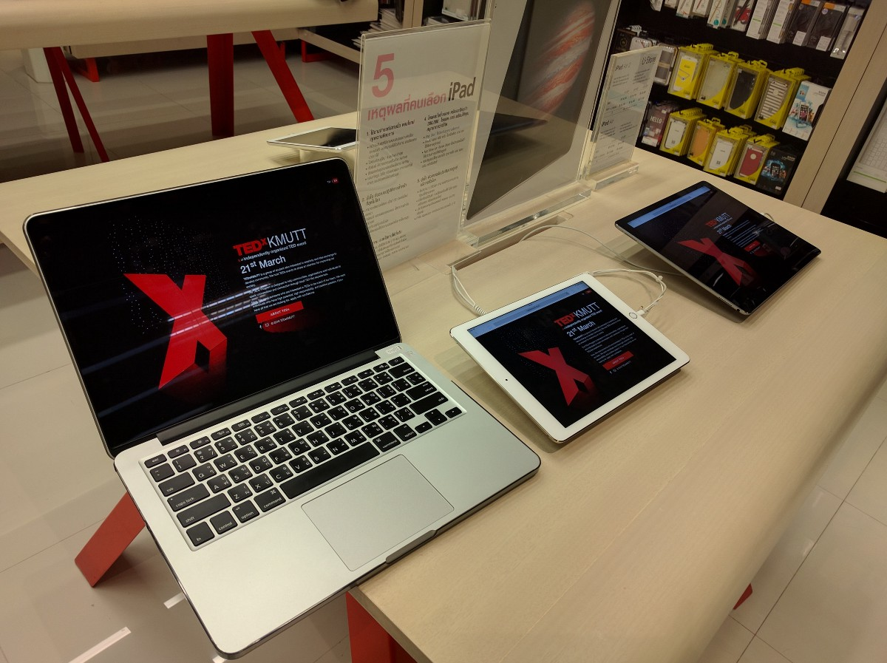
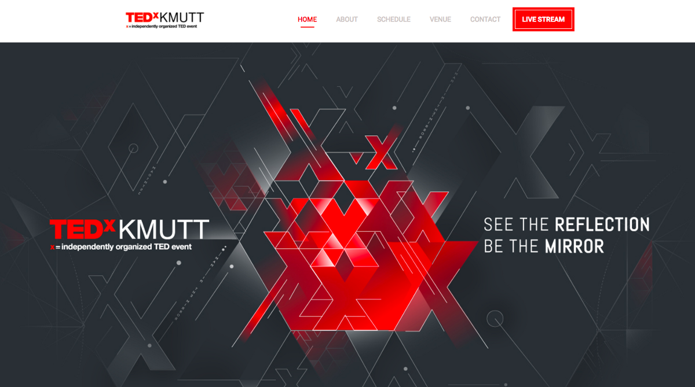

ผ่านมาแล้วครับกับงาน TEDxKMUTT เมื่อวันเสาร์ที่ 8 ตุลาคม 2559 .. ผมเองเป็นหนึ่งในทีม Web Development .. ก็อยู่กับงานนี้มาตั้งแต่แรกๆ พบเจอกับอะไรมากมาย ทั้งความสุข สนุก เฮฮา เหนื่อย ท้อและทุกข์ใจปะปนกันไป

วันนี้ก็อยากมาเล่ามาแชร์ให้ฟังกันว่าเรื่องราวกว่า 7 เดือนที่ผ่านมา พวกเราทีม Web Development ได้ผ่านอะไรกันมาบ้าง มาดูกันครับ : ) ..

ทั้งหมดเริ่มมาจากที่เพื่อนของผม _ตุล_ ที่เรียนอยู่ CPE .. โทรมาชวนว่า

_“ เห้ย!! ทำ TEDxKMUTT ไหม ? เค้าอยากได้ทำเว็บรับสมัครสตาฟ สนใจป่าว ?? ”_

ตัวผมเองมีความอินกับ TEDx อยู่บ้าง .. เมื่อปีก่อน ก็เคยไปห้องสดของ TEDxChulalongkornU ที่จัดเป็นครั้งแรก ไปแล้วติดใจ ❤ อยากให้มีจัดที่มหาลัยตัวเองบ้าง ตอนนี้โอกาศมาแล้ว ก็เลยตอบรับไปว่า …

_“โอเคเพื่อน กูทำ !”_

หลังจากนั้น.. ผมก็โทรชวน _จ๊อบ_ เพื่อนสนิทที่เรียนอยู่ CS .. ชวนให้มาทำด้วย ในตอนแรกเรามีกันอยู่สองคน แต่พอใกล้ๆ เริ่มทำ ตุลก็โทรมาถามอีกว่า

_“ เฟิส.. มีเพื่อนชื่อ ลูกคิด อยู่ภาคเดียวกันกับกูงะ เขียน Front-End ได้ เขียน AngularJS ได้ด้วย! อยากให้มาทำเว็บด้วย ได้ไหมเพื่อน? ”_

ผมกับจ๊อบก็โอเค ในความที่อยู่ปีหนึ่ง ยังไม่ค่อยรู้จักใครมาก ก็ดี้ด้า เห้ยย! เราจะได้รู้จักเพื่อนสาย Dev คนใหม่ว่ะ … แล้วจากนั้นลูกคิดก็เข้ามาอยู่ในทีมของเรา !

> นั่นละฮะ วันแรกของทีมเว็บ TEDxKMUTT .. ทีมที่มีทั้ง IT , CS , CPE !!

### ครั้งแรกที่ได้ทำอะไรแบบนี้ด้วยตัวเอง

หลังจากวันนั้น เราสามคนก็มานั่งคุยกันว่า _“ เห้ย! เราจะทำเว็บยังไงดีหว่า ? ”_

- **เราตกลงกันว่ารอบนี้จะลองของนะ** อยากจะของใหม่ๆ เราตัดสินใจใช้ Nodejs + MongoDB + AngularJS ในการทำ ช่วงที่เริ่มทำนั้นประมานเดือนกุมภา-มีนา ถ้าจำไม่ผิดตอนนั้น Angular2 ยังคง beta อยู่ ก็เลยเลือกใช้ Angular1 กัน
- แต่ก็พึ่งมารู้ตอนหลังว่ามันเป็น [MEAN STACK](http://mean.io/) แหละ ฮ่า ๆๆๆๆ
- เราปั่นเว็บเปิดรับสมัคร Staff กันทั้งหมด 2 วัน … พอออกตัวหน้าเว็บแรกที่ไว้ Promote ปุ๊บ ก็รีบทำระบบสมัครสมาชิกต่อเลย ทำเสร็จ 4 วันต่อมา
- ตัวเว็บไซต์รับสมัครเราใช้ Angularjs ทำ Front-End ทั้งหมด … ใช้ไปหลายตัวเลย ทั้ง ng-route , ng-sanitize , [angular-ui-bootstrap](http://angular-ui.github.io) รวมทั้งทำ Validation Form ด้วยจ้า ยกเครดิตให้ลูกคิดเลยครับอันนี้ โหดจริงๆ
- ลูกคิดเอง เคยเขียน AngularJS มาก่อน … เขียนเก่งพอตัว สามารถทำ Validate Form แบบเจ๋ง ๆ ได้ ทำนู้นนี่ใช้ ดึงศักยภาพ AngularJS ได้มากกว่าผมกับจ้อบซะอีก ลูกคิดก็เลยรับผิดชอบส่วนของ FORM รับสมัครทั้งหมดครับ
- จ๊อบทำระบบส่งอีเมลด้วย Nodejs ไว้ส่งอีเมลตอบกลับสำหรับคนที่สมัครเรียบร้อยแล้ว เราใช้ Service SMTP ของ Mailgun ครับในการส่ง ส่งได้ถึง 10000 ฉบับต่อเดือน คุ้มค่าสุด ๆ ครับ
- จ็อบเองเคยเขียน PHP มาก่อน เข้าใจระบบและการเขียน BackEnd ดีพอสมควร FrontEnd ก็ทำได้ ก็เลยให้จ็อบรับผิดชอบส่วนของ ExpressJS NodeJS ไปครับ
- เราทำ Server เองครับ ใช้ DigitalOcean ใช้ Ubuntu 14.04 ลง Nginx , MongoDB , Nodejs และ Service อีกสองสามตัวกันเองครับ

> ไม่รู้เหมือนกันว่าผ่านมาได้ยังไง.. พวกเราสามคนแทบไม่มีประสบการณ์ในการทำอะไรแบบนี้เลย

- ตัวผมเองเคยเซ็ต Server เพราะ Blog ตัวเองเป็นใช้ Ghost Blog ซึ่งมันเป็น Nodejs ซึ่ง Host ในไทยทั่วไปใช้ไม่ได้ ด้วยความ Geek ก็ต้องหัดลงเอง หัดไรเองก็หยิบสกิลตรงนั้นมาใช้ แล้วผมก็เคยเขียน Animate ด้วย CSS กับ JS Library มาบ้างก็เลยรับผิดชอบส่วนนี้ซะเยอะครับ : )
- มันเป็นครั้งแรกที่ใช้ Github กันจริงจัง Push, Pull, Branch, Checkout และ Commit กันมันส์เลยครับ ~

- เรา Integrate Github กับ Slack ด้วย พอมี Push ก็รู้เลยว่าเห้ยยย ! ใครฟ้ะ ! ก้ถือเป็นเรื่องตื่นตาตื่นใจสำหรับเด็กปีหนึ่งครับ : )

---

### เปิดรับสมัครสตาฟทีม TEDxKMUTT

พอวันแรกที่เราเปิดรับสมัคร Staff ปุ้บ ก็ได้ผลตอบรับดีมาก ๆ เลยครับ ทั้งแชททั้งแฟนเพจ มีคนถามเข้ามากันเยอะว่าเห้ยย จะมี TEDxKMUTT จัดหรอ? อยากทำจัง! ทำยังไง สมัครสตาฟเลยนะ อะไรแบบนี้ : ) ดีใจ

เรา Monitor ดูด้วย Google Analytics แหละครับ ว่าเป็นอย่างไรบ้างในแต่ละวันที่ผ่านกันไป : ) และแอบยิ้มทุกครั้งที่มีคนเข้าเว็บเรา

---

#### รอคอย…

พอหลังจากที่เรารับสมัคร Staff อะไรกันเสร็จแล้วเป็นช่วงปิดเทอร์มใหญ่ ช่วงนี้ก็รอนานพอสมควร เพราะทีมหลักไปคิดตัวงานกันอยู่ ทีมเว็บอย่างพวกเราเองก็แยกย้ายไปทำฝันของแต่ละคนกัน

- ในช่วงปิดเทอร์มใหญ่ ที่เราสามคนว่างงานจาก TEDxKMUTT กันอยู่ เราทั้งสามคนก็แยกย้ายกันไปหาประสบการณ์ต่างๆ นานากันครับ
- ผมเอง ก็ไปฝึกงานเป็น Developer ใน [บริษัท Marvelic Engine](https://www.facebook.com/marvelic.co.th/?fref=ts) ซึ่งได้ไปทำเว็บเกี่ยวกับ E-Commerce ครับ ทำความรู้มากมาย
- จ็อบ ก็ทำค่าย [Junior Programmer Camp](https://www.facebook.com/jpckmutt/?fref=ts) … จ็อบรับหน้าที่ทำเว็บไซต์ ระบบทั้งหมดของค่ายไม่ว่าจะเป็น ระบบสมัครค่าย รวมถึงระบบเกมส์ ระบบสอบต่าง ๆ ที่ใช้ในค่ายครับ แอบได้ข่าวว่าใช้ [Codeigniter](https://www.codeigniter.com/) ด้วยแถมยังทำระบบสมัคร ที่สมัครด้วย Facebook ได้เลย (แกะ API เองด้วยจ้า เถื่อนฝุดๆ)
- คนสุดท้ายในทีมนี่โกอินเตอร์สุด ๆ ลูกคิดไปเรียนซัมเมอร์ที่ปารีส ,ฝรั่งเศษ ตั้งเดือนกว่า ! เป็นโครงการของภาควิชาคอม ได้ทั้งความรู้ เพื่อน และประสบการณ์มากมายแน่นอนแหละ โคตรเท่ห์เลยอะ

และกว่าจะได้กลับมาทำเว็บ TEDxKMUTT ฉบับของจริงก็เป็นช่วงเปิดเทอร์มเลยครับ …

---

### เริ่มงานจริง ! เว็บ Official ของ TEDxKMUTT

ทีนี้ก็ถึงวันที่พี่ ๆ ติดต่อมาว่า “ ทีมเว็บเตรียมตัวเริ่มทำเว็บไซต์หลักได้แล้วนะครับ. ”

- เราทำเป็น Static Webpage ครับรอบนี้
- พี ๆ Organizer ตัดสินใจใช้ EventPop ใน Provide การรับสมัคร จึงทำให้พวกเราทั้งสามคน รับผิดชอบแค่หน้าเว็บไซต์เท่านั้นครับ
- **ปัญหามีอยู่ทุกงาน เป็นปกติที่จะมีปัญหาเรื่องการสื่อสาร เรื่องงานเลต งานเผาใช่ครับ มันเป็นงานแรกของเรา เราลนลานกับปัญหาพวกนั้น มันดีครับที่ได้เจอกับตัว พอครั้งต่อไปที่เจอ**
- เรา Launch เว็บไซต์จริงกันตีสองครับ จริง ๆ เสร็จตอนเที่ยงคืน แต่ใส่ Meta Tag , Tracking Script , SEO ต่าง ๆ อยู่พักใหญ่ โดยมีพี่นิว พี่เฟิส ทีม Organizer อยู่ด้วยตลอดคืนครับ
- และในวันงานพวกเราทำหน้าเพจสำหรับ Live Stream อีกด้วย

พอเว็บเปิดออกไปแล้ว … พวกเราก็โล่งใจ รอวันเปิดรับสมัครจ้าา : )

### วันจริง ! TEDxKMUTT

ทีมเว็บเดฟหมดหน้าที่ตั้งแต่เว็บเปิดรับสมัครครับ อันนี้เรื่องจริง :D เราว่างงานกันมาก ๆ เราไปช่วยในส่วนต่าง ๆ ครับ

- ผมกับลูกคิดไปช่วยในส่วนของการ Flow คนต่าง ๆ … ผมไปประจำอยู่ห้อง Live Stream คอยดูแล Flow คนเข้า คนออก เชคเรื่องของอาหารและเครื่องดื่มที่ห้ามเอาเข้าห้อง ก้สนุกดีครับ ได้พบปะผู้คนมาหน้าหลายตา : )
- ตอนงานชวนคุยกับพี่คนหนึ่งที่มาขอนั่งกินเบรคที่โต๊ะสตาฟห้อง Live Stream เราก็คุยกันหลายเรื่องเกี่ยวกับ Talk ในวันนี้
- แถมยังคุยกับพี่โนบิตะ ที่เป็นพิธีกรในงาน TEDxBangkok อีก เกี่ยวกับทีม Web Development ว่าทีมเราทำอะไร เล่นอะไรกันบ้าง แล้วได้อะไรจากการทำงานบ้าง พี่โนบิตะเล่าว่าเค้าเคยทำ TEDxChaingMai ด้วยเป็นงานแรกของเค้า ตัวผมเองก็อยากไปทำบ้างจัง ถ้ามีโอกาศ
- บรรยากาศในงานก็ดี เป็นกันเอง คนเยอะมากครับ : ) ตึก KX เองก็ดูเหมาะกับ TEDxKMUTT มากๆ ด้วย ลงตัว ชอบ ~

จุดนี้มันเป็นครั้งแรกที่แบบ เห้ย! ภูมิใจว่ะ ไม่มากก็น้อยที่เราได้ทำอะไรที่เราพอทำได้ แล้วมันมีคุณค่าทางใจ พวกเราได้ร่วมสร้างความทรงจำดีๆ ประสบการณ์ดีๆ ให้กับตัวเองแล้วก็คนอื่น ผมเองก็คิดว่าพี่ๆ เพื่อนๆ หรือคนอื่นๆในทีมก็คงคิดเช่นเดียวกัน

สำหรับทีม Web Development .. ผมเองก็มีอะไรอยากจะบอกมากมาย อยากเล่าให้มันลึกกว่านี้ ยังมีอีกหลายอย่างที่ยังไม่ได้บอก ทุกอย่างมันหล่อหลอมเราตั้งแต่แรกที่ก้าวเข้าไปทำงานตรงนี้แล้ว แต่หากจะให้สรุปสั้น ๆ ผมก็จะขอบอกว่า ..

> ดีใจที่ได้ร่วมงาน ไม่มีคำใดจะกล่าวตอบแทนได้ดีเท่ากับคำว่า

> “ขอบคุณที่ให้โอกาศพวกเราครับ.”

### สรุปจ้า …

- ก็เป็นงานระยะยาวงานหนึ่งในชีวิตเลยครับ ที่ได้ทำ ครั้งนั้นเรายังอยู่ปีหนึ่งอยู่เลย ตอนนี้เป็นปีสองที่สอบมิดเทอร์มเสร็จแล้ว เวลามันผ่านไปเร็วจริง ๆ
- ผมเองได้อะไรกับงานนี้เยอะมาก ๆ ครับ ทักษะความรู้ต่าง ๆ ที่ได้ในตอนนั้น มันทำให้ผมทำงานหลาย ๆ ชิ้นออกมาได้ในวันนี้ ย้ำว่ามันทำให้ผมทำงานได้จริงๆ
- บอกเลยว่าถ้าตุลไม่ได้ชวนผมไปทำ TEDxKMUTT ในวันนั้น ผมก็ยังคิดไม่ออกเลยว่า วันนี้ผมจะเขียน Nodejs เป็นไหม? ผมจะรู้ไหมว่า Angularjs เป็นยังไง? MongoDB เป็นแบบไหน? ปัญหาที่เกิดขึ้นจากภาษาและ Tools เหล่านี้เป็นยังไง? ข้อดีข้อเสียของพวกมัน .. ผมคงไม่รู้เลย ไม่มีที่ไหนจะสอนผมได้ดีเท่ากับการที่ผมได้ไปลงมือทำมันจริงๆ ให้คนได้ไปใช้มันจริงๆ
- ถ้าไม่มีระบบนี้ ผมก็คงไม่มีความรู้ไปทำระบบลงทะเบียนชมรมเปิดโลกกิจกรรม KMUTT อย่างที่เขียนไปรอบที่แล้วหรอกครับ :)

[**แชร์ประสบการณ์ทำระบบลงทะเบียนชมรมเปิดโลกกิจกรรม KMUTT !**  
\_ในบทความนี้ ผมจะมาเปิดเผยเส้นทางของการวางแผนและลงมือทำ ระบบลงทะเบียนเพื่อสมัครเข้าชมรม สำหรับใช้ในวันเปิดโลกกิจกรรมของ…\_medium.com](https://medium.com/ks-journals/%E0%B9%81%E0%B8%8A%E0%B8%A3%E0%B9%8C%E0%B8%9B%E0%B8%A3%E0%B8%B0%E0%B8%AA%E0%B8%9A%E0%B8%81%E0%B8%B2%E0%B8%A3%E0%B8%93%E0%B9%8C%E0%B8%97%E0%B8%B3%E0%B8%A3%E0%B8%B0%E0%B8%9A%E0%B8%9A%E0%B8%A5%E0%B8%87%E0%B8%97%E0%B8%B0%E0%B9%80%E0%B8%9A%E0%B8%B5%E0%B8%A2%E0%B8%99%E0%B8%8A%E0%B8%A1%E0%B8%A3%E0%B8%A1%E0%B9%80%E0%B8%9B%E0%B8%B4%E0%B8%94%E0%B9%82%E0%B8%A5%E0%B8%81%E0%B8%81%E0%B8%B4%E0%B8%88%E0%B8%81%E0%B8%A3%E0%B8%A3%E0%B8%A1-kmutt-6d0d51afaacd "https://medium.com/ks-journals/%E0%B9%81%E0%B8%8A%E0%B8%A3%E0%B9%8C%E0%B8%9B%E0%B8%A3%E0%B8%B0%E0%B8%AA%E0%B8%9A%E0%B8%81%E0%B8%B2%E0%B8%A3%E0%B8%93%E0%B9%8C%E0%B8%97%E0%B8%B3%E0%B8%A3%E0%B8%B0%E0%B8%9A%E0%B8%9A%E0%B8%A5%E0%B8%87%E0%B8%97%E0%B8%B0%E0%B9%80%E0%B8%9A%E0%B8%B5%E0%B8%A2%E0%B8%99%E0%B8%8A%E0%B8%A1%E0%B8%A3%E0%B8%A1%E0%B9%80%E0%B8%9B%E0%B8%B4%E0%B8%94%E0%B9%82%E0%B8%A5%E0%B8%81%E0%B8%81%E0%B8%B4%E0%B8%88%E0%B8%81%E0%B8%A3%E0%B8%A3%E0%B8%A1-kmutt-6d0d51afaacd")

- นั่นแหละครับ เว็บไซต์ TEDxKMUTT สำหรับผม ถือเป็นงานที่เป็นจุดเริ่มต้นของหลายๆ เลย ทั้งตัวระบบที่ส่งอีเมลนิตยสารของคณะ ระบบวันปฐมนิเทศ ระบบเปิดโลกกิจกรรม ระบบนั้น~ ระบบนี้~ ที่ทำมาระหว่างนั้นจนตอนนี้ ทุกระบบเริ่มต้นจากตรงนี้เลยครับ ❤
- แน่นอนครับ สุดท้ายแล้ว TEDxKMUTT: See The Reflection | Be the Mirror ทำให้ผมหันกลับมามองที่ตัวเอง ดูการเปลี่ยนแปลงของตัวเองว่าตั้งแต่วันนั้นถึงวันนี้ผมเปลี่ยนไปขนาดไหน : ) ผมเปลี่ยนไปเยอะมากจริง ๆ จากวันนั้น

### ขอขอบคุณ.

- **จ็อบและลูกคิด** ทีมเดฟที่โคตรเจ๋ง เจ๋งที่สุดในสามโลก ขอบคุณที่อยู่ด้วยกันมาเกือบปี ไม่มีอะไรจะพูดนอกจากคำว่า พวกมึงสุดยอดว่ะ !
- **ตุล** ขอบคุณที่ชวนกูไปทำ TEDxKMUTT ในวันนั้น ขอบคุณที่หัวร้อนแล้วยังอยู่ด้วยกันจนวันสุดท้าย
- **แตงกวา แจน** ทีมดีไซน์แรกที่ทำให้เว็บรับสมัครสตาฟเกิดขึ้นมาได้ และอยู่ด้วยกันจนวันนี้
- **พี่เฟิส** ขอบคุณที่คอยถามน้องเสมอ ๆ ว่าเป็นไงบ้างง ไหวไหมม รับฟังน้องทุก ๆ อย่าง ขอโทษที่บางครั้งดื้อไปบ้างครับพี่
- **พี่นิว ป๋าเจมส์แห่งทีม Organizer** ที่ทนกับผมมาจนจบงาน ขอโทษที่พวกเราเป็นเด็กดื้อบ้าง ขอบคุณที่ให้โอกาศพวกเราครับ : )
- **ขอบคุณทุกคนที่เกี่ยวข้อง**กับงาน TEDxKMUTT ที่ทำให้เกิดงานดี ๆ แบบนี้ขึ้นมา
- **ขอบคุณ Speaker ทั้ง 10 ท่าน** ที่ได้มาถ่ายทอดประสบการณ์และแนวคิดดี ๆ นะครับ
- ขอบคุณผู้ร่วมงานและผู้ที่ติดตาม TEDxKMUTT ทุกท่านครับ : ) ที่มาร่วมเป็นส่วนหนึ่งของ TED Talk ในครั้งนี้

และสุดท้ายสุด ถ้ามีอะไรที่ผมทำผิดพลาดไปไม่ว่าจะเป็นระหว่างการทำงาน วันงาน หรือในบทความนี้ กระผมขออภัย ณ ไว้ที่นี้และขอรับไว้แต่เพียงผู้เดียว ..

ขอบคุณครับ : ) แล้วเจอกันปีหน้านะครับ

> #TEDxKMUTT

