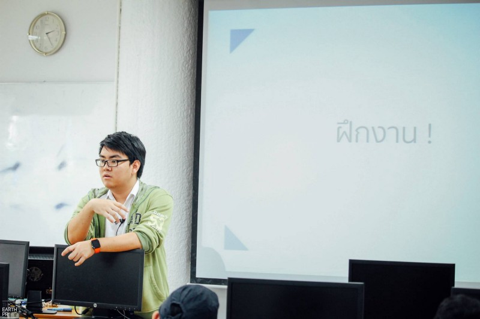
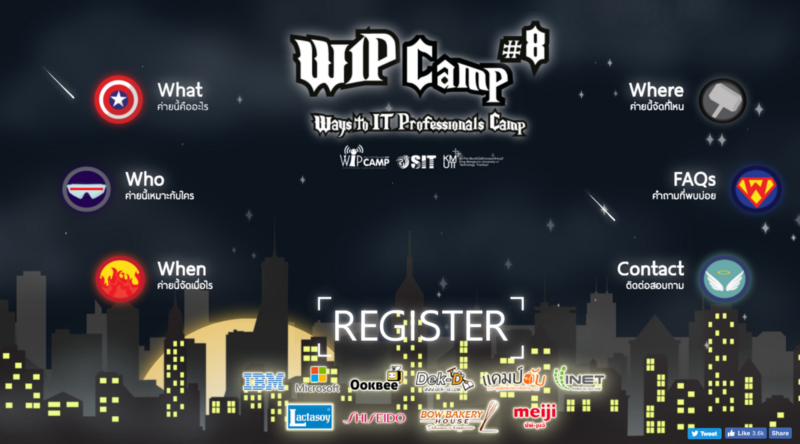

ผ่านมาแล้วหนึ่งปี .. มีอะไรเกิดขึ้นมากมายกับผม ปีนี้เป็นปีที่มีอะไรเกิดขึ้นเยอะมาก มากที่สุดเท่าที่ผมจำความได้ ถือว่านี่เป็นบทความที่จะมา Recap สิ่งที่เกิดขึ้น ไว้เป็นบทเรียนของผมแล้วกันฮะ

ปกติแล้ว ผมมีนิสัยนับปีจากวันเกิดมากกว่า เพราะปีใหม่ดูไม่มีผลอะไรกับชีวิตเท่าไหร่ >< แฮ่ .. แต่พอวันเกิดกลับไม่ได้เขียนด้วยเหตุผลบางอย่าง ก็เลยยกยอดมาเขียนปีใหม่แล้วกันน

> ปีนี้เป็นปีที่สุดยอดมากปีหนึ่งเลย เป็นปีที่ผมเดินไปได้ไกลมากกว่าทุกปีที่ผ่านมา : )

เมื่อปีที่แล้ว ผมเองไม่ได้ตั้งเป้าหมายอะไรไว้เลย แค่ตั้งใจจะทำอะไรซักอย่างเป็นชิ้นเป็นอันขึ้นมาให้ได้เท่านั้นเอง

- ทั้งที่ต้นปียังเขียนเป็นแต่ FrontEnd อยู่เลย HTML, CSS, JS ยังไม่รู้จัก AJAX เลยด้วยซ้ำ (ฮา)
- ยังไม่เคยมีโอกาศจัดค่าย จัดกิจกรรมอะไรด้วยน้ำพักน้ำแรงตัวเองเลย
- และที่คิดว่ามาไกลที่สุดก็คงเรื่องที่ว่า ตั้งแต่เกิดมายังไม่เคยทำเว็บอะไรจริงจังให้คนมาใช้ หรือขึ้น Production เลยนอกจากบล๊อคตัวเอง (ตอนนั้นใช้ ghost รันบน digitalocean)

**คำเตือน​:** ยาวมากก เพราะเขียนจากใจที่อยากจะบอกตัวเองและคนอื่นถึงบทเรียนที่เราได้รับมาตลอดทั้งปี 🙃

### เริ่มปีด้วยการทำเว็บ WIP Camp #8

หลังปีใหม่ปุ๊บ ก็เริ่มต้นปีด้วยการทำเว็บไซต์ของค่าย WIP Camp #8 เลย ..

- ผมเองอยู่ในทีม Frontend รับผิดชอบทำหน้าเว็บไซต์ของค่าย ซึ่งเดทไลน์ก็ประมาน 20 วันเปิดเทอร์ม จำได้แม่น ว่าหนักหน่วงมาก แถมโดนพี่ๆ สั่งรื้อเว็บด้วย แต่ทุกอย่างก็ผ่านมาได้ด้วยดี 😯
- เราทำเว็บไซต์แรกเสร็จกันประมานกลางเดือน แต่สุดท้ายก็ผิดคอนเซปนิดหน่อย รุ่นพี่เลยขอว่า เห้ยเฟิส รื้อใหม่นะ ขอด้วยรอยยิ้ม

- เย้ นี่ดราฟสุดท้ายที่ขึ้น Production จ้าาา 😄 รื้อใหม่และทำกันเสร็จภายในเวลาเพียง 4 วันเท่านั้น ! เหนื่อยนะ แต่สนุกมาก

จบงานนี้ทำให้ผมรู้เลยว่า .. ถ้าจะเอาเว็บขึ้น Production ต้องคำนึงถึงอะไรบ้าง รู้เรื่อง KPI , SEO ตัวแปรต่างๆ นานาที่ควรคำนึงอีกด้วย เป็นการเริ่มต้นปีที่ดีทีเดียวเลยย

---

### อยู่ดี ๆ ก็ได้ทำเว็บให้กับ TEDxKMUTT

ถ้าจำไม่ผิดก็ช่วงกุมภาพันธ์ ที่ได้ทำ .. ใช่ครับ อยู่ดีๆ ก็มีโทรศัพท์จากเพื่อนที่วิศวฯ คอม .. มาชวนไปทำเว็บให้กับ TEDxKMUTT เฉยเลยย

- ได้ทำงานกับสองเทพ: จ๊อบแห่ง CS และ ลูกคิดแห่ง CPE บางมดค้าบบบ
- ได้ทำ Backend ครั้งแรก โดยทำระบบรับสมัคร Staff .. ใช้ Angular กับ NodeJS เลย 🤗
- ได้ใช้ app.get() , app.post() , express.router และอีกหลายอย่างที่เคยได้ยิน แต่ไม่เคยได้ทำซักที ตื่นเต้นและฮามาก >< จุดนี้ทำให้ผมเองเข้าใจ Backend ขึ้นมามาก ๆ เลยย

นับว่าเป็นครั้งแรกที่ผมจับ Backend เลยล่ะะ : ) เรื่องราวต่าง ๆ ผมก็เคยเล่าไว้บ้างแล้ว เป็นงานที่ได้ประสบการณ์กลับมาเยอะมาก และเป็นอีกงานหนึ่งที่ภูมิใจมากๆ เช่นกันครับ .

[**ความทรงจำและแชร์ประสบการณ์ดีๆ ที่ได้จาก TEDxKMUTT**  
\_ผ่านมาแล้วครับกับงาน TEDxKMUTT เมื่อวันเสาร์ที่ 8 ตุลาคม 2559 .. ผมเองเป็นหนึ่งในทีม Web Development .. ก็อยู่กับงานนี…\_blog.ks.in.th](https://blog.ks.in.th/%E0%B8%9A%E0%B8%B1%E0%B8%99%E0%B8%97%E0%B8%B6%E0%B8%81%E0%B8%84%E0%B8%A7%E0%B8%B2%E0%B8%A1%E0%B8%97%E0%B8%A3%E0%B8%87%E0%B8%88%E0%B8%B3%E0%B9%81%E0%B8%A5%E0%B8%B0%E0%B9%81%E0%B8%8A%E0%B8%A3%E0%B9%8C%E0%B8%9B%E0%B8%A3%E0%B8%B0%E0%B8%AA%E0%B8%9A%E0%B8%81%E0%B8%B2%E0%B8%A3%E0%B8%93%E0%B9%8C%E0%B8%94%E0%B8%B5%E0%B9%86-%E0%B8%97%E0%B8%B5%E0%B9%88%E0%B9%84%E0%B8%94%E0%B9%89%E0%B8%88%E0%B8%B2%E0%B8%81-tedxkmutt-8198c44e43c0 "https://blog.ks.in.th/%E0%B8%9A%E0%B8%B1%E0%B8%99%E0%B8%97%E0%B8%B6%E0%B8%81%E0%B8%84%E0%B8%A7%E0%B8%B2%E0%B8%A1%E0%B8%97%E0%B8%A3%E0%B8%87%E0%B8%88%E0%B8%B3%E0%B9%81%E0%B8%A5%E0%B8%B0%E0%B9%81%E0%B8%8A%E0%B8%A3%E0%B9%8C%E0%B8%9B%E0%B8%A3%E0%B8%B0%E0%B8%AA%E0%B8%9A%E0%B8%81%E0%B8%B2%E0%B8%A3%E0%B8%93%E0%B9%8C%E0%B8%94%E0%B8%B5%E0%B9%86-%E0%B8%97%E0%B8%B5%E0%B9%88%E0%B9%84%E0%B8%94%E0%B9%89%E0%B8%88%E0%B8%B2%E0%B8%81-tedxkmutt-8198c44e43c0")

---

### ทีมวิชาการที่ WIP Camp #8

ช่วงเดือนพฤษภาคม พอวันค่ายทีมเดฟเริ่มหมดงานแล้ว เพราะเป็นงานเบื้องหลัง พอวันค่ายผมก็ออกมาทำเบื้องหน้าบ้าง โดยการเป็นคนสอนในค่าย สอนวิชา IT Fundamental ~ 😤

- เตรียมการสอนนานมากกกก ! คิดทุกวิธีที่จะทำให้น้องได้ความรู้ แล้วไม่ง่วงไปซะก่อน
- ได้ทำหนังสือ ทำ Slide ด้วยยย !
- วันสอนนี่สนุกมากเลย สอนในวันแรกของค่ายเลยด้วยครับ : )
- บอกตรงๆ ว่ามันดูเป็นวิชาที่น่าเบื่อนะ .. แต่ก็พยายามทำให้น้องไม่หลับและรู้สึกดีกับมันบ้างง (ดีใจที่น้องบางคนจะหลับ แล้วเรายิงมุขให้เลือกทีม Apple กับทีม Android แล้วน้องตื่นมาเล่นด้วย)
- พึ่งรู้ว่าการจะสอนอะไรสักอย่างต้องคิดหลายอย่างเหมือนกันนะ ทั้งเรื่องเวลาในการสอน คนที่เป็นนักเรียนเป็นใคร เนื้อหาไหนที่เน้น เน้นยังไง ทำยังไงให้เค้าไม่เบื่อ ทำยังไงให้มันไม่ดูเหมือนอ่านให้ฟัง คนที่นั่งหลังสุดจะเห็น Slide มั้ยนะ สีสไลด์ยังไงดี สว่างไปจะเห็นไหมนะ หู้ย เยอะ ! แต่ทุกอย่างก็ทำให้มันออกมาพร้อมและพอดีครับ

และแล้วพอทุกอย่างจบลงก็เข้าช่วงปิดเทอร์มใหญ่ : )

ผมอยู่ด้านซ้ายครับบ >< อ้วน ๆ อยู่หน้าเวทีตรงนั้น

---

### ฝึกงานกับ [Marvelic Engine Co., Ltd.](http://www.marvelic.co.th/en/home.html)

ผมเองตั้งเป้าหมายไว้ว่าจะฝึกงานทุกปีเลยครับ ปีนี้ก็ทำเหมือนกัน … ออฟฟิสอยู่ที่ตึง KPN Tower ที่พระราม 9 ครับ ฝึกอยู่หนึ่งเดือนนิดๆ แต่เป็นหนึ่งเดือนที่เข็มข้น ตื่นเช้าทุกวัน รถติดทุกวัน สนุกทุกวัน เป็นประสบการณ์ที่ดีมาก ๆ เลยครับ : )

- ได้รู้จักการทำงานในบริษัท ที่ต้องมีบัตรเข้าออกตึก มีระบบแบบแผนที่ชัดเจน
- ได้เข้าใจ Backend มากขึ้น เพราะเข้าไปทำ Magento ครับ ใช้ PHP เป็นหลักเลย ได้เขียน Extension ด้วย
- พี่ต่อ YWC9 ได้สอนให้ลองใช้ RiotJs ด้วยฮะ เปิดโลกเรื่อง FrontEnd มาก ๆ จุดประกายให้มาเขียน VueJS ในวันนี้เลย
- ได้เจอคนใหม่ๆ ที่เก่งๆ ในวงการอีกเยอะเลยครับ : ) แล้วก็เจอคนอื่นที่ไม่ได้ทำส่วนของโปรแกรมมิ่งด้วย เปิดโลกสุดๆ เลยก็ว่าได้ฮะ

> มีเรื่องตลกจะเล่าให้ฟัง …วันหนึ่งพี่ๆ ที่ทำงานพาไปเลี้ยงข้าวข้างนอก ชื่อร้านว่า การะเกต ผมได้ยินเป็น การะเกะ คิดว่าเป็นร้านอาหารญี่ปุ่น ..พาไปถึงปุ๊บ ถึงกับขำในใจ “ร้านครัวการะเกตไก่ย่างส้มตำ” ยิ้มเลยครับ เป็นเรื่องฮาๆ ที่ยังตรึงใจเสมอมาเลย

---

### \[ Alchemist \] ไอทีบางมด

ไฮไลต์ของผมในปีนี้เลยฮะ เป็นทีมที่ต่อมาจากทีมเดฟของ WIP Camp ตั้งขึ้นมาโดยรุ่นพี่ปีโตๆ ผมอยู่ตั้งแต่ทีมนี้ตั้งขึ้นมาจนวันนี้ เราทำงานมาด้วยกัน แล้วก็ทำอะไรไปเยอะเลย ทีมนี้เป็นมากกว่าทีมสำหรับผมนะ มันเป็นครอบครัวซะมากกว่า มีอะไรเราก็คุยกันตลอด ทุกๆ เรื่องเลย : )

ถ้าถามว่าทำอะไรมาบ้างคร่าว ๆ ที่ผมมีส่วนร่วมเยอะๆ ก็คงจะเป็นประมาณนี้ ~

- **งานปฐมนิเทศของคณะเทคโนโลยีสารสนเทศ  
  **โปรเจคนี้ได้มาตอนที่ฝึกงานอยู่ ขนาดฝึกงานอยู่ยังโดน Assign มาเลย ฮาร์ดคอร์สุด ๆ … ที่รับทำก็คงเป็นเพราะโปรเจคนี้เป็น First Impression สำหรับน้องๆไอทีบางมดที่กำลังจะเข้ามา จะได้สัมผัสกับความไอทีในทุกอนูของคณะเรา รวมถึงความเป็นกันเองของอาจารย์ต่อนักศึกษาด้วยครับ

[**กว่าจะเป็นระบบ #Vote และ #Ask ในวันงานปฐมนิเทศ ป.ตรี SIT KMUTT**  
\_เมื่อพูดถึงงานปฐมนิเทศนักศึกษาใหม่ ทุกคนมักนึกถึงการนั่งในห้องประชุมแล้วต้องฟังอาจารย์และใครต่อใครมากมายพูดในสิ่งที่เข…\_alchemist.itbangmod.in.th](https://alchemist.itbangmod.in.th/%E0%B8%81%E0%B8%A7%E0%B9%88%E0%B8%B2%E0%B8%88%E0%B8%B0%E0%B9%80%E0%B8%9B%E0%B9%87%E0%B8%99%E0%B8%A3%E0%B8%B0%E0%B8%9A%E0%B8%9A-vote-%E0%B9%81%E0%B8%A5%E0%B8%B0-ask-%E0%B9%83%E0%B8%99%E0%B8%A7%E0%B8%B1%E0%B8%99%E0%B8%87%E0%B8%B2%E0%B8%99%E0%B8%9B%E0%B8%90%E0%B8%A1%E0%B8%99%E0%B8%B4%E0%B9%80%E0%B8%97%E0%B8%A8-%E0%B8%9B-%E0%B8%95%E0%B8%A3%E0%B8%B5-sit-kmutt-ff8c44093c66 "https://alchemist.itbangmod.in.th/%E0%B8%81%E0%B8%A7%E0%B9%88%E0%B8%B2%E0%B8%88%E0%B8%B0%E0%B9%80%E0%B8%9B%E0%B9%87%E0%B8%99%E0%B8%A3%E0%B8%B0%E0%B8%9A%E0%B8%9A-vote-%E0%B9%81%E0%B8%A5%E0%B8%B0-ask-%E0%B9%83%E0%B8%99%E0%B8%A7%E0%B8%B1%E0%B8%99%E0%B8%87%E0%B8%B2%E0%B8%99%E0%B8%9B%E0%B8%90%E0%B8%A1%E0%B8%99%E0%B8%B4%E0%B9%80%E0%B8%97%E0%B8%A8-%E0%B8%9B-%E0%B8%95%E0%B8%A3%E0%B8%B5-sit-kmutt-ff8c44093c66")

- **งานเปิดโลกกิจกรรมของมหาวิทยาลัยเทคโนโลยีพระจอมเกล้าธนบุรี  
  **โปรเจคนี้เป็นระบบใหญ่ครั้งแรกในชีวิตเลย รู้สึกว่าเป็นอะไรที่ต้องเป๊ะ ต้องปัง ต้องครบ จะผิดพลาดไม่ได้ เป็นงานที่จะยกระดับการลงทะเบียนชมรมของมหาลัยขึ้นไปโดยใช้เทคโนโลยีเข้ามาช่วยเลยล่ะ (ยิ่งใหญ่ไปเน้อะ ฮา) งานนี้ได้สกิลทั้งการทำระบบขึ้น Production, ทำ Load Test, ทำนู่นนี่เต็มไปหมด, Hot Fix กันหน้างาน, และจริงๆ แล้วแทบจะทำทุกๆ อย่างเลยฮะ

[**แชร์ประสบการณ์ทำระบบลงทะเบียนชมรมเปิดโลกกิจกรรม KMUTT !**  
\_ในบทความนี้ ผมจะมาเปิดเผยเส้นทางของการวางแผนและลงมือทำ ระบบลงทะเบียนเพื่อสมัครเข้าชมรม สำหรับใช้ในวันเปิดโลกกิจกรรมของ…\_blog.ks.in.th](https://blog.ks.in.th/%E0%B9%81%E0%B8%8A%E0%B8%A3%E0%B9%8C%E0%B8%9B%E0%B8%A3%E0%B8%B0%E0%B8%AA%E0%B8%9A%E0%B8%81%E0%B8%B2%E0%B8%A3%E0%B8%93%E0%B9%8C%E0%B8%97%E0%B8%B3%E0%B8%A3%E0%B8%B0%E0%B8%9A%E0%B8%9A%E0%B8%A5%E0%B8%87%E0%B8%97%E0%B8%B0%E0%B9%80%E0%B8%9A%E0%B8%B5%E0%B8%A2%E0%B8%99%E0%B8%8A%E0%B8%A1%E0%B8%A3%E0%B8%A1%E0%B9%80%E0%B8%9B%E0%B8%B4%E0%B8%94%E0%B9%82%E0%B8%A5%E0%B8%81%E0%B8%81%E0%B8%B4%E0%B8%88%E0%B8%81%E0%B8%A3%E0%B8%A3%E0%B8%A1-kmutt-6d0d51afaacd "https://blog.ks.in.th/%E0%B9%81%E0%B8%8A%E0%B8%A3%E0%B9%8C%E0%B8%9B%E0%B8%A3%E0%B8%B0%E0%B8%AA%E0%B8%9A%E0%B8%81%E0%B8%B2%E0%B8%A3%E0%B8%93%E0%B9%8C%E0%B8%97%E0%B8%B3%E0%B8%A3%E0%B8%B0%E0%B8%9A%E0%B8%9A%E0%B8%A5%E0%B8%87%E0%B8%97%E0%B8%B0%E0%B9%80%E0%B8%9A%E0%B8%B5%E0%B8%A2%E0%B8%99%E0%B8%8A%E0%B8%A1%E0%B8%A3%E0%B8%A1%E0%B9%80%E0%B8%9B%E0%B8%B4%E0%B8%94%E0%B9%82%E0%B8%A5%E0%B8%81%E0%B8%81%E0%B8%B4%E0%B8%88%E0%B8%81%E0%B8%A3%E0%B8%A3%E0%B8%A1-kmutt-6d0d51afaacd")

- **Brownbag : งานนั่งคุยกัน สนทนากันแบบเป็นกันเอง ไม่เครียด อยากคุยอะไรก็คุย แบบไม่เป็นทางการ : )  
  …** สำหรับใครยังนึกไม่ออกว่ามันคืออะไร ให้นึกถึง Barcamp ครับ : ) … แต่เราจะมี Signature ที่ต่างกัน เป็นงาน Talk ที่ตั้งใจจัดและส่วนตัวก็ชอบมันมากๆ เลย แต่ตอนนี้เราจัดกันภายในนะจ้ะ : )

ง่อวววววว >< แลกถุงน้ำตาลกันน

---

### HelloWorld จัดเทรนนิ่งครั้งแรกของตัวเอง

เป็นการจัดติวการออกแบบ ทำเว็บไซต์ และทำเกมส์ จากพวกเราทีม developer ของ WIP Camp #8 เป็นเวลา 3 อาทิตย์ ให้กับน้องๆ ปีหนึ่งไอทีบางมด.. เรียนกันตอนเย็นอาทิตย์ละ 2 วัน และมีโปรเจคให้น้องๆ ได้คิดได้ทำด้วย

- ดีใจมากกก ได้รับการตอบรับจากน้องปีหนึ่งดีมากๆ บัตรหมดภายใน 6 นาที !
- ส่วนของ Project นั้นน้องๆ ทำได้เกินที่คาดไว้มาก เก่งกว่าพวกเราทีมเดฟตอนที่ยังอยู่ปีหนึ่งซะอีกก … ไว้วางใจเลย ว่าต่อจากนี้น้องๆ คงจะพัฒนาไปได้ไกลกว่านี้อีกแน่ ๆ
- **หัวข้อคือ เว็บเชิญชวน เชิญชวนอะไรก็ได้ คิดเองเลย :)**
- นี่เป็นผลงานตัวอย่างของน้อง ๆ :[HelloEarth](http://helloearth.web.wip.camp) เชิญชวนปลูกต้นไม้(ทีมผม) , [Getbike](http://getbike.web.wip.camp) เชิญชวนปั่นจักรยาน เป็นต้นน.

จริงๆ มีทีมเว็บมีทั้งหมด 7 กลุ่ม และยังมีผลงานของฝ่าย Design ที่เป็นออกแบบ Poster และฝ่ายเกมส์ที่สอน Phaser.js อีก

เป็นงานที่อินมาก ๆ เลย ยิ่งเป็นคนจัดด้วย ยิ่งอินใหญ่เลยครับ ภูมิใจ ดีใจ รัก … ปีหน้าคงจัดอีกแน่นอน

ความอินของคนจัด >< ซักหน่อยย

### WIP Camp #9 is Coming !

ไม่บอกหรอก เดี๋ยวปีหน้าเจอกัน >< เอาโปสเตอร์รับสมัครทีม Developer ไปก่อนฮะ .. หลายๆ อย่างต้องเจ๋งขึ้นสุดยอดมากขึ้น ทั้งเบื้องหน้าและเบื้องหลัง รอชมได้เลยสนุกแน่นอนฮะ ..

---

### Young Webmaster Camp 14

มหากาพย์ค่ายแห่งช่วงชีวิตผมเลยฮะ … ค่ายนี้เป็น Coming of Age ของผมเลยก็ว่าได้ .. สำหรับใครไม่รู้จักค่ายนี้ แนะนำให้อ่านอันนี้ก่อน

[**ค่ายบ้าอะไร แทบไม่ได้นอน #YWC14**  
\_เพิ่งได้มีโอกาสไปเข้าร่วมค่าย Young Webmaster Camp ครั้งที่ 14 เพิ่งกลับมาถึงบ้านเมื่อวานนี้ ก็เลยมาเขียนรีวิวแชร์เรื่…\_microbenz.in.th](https://microbenz.in.th/%E0%B8%84%E0%B9%88%E0%B8%B2%E0%B8%A2%E0%B8%9A%E0%B9%89%E0%B8%B2%E0%B8%AD%E0%B8%B0%E0%B9%84%E0%B8%A3-%E0%B9%81%E0%B8%97%E0%B8%9A%E0%B9%84%E0%B8%A1%E0%B9%88%E0%B9%84%E0%B8%94%E0%B9%89%E0%B8%99%E0%B8%AD%E0%B8%99-ywc14-b9471330ed54 "https://microbenz.in.th/%E0%B8%84%E0%B9%88%E0%B8%B2%E0%B8%A2%E0%B8%9A%E0%B9%89%E0%B8%B2%E0%B8%AD%E0%B8%B0%E0%B9%84%E0%B8%A3-%E0%B9%81%E0%B8%97%E0%B8%9A%E0%B9%84%E0%B8%A1%E0%B9%88%E0%B9%84%E0%B8%94%E0%B9%89%E0%B8%99%E0%B8%AD%E0%B8%99-ywc14-b9471330ed54")

#### ต่อจากนี้จะเป็นเรื่องราวของผม

4 ปีก่อน .. ที่ผมได้เข้า JWC#5 ซึ่งหลังจากวันสุดท้าย มีรุ่นพี่ YWC ชวนไปฝึกงาน ผมเป็นเด็กต่างจังหวัดที่เป็นช่วงหัวเลี้ยวหัวต่อจะเข้ามหาลัย ผมเดิมพันทุกอย่างไว้กับการฝึกงานหนึ่งเดือนครึ่งที่ 7republic … ที่นั่นเปิดโลกเกี่ยวกับเว็บไซต์ให้กับผมเลย และเป็นตัวแปรสำคัญที่ทำให้ผมติดมหาลัยด้วย ><

พูดได้เต็มปาก ถ้าไม่มีค่ายนี้ ไม่มีผมในวันนี้เลยก็ได้ : ) เลยตั้งเป้าหมายไว้ว่า เอาว่ะ! ต้องเข้า YWC ให้ได้ และเมื่อไม่กี่วันก่อน ผมก็ได้เป็น YWC#14 แล้ววว

เป็นค่ายที่กรอกใบสมัครไป 6 วัน Proof แล้ว Proof อีก พิสูจอักษรแล้วก็พิสูจอักษรอีก ทวนวนไปหลายรอบมาก เพื่อไม่ให้ผิดพลาด หรือตกม้าตายเพราะเขียนผิด หรือสื่อออกไปไม่ถูกต้อง วันสัมภาษณ์ก็สนุกดีครับ ดีใจที่มีทั้งเพื่อน ทั้งพี่ ทั้งน้องพี่ติดสัมภาษณ์ไปด้วยกัน ทั้งยังมีพี่ที่รู้จักเป็นพี่ค่ายอีก มีกำลังใจและไม่เกร็งเท่าไหร่ ทั้งหมดผ่านไปได้ด้วยดี : )

ในค่ายสนุกสุดด! มีทุกรสทุกอารมณ์จริงๆ ตั้งแต่สนุก ดีใจ ภูมิใจ ปลื้ม ท้อ จิตตก ร่วง จุกอก เจ็บ แต่ไม่ใช่แค่นั้น ยังได้รับความรู้ต่างๆ นานามากมาย ทั้ง Thinking Process และ Agile Methodology จากพี่ตั้ง ความรู้ด้าน Programming ในปัจจุบันและ Career Path จากพี่ฮันต์ และการแนวทางการนำเสนอผลงานจากพี่แอ๊ม และอีกหลายๆ อย่างจากการที่เขาสอนเรา หรือเราเข้าไปสอบถามเอง อัดแน่นมากๆ

#### มีอะไรไม่ดีที่เท่ากับมีทีมที่ดี ! GROUP E

ทีมผมอาจจะไม่ใช่ทีมที่ดีที่สุดในค่าย แต่เป็นทีมที่รักกันมากที่สุดฮะ … ทีมเรากล้าพูด กล้าทำ ไม่ชอบอะไร หรือชอบอะไร ไม่เห็นด้วย เราพูดหมด ดีใจที่ได้เจอทีมนี้ ผมเองมีคติในใจที่ชอบว่า “ทีมที่ไม่สามารถให้ Feedback กันได้ ทีมนั้นจะไม่พัฒนา”

โอเคด้วยความที่เรารับฟังกันมากไป แต่ไม่ได้มั่นใจในคอนเซปของตัวเอง ทีมเลยเขวไปเขวมาบ่อย กว่าจะตกลงกันได้ว่าจะทำอะไร ก็เหลือเวลาแค่ 4 ชั่วโมงสุดท้าย (ฮา) คิดแล้วก็ขำและเฟลในตัวเองเหมือนกันที่ทำหน้าที่ในฐานะ Programmer ได้ไม่ดีเท่าไหร่ แต่แลกด้วยการที่ Concept เราชัดเจน แน่น โดยรวมมันได้ ผมก็โอเค : )

โดยรวมแล้วมันกลมกล่อม : ) ดีพอแล้วที่ออกมาเป็นแบบนี้ หลังจากค่ายก็มีปาร์ตี้ฉลองปีใหม่จากพี่ๆ Senior อีก … เป็นครอบครัวใหญ่ที่อบอุ่น รู้สึกดีและภูมิใจที่ได้มาอยู่ในจุดที่ครั้งหนึ่งพี่ YWC ที่เคยให้โอกาศเรานั้น เค้ายืนอยู่ .

---

#### ยาวมั้ยยยยย? ยาวมากละสิ

เป็นไงบ้างจากข้างบนที่เล่ามา .. จริง ๆ มันมีเหตุการณ์อีกมากมายที่ถาโถมเข้ามาในปีนี้ มันสนุกมาก แล้วมันดูสวยงามใช่ไหมล่ะ ? ใช่ มันสวยนะ แต่มันก็มีอะไรที่เจ็บปวดอยู่เหมือนกัน ~ เบื้องหลังสิ่งเหล่านี้ยังมีอะไรที่ผมพลาดไปอีกเยอะมาก และทำได้ไม่ดีเลย

- ผมกลับบ้านน้อยมาก ทั้งปีกลับไม่ถึง 20 วันเอง ในฐานะลูกนี่แย่มากๆ
- ไม่ได้ใส่ใจการเรียนเท่าไหร่ เกรดตกอย่างที่คาดไว้เลย เฟลนะ
- ห่างเหินกับเพื่อนบางคนไปมากๆ ไม่ค่อยเข้าสังคม เอาแต่เขียนโปรแกรมไปวันๆ
- ไม่ดูแลตัวเอง ตื่น กิน จับคอม กิน จับคอม นอน ~ ครั้งนึงเคยนอนหงายไม่ได้ เจ็บหน้าอก คิดว่าเป็นโรคหัวใจไปแล้ว ทั้งที่อายุน้อยอยู่
- เป็นปีที่ร้องไห้บ่อย : ( หลายๆ เรื่องที่ผ่านเข้ามา กว่าจะผ่านมันไปได้ ก็เจ็บจุกพอสมควรเลย

เมื่อก่อนผมเองรู้สึกว่าการที่จะได้อะไรมา มันก็ต้องมีอะไรที่ต้องแลก ~ แต่คิดดูดี ๆ มันไปด้วยกันได้ แค่เรายังบริหารเวลายังไม่ดีพอ ยังจัดการตัวเองยังไม่ได้ดีเท่าไหร่ ปีหน้าก็คงต้องปรับกันไปอีกเยอะฮะ : )

### แล้วปีหน้ายังไงต่อดีล่ะ ?

ปกติผมไม่ค่อยชอบตั้งโกลล์เป็นปีๆ เท่าไหร่ เพราะขี้ลืม (ฮา) แต่สำหรับปีหน้าก็คงชัดเจนเรื่องชีวิตตัวเองมากขึ้น บาลานซ์ชีวิตให้ดีขึ้น พยายามให้ทุกอย่างไปด้วยกันด้วยดี พร้อมกับ Moving Quickly ตามสไตล์สาย Developer อย่างชาวเรา ..

ครั้งหนึ่งมีพี่ท่านหนึ่งเคยกล่าวกับผมไว้ว่า ..

> เห้ยเฟิส .. พี่ว่า กิจกรรม งาน และการเรียน มันไปด้วยกันได้นะ .  
>  — พี่อู๋ Alchemist

นั่นละฮะ ถ้าตั้งใจก็บริหารเวลาดี ๆ ก็คงไม่มีอะไรยากเกินพยายาม : ) ต้องทำให้ได้ และต้องทำให้มันออกมาดีด้วย ! สู้ 🌹

---

ก็ขอฝากให้ทุกคนที่เข้ามาอ่านจนถึงตรงนี้  
…

_ถ้าเป็นน้องๆ นักศึกษา นักเรียน ก็ขอให้ใช้ชีวิตให้คุ้มนะค้าบบ อย่าพึ่งแก่เกินวัย ..   
ถ้าเป็นรุ่นเดียวกันก็ สู้โว้ย ! (ฮา)..  
ถ้าเป็นรุ่นพี่ หรืออาวุโสกว่า ก็ขอให้มีความสุข สุขภาพแข็งแรง ก้าวหน้าในหน้าที่การงานสืบไปนะคร้าบบบ .._

สุดท้ายก็ขอฝากคำอวยพรเอาไว้ ณ ตรงนี้ …

> .. “ สวัสดีปีใหม่ครับ ขอให้ยั่งยืนและรุ่งเรือง ” ..

_ปล. ช่วงนี้ผมอินกับ Startrek มักๆ ชอบสป๊อค : ) บะบาย เจอกันปีหน้าฮะ_
