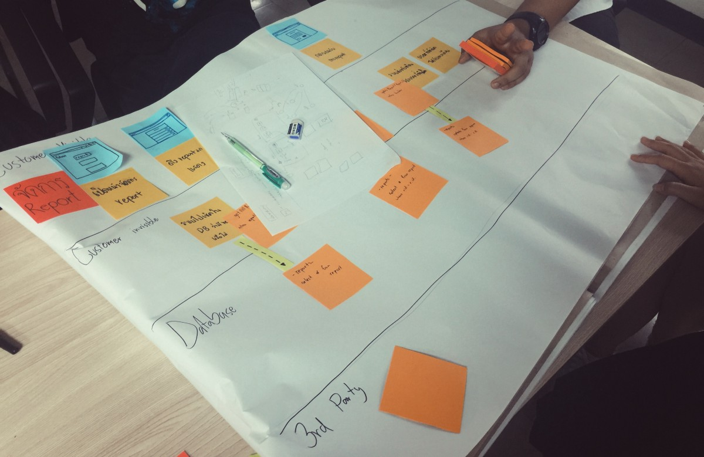

วิชา Software Development Process หรือ INT202 หนึ่งในวิชาบังคับของหลักสูตรเทคโนโลยีสารสนเทศ ที่มีชื่อเล่นเก๋ๆ ว่า “วิชาซอฟแวร์โพรเซส” ที่จะได้เจอกันตอนปี 3 เทอร์มหนึ่ง

ที่มาแชร์วันนี้ส่วนหนึ่งด้วยความอยากของตัวเอง อีกส่วนหนึ่งเป็นพี่ TA ในวิชาเค้าบอกว่า กลุ่มก็ตามที่เขียนบล้อคแชร์สิ่งที่ได้ในวิชานี้ เดี๋ยวจะมีคะแนนพิเศษให้กลุ่มนั้น

- กลับมาที่วิชานี้กันดีกว่า เล่าสั้นๆ ว่าเป็นวิชาที่จะสอนเราว่าการจะทำ Product ที่ดีและระบบระเบียบซักตัวหนึ่ง มันจะต้องทำอะไรบ้าง
- ในโลกความเป็นจริงของเรามันไม่มีคำว่า One-man-show .. เราต้องทำงานเป็นทีม แล้วถ้าจะสร้าง Product ที่ดีได้ เราจะทำยังไงให้เราและคนอื่นๆ ในทีมทำงานร่วมกันได้

หลายอย่างที่กล่าวมาข้างบนทั้งหมด คงเป็นสิ่งที่เราเองคิดว่า นี่แหละที่วิชานี้สอนเรา

> โปรแกรมเมอร์ส่วนใหญ่เก่ง Technical ถึงไม่เก่งมันก็หัดกันได้ แต่สิ่งที่ยังขาดคือ Teamwork และ Process ในการทำงานต่างหาก  
> — จอมยุทธ

### Week 1 : Be Absent

ช่วงเปิดเทอร์มอาทิตย์แรก ผมอยู่ที่มาเลเซีย 😗 พอดีกำลังเข้าค่าย AIOTI อยู่ที่ UTM, Johor Bahru, Malaysia เลยต้องเป็นอันพลาดคลาสแรกกันไป โบราณว่าไว้ พลาดคาบแรก ดรอปทิ้งลงใหม่ดีกว่า .. บ้าน่า พูดเล่นเฉย ๆ

- ใน week นี้เค้าให้จับกลุ่ม กลุ่มละ 6 คนครับ เพื่อที่จะเรียนวิชานี้
- วิชานี้เป็นโปรเจคกลุ่มทั้งหมดครับ ด้วยเหตุผลที่ว่า ในความเป็นจริงการทำงานเราต้องทำงานเป็นทีม การพัฒนา Software ก็เช่นกัน และตั้งแต่วันนั้นก็มีแต่งานกลุ่มรัวๆ เลยครับ
- ความพีคคือวันที่จับกลุ่ม ผมอยู่สิงคโปร์ เพื่อนคอลมาว่า มึงกลุ่มกูนะ (!) โอววว -//- รู้เลย

### Week 2 : How we think about Product ?

เราเริ่มเรียนรู้วิธีคิด Product อะไรซักชิ้นขึ้นมาครับ โดยใช้ แผนภูมิ Fish bone กัน โดยให้จำลองคิดว่า เราจะทำระบบ KMUTT E-payment ที่ทำให้การจ่ายเงินในมหาวิทยาลัยไม่ต้องใช้เงินสด

- โดยให้คิดเป็น Features และ Functions ย่อยๆ ของแต่ละ Feature นั้นจ้า

เราใช้แผนภูมิ Fish Bone หรือแผนภูมิก้างปลา(นั่นแหละ) ในการระดมสมองครับ โดยมีวิธีใช้แบบนี้

- หัวปลาจะเป็นหัวข้อโปรเจคของเรา
- แต่ละก้างปลาตรงปลายจะเป็น Feature มองง่ายๆ ว่าเป็นภาพใหญ่ของสิ่งที่จะมีในระบบของเรา
- ภายในก้างปลานั้นจะมี Function ต่างๆ ของ Feature นั้น

ไหนเดี๋ยวผมลองยกตัวอย่างการใช้งานให้เห็นภาพ ก็จะเป็นแบบนี้

- Feature: เติมเงินเข้า E-wallet
- Functions: เติมเงินผ่านทาง ATM, เติมเงินผ่าน Counter Service, เติมเงินผ่านทางตัวแทนตามร้านค้าในมหาวิทยาลัย เป็นต้น

ทั้งหมดมันทำให้เราเห็นภาพมากขึ้นว่า อ๋อออออ ​~ เราจะมีอะไรบ้างนะ และอะไรที่เรายังขาดไป

ทำคนเดียวมันไม่รู้สึกอะไรหรอก แต่พอทำเป็นกลุ่มเราจะเห็นว่า เรากับเพื่อน มุมมองจะต่างกัน และตัว Fish bone นี่แหละ จะทำให้เรา Brain strom และปรับความเข้าใจกับทีมได้ดี ใช่ ผลที่ได้มามันก็ดีจริง เราก็คิดและแจกแยกย่อยมาซะเยอะเลย

### Week 3 : Beginning of Term-Project

เราได้เปิดโจทย์ Term-project กันในหัวข้อ Sustainable Delevelopment Goals หรือเรียกอีกอย่างว่า SDGs ที่มีทั้งหมด 17 ข้อ และเลือกทำ Product อะไรก็ได้หนึ่งชิ้นที่ตอบสนองอย่างน้อยหนึ่งข้อใน SDGs

กลุ่มผมเราลองใช้เทคนิค ::Design Thinking:: ในการทำสรุปและ Brian Stroming คิดโปรเจคขึ้นมา

1.  เราเริ่มจากระดมปัญหาที่ตัวเองอยากแก้มาก่อน คนละ 3 ปัญหา แล้วให้ทุกคนเล่ามาว่า พบเจออะไรมาจึงเขียนปัญหานี้
2.  พอฟังกันหมดแล้ว ให้กลับไปเขียนปัญหามาอีกคนละ 2 ปัญหา แล้วเอามาเล่าให้กันฟังอีก เพื่อฟังของเพื่อนๆ แล้วตกผลึกอะไรได้ขึ้นมา
3.  โหวดกันว่า ทีมเราทุกคนจะเลือกแก้ปัญหาอะไรกัน มีคนละ 3 โหวด
4.  พอโหวดได้ปัญหาที่ทั้งทีมตกลงอยากจะแก้กันแล้วปุ๊บ เราก็มาเลือกว่าจะแก้ด้วยวิธิการไหนกัน ?
5.  ก็ Loop เดิมเลยฮะ แค่เปลี่ยนจากปัญหา เป็นวิธีแก้แทน

ความจริงที่เรากล้าพูดคือ เราไม่ได้เริ่มจากการคิดว่าอยากจะแก้อะไรใน SDGs แต่เราคิดว่าเราอยากทำอะไรก่อน แล้วค่อยหาเรื่องให้สิ่งที่เราคิดเนี่ย ไปสนับสนุน SDGs เอา

### **Week 4 : Present Our Term-Project**

เราเตรียม Present สิ่งที่เราได้คิดกันมาครับ ทุกทีมก็พรีเซนต์กันไป ทำให้เราได้เห้นว่าเอ๊อออ แต่ละทีมมีแนวคิดยังไง ? แต่ละทีมจะทำอะไรกัน

การพรีเซนต์ในครั้งนี้ก็จะได้รับ Comment จากอาจารย์และพี่ TA ว่าเค้าสงสัยทางไหน มันจะเป็นไปได้ไหม แนะนำหรือเสริมในบางมุมลงไป

เป็น mini-pitching เล็กๆ ใน Class กันครับผม เป็นสีสันหนึ่งที่ดี อารมณ์ทุกคนเตรียมตัว เผาสไลด์ ตั้งใจฟังเพื่อนพรีเซนต์ เพื่อตัวเองจะได้ improve การพรีในรอบต่อไปให้ดีกว่ากลุ่มเพื่อน อูวววว ครบรส

จากที่เราตั้งใจ เราก็ต้องเปลี่ยน Project ของเรากันเลยทีเดียวครับ

### Week 5 : Let we know “A-DAPT Blueprint”

เราเริ่มเขียนแผนภูมิ Fish bone กันตั้งแต่หลังวันที่ Present นั่นแหละครับ และเราจะหยิบเอาทุก Function ที่แปะไว้ ออกมาเขียนเป็น User Flow ยาวๆ ว่า ใน Function นี้ Flow นี้ User จะเจออะไรบ้างหว่า

> พอดีวันที่เขียนบทความนี้ขึ้นมาไปอ่านเจอบทความหนึ่งที่ดีมากๆ เกี่ยวกับเครื่องมือกลางสื่อสารกับทีมให้เข้าใจได้ตรงกัน.  
>  — เป็นความรู้ที่พี่ชายของผมไปรับฟังมาจากงาน UX Meetup ครั้งที่ 10 ครับ เกี่ยวกับการทำ User Journal ที่จะทำให้ทุกคนในทีมนั้น มองภาพทั้งระบบออกและเข้าใจตรงกัน

[**UX Meetup #10 — Mastering Customer Journey เครื่องมือกลางสื่อสารกับทีม**  
\_สวัสดีครับวันนี้มีโอกาสได้ไปงาน UX Meetup ครั้งที่ 10 เรียกได้ว่ากดบัตรเข้างานบน Event Pop นั้นโหดมาก แต่โชคดีที่กดทัน…\_medium.com](https://medium.com/@kampfer2nd/ux-meetup-10-mastering-customer-journey-%E0%B9%80%E0%B8%84%E0%B8%A3%E0%B8%B7%E0%B9%88%E0%B8%AD%E0%B8%87%E0%B8%A1%E0%B8%B7%E0%B8%AD%E0%B8%81%E0%B8%A5%E0%B8%B2%E0%B8%87%E0%B8%AA%E0%B8%B7%E0%B9%88%E0%B8%AD%E0%B8%AA%E0%B8%B2%E0%B8%A3%E0%B8%81%E0%B8%B1%E0%B8%9A%E0%B8%97%E0%B8%B5%E0%B8%A1-90263754d2fa "https://medium.com/@kampfer2nd/ux-meetup-10-mastering-customer-journey-%E0%B9%80%E0%B8%84%E0%B8%A3%E0%B8%B7%E0%B9%88%E0%B8%AD%E0%B8%87%E0%B8%A1%E0%B8%B7%E0%B8%AD%E0%B8%81%E0%B8%A5%E0%B8%B2%E0%B8%87%E0%B8%AA%E0%B8%B7%E0%B9%88%E0%B8%AD%E0%B8%AA%E0%B8%B2%E0%B8%A3%E0%B8%81%E0%B8%B1%E0%B8%9A%E0%B8%97%E0%B8%B5%E0%B8%A1-90263754d2fa")

ผมว่าพี่เค้าอธิบายได้ดีมากๆ เลยครับ :) ลองอ่านกันดู เครื่องมือข้างบนที่พี่เค้าแชร์จะทำให้ทีมเราเขียน Flow. ได้ดีขึ้นจริงๆ นะ

หลังจากที่ได้ Flow แต่ละอันมาแล้ว เราจะมาแยกแต่ละ Card ให้ออกมาเป็น 4 ส่วน

- สิ่งที่ผู้ใช้มองเห็น (User Visible)
- สิ่งที่ผู้ใช้มองไม่เห็น (User Invisible)
- การเก็บข้อมูล (Database)
- ปัจจัยภายนอก (3rd Party)

สิ่งที่พูดมาข้างบน 4 อย่างมันมีชื่อเท่ห์ๆ ที่เรียกว่า A-DAPT Blueprint

> ถ้าอยากอ่านเกี่ยวกับการใช้ A-DAPT Blueprint อีกนิด เชิญบทความนี้เลยนะครับ แล้วจะเห็นภาพมากขึ้นค้าบผม  
> ปล. เทคนิคอาจจะแตกต่างกัน โดยดูจากการแบ่งชั้นของ Blueprint ที่ของที่ผมเรียนและพี่ Chonnikan Toboonlarng ใช้ … แต่ผลที่คาดหวังก็เหมือนกันนะครับ

[**เมื่อฉันได้เห็นการ Planning โดยใช้ A-DAPT Blueprint**  
\_สำหรับพลอยการวางแผนงานถือเป็นสิ่งแรก ที่เราควรทำ ก่อนที่จะเริ่มพัฒนาซอฟต์แวร์ ถ้าเราทำซอฟต์แวร์แบบที่ไม่มีการวางแผนล่ว…\_medium.com](https://medium.com/@chonnikantoboonlarng/%E0%B9%80%E0%B8%A1%E0%B8%B7%E0%B9%88%E0%B8%AD%E0%B8%89%E0%B8%B1%E0%B8%99%E0%B9%84%E0%B8%94%E0%B9%89%E0%B9%80%E0%B8%AB%E0%B9%87%E0%B8%99%E0%B8%81%E0%B8%B2%E0%B8%A3-planning-%E0%B9%82%E0%B8%94%E0%B8%A2%E0%B9%83%E0%B8%8A%E0%B9%89-a-dapt-blueprint-a3ae5a69c6e8 "https://medium.com/@chonnikantoboonlarng/%E0%B9%80%E0%B8%A1%E0%B8%B7%E0%B9%88%E0%B8%AD%E0%B8%89%E0%B8%B1%E0%B8%99%E0%B9%84%E0%B8%94%E0%B9%89%E0%B9%80%E0%B8%AB%E0%B9%87%E0%B8%99%E0%B8%81%E0%B8%B2%E0%B8%A3-planning-%E0%B9%82%E0%B8%94%E0%B8%A2%E0%B9%83%E0%B8%8A%E0%B9%89-a-dapt-blueprint-a3ae5a69c6e8")

### Warp Up!

- Fish Bone ใช้ในการวางแผน คิด ระดมสมองในภาพใหญ่ ซึ่งช่วยได้ดีมากๆ
- Design Thinking เป็นพื้นฐานที่ดีนะ
- A-DAPT Blueprint เป็นสิ่งที่ทำให้เราเห็นภาพของระบบ ของแต่ละ Flow อย่างชัดเจนแบบ Step-by-Step
- ถ้าใครไม่เข้าใจระบบในส่วนไหนก็แค่กาง A-DAPT Blueprint ออกมาดูและชี้เข้าไปตรงที่สงสัยได้เลย
- ที่สำคัญทุกคนไม่ต้องจินตนาการตามสิ่งที่คนอื่นพูด เพราะทุกอย่างถูกเขียน ลงบน Post-it ที่ติดลงบน “A-DAPT Blueprint” เรียบร้อยแล้ว
- จากประสบการณ์ที่รู้สึกดีมากที่สุดคือ เมื่อเราทำ A-DAPT Blueprint ไปเรื่อยๆ กับทีม มันจะเริ่มตะหงิดใจขึ้นมาว่า เอ๊ะ เราคิด Flow ไม่ครบหรือเปล่า มันทำให้เราเก็บจุดเล็กจุดน้อยไปได้เยอะมากจริงๆ
- ด้วยเหตุผลข้างบน เลยต้องกลับไปเพิ่ม Function ที่ Fish Bone บ่อยครั้ง และบางครั้งก็ถึงกับเพิ่ม Feature เข้าไปเลยก็มี (อวดครวญกันทั้งทีมเวลาเพิ่ม Flow เพราะมันเขียนเย๊อะ เยอะ)

---

ขอบคุณอาจารย์อัจฉรา ธารอุไรกุล และพี่ณฐวัฒน์ ธัมธิวงศ์ หรือพี่อู๋ ที่สอนและถ่ายทอดประสบการณ์เจ๋งๆ แบบนี้ให้ได้เรียนรู้กันนะครับ
