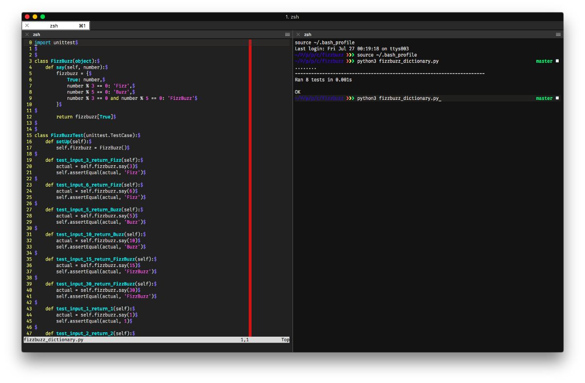

หลายคนคงเคยได้ยินคำว่า **CodeKata** อยู่บ่อย ๆ ถ้าทำงานหรือศึกษาอยู่ใน track ของ programming นะครับ .. วันนี้จะมาแชร์ว่าที่ [Pronto Tools](https://prontotools.io) เราทำ **CodeKata** กันทุก ๆ เช้า 9:30 น. พวกเราทำแล้วพวกเราได้เรียนรู้อะไรจากมันมาบ้าง ?

### Everyday we do CodeKata! 🎯

-   เล่าให้ฟังก่อนว่าปกติแล้ว ธรรมเนียนปฏิบัติของเด็กฝึกงานของ Pronto Tools เราจะมาทำ CodeKata ทุก ๆ 9:30 ถึง 10:00 น. ของทุกวัน
-   โดยจะมีอุปกรณ์คือ **Macbook** 1 ea + **iTerm2** + **vim** + **python3** = **Our** CodeKata **environment** .. นั่นคือทั้งหมดที่เรามี

-   เด็กฝึกงานและพี่ ๆ ที่ทำงานอยู่ที่จะมาทำ **Codekata** ด้วยกันรวมแล้ว 8–9 คน ล้อมจอทีวีเดียวกัน และหนึ่งในนั้นจะเป็นคนเริ่มเขียนโค๊ดคนแรก
-   เราจะเขียน​ **Test** ก่อน และเขียน Code เพื่อแก้ Test นั้นจนผ่าน และพอเสร็จ testcase หนึ่ง รวม **Refactor Code** แล้ว ก็จะพลัดให้คนต่อไปเขียน .. หากบางวันเราต้องการ Speed up ก็จะให้ 1 คนเขียนแก้ 2 Tests เป็นต้น
-   หมดเวลา 10:00 น. เป๊ะ พี่กานต์ [Kan Ouivirach](https://medium.com/u/6f6af3cc17e7) ก็จะบอกว่า “เอ๊า ลบ” พรุ่งนี้เขียนใหม่ ถ้าวันไหนเขียนไม่ทันก็จะมีอาการร้องโอดครวญ 😥 .. ถ้าวันไหนเขียนจนเสร็จครบทุก Case เราก็จะยิ้มหัวเราะอย่างดีใจจจ ฮ่า ๆๆๆๆ 😄

---

### CodeKata คืออะไร ?

จริง ๆ แล้วมันคือการฝึกแบบหนึ่งที่เลียนแบบมาจากการฝึกฝนจากทางญี่ปุ่น ซึ่งผมก็ไปอ่านมาจากหลาย ๆ สำนัก ซึ่งได้ใจความมาประมาณนี้ครับ

-   จาก [Wikipedia](https://en.wikipedia.org/wiki/Kata_%28programming%29) เค้าบอกว่า “A **code kata** is an exercise in [programming](https://en.wikipedia.org/wiki/Computer_programming "Computer programming") which helps [programmers](https://en.wikipedia.org/wiki/Programmer "Programmer") hone their skills through practice and repetition.”  
    จากตรงนี้ผมพอเข้าใจแล้วว่า Codekata คือ เป็นการฝึกที่ช่วยให้โปรแกรมเมอร์ฝึกฝนทักษะของตัวเองผ่านการฝึกซ้อมและทำซ้ำ ๆ
-   และจากของพี่ภวิน [Phawin](https://medium.com/u/3e43ec11084a) (Software Engieer ที่ Pronto Tools) ก็เคยเขียนเอาไว้เช่นกันว่า “ มันคือการ ฝึกฝน ฝึกฝน และฝึกฝน ในเรื่องเดิม ๆ แล้วค่อย ๆใส่เงื่อนไขเพิ่มเข้าไป เพื่อพัฒนาความสามารถและแนวคิดในการเขียน Code ของเราได้”
-   และจาก [hatoriz.com](https://hatoriz.com/2017/05/09/coding-dojo-%E0%B9%82%E0%B8%A3%E0%B8%87%E0%B8%9D%E0%B8%B6%E0%B8%81%E0%B8%A7%E0%B8%B4%E0%B8%8A%E0%B8%B2%E0%B8%82%E0%B8%AD%E0%B8%87-programmer/) เค้าก็เขียนความหมายของ **Kata** (คาตะ) เอาไว้ว่า “มันแปลตรงตัวหมายถึง แบบอย่าง อธิบายเพิ่มเติมแบบเข้าใจง่ายๆ เช่น คาตะในคาราเต้ จะบ่งบอกถึงลักษณะเด่นของแต่ละสำนัก เปรียบเสมือกระบวนท่าเอกลักษณ์ อีกทั้งยังบ่งบอกระดับความสามารถของแต่ละบุคคลได้ด้วย”

สุดท้ายเท่าที่ผมจับใจความได้จากข้างบน นั่นคือ **“การเขียนโปรแกรมและฝึกซ้ำ ๆ ด้วยสิ่งเดิม ๆ โจทย์เดิม ๆ เพื่อฝึกฝนทักษะการเขียนโปรแกรม”**

ทีนี้จากคำว่า “**Kata”** นั้นบอกว่ามันจะบ่งบอกถึงลักษณะเด่นของแต่ละสำนัก หมายความว่าการฝึกของแต่ละคนนั้น มันไม่จำเป็นต้องเหมือนกัน หรือใช้ภาษาเดียวกัน Tools เดียวกัน .. คือพี่จะฝึกด้วย Java ก็ได้, น้องจะฝึกด้วย Javascript ก็ได้ หรือถ้าน้าจะฝึกด้วย Golang ก็โอเคเช่นกันครับ

และ Skill ที่จะได้ของแต่ละคนก็จะแตกต่างกันไปใน Environment ที่ต่างกัน หรือลักษณะภาษาที่แตกต่างกัน .. นั่นเป็นสิ่งที่ดีและมีคุณค่ามาก ๆ สำหรับตัวเองเลยนะ

เอาล่ะทีนี้มาดูกันว่าที่ผมและเพื่อน ๆ พี่ ๆ ฝึกมาตลอดเกือบ 2 เดือนนั้น พวกเราฝึกอะไรไปบ้าง ~

---

### What’re we learning from CodeKata ??

ที่ Pronto Tools ตั้งแต่ฝึกงานมาเจอทั้งหมดตอนนี้คือ 3 โจทย์ .. ที่นี่เราเขียน Python เป็นหลักจึงฝึกด้วย Python นี่แหละ

โดยปกติเราจะเพิ่มความยากของโจทย์ ความซับซ้อน ด้วยเอกลักษณ์และมาตราฐานของ Python เช่น ให้ใช้ Data structure แบบต่าง ๆ อย่างเช่น Dict หรือ Tuples , หรือให้ใช้ Style Guide แบบ [Flake8](http://flake8.pycqa.org/en/latest/) เป็นต้น มาดูข้อแรกกันเลยครับ..

#### I. FizzBuzz แด่โจทย์ฝึกเขียน Test ในตำนาน

สำหรับผมเอง มองว่าโจทย์นี้เป็นโจทย์แรกที่เป็นเบสิกพื้นฐานในการทำให้ตัวเองคุ้นเคยกับการเขียน Test ในภาษานั้น ๆ ก่อน

ซึ่งได้ผลดีมาก ๆ ครับ ผมเขียนโจทย์นี้ 3 วัน บวกกับการกลับไปอ่านภาษานี้เพิ่มเติม ผมเข้าใจ Python มากขึ้นและเข้าใจว่าการเขียน Test ใน Python มากขึ้น

ผมใช้เวลาประมาณหนึ่งอาทิตย์ในการปรับตัวให้คุ้นชินกับ Python มันเป็นเรื่องธรรมดาที่เขียนภาษาอื่นมาก่อนแล้วพอมาเขียนภาษาที่มีโครงสร้าง วิธีการเขียนแบบใหม่ มันจะไปได้ช้า

แน่นอนว่าพื้นเพผมคือคนเขียน Laravel, Nodejs, Javascript React มาก่อน ค่อนข้างยากที่จะต้องปรับให้ตัวเองลืม { … } และ ; (semicolon) แต่พอเราได้ทำทุกวัน ๆ ฝึกฝนทุกวันซ้ำ ๆ

ไม่นานผมก็คุ้นชินมากขึ้น เขียนคล่องพลิ้ววว จนเริ่มเข้ามือและทำโจทย์นี้เสร็จได้อย่างชิลใจ

---

#### II. Roman โจทย์ปราบเซียน

ที่ตอนแรกผมเองก็ไม่รู้ ว่ามันจะยากขนาดนี้ .. ตอนแรกก็คิดว่าแค่ mod ไม่ก็ divide เฉย ๆ ก็น่าจะผ่าน โอ้ววววว .. รู้เลย

สำหรับโจทย์ข้อนี้มันทำให้เราได้ฝึกเรื่องของการคิดละ Algorithm ที่เรียนมาก็คงต้องใช้ บวกกับความใหม่ของ Python ของเรา แน่นอนว่าไม่นานเกิน 3 วัน เราก็สามารถ Archive Quiz ข้อนี้ได้

แต่สิ่งที่เราได้มากกว่าสำหรับข้อนี้คือ เราได้ Algorithm ถึง 2 แบบ คือเขียนแบบ **while + ifelse** และ **recursive function**

นั่นถือเป็นเรื่องราวดี ๆ ที่เกิดขึ้น เราพยายามลองโน่นนี่กับโจทย์นี้ ก็ได้ทักษะแปลก ๆ จากการทำ CodeKata ช่วงนี้หลายอย่างเช่นกันครับ

---

#### III. Captcha โจทย์นี้มาเมื่อเราได้รู้จักกับคำว่า “Test Double”

โจทย์ข้อนี้เป็นโจทย์ง่าย ๆ คือ เราต้อง random เลขมา 1 ตัว, Operator ทางคณิตศาสตร์ 1 ตัว, เลขภาษาอังกฤษมาอีก 1 ตัว

เอามา Calculate กัน จนได้คำตอบออกมา เช่น `1 + one = 2` เป็นต้นครับผม

เพราะโจทย์ข้อนี้ใช้ Library เข้ามาช่วย นั่นคือ **“random”** งั้นถ้าเราจะต้องเขียน Test ให้กับสิ่งที่เราไม่ได้เขียนเอง หรือเป็น Dependencies เนี่ย ก็ต้อง **Mock/Stub** ให้มัน

เพื่อให้มั่นใจว่า Library นั้นถูกเรียกใช้งานจริง ๆ นะ _หรือ_ บังคับให้มันส่งค่าออกมา อย่างที่เราต้องการ เพื่อให้มั่นใจว่าถ้าค่า return มาตามที่เราต้องการแล้ว Function ของเราจะทำงานได้ถูกต้องใช่ไหม? เป็นต้น

> ทั้งหมดทั้งมวล จำเป็นต้องรู้ว่าเราจะ Mock ค่าขึ้นมาเนี่ย มันทำยังไง ?? ซึ่งมันเป็นเรื่อง **“Test Double”** … และผมขอข้ามไปนะครับ มันยาววว ..  
> แต่สามารถอ่านเพิ่มเติมได้ที่ [บทความของพี่ Somkiat](http://www.somkiat.cc/test-double-mock-stub-and-dummy/) ครับ :)

หน้าตาของ Code ก็จะเป็นประมาณนี้ .. ซึ่งเราต้อง patch ของเข้าไปเพื่อ Mock ค่าอะไรบางอย่างที่ใช้ Library นั่นเอง (บรรทัดที่ 28)

จากโจทย์ข้อนี้ทำให้ผมเริ่มเขียน **Test** ที่เป็น **API** หรือมี **Dependencies** จาก **3rd party** ได้ :) ถือเป็นโจทย์ที่เปิดโลกให้ผมมาก ๆ โจทย์หนึ่งเลยครับ 🎉

ถ้าจะให้บอกว่าทุกวันนี้เป็นยังไง บอกได้เลยว่ายัง **Archive** โจทย์ข้อนี้ไม่ได้ภายใน 30 นาทีนะครับ แต่ผมเขียน Version ที่มันผ่านไว้แล้วที่นี่ **Github:** [**firstziiz:pronto\_intern\_lab/codekata**](https://github.com/firstziiz/pronto_intern_lab/tree/master/codekata)

](./asset-6.png)

---

### The Excited things when we’re working.

พอฝึก CodeKata แล้ว มันเหมือนว่าการเขียนโค๊ดมันฝังอยู่ในกล้ามเนื้อเลย (ฮา) มันไม่ได้เกินจริงนะ บางทีเราก็รู้โดยอัตโนมัติว่า

.. เห้ย ถ้าจะ **Test** แบบนี้ มันต้องมีอะไรก่อน ถึงจะมีอันนี้ได้ และอันนู้นจะตามมาทีหลัง

.. เห้ย มี **API** ว่ะ เราต้อง mock นะ แล้วอีกฝั่งที่เป็น **Endpoint** เราก็ต้องเขียน Test แบบนี้นะ

หรือบางครั้ง **Algorithm** หรือแนวคิดอะไรบางอย่างที่เราเคยฝึกตอนทำ **Codekata** ก็จะโผล่มาเมื่อเราเจอโจทย์แปลก ๆ อย่างผมเคยที่เราต้องเขียน `ifelse` ยาว ๆ ประมาณ 8 case

ซึ่งมันจัดการยากมากกกกก ..พอใช้ความสามารถของ **Dictionary** เก็บเป็น Key, value เหมือน **Javascript Object** แต่ Key เป็นอะไรก็ได้ เราเลยเก็บ Key เป็น Statement แทน เช่น `{ a % 2 == 0 : 'EVEN' }`

ทั้งหมดทั้งมวลพวกนี้นั้นมาจากการนั่งทำ **Codekata** ในทุกวัน ๆ วันละครึ่งชั่วโมงติดต่อกันเป็นเดือน ๆ ทั้งสิ้นเลย 👍🏻

---

### Conclusion

สำหรับวันนี้อยากจะแชร์ว่า CodeKata นั้น มันเป็นสิ่งที่เราทำกันเป็นประจำทุกวันที่ไปทำงาน และตัวผมเองก็รู้สึกได้ ..ว่ามันพัฒนาตัวผมจริง ๆ ไม่ได้โมเม

เท่าที่อ่าน Blog ของพี่ ๆ ที่เคยมาฝึกงานที่นี่ คือ Pronto Tools เราทำ CodeKata แบบนี้มาหลายปีมาก ๆ แล้ว .. และถึงแม้เราจะพึ่งทำได้แค่เดือนกว่า ๆ ผมก็ขอเป็นปากเป็นเสียงว่า**มันเป็นสิ่งที่ช่วยพัฒนาทักษะโปรแกรมมิ่ง**ได้จริง ๆ

ถ้าใคร มหาลัย หรือองค์กร หรือบริษัทอะไรก็ตามที่ได้อ่านบล็อคนี้แล้วยังทำ Codekata อยู่ หรือสนใจอยากลองเริ่มทำ ทักทายมาก็ได้ หรือมาแชร์กันก็ได้ครับ มาฝึก ๆ ๆ ไปด้วยกันครับ

หรือหากมีแนวคิด วิธีการ แนวทางที่น่าสนใจก็อยากจะขอให้แชร์และแบ่งปันกัน ถ้ามันน่าสนุกและน่าสนใจ เดี๋ยวพวกเราจะลองมานำมาใช้กันดูครับผมม : )

วันนี้ก็จบไปแล้วนะครับกับ Blog Everyday ของผมใน **#Dontbreakthechain** Challenge

อาจจะช้านิดนึงนะครับ พอดีผม VPN ไปอังกฤษแล้ว Timezone น่าจะไม่ตรงกับไทยเลยมาสายนิดหน่อย >< เอ้ย ไม่ใช่! พอดีวันนี้กลับดึกครับผม ต้องขออภัยด้วยครับ

แล้วไว้ติดตามกันใหม่ในเย็นนี้ วันนี้ที่ 27 กรกฏาคม 2018 ครับผม

สวัสดีครับ!

