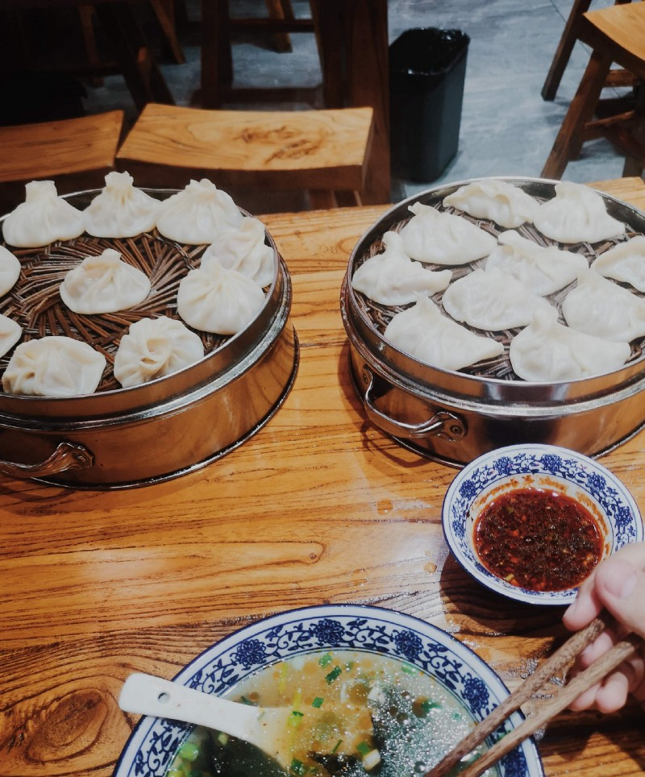

สวัสดีครับ! คิดว่าหลายคนที่หลงเข้ามาในนี้คงจะเป็นคนที่อยากรู้ว่า เฟิสมันไปทำไรที่จีน? หรือไม่ก็คนที่ว่าง เลื่อนผ่าน Feed แล้วมาเจอคนแชร์บทความนี้ หรือจะเป็น **T**hought**W**ork**er** ประเทศไทยเอง!

ก็ขอขอบคุณทุกท่านที่เข้ามาอ่านกันนะครับบ ~

ผมชื่อ เฟิส ครับ ตอนนี้อยู่ **T**hought**W**orks ประเทศไทย ในตำแหน่ง Developer, _Graduate_ Consultant … จากตำแหน่งแน่นอนว่าผมพึ่งจบได้ 2 เดือนเศษ ๆ และนี่เป็นงานประจำงานแรกในชีวิตของผมเช่นกัน

นี่ก็ถือเป็นโอกาสที่พึ่งกลับจากจีน กินอาหารไทยที่คิดถึงเรียบร้อย ก็เลยมาแชร์ประสบการณ์ 5 อาทิตย์กว่า ๆ ที่ไปอยู่ Xi’an, China ไว้เผื่อเก็บไว้อ่านตอนโต

ที่ ThoughtWorks เนี่ยถ้าใครเป็น _Graduate_ หรือสั้น ๆ ว่า _Grad_ จะถูกส่งไป จีน หรือ อินเดีย เพื่อเรียนรู้การทำงาน ซึ่งในที่นี้เราเรียกมันว่า **“T**hought**W**orks **U**niversity**”** หรือเรียกสั้น ๆ ว่า **“TWU”** ซึ่งจะเป็นที่ที่ทุกคนในตำแหน่ง _Grad_ จากทั่วโลกจะมาเรียนรู้งานด้วยกัน

ขอย้ำอีกทีว่า “**ทั้งโลก**” จริง ๆ

---

### ThoughtWorks University 66th

สไตล์การจัด **TWU** นั้นจะจัดเป็นรอบ ๆ ซึ่งจะจัดที่ อินเดีย และ จีน คละ ๆ กันไป แล้วแต่ช่วง … และจะเรียกแต่ละรอบที่จัดว่า Batch ซึ่งตัวผมอยู่ใน Batch ที่ **66** น่ะ

และใน TWU เราก็จะมีทุก Roles ของ ThoughtWorks เข้าร่วมด้วยทั้งหมด ทั้ง **B**usiness **A**nalyst, **E**xperience **D**esign (จงเข้าใจแบบสั้น ๆ เร็ว ๆ ว่า **UI + UX**), **Q**uality **A**ssurance ด้วย ไม่ใช่แค่ **Dev**eloper เท่านั้น

ยอมรับว่าตื่นเต้นสุดๆ ตั้งแต่ตอนได้งานและที่รู้ว่าต้องไปจีน! ไอ่เราก็คนไม่เคยไปต่างประเทศนาน ๆ ไม่รู้หรอกว่าต้องทำตัวยังไง .. แต่พี่อ้อ [Boonjira Angsumalee (Aor)](https://medium.com/u/69ce0838627f) และพี่อีกหลาย ๆ คนในออฟฟิสบอกว่า _“มันสนุกเว้ย! ครั้งหนึ่งในชีวิต!”_ อะก็ได้ ลุยยยยย

> **Fun Fact:** ไปจีนครั้งนี้เราไปในนามบริษัท ทำให้เป็นครั้งแรกที่ทำ VISA แบบ Business! ตื่นเต้นดีนะ มี VISA Class แปลกใหม่เพิ่มใน Passport

ผมเดินทางวันที่ 20 June … มันจะไม่มีอะไรพีคเลย ถ้าเครื่องบินไม่ดีเลย์ 3 ชั่วโมง ทำให้เครื่องไปถึงจีนเกือบเที่ยงคืน ซึ่งเพลียมาก ๆ แถมอีกวันต้องตื่นแต่เช้าเพื่อไปเข้า Day-0 Session! เริ่มทริปก็เหนื่อยแล้วว

นั่นเป็นจุดเริ่มต้นของ 5 อาทิตย์ที่เหมือนจะนานมากกก แต่ไม่นานเลย 😀

---

### A lot of International Colleague

คำว่า “ทั้งโลก” คงไม่เวอร์ไป เพราะใน Batch ของผม มีเพื่อนร่วมงานจากแทบทุกทวิปบนโลก ทั้ง _Chili, Ecuador, Brazil, United State, Maxico, United Kingdom, German, Spain, India, China, Australia, Singapore_ และผมมาจาก​ _Thailand_ เพียงหนึ่งเดียวใน Batch นี้ !

> **Fun Fact:** สมัยเด็ก ๆ เราก็ฝันแหละว่า เอ้อ! โตขึ้นเราอยากทำงานกับคนจากหลาย ๆ ประเทศบนโลกจัง … ไม่คิดหรอกว่ามันจะเป็นจริงวันนี้ ฮ่าๆๆๆ

ในเมื่อมาอยู่รวมกัน … สิ่งหนึ่งที่ผมได้เรียนรู้จากที่นี่ คือ **การเคารพซึ่งกันและกัน** เคารพในความต่างทั้งด้านเชื้อชาติ ศาสนา สีผิว สำเนียง เพศ อายุ ส่วนสูง น้ำหนัก หรือแม้แต่ Background ชีวิตของแต่ละคนที่ไม่เหมือนกัน ทุกอย่างเหล่านี้ถูกให้ความสำคัญและไม่มีการล้ำเส้นกันระหว่างเพื่อนร่วมงานกันเลย

ผมว่าการคัดคนของที่ ThoughtWorks มีเอกลักษณ์อยู่ที่ไม่เหมือนที่ไหน … ส่วนหนึ่งมันทำให้คัดคนที่มีนิสัยใจคอ หรือมีความคิดใกล้ ๆ กันมาอยู่ด้วยกัน ทำให้ผมปรับตัวเข้ากับคนอื่น ๆ ได้ไม่ยากมาก ไม่ว่าเค้าจะมาจากประเทศไหนก็ตาม

---

### Feedback Culture!

สิ่งหนึ่งที่ชอบมาก ๆ คือเรื่องของ Feedback .. มันถือเป็นเรื่องสำคัญที่สุดกว่าเรื่องอื่น ๆ เลย

ถ้าอันไหนที่เราทำได้ดี เค้าก็จะบอกว่ามันดีอยู่แล้วจงมั่นใจ … อันไหนที่เราทำได้ยังไม่ดีพอ เค้าก็จะบอกว่ามันยังไม่ดีและคุณควรจะปรับปรุงตรงไหนในความเห็นของเค้า

บางครั้งสิ่งที่ทำได้ดีอยู่แล้ว เค้าเห็นว่ามันไปต่อได้ เค้าก็จะแนะนำเราให้ลองทำสิ่งใหม่ ๆ เช่นกัน

> **Fun Fact:** สิ่งที่เปลี่ยนความคิดผม คือ “ Feedback ไม่ใช่คำด่าทอ เสียดสี หรือทำให้เกิดความรู้สึกที่แย่ ”

> … บอกตามตรงว่า ผมเองยังไม่รู้หรอกว่า Feedback ที่ดีที่สุดมันควรเป็นยังไง เพราะการพูดกับคนต่างกันก็มีสไตล์ที่ต่างกัน แต่สิ่งหนึ่งที่ผมเรียนรู้ คือ เราจะระลึกในใจ ว่าเราต้องไม่ทำให้เขาเสียใจ และเขาต้องได้ประโยชน์ ได้พัฒนาตัวเองจากคำพูดของเราเช่นกัน

ที่ **T**hought**W**orks ทุกคนจะซีเรียสเรื่องการให้ Feedback, การรับ Feedback หรือการใช้ Feedback มาปรับปรุงตัว … สิ่งนี้ทั้งหมดถูกพูดตั้งแต่วันแรกที่ผมเข้าทำงานที่ **T**hought**W**ork เลย

และใน **TWU** เองเรามีกิจกรรมที่ให้เราแชร์อะไรก็ได้ที่อยากแชร์ เรียกว่า **“**[**Pacha Kucha**](https://www.pechakucha.com/)**”** และผมก็แชร์เรื่องราวของผม … ซึ่งเมื่อจบการแชร์ทุกคนเขียน Feedback ลงใน Post-it แล้วส่งให้ผม

รู้มั้ยครับว่า … จากคนที่ไม่เคยมั่นใจว่าสกิลภาษาอังกฤษตัวเองจะไปคุยกับใครเขาได้ วันนี้ทุกคนบอกว่าผมพรีเซนต์ดีมาก ๆ ผมทำให้พวกเขารู้สึกไปตามกับผมได้

โห! เรื่องเล็ก ๆ ที่ทุกคนเสียสละเวลาแค่ 5–10 วินาทีเขียนข้อความลงใน Post-it แล้วส่งให้ผม … มันทำให้เรามีมั่นใจเพิ่มขึ้นมหาศาลลลลลล จนนี่อยากลองไปเป็น Speaker ในงาน Tech Conference นานาชาติดูบ้างเลย

เห็นไหม … ว่า **_Feedback_** มันสำคัญ​ :)

---

### Technical Lessons Learned!

ที่ **TWU** มีไว้เพื่อ Fails เพื่อล้ม เพื่อพลาด เพื่อเสียใจ … มันเหมือนเป็น _Safe_ Environment ที่ทำมาเพื่อให้เราได้เรียนรู้การทำงาน เป็นสถานที่ที่ทำให้เราได้เจ็บ เจ็บแล้วจะได้จำ … เมื่อกลับไปประเทศตัวเอง จะได้คิดให้มากขึ้น รอบคอบมากขึ้น จะไม่เจ็บซ้ำรอยนั่นเอง

จากการล้มใน **TWU** ทำให้ผมเรียนรู้เยอะมาก ๆ ครับ ผมจดโน้ตในไว้ iPad เกือบ 20 หน้าตลอดหนึ่งเดือนกว่า ๆ … ทั้งความรู้ ความเจ็บ ข้อควรจำ และอีกมากมาย

มันได้เรียนรู้อะไรเยอะมาก ๆ จากเด็กโปรแกรเมอร์คนหนึ่งที่มั่นใจมาโดยตลอด จนไป **TWU** แค่ผ่านมา 5 อาทิตย์และกลับมา … มุมมองเราเปลี่ยนไปหมดเลย เปลี่ยนแทบจะทุกมุม … โดยเฉพาะมุมของการเป็นโปรแกรมเมอร์ที่ดี มันควรจะต้องเป็นยังไง ต้องคิดถึงอะไรบ้าง ~

จากการฝึกงานตลอด 4 ปีในองค์กรทุกรูปแบบ เราก็คิดเอาเองว่า เราคงเจอโลกมาก็พอสมควรแล้วล่ะ … เราพึ่งรู้ว่านี่มันแค่เริ่มต้นเท่านั้นเอง ในโลกโปรแกรมเมอร์ยังมีอีกเป็นแสน ๆ อย่างให้เราได้เรียนรู้มัน

หลายคนคิดว่าโปรแกรมเมอร์มันแค่เขียนโปรแกรมให้เสร็จก็จบ, แต่ไม่ใช่กับที่ ThoughtWorks ที่นี่ทำให้โปรแกรมเมอร์ต้องคิดในภาพที่มันใหญ่ขึ้น โปรเจคนี้จะเกิดได้ยังไง? จะต้องวางแผนอะไรบ้าง? ใครเป็นลูกค้าเรา? เค้าอยากได้อะไรกันแน่? เราจะไปช่วยเค้ายังไงได้บ้าง? หรือเราจะต้องวางพื้นฐานอะไรบ้างเพื่อให้เค้าเติบโตไปกับเรา? แล้วผลกระทบฝั่งเรามีอะไรบ้าง? แล้วผลกระทบฝั่งลูกค้าล่ะ? และอีกมากมายที่ผมคิดเยอะขึ้นมาก ๆ กว่าสมัยเป็นก่อน

ทุกอย่างที่ผมเจอมา … ผมคิดว่ามันเป็นจุดเริ่มต้นที่ดีนะ สำหรับเด็กจบใหม่อย่างเรา และวันนี้มันทำให้ผมมีเป้าหมายที่ไกลขึ้นกว่าเดิมมากกกกกกกก

> **Fun Fact:** พูดถึงโปรแกรมเมอร์ประเทศอื่นบ้าง … มันก็บ้าเหมือน ๆ คนไทยนี่แหละครับ เขียนโค้ดแบบไม่หยุดไม่หย่อน ชอบทำของเล่น! เขียนนั่น ลองนี่ แล้วบางครั้งก็ชอบลืมอะไรบางอย่างจนเกิดบัค แล้วมันก็คิดไม่ออก …

> ก็มักจะแซวกันเสมอว่า “โถ่ ทำไมยูลืมอะไรแค่นี้! ฮั่นแหน่! นอนน้อยล่ะสิ!” และหลาย ๆ มุขตลกที่เล่นในไทย …ใช้ในคนต่างชาติได้นะ ผมลองมาแล้ว

---

### Daily Life

มาถึงเรื่องชีวิตแต่ละวันที่เมือง Xi’an … มันไม่ได้ง่ายอย่างที่คิด เพราะเราใช้ได้แค่ WeChat สำหรับติดต่อสื่อสาร ถ้าอยากจะใช้ Google, Line, Facebook ก้ต้องต่อ VPN ตามระเบียบ ซึ่ง VPN ฟรีก็ช้ามาก ๆ ถ้าอยู่เป็นเดือนแบบผม ขอแนะนำให้**จ่ายเงินซื้อ**ไปเลย …

เรื่องอาหารที่จีนก็**เผ็ดมาก** ๆ ระดับที่หม่าล่าเมืองไทยกระจอกไปเลย ส่วนอาหารที่ไม่เผ็ดก็จะค่อนข้างมันและจืดมาก ๆ เช่นกัน ที่นี่กินเนื้อหมู เนื้อวัว เนื้อแพะ

สิ่งที่อร่อยที่สุดและทำให้ผมมีชีวิตได้ครบเดือนคือ **เกี๊ยว**นั่นเอง ถ้าไม่มีเกี๊ยว ผมคงอดตายไปแล้ว

เรื่องเดินทางก็ลำบากพอสมควร เพราะทุกอย่างเป็นภาษาจีนทั้งหมด คนจีนที่เมืองนี้ 90% พูดภาษาอังกฤษไม่ได้เลย … แต่ข้อดี คือ **เมืองสวยมากกกก** ขนาดที่เพื่อนจาก Chicago พูดว่า ที่นี่เหมือนชิคาโก้เลย ทั้งถนน ตึกต่าง ๆ สูงละลานตาเต็มไปหมด

โซนที่เราอยู่คือ Hi-tech Zone เป็นโซนอุตสาหกรรมเทคโนโลยีของเมืองซีอาน … ทั้งโซนในเมืองก็ยังคงตื่นตาตื่นใจกับสถาปัตยกรรมจีนอีกมากมาย กำแพงเมือง Xian เอย ใหญ่มากกกก

เราไปปั่นจักรยานบนกำแพงได้ด้วย วนทั้งหมดประมาณ ~16 กิโลเมตร ปั่นจนเหนื่อยเลยยยย … ใครไป Xi’an แล้วไม่ได้ไปปั่นจักรยานข้างบนนี่ ถือว่าไปไม่ถึงนะ

เรายังไปเที่ยว Golden Monkey Nature Reserve เขตอนุรักษ์ธรรมชาติลิงทอง (ผมมั่วชื่อไทยนะ) … เราไปปีนเขากันครับ เหนื่อยมากกกกกกกกกกก ~ ขึ้นเขาตั้งแต่เที่ยง กว่าจะหาทางลงมาได้ก็ปาไปหนึ่งทุ่ม .. เป็นประสบการณ์ที่ดีมากครั้งหนึ่งในชีวิตเลย

หลายคนสงสัย ว่าผมไม่พูดถึง Terracotta Army ที่สุสานทหารจิ๋นซี ฮ่องเต้เลย?… ผมไม่ได้ไป เพราะมันไกล … ภูเขาหัวซานผมก็ไม่ได้ไปเช่นกัน (ฮา) แค่ทำงานจันทร์ถึงศุกร์ก็กินพลังชีวิตไปเยอะแล้ว เสาร์อาทิตย์เลยเดินเล่นในเมือง เที่ยวบ้างไรบ้าง แค่นั้นจริง ๆ เลยครับ 😂

> **Fun Fact:** เราไป Pet Cafe ด้วยกัน ผมพึ่งรู้ว่าแมวครองโลกก็วันนี้นี่แหละครับ ไม่ว่าคุณจะมาจากประเทศไหนก็ตาม อเมริกาเหนือใต้ ยุโรป เอเชีย ออสเตรเลีย … ก็ไม่มีใครต้านทานพลังแห่งแมวได้เลยแม้แต่คนเดียว

---

### Conclusion

นับจากวันที่เขียน ตอนนี้ก็ครบ 5 วันหลังจากกลับจากจีนพอดี … ยังรู้สึกเหงา ๆ อยู่บ้าง ที่ไม่ได้เจอเพื่อน แต่เราทั้ง ~60 คนก็ยังคงติดต่อกันผ่าน Chat ของบริษัท … บางประเทศมี _Lunch & Learn_ _Session_ เกี่ยวกับ **TWU** … บางประเทศก็ยังมี _Post_ **TWU** _Session_ ต่ออีก … บางประเทศกลับถึงบ้านก็เข้า _Project_ เลย ไม่ใช่ที่ไหนไกล ที่ไทยนี่แหละครับ

แต่รู้ไหม? ว่าการเข้าโปรเจค อย่างน้อยมันก็ทำให้เราหายเหงาได้พอสมควรนะ มีงานให้ทำตลอด … มีเพื่อน พี่ คนจากต่างชาติที่อยู่ในโปรเจคต้องทำความรู้จัก มีอีกเป็นร้อยพันอย่างที่ต้องทำ

สุดท้ายแล้ว ถ้าใครถามว่าผมไป **T**hought**W**orks **U**niversity แล้วมันเป็นยังไงบ้าง? ได้เรียนรู้อะไรกลับมาบ้าง? มันคงเล่าได้ไม่หมด มันเยอะมากจริง ๆ ทั้งเพื่อนใหม่จากทั่วทั้งโลกเลย, ความรู้ที่ไม่มีสอนในห้องเรียน, ประสบการณ์สุดบ้าบิ่นต่าง ๆ นานา ได้เจอเป้าหมายในชีวิตใหม่ ๆ, ได้ไฟในการทำงานดวงใหม่, ได้ Year Goal เพิ่มขึ้นหลายอัน, และอีกร้อยพันอย่างที่ผมจะไม่มีวันลืมเลยย … แต่ผมจะสรุปสั้น ๆ เพียงประโยค ผมจะขอบอกว่า

“ตัวผมเองได้ไป **TWU** ในฐานะ Developer และผมกลับมาในฐานะ Consultant ครับ​”

---

ขอขอบคุณทุกท่านที่อ่านมาถึงตรงนี้ครับผม …   
สำหรับวันนี้ สวัสดีครับ 🙏🏻

> It’s hard to write down our story without crying because I really miss you all. — TWU 66

> Love,  
> First Kanisorn Sutham  
> ThoughtWorks Thailand.
