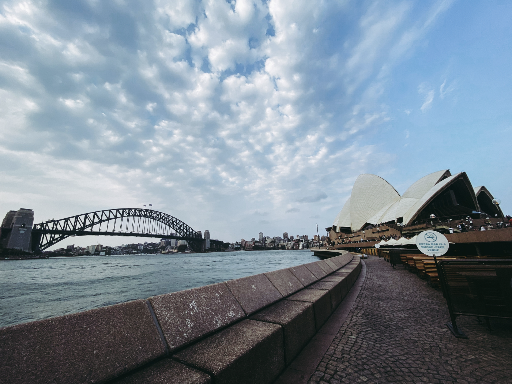
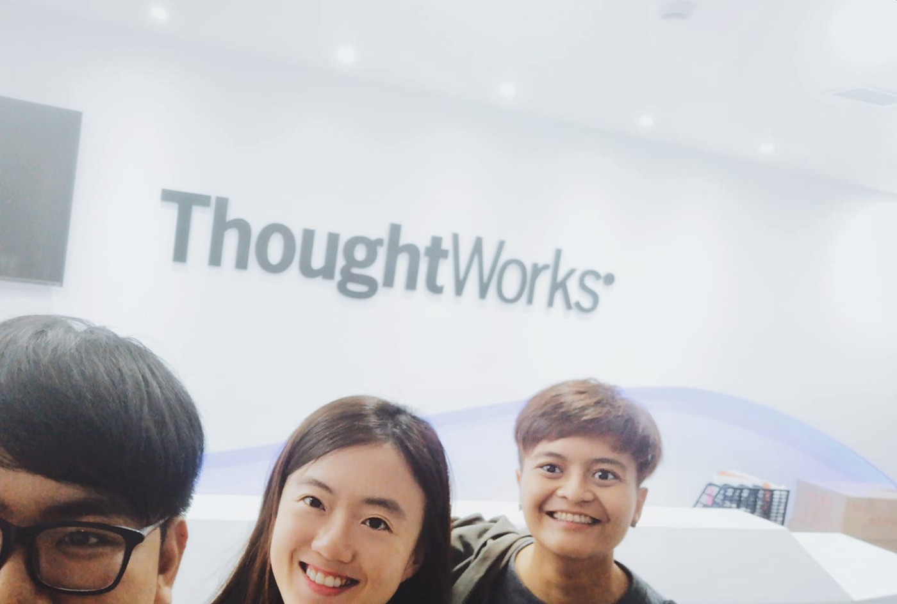
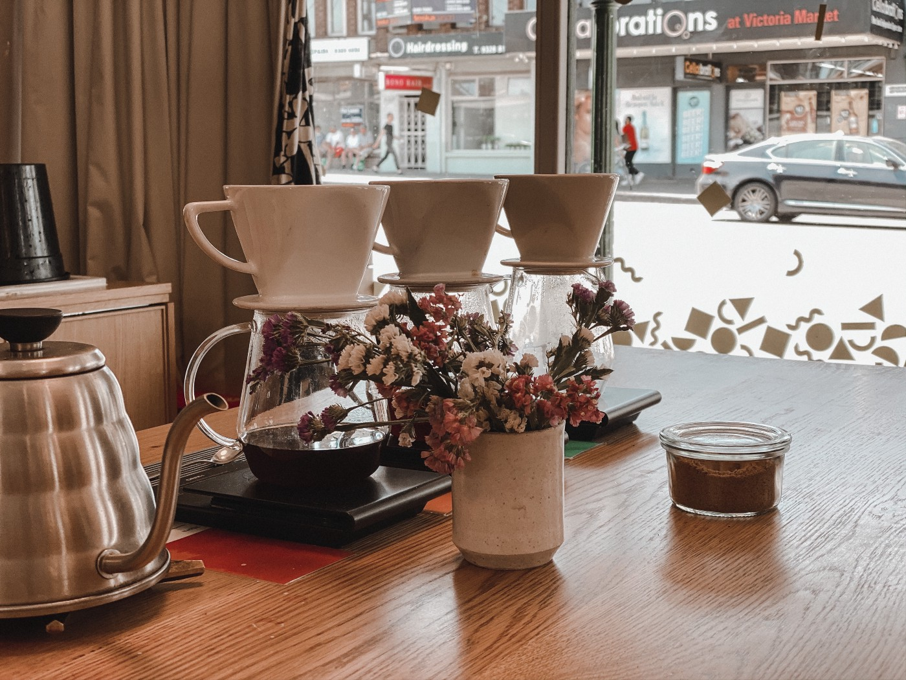
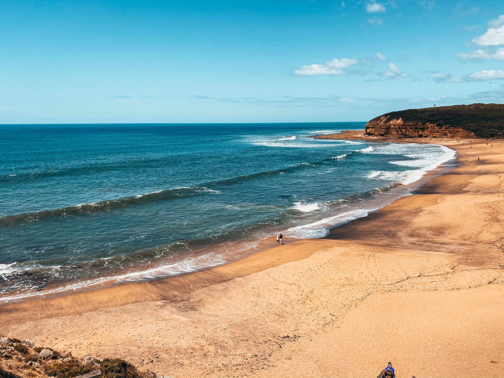

สวัสดีครับ :) ในวันที่ผมโพสรีวิวปี 2019 ของตัวเอง ทุก ๆ คนรอบตัวคงโพสกันไปหมดแล้ว … ผมตั้งใจไว้แบบนั้น

ด้วยความที่ตัวเองไม่อยู่ช่วงท้ายปี จะเขียนให้ครบก็คงยาก เลยตั้งใจกลับถึงไทยแล้วให้เวลาตัวเองซักหน่อย … น่าจะพอสำหรับบันทึกเรื่องราวชีวิตตลอดปี 2019 ของตัวเอง

## Everything is going according to the plan.

- “ทุกอย่างเป็นไปตามที่คิดไว้” ประโยคสั้นๆ ประโยคเดียวที่บอกเล่าเรื่องราวของปี 2019 ได้อย่างหมดจด … ตั้งแต่ต้นปีตลอดจนท้ายปี
- จริง ๆ ไม่ได้เขียนรีวิวปี 2018 ไว้ เพราะผมไม่พอใจปีนั้นของตัวเอง หลายเรื่องในปีนั้นมันค่อนข้างหนักทั้งกาย ทั้งใจพอสมควร แม้มันจะมีเรื่องดี ๆ เกิดขึ้นมากมาย … จึงทำให้ผมตั้งเป้าว่าปี 2019 ต้องเป็นปีที่ผมขอแค่ “มีความสุขและยิ้มได้ตลอดปี”
- แบ่งเป็นทีละเรื่องให้ตัวเองได้โฟกัสดีกว่า…

## Study & Works

- เรื่องการเรียนในเทอมสุดท้ายในรั้วมหาลัย ผมตั้งเป้าหมายว่าอยู่กับเพื่อนให้มากที่สุด ผมเลือกเรียนวิชาที่เพื่อนลงเยอะที่สุดหมดเลย!
- ถนัดบ้างไม่ถนัดบ้าง ปะปนกันไป และแน่นอนหลายคนรอบตัวจะรู้ว่าผมลงเรียน จีน และผมจบมาด้วยเกรด D ซึ่งเป็นเกรดที่น้อยที่สุดตั้งแต่ผมเรียนมหาลัยมาเลย!
- ตอนนั้นอึดอัดใจมากกก จะดรอปก็ไม่ได้ มันเทอมสุดท้าย เหมือนตัวเองคิดผิดมากที่ลงเรียนไป … แต่พอตอนนี้ก็โอเคที่ผ่านมันมา แล้วได้เอามาใช้ในชีวิตการทำงานค่อนข้างเยอะอยู่ (หลายคนก็คงรู้ว่าผมไปอยู่ที่จีน 2 เดือน)
- และได้เรียบจบจริงจังซักที จบด้วยเกรด 3.28 ติดเกียรตินิยมอันดับ 2 เฉยเลย! ทำได้ตามที่หวังว่าอยากจบเกียรตินิยม
- เรื่องงานบ้าง ผมเริ่มหางานตั้งแต่มกราคมเป็นต้นมา ส่ง Resume และสัมภาษณ์งานหลายบริษัท และสุดท้ายได้ทำงานกับบริษัทที่อยากเข้ามาก ๆ สมใจในเดือนเมษายน
- เราฝันตั้งแต่เด็กว่าอยากทำงานเป็นโปรแกรมเมอร์ อยากไปทำงานต่างประเทศ อยากไปเห็นโลกว่าโปรแกรมเมอร์คนอื่น ๆ ในโลกเป็นยังไง อยากออกไปเห็นโลกกว้าง … การที่ได้เข้ามาทำงานที่ ThoughtWorks ได้ทุกอย่างที่กล่าวมาทั้งหมดเลย
- เรื่องสัมภาษณ์งาน ThoughtWorks เป็นที่ที่ผมไม่คิดว่าตัวเองจะทำได้เลย โดยเฉพาะการสัมภาษณ์ Technical Interview เป็นภาษาอังกฤษตลอด 1 ชั่วโมง … พอผ่านจุดนั้นมาได้ เราก็รู้สึกเลย ว่าทุกครั้งที่กังวล เราแค่กลัวเท่านั้นเองนี่หว่า มันไม่ได้แปลว่าเราทำไม่ได้
- ไปต่างประเทศหลายต่อหลายครั้ง ตั้งแต่ไปสิงคโปร์เพื่อ Onboarding, ไปจีนเพื่อไป ThoughtWorks University, ไปจีนอีกทีเพื่อไป Onboarding เข้าโปรเจค กว่าจะได้ทำงานอยู่ไทยนิ่ง ๆ ก็ผ่านไปแล้ว 2 เดือนกว่า
- ผ่าน Probationary Period แล้วนะ ตื่นเต้นดีเหมือนกัน :)
- พอมองย้อนกลับไปช่วงเรียนหนังสืออยู่ เราทั้งเรียนไปด้วย กิจกรรมไปด้วย แล้วยังรับทำเว็บ ทำระบบไปอีก … มันเหนื่อยและมันท้อแท้เอามาก ๆ มันต้องแบกรับอะไรหลาย ๆ อย่างในเวลาเดียวกัน
- ตลอดปี 2018 มันเป็นแบบนี้เสมอ ผมไม่ได้บอกใคร และพยายามฝืนยิ้ม หัวเราะตลอด ๆ เลยทำให้ผมเลยหยุดรับทำเว็บตั้งแต่ปี 2019 เป็นต้นมา
- จนเข้าทำงานจริง ๆ ผมรู้สึกเลยว่ามันมีความสุขมาก และจะว่ามันสบายขึ้นก็ได้ เพราะมันเหลือแค่งานเท่านั้นตรงหน้า ไม่มีอีกแล้วรายงานการบ้านที่ต้องส่ง โปรเจคที่ต้องทำ งานเว็บต่าง ๆ ที่เร่งรัดเข้ามา … มันเหลือแค่งานตรงหน้าที่เราเลือกและเราค่อนข้างชอบมัน
- มองกลับกัน ผมเองก็รู้สึกเลยว่าเรื่องงานเหมือนมันจะเป็น Comfort Zone ของเราไปแล้วรึเปล่านะ เราเริ่มห่วงเวลาว่างของเรารึเปล่านะ แล้วมันจะดีจริง ๆ หรอ?
- แต่ลึก ๆ เรารู้ตัวเองว่าเราเป็นคนที่เบื่อง่าย อยากขึ้นที่สูง และมีความโลภพอตัว ที่อยากจะทำทุกอย่าง อยากจะมีทุกอย่าง และไม่ชอบหยุดอยู่ที่เดิมนาน ๆ
- ปีนี้ตั้งใจต้อง Challenge ตัวเองให้มากขึ้นกว่าเดิม หวังจะไปแตะยอดภูเขาลูกใหม่ที่สูงขึ้นกว่าเดิม

## Life.

- ปีนี้กินกาแฟเยอะมาก (และชาไทยเย็น) มันเยอะขึ้นเรื่อย ๆ เป็นทวีคูณจนช่วงท้ายปีรู้สึกเลยว่าเรากินกาแฟทุกวัน อย่างน้อยวันละแก้ว
- เรารู้ตัวเองว่าชอบกาแฟนม หรือคนบ้านเราเรียก Latte coffee, คนที่อื่นเรียก White Coffee … และต้องเป็นกาแฟเย็นด้วย เพราะไม่ชอบกินกาแฟร้อนเลย
- จริงจังถึงขนาดที่บินไปกินกาแฟถึง Melbourne, Australia ที่คนว่ากาแฟดีงาม และซื้อเมล็ดกาแฟจากร้านที่ตัวเองกินลาเต้แล้วชอบใน Melbourne มา 2 ร้าน (Maketlane และ St. ALi) เพื่อเอากลับมาไทยและให้พี่บาริสต้าที่นี่ทำลาเต้ให้ดื่ม
- เลิกกินเหล้าไปเลย แถมออฟฟิศและคนในทีมก็ไม่มีใครกินเท่าไหร่ (ยกเว้นมีเหตุเช่น เพื่อนโรงเรียนเก่านัดเจอ เพื่อนกลับจาก Work and Travel ซึ่งเป็นแค่ 2 ครั้งในรอบหลาย ๆ เดือนที่ผ่านมา)

- และพอมองเรื่องสุขภาพร่างกายจัดได้ว่า “ห่วย” … สวนทางกับความสุขเลยก็ว่าได้ …
- ครั้งหนึ่งเมื่อไม่นานมานี้ ผมไปเล่น Trampoline กับบริษัท และผมโดดผิดท่า ผมรู้สึกหน้ามืด เสียงรอบข้างค่อย ๆ เบาลง ภาพที่ตาเริ่มพร่ามัวอย่างช้า ๆ เหมือนจะตายจริง ๆ เลย
  คงต้องทำอะไรสักอย่างกับมันแล้วล่ะ …
- พอนับจริง ๆ แล้วเราอายุ 23 แล้วหรอวะ โตขนาดนี้แล้วหรอเรา รู้สึกเรื่องอายุครั้งล่าสุดก็คง 18 ขวบ สมัยกำลังจะเข้ามหาลัย
- แล้วความรู้สึกของคนที่อายุ 18 กับ 23 มันจะต่างกันไหมนะ ? สิ่งที่รู้สึกได้มีแค่เรามองเห็นโลกมากขึ้น เราพบเจอคนมากขึ้น เรารู้จักคนหลากหลายมากขึ้น หลายครั้งที่รู้อะไรมากขึ้น ทำให้เราตัดสินใจช้าลง และใจเย็นลงอย่างรู้สึกได้
- แต่พออยู่ในสถานการณ์เดิม ๆ ที่เดิม ๆ ก็ยังรู้สึกว่าเราเป็นเด็กกวน ๆ คนหนึ่งอยู่ดี … ซึ่งสำหรับตอนนี้ อายุเท่านี้มันก็คงไม่ดีเท่าไหร่ คิดว่านะ

## Travels.

- ปีนี้เดินทางค่อนข้างบ่อย สำหรับตัวผมมันมากเกินไปด้วยซ้ำเลย … ผมนับตลอดทั้งปี ผมบินเกิน 20 แลนด์น่าจะได้ เฉลี่ยเดือนละครั้ง ใกล้ไกลสลับกันไป
- ทำให้ผมรู้ว่า “ผมไม่ชอบเดินทางด้วยเครื่องบิน มันค่อนข้างน่าเบื่อ” เมื่อต้องบินนาน ๆ เกิน 2 ชั่วโมงขึ้นไป มันดูใช้เวลาค่อนข้างนาน ตั้งแต่ check-in รอขึ้นเครื่อง พอถึงที่หมายแล้วก็ต้องรอกระเป๋าเดินทาง ทั้งที่มันบินแปปเดียว
- ผมกลับชอบรถไฟความเร็วสูงมากกว่า อย่างน้อยเราทำโน่นนี่และเล่นอินเตอร์เน็ตได้ไปด้วย แม้จะใช้เวลามากกว่าเครื่องบิน 2–3 เท่าก็ยังโอเค … ที่จีนรถไฟความเร็วสูงนิ่งมากเลย เชื่อว่าญี่ปุ่นกับยุโรปก็คงดีเหมือน ๆ กัน
- ตั้งแต่เกิดจนถึงตอนนี้ก็ไปมาแล้วทั้งหมด 5 ประเทศ: มาเลเซีย, สิงคโปร์, ฝรั่งเศส, จีน, ออสเตรเลีย
- ชอบสิงคโปร์กับออสเตรเลียมากที่สุด หลายอย่างคล้าย ๆ กัน … อยากไปทำงานมากครับ! แฮ่ะ
- แต่รู้สึกว่ายุโรปมันไม่ใช่ที่ของเราเท่าไหร่ จากที่ไปฝรั่งเศษมา ส่วนอเมริกาก็คงต้องไปซักวัน ไม่วันใดก็วันหนึ่ง สำหรับคนอยู่ในสายอาชีพเทคโนโลยีแบบนี้
- ไปต่างประเทศที่ไม่ใช่ไปเพราะทำงานในรอบปีซักที คือ Australia ยาว 12 วัน ทั้งหมด 3 เมือง Sydney, Brisbane, Melbourne พร้อมขับรถเที่ยวไป Great Ocean Road เป็นประสบการณ์ที่ดีนะ มีโอกาศก็อยากกลับไปอีก
- เจอ Delay Flight ข้ามคืนครั้งแรกในชีวิต เพราะพายุเข้า Melbourne สนามบินปิด … เลยต้องนอน Sydney ไป 1 คืนโดยสายการบินออกค่าที่พักให้ … ตั้งแต่ไปเที่ยวมาได้ใช้ประกันเดินทางก็วันนั้น
- พึ่งรู้ว่าตัวเองไม่เคยเที่ยวในประเทศเลย ปี 2020 เลยอยากเที่ยวในประเทศให้มากขึ้น ไปดูต่างบ้าน ต่างเมืองบ้าง! สถานีแรกคงเป็น หาดใหญ่

## Family & Friends.

- ปี 2019 นับได้เลยว่ากลับบ้านบ่อยขึ้นมาก ๆ รู้สึกใกล้กับครอบครัวมากขึ้น โทรคุยกับที่บ้านมากขึ้นกว่าปีก่อน ๆ สมัยเรียนอย่างชัดเจน
- บ้านเรา ยังไงมันก็ยังคือบ้านเรา กลับไปทุกครั้งมันก็อุ่นใจและปลอดภัยเสมอ … มันยังเป็นจริงเสมอ ไม่ว่าจะผ่านมากี่ปีต่อกี่ปี แค่เหนื่อยก็บินกลับบ้าน รู้สึกโชคดีที่เกิดยุคที่มี Low cost Airline
- เรื่องเพื่อน ๆ ก็ได้กลับไปเจอเพื่อนเก่าสมัยมัธยมมากขึ้น หลายคนมาทำงานกรุงเทพเลยได้พบปะกันบ่อย ๆ บางคนทำงานในตึกเดียวกันเลยด้วยซ้ำ
- ส่วนเพื่อนมหาลัยก็เจอกันน้อยลง หลายคนที่อยู่ในสายงานเดียวกันก็มักจะเจอกันใน Tech Meetup ซะมากกว่า
  มันค่อนข้างพอดี ๆ นะ สำหรับผมตอนนี้ เป็นแบบนี้ต่อไปแหละดีแล้ว :)

## Love.

- แย่
- ข้ามไปเลย…

## Finance.

- เรามีเงินเดือนเป็นของตัวเองแล้ว เรามีเงินพอที่ดูแลตัวเองได้และทำตามความฝันได้แล้ว ซื้อของกลับไปให้ที่บ้านบ้างเป็นครั้งคราว ตอนรูดบัตรจะเจ็บหน่อย แต่พอให้แล้วเราก็ดีใจนะ
- รู้สึกว่าตัวเองบริหารเงินยังไม่เก่ง และใช้เงินหนักข้อเหมือนเดิม สิ้นปีเงินติดลบจากที่คาดการณ์ไว้พอสมควร
- พอได้คุยกับหลาย ๆ คน ทุกคนก็บอกว่าถ้ารู้เรื่องการเงินเร็วก็จะมี Financial Freedom เร็ว แต่เอาเข้าจริง ๆ อายุพอ ๆ กันก็พึ่งจะมีเงินเดือนและเงินเก็บกันครั้งแรก ไม่แปลกที่จะฟุ่มเฟือยในตอนแรกหรอก … ใช่ครับ ปลอบใจตัวเองทั้งนั้น
- ในปี 2020 จะโฟกัสเรื่องการบริหารเงินมากขึ้น รวมถึงดูเรื่องภาษีอีกด้วย เพราะปีนี้เสียภาษีเป็นปีแรก จัดการกับกิเลสทั้งหลาย

## What’s Next?

- ผมว่าผมพอใจกับปี 2019 ของตัวเองมาก ๆ และมันเป็นปีที่ดีจริง ๆ เหมือนที่โพสไว้ไม่มีผิด
- ในปี 2019 ความมั่นใจหลายอย่างผมพังลง มันเป็นเรื่องที่ดีนะ ที่เราเห็นคนเก่ง ๆ คนใหม่รอบตัว แล้วเรารู้สึกว่าเรายังเด็กอยู่มากเลยในโลกของความเป็นจริง และผมอยากเป็นคนที่โตขึ้นกว่านี้ เก่งกว่านี้ และเก่งเหมือนกับเขาเหล่านั้น
- ผมไม่ได้ลืมว่าวันนี้ที่ผมวิ่งอยู่ เค้าก็วิ่งเหมือนกัน พี่ ๆ และคนรอบ ๆ ตัว แม้แต่น้อง ๆ เค้าก็วิ่งเหมือนกัน
- จะทำปีนี้ให้ท้าทายตัวเองได้มากขึ้นกว่าเดิม ไปในที่ที่ไกลกว่าเดิม ทำในสิ่งที่ยากกว่าเดิม มีคุณค่ากับตัวเองและคนรอบตัวมากกว่าเดิม เดินไปในที่ที่สูงขึ้น

จนถึงตอนนี้ก็รู้สึกว่า ปีนี้จะเป็นปีที่ดี :) #HNY2020

สวัสดีปีใหม่ครับทุกคน.
