ในบทความนี้ ผมจะมาแชร์ประสบการณ์_การทำระบบเลือกตั้งออนไลน์ของมหาวิทยาลัยเทคโนโลยีพระจอมเกล้าธนบุรี ประจำปี 2561_ นี้ ที่เพิ่งผ่านมาเมื่อวันอังคารที่ 3 เมษายน

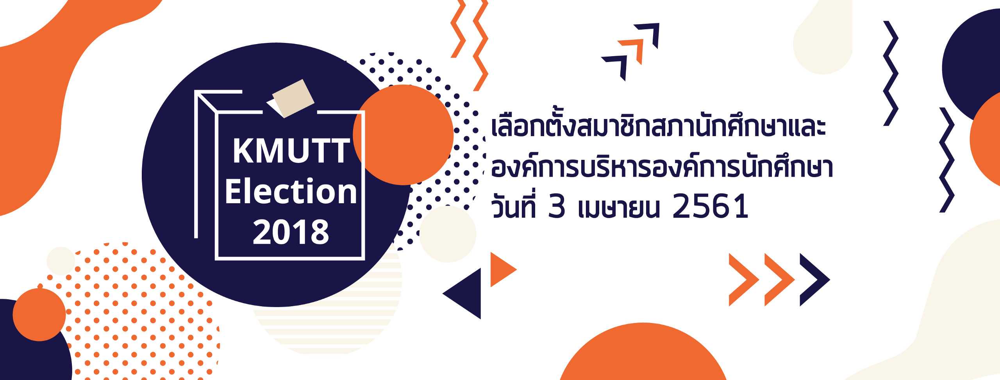

เป็นบทความนึงของผมเลย ที่ใช้เวลานานเหมือนกันนะกว่าจะเขียนเสร็จ คงเพราะไม่ได้เขียนบทความมานานหลายเดือน กว่าอารมณ์จะเข้าร่องเข้ารอย และคั้นภาพจำตอนนั้นมาได้ก็ใช้เวลาพอสมควร

ทีนี้ก่อนเราจะเข้าเรื่อง ผมขอท้าวความก่อนว่าพวกเราเป็นใครมาจากไหน

---

### กลุ่ม Alchemist คือใคร ?

พวกเราเป็นกลุ่มนักศึกษาไอทีที่อยากจะเปลี่ยนสิ่งต่างๆ รอบตัวให้ดีขึ้นด้วยเทคโนโลยีที่มีอยู่ครับผม

และหากถามว่าเรามาทำ_ระบบเลือกตั้ง_ได้อย่างไร จริงๆ แล้วเราไม่ได้อยู่ดีๆ ได้รับมอบหมายให้มาทำตรงนี้เลย … ทีมของพวกเรานำเทคโนโลยีมาช่วยมาใช้กิจกรรมในรั้วมหาวิทยาลัยมาแล้วร่วมจะ 2 ปี โดยเราเริ่มจากการลองเปลี่ยนกิจกรรมในคณะไอทีของเราก่อน อย่างเช่น การเปลี่ยนรูปแบบของงานปฐมนิเทศของนักศึกษาไอที เป็นต้น

[**SIT Orientation 2017 สานต่อสิ่งดีๆในวันปฐมนิเทศนักศึกษา**  
_On This Day…_alchemist.itbangmod.in.th](https://alchemist.itbangmod.in.th/sit-orientation-2017-%E0%B8%AA%E0%B8%B2%E0%B8%99%E0%B8%95%E0%B9%88%E0%B8%AD%E0%B8%AA%E0%B8%B4%E0%B9%88%E0%B8%87%E0%B8%94%E0%B8%B5%E0%B9%86%E0%B9%83%E0%B8%99%E0%B8%A7%E0%B8%B1%E0%B8%99%E0%B8%9B%E0%B8%90%E0%B8%A1%E0%B8%99%E0%B8%B4%E0%B9%80%E0%B8%97%E0%B8%A8%E0%B8%99%E0%B8%B1%E0%B8%81%E0%B8%A8%E0%B8%B6%E0%B8%81%E0%B8%A9%E0%B8%B2-4794b3721364 "https://alchemist.itbangmod.in.th/sit-orientation-2017-%E0%B8%AA%E0%B8%B2%E0%B8%99%E0%B8%95%E0%B9%88%E0%B8%AD%E0%B8%AA%E0%B8%B4%E0%B9%88%E0%B8%87%E0%B8%94%E0%B8%B5%E0%B9%86%E0%B9%83%E0%B8%99%E0%B8%A7%E0%B8%B1%E0%B8%99%E0%B8%9B%E0%B8%90%E0%B8%A1%E0%B8%99%E0%B8%B4%E0%B9%80%E0%B8%97%E0%B8%A8%E0%B8%99%E0%B8%B1%E0%B8%81%E0%B8%A8%E0%B8%B6%E0%B8%81%E0%B8%A9%E0%B8%B2-4794b3721364")

พอเริ่มจากงานปฐมนิเทศ จนมาเป็นแรกพบมดน้อย เปิดโลกกิจกรรม และกิจกรรมอื่นๆ มากมาย จนสุดท้ายมาสิ้นสุดปีการศึกษาที่งานเลือกตั้งสภาและองค์การนักศึกษาเมื่อปี 2560 และ**วนกลับมาใหม่อีกครั้งในปี 2561** นี้

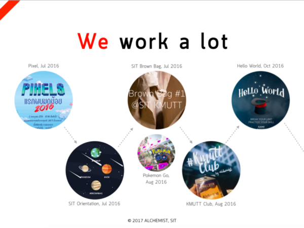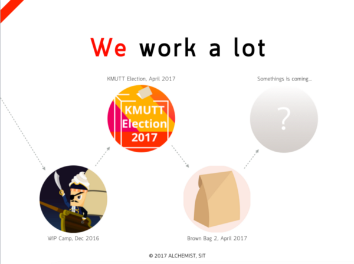

รูปแบบการทำงานของเราขึ้นอยู่กับความสนใจที่อยากจะทำงานนั้น ๆ เราสนุกกับการได้ทำกิจกรรม _พัฒนาระบบ เจอะเจอผู้คน ได้แลกเปลี่ยนความรู้_ เช่น การทำงานกับพี่ๆ จากสำนักคอมของมหาวิทยาลัย ทำให้เราได้แลกเปลี่ยนความรู้ ทั้งพื้นฐานที่สำคัญกับการทำระบบให้คนใช้งานเยอะๆ และเรื่องของ Network และ Security ต่างๆ มากมาย …

ปีนี้เป็นปีที่ 2 ที่เรามาทำกิจกรรมตรงนี้ครับ ผ่านมาแล้วกว่า 10+ กิจกรรม จนตอนนี้มาถึงกิจกรรม**การเลือกตั้งองค์การและสภานักศึกษาครั้งที่ 2** ที่พวกเราได้โอกาสได้เข้าไปพัฒนาระบบให้อีกครั้ง ก็ถือว่าเป็นงานส่งท้ายปีการศึกษาที่พวกเราจะเอาความรู้และเทคนิคต่างๆ ที่สั่งสมมาตลอดสองปี มาใช้ในงานนี้อย่างสุดแรง

---

### เมื่อปีที่แล้ว ครั้งแรกกับการเลือกตั้งออนไลน์ที่ มจธ.

เมษายนปีที่แล้ว เป็นครั้งแรกที่กลุ่มเรา Alchemist ได้เข้ามาทำระบบเลือกตั้งออนไลน์ให้กับสภานักศึกษา มจธ.

จุดเริ่มต้นมาจาก ทางสภานักศึกษา_อยากทำระบบเลือกตั้งแล้ว_ โดยถามผ่านมาทางรุ่นพี่ของกลุ่มเรา และทีมเราเองก็ Accept จะทำ ก็เลยเป็นจุดเริ่มต้นของการเปลี่ยนแปลงครั้งนี้ อ่านต่อได้ที่ …

[**KMUTT Election 2017 จุดเริ่มต้นเล็กๆ สู่การเปลี่ยนแปลงที่ยิ่งใหญ่**  
_เป็นการรวบรวมความทรงจำเกี่ยวกับงาน KMUTT Election 2017_alchemist.itbangmod.in.th](https://alchemist.itbangmod.in.th/kmutt-election-2017-18d25fa69540 "https://alchemist.itbangmod.in.th/kmutt-election-2017-18d25fa69540")

โดยคอนเซปที่เราพยายามจะแก้ไขกันในครั้งก่อน คือ **การใช้รหัส KMUTT Account เข้าสู่ระบบในเว็บไซต์เพื่อลงคะแนนเสียงเลือกตั้งที่คูหา**

ผลที่ได้จากการเปลี่ยนแปลงทำให้เราสามารถ ลดความผิดพลาดของผู้ใช้ได้พอสมควร เช่น _เรื่องของบัตรเสีย และการนับคะแนนด้วยมือ_ เป็นต้น

อีกทั้งยังสามารถลดการใช้กระดาษ ลดการเตรียมการได้อย่างมาก เพราะการจะตัดกระดาษเพื่อทำใบลงคะแนนเสียงต้องใช้ทั้งคน ทั้งกระดาษ หมึก และเวลาเป็นจำนวนมากเช่นกัน

เป็นก้าวแรกสำหรับการเปลี่ยนแปลงของเรา … สำหรับผมเอง ผลตอบรับถือว่าอยู่ในระดับที่ดีมากๆ โดยอิงจากสถิติที่เกิดขึ้นในปีที่แล้วอย่างเช่น การเพิ่มขึ้นของการมาใช้สิทธิ์กว่า ~10%

และนั่นคือ สิ่งที่เราเชื่อว่า **เห้ย มันทำได้นะ มันเป็นสิ่งที่เทคโนโลยีจะมาแก้ปัญหามัน และทำให้มันดีขึ้นไปอีกแน่นอน**

เหตุผลนั้นทำให้เราเดินต่อในปีที่ 2 นั่นเอง

---

### Let’s Start!

ตัวผมเอง จำไม่ได้แล้วว่า … เรามานั่งประชุมกันว่า เลือกตั้งออนไลน์ปีนี้จะเป็นยังไง? กันตอนไหน แต่จำได้คร่าวๆ ว่า มีคนมาจากทางสภานักศึกษา ทักมาว่า _“ปีนี้ทาง Alchemist จะมาทำระบบเลือกตั้งออนไลน์ไหมครับ ?”_ ฝั่งเราเองก็ประชุมกันและตอบตกลงกลับไปไม่นานหลังจากนั้น

เราเริ่มคุยกันในทีมว่า _ปีที่แล้วเป็นยังไงบ้าง?_ _แล้วปีนี้เราจะพัฒนาไปทางไหนดี_? เพราะจากปีที่แล้วทั้งสถิติที่เพิ่มขึ้นมากว่า ~10% ทำให้เราเริ่มเชื่อแล้วว่า **มันได้ผล.** และมันเป็นทางที่สมควรไปต่อ จึงได้ลิสปัญหาจากปีที่แล้ว และสิ่งที่เห็นช่องว่างที่พร้อมจะพัฒนาด้วย

-   จาก **~10% -> 19.2%** ถือว่าเป็นสถิติที่สูงขึ้นก็จริง แต่หากมองความจริงแล้ว**จำนวนยังน้อยหากเทียบกับนักศึกษาทั้งมหาวิทยาลัย** จะมีทางไหนไหม ที่ทำให้คนมาลงคะแนนเสียงมากขึ้น
-   ในช่วงเวลาเลือกตั้งของ มจธ. ส่วนใหญ่ คือ **อาทิตย์แรกของเดือนเมษา** ซึ่งคือช่วงก่อนสงกรานต์ คนส่วนใหญ่เลือกที่จะกลับบ้านกันตั้งแต่อาทิตย์นี้ อีกทั้งยังควบเกี่ยวกับช่วงการเกณฑ์ทหาร ซึ่งทำให้คนในมหาวิทยาลัยน้อยลงมากๆ เป็นเหตุผลหนึ่งที่ทำให้คนมาลงคะแนนเสียงน้อย
-   **การลงคะแนนเป็นคูหา เป็นคอขวด** ที่ไม่สามารถขยายได้ ถ้ามี 12 จุด ก็คงเป็น 12 จุดแค่นั้น ถ้าอยากเพิ่มจุดลงคะแนน ก้ต้องเพิ่มคน เพื่มโต๊ะของ เพิ่มอุปกรณ์ ยิ่งใช้คนเยอะ ก็ยิ่งควบคุมได้ยาก
-   ส่วนหนึ่งเป็นเรื่องของการประชาสัมพันธ์ ที่ต้องประกาศออกไปให้นักศึกษาปริญญาตรีทั้ง 11000+ คนให้รับทราบทั่วกันว่า ตอนนี้จะเลือกตั้งแล้วนะ อย่าลืมมาใช้สิทธิ์ ใช้เสียงของตัวเอง .. ส่วนหนึ่งคือทำให้เค้ารู้ถึงหน้าที่ขององค์การและสภา จะทำให้เค้าเข้าใจว่าทำไมต้องมี ทำไมต้องเลือก และมาใช้เสียงมากขึ้นด้วย

จึงเป็นผลสรุปเลยออกมาว่า

-   พวกเราอยากจะ**ทำระบบเลือกตั้งออนไลน์ เลือกจากที่ไหนก็ได้ เวลาใดก็ได้ ด้วยตัวคุณเอง บนมือถือของคุณเอง** .. ด้วยเหตุผลข้างบนที่กล่าวมาทั้งหมด เพราะหากยังกลับไปเป็นเลือกตั้งบนคูหาดังเดิม จำนวนผู้มาใช้สิทธิ์คงจะไม่เพิ่มขึ้น และการเข้าถึงการเลือกตั้งของนักศึกษา มจธ. ก็จะไม่สูงไปกว่านี้
-   แน่นอนว่ามันเป็นการเดินพันที่สูงมาก ของฝั่งกรรมการการเลือกตั้งที่ต้องฉีกทุกกรอบที่เคยมีมา และฝั่งทีมระบบอย่างพวกเราที่ต้องเคลมให้ได้ถึงความปลอดภัย ความมั่นคง และความโปร่งใสของระบบและข้อมูลการเลือกตั้ง ถ้ามีคนยิง มันห้ามล่ม!

---

### เริ่มต้นลงมือทำงานกัน! 👨🏻‍💻

ในฝั่งของทีมเราเองรับหน้าที่ 2 อย่าง คือ สนับสนุนการประชาสัมพันธ์ กับ ทำระบบเลือกตั้ง ในส่วนแรกขอพูดถึงการทำระบบกันก่อน

ทีมเรามีกันทั้งหมด 3 ทีม คือ

-   **ทีมออกแบบ** ออกแบบ UX/UI ให้กับระบบของเรา
-   **ทีมพัฒนาระบบ** เขียนโปรแกรม,เขียนโปรแกรม แล้วก็เขียนโปรแกรม
-   สุดท้ายคือ **ทีมอินฟรา**ที่ดูแล Server, Monitoring ต่างๆ ของระบบ

… ทั้งหมดเป็นนักศึกษาไอทีปี 2 ร่วม 10 กว่าชีวิต และปี 3 อย่างเราผู้เป็นผู้ประสานงานและที่ปรึกษา ไม่นับละกันนะครับ 🎉

เราตั้งเป้าหมายกันง่ายๆ คือ การยกเอาระบบคูหาปีที่แล้ว มาไว้บนมือถือทั้งหมด

ซึ่งระบบก็จะทำงานก็จะเป็นแบบนี้

1.  **Login เข้าสู่ระบบ**ด้วยรหัส KMUTT Account
2.  **ยืนยันตัวตน**
3.  **เลือกองค์การนักศึกษา** เลือกได้เพียงหนึ่งพรรคเท่านั้น
4.  **ยอมรับสภานักศึกษา** ยอมรับเท่าที่แต่ละคณะจะมีสิทธิ์
5.  **เสร็จสิ้น**การลงคะแนนเสียง

ด้านล่างคือ การแนะนำขั้นตอนการใช้สิทธิ์ที่เราโพสต์ทาง Facebook น่ะครับ :)

โดยมีกฏอยู่ 2 ข้อง่ายๆ คือ ถ้าเลือกตั้งครบทั้งสภาและองค์การ จะไม่นับคะแนน และถ้าออกจากหน้าเว็บไซต์หรือ Refresh หน้าเว็บ จะต้อง Login ใหม่

เราวางแผนทำ Timeline ของงานทั้งหมดไว้ ให้เสร็จแล้วทั้งหมดในอาทิตย์สุดท้ายของเดือนมีนาคม และเริ่มทำงานกันหลังสอบมิดเทอร์ม หรือช่วงอาทิตย์ที่ 3 ของมีนาคม

---

### เทคนิคการวางแผนการพัฒนาระบบของเรา 🎉

หลายครั้งเรามักจะเจอปัญหาต่างๆ นานา เกี่ยวกับการพัฒนาระบบร่วมกัน แล้วยิ่งมี Developer หลายคน เช่น

-   **ที่มีทักษะที่ต่างกัน** ก็จะเกิดปัญหาขึ้นระหว่างทำก็ได้ เช่น คนหนึ่งทำเทคนิคแบบหนึ่ง อีกคนอีกเทคนิคหนึ่ง
-   **ความไม่รู้ และความทำไม่เป็น** เช่น การ Authentication ด้วย LDAP, การทำ Session ด้วย Redis กับ Nodejs, การ Hashing ด้วยเทคนิคต่างๆ ทั้ง Bcrypt, MD5, AES, เทคนิคการคุม Cookie ใน Next.js, การทำ Logging ของ Nodejs เพื่อนำเข้า Logstash ใน ELK เป็นต้น

#### มารู้จักกับ Hello World Project

โปรแกรมเมอร์หลายคนคงรู้จักกับคำว่า Hello World อย่างดี .. เพราะทุกครั้งที่เราเริ่มเขียนโปรแกรมด้วยภาษาใหม่ framework ใหม่เรามักจะประกาศคำว่า Hello World เพื่อ make sure ว่าเราเขียนได้แล้ว จริงไหม?

สิ่งที่เราจะทำหลังจากนี้ คือการทำ Hello World ให้กับโปรเจคของเรา นั่นคือการ make sure ว่า Project เรานั้นพร้อมเริ่มพัฒนาได้แล้ว

สิ่งที่ต้องทำมีทั้งหมด 3 สิ่งด้วยกัน

-   **เตรียม Project** ที่ Structure ใกล้เคียงกับคิดกันไว้ให้มากที่สุด แล้วทำให้มันดึงคำว่า Hello จาก Database แล้วพ่นออกทาง Front End ให้ได้ เอาขึ้น Git ให้เรียบร้อย
-   **เตรียม CI CD และ Server** ให้พร้อมทั้ง Dev, Production โดยที่ Server Dev และ Prod .. เอา Project ขึ้น Server รันให้เรียบร้อย

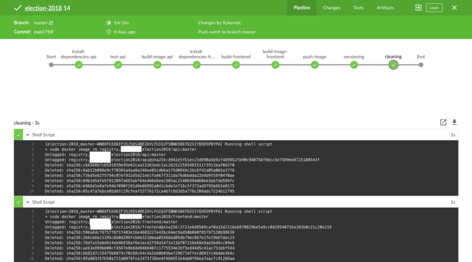

-   สุดท้ายคือ **การทำ Technical Challenge** หรืออธิบายเข้าใจง่ายๆ คือการทดสอบเทคนิคต่างๆ ที่ต้องใช้ในโปรเจคของเราทั้งหมด ให้แน่ใจว่ามันทำได้

และเมื่อทำทุกอย่างเสร็จแล้ว ทีมเดฟทุกคนจะกลับมาแชร์กันว่า สิ่งที่ตัวเองได้มา เป็นยังไง และสิ่งที่ตัวเองศึกษาเป็นอย่างไรบ้าง **จากนี้ค่อยเริ่มวางแผน !**

ถามว่าทำไมต้องทำสิ่งนี้ก่อนวางแผน

-   เพราะหนึ่ง เราจะวางแผนไม่ได้เลยนะ ถ้าหากยังไม่รู้ว่าสิ่งที่กำลังจะเขียน มันต้องทำยังไง มีความซับซ้อนไหม แล้วต้องใช้เวลาเท่าไหร่ ?
-   เพราะสอง ทำให้เราพร้อมสำหรับการพัฒนาเลย หลังจากนี้คือวางแผน แล้วพัฒนาซอฟแวร์ได้เลย เพราะเมื่อ push code เสร็จ CI/CD ก็จะทำงานแล้วเอาซอฟแวร์ขึ้นไปบน Server เรียบร้อยเลย พร้อมส่งมอบตลอดเวลา

ทำให้เราไม่กังวลเลยว่า หลังจากนี้เราจะต้องพัฒนาเสร็จแล้ว ต้องเอาซอฟต์แวร์ไป deploy บน Server แล้วจะมีปัญหาอะไรอีกไหม เช่น _พอขึ้นปุ๊บ ติดปัญหา cors บ้าง, docker วิ่งหา private ip ไม่เจอบ้างล่ะ , ปัญหา SSL บ้างล่ะ_ ถ้าทำทุกอย่างให้เรียบร้อยตั้งแต่แรก หลังจากนี้การพัฒนาก็จะลื่นไหล และไปได้เร็ว

ถึงเวลาเข้า Sprint ก็ใส่โค้ดลูกเดียวไม่ต้องสนใจอะไรอื่นแล้ว :)

> ถ้าไม่รู้จักช้าก่อน .. ก็เร็วไม่ได้หรอกจริงไหม ?

---

### การวางแผนทำระบบ!

#### Software Development

พวกเราทำ A-DAPT Blueprint ของระบบเลือกตั้ง

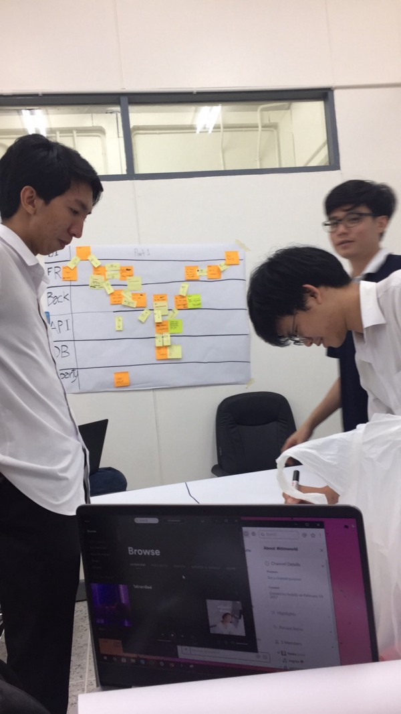

โดยมีทั้งหมด 6 เลน คือ UI / Front End / Back End / API / Database / 3rd Party

การทำ **A-DAPT Blueprint** ไม่ได้มีแค่เพื่อทำให้เรามองภาพระบบออก แต่มันทำให้ทีมเดฟได้คุยกัน วางแผนกัน คุยกันก่อนลงมือเขียนโค้ด _เราคุยกันในระดับที่ว่า Function นี้ชื่อว่าอะไร ทำงานอย่างไร_ เป็นต้น

ผมเอง ในฐานะรุ่นพี่ ตอนรุ่นน้องเขียน Blueprint ผมชอบจังหวะที่มันนั่งเถียงกันว่า _“พวกมึง ก่อนจะผ่านตรงนี้มันต้องมี Middlewares คั่นก่อนสิ, ตรงนี้ควรมี Libs ตัวนี้ช่วยนะ มันน่าจะทำให้ง่ายขึ้น”_

จากการนั่งทำ Blueprint ด้วยกัน 3 ชั่วโมง ทำให้ผมรู้ว่ามันช่วยเราจิงๆ นะ ช่วยให้เราได้เข้าใจกันมากขึ้น ปรับความเข้าใจ ปรับเทคนิคต่างๆ ที่เป็นที่ยอมรับกันของทั้งทีม

สุดท้ายสิ่งที่ได้มามันคือ **ซอฟต์แวร์ที่ออกมาในทางเดียวกัน ใครก็แก้แทนกันได้ โดยไม่ต้องถามกันก็เข้าใจ** .. มันคือจังหวะที่ใส่พลัง ใส่ความรู้ ใส่ทักษะที่มีใส่กันรัวๆ แข่งกัน พยายามทำให้มันออกมาดีที่สุดเท่าที่พวกเราจะทำมันได้ มันสนุกจริงๆ นะ 🎉

---

ส่วน Code ทั้งหมดเราเก็บไว้ใน GitHub ตามปกติ แต่ในครั้งนี้เราใช้ Repository เดียวในการเก็บทุกๆ Service เอาไว้

การทำแบบนี้มันง่ายขึ้นมากๆ เวลาทำ Docker หรือทำ Build Pipeline .. หลายคนถกเถียงกันว่าควรจะแยก Repo ของแต่ละ Service ออกจากกัน แต่ในทีมเราเอง เราคิดว่าแบบนี้สะดวกกับทีมเรามากกว่า **ของแบบนี้มันไม่มีผิดไม่มีถูกนะ** แต่ขอบอกว่ามันจัดการง่ายขึ้นจริงๆ สำหรับผมพวกเรา

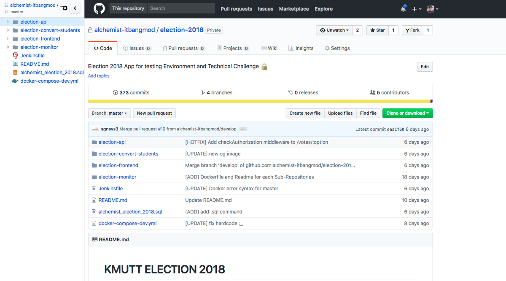

---

#### Network & Infrastructure

พูดถึง Developer กันไปแล้ว ในฝั่งอินฟรากันบ้าง

พวกเราเองใช้ **Docker** ในการพัฒนา ซึ่งมันทำให้ง่ายเวลา Deploy มากๆ และแถมง่ายในการทำ Logging กับ Monitoring ด้วย

ในส่วนโครงสร้างโปรเจคของฝั่ง Infra เราจะเป็นแบบนี้

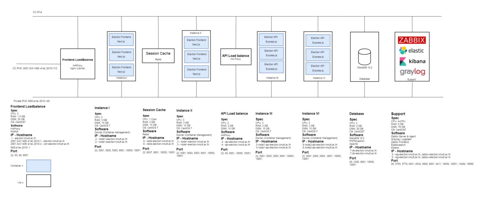

เชื่อม **HAProxy** เพื่อทำ Load Balancing ในแต่ละจุด (Front End, API)

ในความจริงตอนใช้งานนั้น แต่ละ node ของเรามี CPU ทั้งหมด 4 core … เราก็รัน container ให้ครบจำนวน core ไปเลย บอกได้คำเดียวเลยว่าแรงส์ แรงส์สะใจวัยรุ่นเลยครับผม

ส่วน Support Server นั้นเรามีหลายๆ อย่างรันอยู่บนนั้น เช่น Zabbix, Elasticsearch ~ ELK และ Graylog.

ท้ายนี้ในส่วนของทีมอินฟรานั้น ผมขอเป็นตัวแทนในการขอบคุณผู้ใหญ่ใจดีจากสำนักคอมพิวเตอร์ และ คณะเทคโนโลยีสารสนเทศ มหาวิทยาลัยเทคโนโลยีพระจอมเกล้าธนบุรี ที่สนับสนุนทั้งอุปกรณ์, Virtual Machine, Domain name (\*.election.kmutt.ac.th) และอื่นๆ อีกมากมาย พร้อมความรู้ ความเข้าใจ และข้อควรตระหนักต่างๆ ในการทำระบบที่มีความต้องการความปลอดภัยสูงและผู้ใช้ปริมาณมากๆ

ขอบคุณประสบการณ์มีค่าให้แก่พวกเรากลุ่ม Alchemist ครับผม

---

#### Monitoring / Logging

เราดูในส่วนของ Loging ของส่วนระบบ Application / และ Monitoring ของ Service ต่างๆ

ที่ผมชอบเป็นส่วนตัวคือ Logging เพราะ ผมศึกษาเอง >< Logging บน Node.js ก็คงหนีไม่พ้น winston ที่มีความสามารถมหาศาล สามารถพ่น Log ให้เป็น JSON ได้ง่ายมากด้วย

พวกเรากำหนด Status Code กันเอง โดยตกลงกันไว้ประมาณนี้ครับผม

-   **1000** — Login สำเร็จ
-   **1001** — ลงคะแนนสำเร็จ
-   **20XX** — เกิดข้อผิดพลาดในระบบ
-   **202X** — เกิดปัญหากับ Middlewares
-   **5000 — **Critical Errors ทั้งหมด

โดยวิธีที่เราเก็บ Logging นั้นคือการให้มันพ่นเป็น JSON ออกทาง **Stdout ของ Docker Container** และไปดึงจาก Logfile ของ Docker อีกที นำเข้า Elasticsearch เพื่อไปทำ Visualization ใน Kibana เป็นอันจบ ~

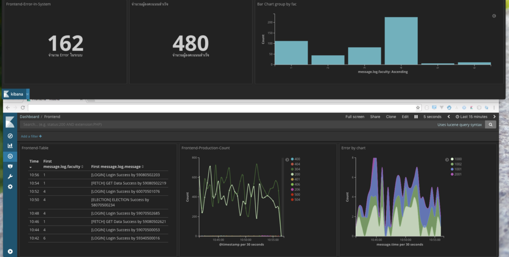

ส่วน Zabbix นั้นดึงตรงๆ แล้วเอาไปทำ Visualization ใน Grafana แทน

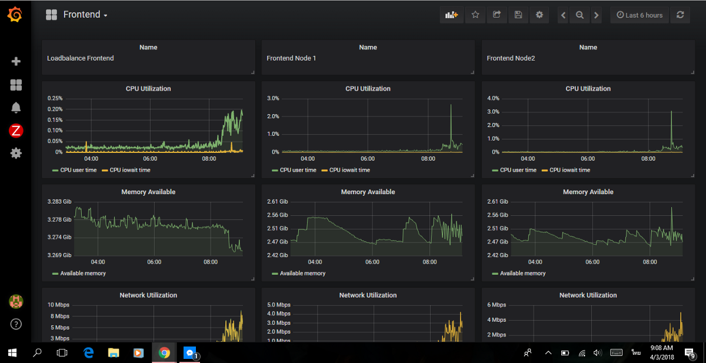

เราตรวจสอบทุกอย่างทีเกิดขึ้นในระบบตลอดเวลา ในห้อง **Warroom** ที่เราขอไว้สำหรับจัดการระบบเลือกตั้งตลอดทั้งวัน และนี่เป็นภาพบรรยากาศทั้งหมดในห้อง **Warroom** วันนั้น

_ปล. ทีมของเรา เปลี่ยนเวรกันนั่ง Monitor ระบบนะครับ ถึงจะเป็นวันเลือกตั้งแต่เราก็ต้องเรียนหนังสือ เพื่อให้เหมาะสมกับเวลาเรียนของทีมเราเอง … กิจกรรมได้ แต่การเรียนเราก็ไม่ทิ้งเหมือนกันนะ_

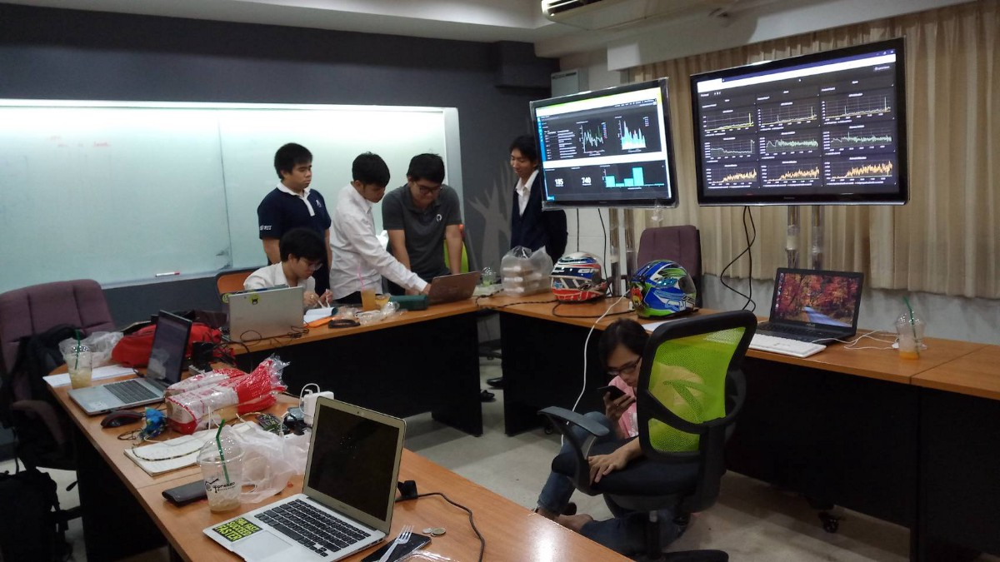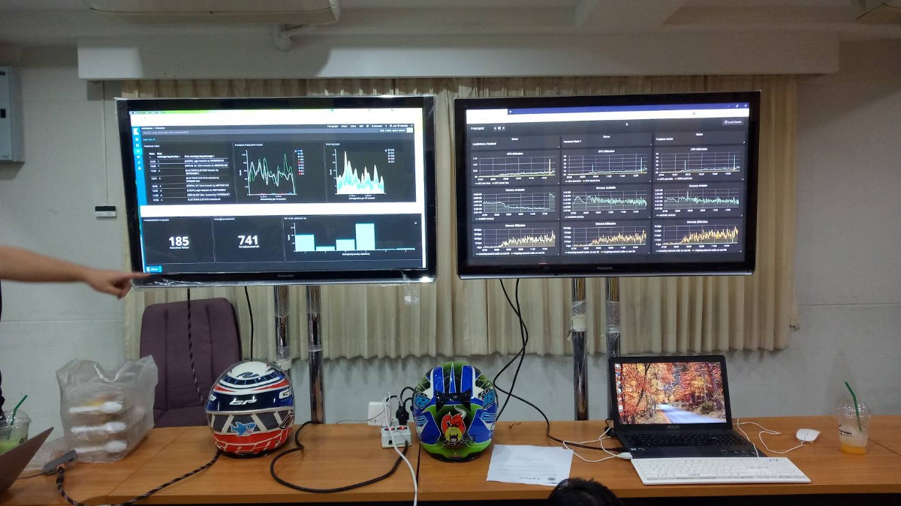

---

#### Designer การออกแบบทั้งหมดของทีมเรา

ทีมเราใช้ [Figma](http://figma.com) เป็นใหญ่ในงานครั้งนี้ ด้วยความที่ทีมเรามีทั้งคนใช้ mac และ windows จึงต้องหา Tools ตรงกลางเพื่อทำงานร่วมกัน

เป็นเวลาหลายเดือน ที่เราหา Tools มามากมาย ตั้งแต่ PS/AI แต่ก็ติดปัญหา ที่ว่า บางคนคอมไม่ได้แรง, เปิดช้า กิน ram, แถมยังไม่เหมาะกับเดฟด้วย

มาเป็น Adobe XD ที่เหมือนจะดี แต่ตอนนี้ก็เก็บตังไปซะแล้ว จนอาจารย์ที่ปรึกษากลุ่มเราเมลล์ไปขอ InVision, Sketch จนได้ Education License มา แต่ก็ใช้ได้แค่บางคนเพราะ windows นั้นใช้ Sketch ไม่ได้

จนตอนนี้สุดท้ายสุด **เราก็ไปเจอ Figma.com** ซึ่งมันคือ Sketch v. บนเว็บไซต์ แรงและเร็วมากพอที่จะทำงานได้ แถมมีออฟชันในการ collaboration กันอีก สามารถแก้งานได้พร้อม ๆ กันดั่ง google docs, และสามารถ comment งานกันได้ด้วย

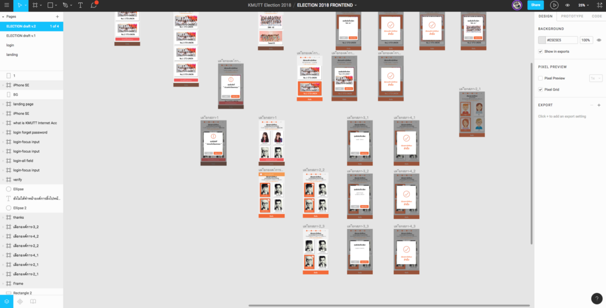

ดูรวมๆ แล้วมีเสน่ห์เหลือเกิน สำหรับตัว Figma คิดว่าต่อไปคงใช้งาน Tools ตัวนี้อีกนานๆ เลย

และทั้งหมดนั้นในส่วนของพัฒนาระบบทั้งหมดของเรา

---

#### **Public Relationship การประชาสัมพันธ์**

ในส่วนของ PR เราทำ Facebook Fanpage โดยเน้นตาม Practics ต่างๆ ของ Facebook ทั้งขนาดรูปและการจัดวางตัวหนังสือ

ปีนี้เราเคยรับผิดชอบในส่วนของการ ​Live ในครั้งแรกอีกด้วย **“ถ่ายทอดสดการจับฉลากหมายเลขผู้ลงสมัครสมาชิกสภานักศึกษาและองค์การบริหารองค์การนักศึกษา ประจำปีการศึกษา 2561”**

ทั้งนี้ขอขอบคุณอุปกรณ์จากคณะเทคโนโลยีสารสนเทศด้วยที่สนับสนุนทั้งกล้อง และอุปกรณ์ต่าง ๆ สำหรับการ Live ในครั้งนี้ครับผม

รวมถึง Artwork ต่างๆ ทุกชิ้นใน Facebook Fanpage นั่นเป็นผลงานของทีม Designer ของเราทั้งหมดครับผม

---

ทั้งหมดเป็นกระบวนการการพัฒนาระบบและการทำงานของเราในครั้งนี้ ซึ่งทั้งหมดที่เราทำมานั้น มันมาจากการเราพยายามเรียนรู้อะไรใหม่ๆ และปรับตัวอยู่เสมอ เราพยายามเก็บ Feedback จากงานที่แล้ว งานแล้วงานเล่า จนหาจุดที่เหมาะสมกับทีมของเรามากที่สุด จนเกิดมาเป็น Process ของทีมต่าง ๆ อย่างที่กล่าวมาข้างบน

สุดท้ายผมมี Quote หนึ่งที่อ่านเจอมาแล้วรู้สึกว่าใช่มากๆ มันทำให้ตัวผมเองรู้ว่าที่เราทำอยู่มันไม่ได้สูญเปล่าเลย แต่กลับทำให้ทีมเราเป็นเราที่ดีขึ้นจากวันนั้นจนวันนี้

> เราเชื่อว่าทุกความพยายามมีผลลัพธ์ขั้นต่ำสุดคือเราได้เรียนรู้อะไรอยู่เสมอๆ และเราสามารถปรับปรุงมันให้ดีขึ้นได้กว่านี้  
>  — [Mahasak Pijittum](https://medium.com/u/7a1495cccd82) ([A Day in Agoda](https://mahasak.com/a-day-in-agoda-full-stack-software-engineer-e20cf21ac364))

---

### ณ วันเลือกตั้งองค์การบริหารองค์การนักศึกษาและสภานักศึกษา

#### 7:00 น. | ตื่นนอน

เราตื่นนอนและนัดเจอกันที่ห้องประชุมใต้ KFC เพื่อเตรียมเริ่มการ Monitoring ระบบ .. เป็นเช้าที่ไม่ร้อนมาก :)

#### 8:30 น. | เปิดระบบ !

ในคืนก่อนวันงาน เราตั้งเวลากันไว้แล้ว ว่าระบบจะเริ่มขึ้นในเวลา 8:30 น. ตามเวลาประเทศไทย และปิดในเวลา 16:30 น.

โดยเมื่อเข้าก่อนหรือหลังเวลาที่กำหนดไว้ หน้าเว็บไซต์จะไม่โชว์ปุ่มเข้าสู่ระบบการเลือกตั้ง แต่หากเข้า Link ตรงๆ จะ Redirect ไปยังหน้าแรก

ดังนั้นเราไม่ต้องทำอะไรเลย ถึงเวลาปุ๊บ เข้าไปตรวจสอบระบบว่าทำงานได้ไหม เป็นอันเสร็จ ~

#### 8:30–16:30 น. | ตรวจสอบระบบ พยายามแก้ปัญหา และสื่อสารกับผู้สมัคร

ช่วงนี้ในส่วนของ **Application** นั้น มีการ push code ขึ้นไปแก้อยู่บ้าง เช่น คำผิด … โดยน้องๆ ทีมอินฟราก็พยายามทำเทคนิค **Zero-downtime** (ไม่กล้ารับประกันว่า 0 จริงๆ นะครับ แต่ฝั่งผู้ใช้ไม่รู้สึกถึงการเปลี่ยนแปลง) กับ **HAProxy** ให้มีการ up-down ของ Service ที่ไล่เลี่ยกัน

ในส่วนของหัวหน้าทีมอย่างผมเอง เราพยายามทำ **Crisis Management** กัน ตามบทความนี้ หากเกิดปัญหาขึ้นเราต้องแก้ปัญหาให้ได้ !

[**7 ขั้นตอนเตรียมแผนกู้ชีพสำหรับแบรนด์ในภาวะวิกฤติ - thumbsup**  
_วิกฤติเป็นสิ่งที่มาแบบไม่ตั้งตัว ดังนั้น การวางแผนล่วงหน้าจึงมีความสำคัญมากสำหรับทุกๆ องค์กร…_thumbsup.in.th](http://thumbsup.in.th/2014/10/critical-steps-to-crisis-management/ "http://thumbsup.in.th/2014/10/critical-steps-to-crisis-management/")

เราพยายามเตรียมตัวโดย การเรียกตัวแทนพรรคต่างๆ มาคุยกันในช่วงเริ่มเลือกตั้ง พูดถึง**ความเสี่ยงที่จะเกิดขึ้น พร้อมทั้งให้ช่องทางติดต่อต่างๆ แก่ผู้สมัคร** หากเกิดสภาวะที่มีปัญหา เราจะแจ้งผู้สมัครให้ทราบก่อน หากแก้ปัญหาเกิน 15 นาที เราจะให้เกิดการโหวดเพื่อเลื่อนเวลาลงคะแนนเสียง เป็นต้น

#### 17:00 สรุปงาน

พอจบงาน เรารายงานผลการเลือกตั้งแต่อาจารย์ผู้ใหญ่ และประธานกรรมการการเลือกตั้ง และผู้ที่เกี่ยวข้องเรียบร้อย ก็ถึง**เวลาสรุปงานของพวกเรา** ในครั้งนี้เราเชิญผู้ลงสมัครทุกพรรคและผู้ลงสมัครสภานักศึกษา เข้าร่วมการสรุปงานด้วยกันกับเราครับ

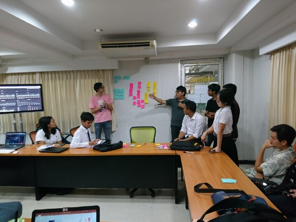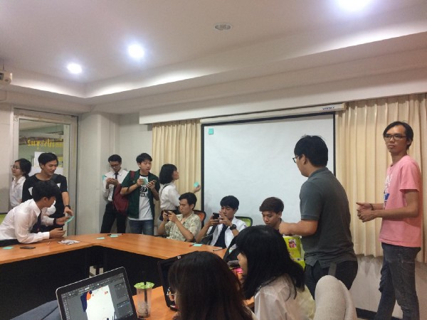

และเป็นธรรมเนียมของเรา Alchemist การสรุปงานของเราก็จะเป็นการทำ Retrospective เพื่อสะท้อนถึงการงานที่ผ่านมา

เริ่มต้นด้วยการเขียน**สิ่งที่ดี (Good)** ที่เกิดขึ้นในการเลือกตั้งในครั้งนี้ ต่อมาเป็นการบอกใน**สิ่งที่แย่หรือรู้สึกไม่ดี (Bad)** ในการเลือกตั้งครั้งนี้ โดยที่เมื่อเราพูดสรุปในส่วนนี้ เราจะขอความคิดเห็นของทุกคนเพื่อแก้ปัญหามัน ไปทีละข้อๆ สุดท้ายเป็นสิ่งที่เรา**อยากให้เกิดขึ้นในการเลือกตั้งครั้งหน้า (Try)**

ก็เป็นอันจบงานอย่างสมบูรณ์แล้ว กับการเลือกตั้งในปีนี้

---

### สถิติที่เกิดขึ้นในปีนี้ทั้งหมด

สถิติที่น่าสนใจคือการเพิ่มขึ้นของจำนวนคนมาลงคะแนนเสียง จากในปีก่อนที่เพิ่มขึ้นมาเป็น **19.2%** และในปี 2561 นี้จากการเปลี่ยนมาเป็นเลือกตั้งออนไลน์จากที่ไหนก็ ทำให้จำนวนมาลงคะแนนเสียงเพิ่มขึ้นอีกกว่า 10% เป็น **29.6%** หรือจำนวน 3475 คนใน 11703 คนของประชาการนักศึกษาปริญญาตรีทั้งหมด

---

ก็จบไปแล้วสำหรับงานเลือกตั้งในปีนี้ มันเป็นช่วงเวลาที่เหนื่อยปนสนุกไปพร้อมๆ กัน เราเครียดบ้าง เพราะมีหลายๆ อย่างถาโถมเข้ามา โดยเฉพาะน้องๆ ในทีมที่ทำงานตรงนี้

ส่วนตัวผมไม่ค่อยหนักเท่าไหร่ เพราะเราไม่ได้ลงแรงมากเท่าน้องๆ หรอก แค่ดูภาพรวม และพยายามคุมให้อยู่ในร่องในรอย ลง Coding บ้าง ประสานงานกับ Stackholder อื่น ๆ เช่น สภา และผู้สมัครด้วย

### ในการเลือกตั้งครั้งหน้า.

ขอเป็นหัวข้อที่ตัวผมเองสรุปจากการทำ Retrospective และข้อคิดจากรองอธิการบดีฝ่ายพัฒนานักศึกษา รศ.ดร.เชาวลิต ลิ้มมณีวิจิตร ที่ให้ไว้ในช่วงการรายงานผลคะแนน

-   ในส่วนแรกเป็นเรื่องของการเลือกตั้งในประเทศ Estonia ที่เป็นเลือกตั้งแบบออนไลน์แบบที่มีคูหา สิ่งที่โดดเด่นของเขา คือ **คนที่มาลงคะแนนเสียงนั้นมีสิทธิ์เปลี่ยนใจเลือกใหม่ได้เรื่อย ๆ จนวินาทีสุดท้ายของการเลือกตั้ง** ส่วนตัวคิดว่าการทำแบบนี้เป็นทางที่ถูกต้องสำหรับการเลือกตั้งออนไลน์ และสามารถกันเรื่องของการบังคับให้เลือกลงคะแนนเสียงได้อีกด้วย สามารถอ่านต่อได้ที่ลิงค์ด้านล่างได้เลย

[**Electronic voting in Estonia - Wikipedia**  
_The idea of having electronic voting in Estonia gained popularity in 2001 with the "e-minded" coalition government…_en.wikipedia.org](https://en.wikipedia.org/wiki/Electronic_voting_in_Estonia "https://en.wikipedia.org/wiki/Electronic_voting_in_Estonia")

-   ในส่วนของระบบสิ่งที่หลายผู้สมัครอยากให้เพิ่มเติมคือ การกดไม่ยอมรับสภานักศึกษา เพราะในตอนนี้มีแต่การยอมรับเพียงเท่านั้น เพียงหนึ่งเสียงก็ทำให้คนๆ นั้นเข้าสู่ตำแหน่งสภานักศึกษาได้ จึงมีหลายเสียงที่เสนอขึ้นมาว่า ควรจะให้มีกดโหวตเพื่อไม่ยอมรับสภาคนนั้นๆ เพิ่มอีกด้วย
-   การยืดเวลาลงคะแนนเสียงจาก 8 ชั่วโมง เป็นหลายวัน ด้วยเหตุผลที่ว่าเป็นออนไลน์แล้ว การเปิดหลายๆ วันจะเปิดโอกาสให้มีการใช้สิทธิ์ใช้เสียงมากขึ้นอีกด้วย

ทั้งหมดที่กล่าวมานั้น อย่างไรก็ตามก็ต้องขึ้นอยู่กับกฏของมหาวิทยาลัยในส่วนการเลือกตั้งสภาและองค์การบริหารองค์การนักศึกษานะครับ ไว้เมื่อถึงปีหน้าถ้าเกิดพวกเรามีโอกาสได้เข้ามาพัฒนาระบบอีกครั้ง สัญญาว่าจะทำให้ดียิ่งขึ้นอย่างแน่นอน

---

### ทิ้งท้าย.

ถึงตรงนี้มีสิ่งหนึ่งที่ผมเองในฐานะประธานกลุ่ม Alchemist รุ่นที่ 2 อยากจะฝากแก่ผู้เข้ามาอ่านทุกท่านที่อ่านมาถึงตรงนี้ ไม่ว่าจะเป็นเด็ก นักศึกษา นักพัฒนา อาจารย์ท่านผู้ใหญ่ หรือ ใครทุกคนที่สนใจในงานของพวกเรานะครับ :)

สิ่งที่อยากจะบอกคือ การที่เราอยู่ตรงนี้ ทำงานตรงนี้ เราไม่ได้อยากสื่อว่าทีมเราเก่ง ทีมเราเจ๋ง .. แต่ทีมเราเพียงอยากพิสูจน์ว่า _“ตรงนี้ เราทำมันได้นะ .. เด็กนักศึกษาอย่างเราทำมันขึ้นมาจริงๆ ได้นะ”_ แน่นอนว่าเราจะพูดแบบนี้ไม่ได้เลยถ้าไม่มีผู้ใหญ่ที่ให้โอกาสเรา ทั้งคณะและมหาวิทยาลัย ที่เปิดเวทีให้เราได้โชว์ฝีมือ ได้พัฒนาทักษะ ได้ลองประยุกต์สิ่งที่เรียนมา มาใช้จริงๆ กับงานจริงๆ ที่มีคนใช้งานจริงๆ

แน่นอนว่าในประเทศไทยยังมีมหาวิทยาลัยอีกหลายแห่งที่มีนักศึกษาที่มีศักยภาพที่จะทำอะไรแบบนี้อยู่ ไม่ใช่แค่สายงานไอทีเพียงแค่นั้น ในสายงานอื่นๆ ก็สามารถทำได้เช่นกัน ยังมีสิ่งที่เราช่วยกันพัฒนาอีกเป็นร้อยเป็นพันในมหาวิทยาลัยของเราแห่งนี้

ตัวผมเองไม่ได้อยากเห็นว่า Alchemist เป็นเพียงทีมเดียว ที่พัฒนาระบบให้กับหน่วยงานในมหาวิทยาลัย แต่สิ่งที่อยากให้เป็นคือเกิดทีมใหม่ ๆ ขึ้นมาเพื่อช่วยกันพัฒนาสิ่งต่าง ๆ ในมหาลัยให้ดีขึ้นไปพร้อม ๆ กัน

สุดท้ายนี้หากอาจารย์หรือกลุ่มนักศึกษา หรือใครก็ตามที่สนใจ เราเองพร้อมจะแชร์ทักษะความรู้ที่มีทั้งหมดครับ … แล้วไว้มาแชร์ความรู้กับพวกเราได้นะครับ : ) Alchemist เองก็พร้อมจะแชร์ความรู้ของเราเช่นกัน

---

ตัวผมเองก็ขอสละตำแหน่งประธานกลุ่ม Alchemist รุ่นที่ 2 ไว้ในบทความนี้แห่งนี้เลย ขอขอบคุณทุกคนที่ร่วมเดินทางกันมากว่าเกือบ 2 ปี : ) และหากมีอะไรที่ตัวผมและทีมทำผิดพลาดไปไม่ว่าจะเป็นระหว่างการทำงานตลอดทั้งปี หรือในบทความนี้ กระผมขออภัย ณ ไว้ที่นี้และขอรับไว้แต่เพียงผู้เดียว ..

รักและขอบคุณ.  
_9.4.61 03:31 AM._
