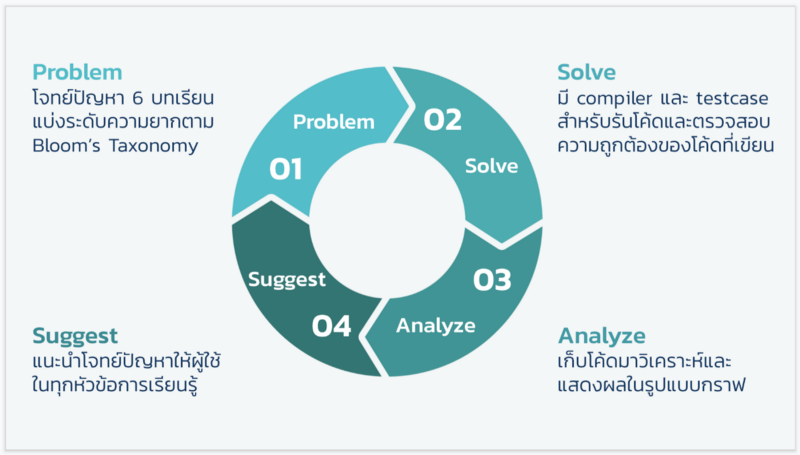
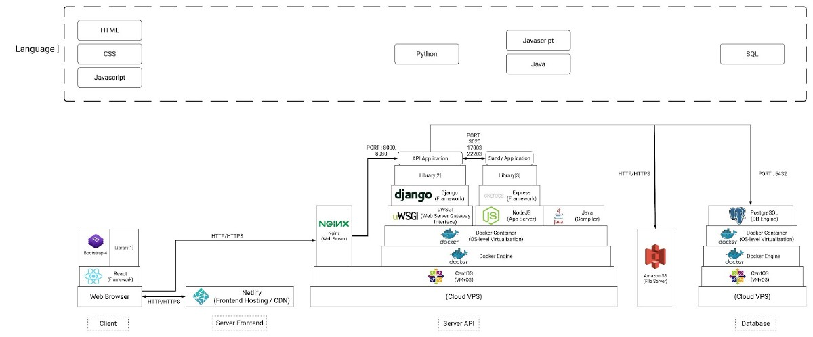

หลายอาทิตย์ก่อนมีบล็อคของเพื่อนกลุ่มโปรเจค ออกไปแชร์เกี่ยวกับการทำหน้าที่ Project Manager ไปแล้ว … วันนี้ผมก็จะแชร์เรื่อง Technical Part ของโปรเจคจบกันบ้าง ~

หัวข้อที่บอกว่าทำ Senior Project ยังไงให้ได้งาน จริง ๆ ทำแบบไหนมันก็ได้งานทำหมดนั่นแหละ (ฮา) แต่ผมจะมาแชร์ว่าเส้นทางของผมมันเป็นประมาณนี้ และตอนสัมภาษณ์งานเราก็เอาโปรเจคจบไปคุยตอนสัมภาษณ์เช่นกัน

---

ซึ่งก่อนจะเริ่มกัน มีสิ่งหนึ่งที่กลุ่มเราคุยกันตั้งแต่ก่อนทำโปรเจคจบว่า “เราจะไม่ทำโปรเจคจบตัวนี้ให้มันผ่าน ๆ ไป … มันต้องทิ้งบางอย่างไว้ให้เรา” เพราะอะไรเดี๋ยวผมจะเล่าให้ฟังตอนท้ายครับ

### What’s Our Senior Project?

โปรเจคจบของเราคือ Luna ครับ ชื่อมันไม่ได้บ่งบอกอะไรหรอก มันคือระบบหัดเขียนโปรแกรมบนเว็บคล้าย ๆ หลายเว็บชื่อดังในไทยอย่าง Programming.in.th, CodeCube หรือต่างประเทศแบบ CodeSignal, CodeWars, HackerRank นั่นแหละ ให้เข้าใจง่าย ๆ เลย

แต่สิ่งที่เรามองต่างคือ นอกจากที่จะทำให้นักเรียนที่เข้ามาฝึกในระบบเราได้ความรู้แล้ว … เราตั้งใจทำระบบนี้มาเพื่อช่วยในการสอนของอาจารย์ในมหาวิทยาลัย โดยเฉพาะของคณะเราเอง … เพื่อให้อาจารย์สามารถดูข้อมูลของเด็กทุกคนที่เข้ามาทำโจทย์ โดยโจทย์จะถูกแบ่งออกตามหัวข้อหลัก ๆ ตามหัวข้อต่าง ๆ, และแต่จะโจทย์จะแบ่งตามความยากง่าย และอีกหลาย ๆ Factors ที่เอามาวิเคราะห์ ประมวลผล ประเมินผล แถมให้คำแนะนำอีกด้วย

ตรงนี้ที่จะทำให้อาจารย์รู้ว่าเด็กทั้งห้อง 100+ คน … คนไหนเรียนเข้าใจบ้าง? มีหัวข้อไหนที่น่าเป็นห่วง? ควรจะดูแลเด็กไปทางไหน? หรือแม้กระทั่งระบุเป็นรายคนว่า เด็กคนไหนน่าเป็นห่วง ที่จะต้องดูแลเป็นพิเศษ เพราะแค่การสอนปกติอาจารย์ไม่สามารถดูได้ทั่วถึงอย่างแน่นอน

ตามที่วางแผนกันไว้ … ตัวระบบก็จะมีทั้งแบบฝึกหัด จนถึงสอบ และแข่งขันภายในกันเลยทีเดียว แน่นอนว่าเราทำไม่ทัน (ฮา)

### Our Tech Stack

โปรเจคนี้อย่างที่บอกไปตอนต้น คือ “เราจะไม่ได้ทำให้มันแค่ผ่าน ๆ ไป” … สิ่งหนึ่งที่เราคุยกันมาแล้วคือ เราจะนำทุกอย่างที่เราเรียนรู้ตลอดระยะเวลาที่อยู่ในมหาลัย เค้นออกมาให้เกิด _Masterpiece_ เท่าที่พวกเราสามคนจะเสกขึ้นได้!

โดยโปรเจคจบนี้มีทั้งหมด 3 คน **แจน** **เฟิส**(ตัวผม) และ**เป็นไท** ซึ่ง**แจน**เป็นตำแหน่ง PM + Designer + ทำทุกอย่าง ไปแล้ว **ผม**กับ**เป็นไท**เป็นคนพัฒนาเว็บไซต์เป็นหลักครับ โดยเราสามารถทำแทนกันได้ทุกอย่าง แต่ผมจะโฟกัสหลักที่ Web Development และเป็นไทจะโฟกัสที่ Infrastructure ทั้งหมด … ซึ่งเราก็จะแบ่งกันโฟกัส และแชร์กันอยู่ตลอด ๆ เพื่อดันโปรเจคนี้ให้สุดเท่าที่มือเราจะเอื้อมไปถึง

ส่วนภาพข้างล่าง คือ Web Application Architecture ของเราครับ … เราเลือกใช้ **ReactJS** เป็น Client Side และใช้ **Django/Python** เป็น API และมี Service ภายในหนึ่งตัวที่เขียนด้วย NodeJS ที่เรียกว่า **Sandy Application**(เล่นคำมาจากคำว่า Sandbox)  เพื่อใช้ Compile และ Run Tests ตัว Java Code ที่ถูกส่งเข้ามานั่นเอง

> Fun Fact: เราเปลี่ยน Stack หลายครั้งมาก จาก **NextJS** ไป **React Static** บ้าง จาก **NodeJS** ไป **Django/Python** จาก **MongoDB** ไป **PostgresDB** และอีกหลายอย่างที่เราเปลี่ยนแล้วเปลี่ยนอีก ซึ่งมันไม่ดีหรอกในเชิงธุรกิจซอฟต์แวร์ … แต่สำหรับโปรเจคจบ มันก็เป็นดีที่เราได้ลองได้เล่นอะไรแปลกใหม่

ตลอดเวลาเกือบ 1 ปีที่เราทำโปรเจคนี้ ก็ทำให้ตัวผมเองเรียนรู้เยอะมาก ๆ ในเรื่อง Web Development ซึ่งได้แก่ …

-   **Multi-tier Web Architectur — **เพราะเราทำโครงสร้างเป็นหลาย ๆ layer มีทั้ง front-end ต่อ api แล้วก็ต่อ internal service ที่เขียนไว้เองอีก แถมแยก database และ service ต่าง ๆ ไว้เป็น container รวมทั้งแยก server ทั้งหมด … พยายามทำ redundant ในทุก ๆ layer เพื่อป้องกันมันล่ม … เราทดลองการคุยกันด้วย HTTP Request ผ่าน docker network layer ด้วย
-   **12 Factors App\* — **จากข้อแรกที่เราพยายามแยก Service ทุกอย่างออกจากกัน มีเหตุผลมาจากเราต้องการทำแอพให้เป็น Cloud Native … ซึ่งเริ่มต้นง่ายสุดด้วยการปฏิบัติพื้นฐานของ 12 Factors App เพื่อให้แอพเราทำสามารถ Scale ได้แบบเนียน ๆ เลย
-   **ORM / DB Migrations—** ผมรู้จัก Migrations ครั้งแรกตอนปี 1 ที่เริ่มหัดเขียน Laravel, แต่ใน Django นั้นตัวมันเองมี ORM + Migration ที่ทรงพลังมาก ๆ ซึ่งเราสามารถสร้าง Model แล้วตัว Django เองจะสร้าง Migration ให้อัตโมมัติตามที่เราสร้าง Model ไว้นั่นเอง … พอมันง่าย ทำให้เราเข้าถึงความทรงพลังของ Migration มากขึ้น ทุกครั้งที่เรา Deploy ไม่ว่าจะไป Environment ไหน ผมแทบไม่ได้แตะตัว Database จริง ๆ อีกเลยตั้งแต่นั้น เพราะทุกอย่างเราเขียน Handle ผ่าน Migration file หมดแล้ว
-   **Authentication / Authorization — **ส่วนนี้ Django เอง มีมาให้ตั้งแต่เริ่ม แต่มันทำให้ผมเรียนรู้ว่า การวาง Model แบบ Users — Permissions — Groups เค้าทำแบบนี้ได้เหมือนกันนะ ตรงนี้ผมได้เรียนรู้ว่าเราจะประยุกค์การใช้งานสิทธิต่าง ๆ กับ Application ได้ยังไงบ้าง เช่น อาจารย์, นักศึกษา, แอดมิน เข้าถึงส่วนไหนได้ ส่วนไหนไม่ได้บ้าง หรือแม้แต่การให้สิทธิเฉพาะรายคนก็ยังทำได้เลย
-   **Logging / Error Tracking — **เราใช้ทำ **Sentry** ในการช่วยเก็บ Errors ทั้งหมดในระบบทั้ง Frontend และ API เพื่อให้เรารู้ว่าเวลามัน **บึ้ม!** จุดไหนกันที่มันบึ้ม บึ้มที่ Environment ไหร แล้วหน้าตาของ Request นั้นเป็นยังไงบ้าง … ส่วนนี้ช่วยลดเวลาหาบัคไปเยอะมาก ๆ ในช่วงเวลาเอาไปทดลองใช้จริง
-   **CI / CD —** ส่วนนี้เราใช้ **CircleCI** ด้วยเหตุผลข้อใหญ่คือ มันฟรี! ซึ่งสิ่งที่เราเรียนรู้คือเราเขียน Script ขึ้นมาเป็น Workflow เพื่อให้ทำการ Build ตัว API และตัว Sandy ไปพร้อม ๆ กันและจุดที่สำคัญคือ ถ้าตัวใดตัวหนึ่งเกิด Build Fail ขึ้นมา มันจะไม่ Deploy แม้แต่ตัวเดียว … ซึ่งใน Build ยังมีการทำ Static Code Analysis, Test, Build ด้วย แต่ไม่ถึงกับได้ทำ UI Testing ครับ 😂 ตอนนั้นยังทำไม่เป็น
-   **Docker Container — **ผมเรียนรู้เยอะมากจากสมัยก่อนแค่ใช้เป็น Docker เฉย ๆ แต่พอเป็นโปรเจคที่ใหญ่ขึ้นทำให้เราเริ่มทำ Docker-Compose เริ่มใช้ชื่อ Service คุยกันแทน IP, เริ่มทำ Load Balancing ด้วย Nginx โดยชี้ไป Container เลย, ลองแม้กระทั่ง K8s, ยังใช้งาน Portainer เพื่อ Monitor Container, ยังมี Datadog, Zabbix + Grafana, ผมแตะ ๆ บ้าง แต่หลัก ๆ ส่วนนี้เป็นไทจะเป็นคนแชร์ให้ผมมากกว่า มันเจ๋งนะ เหมือนโลกใหม่เลย
-   **Beyond Frontend — **ชีวิตผมทำแต่ Front End มาตลอดชีวิต … มันเป็นช่วงเวลาที่เราต้องทำทุกอย่างเพื่อให้ FrontEnd ของเราทำงานดีขึ้น ตั้งแต่ลด Logic ลง เน้นส่ง Data ที่พร้อม Render จากหลังบ้านแทน, ลองวาง File Structure แบบใหม่ ๆ เพื่อให้ง่ายต่อการเขียนเวลาเพิ่ม Feature, ลอง Opitmize Webpack บ้าง ทำ Chuck บ้าง, ทำหมดทุกอย่างเท่าที่ทำได้

และต้องบอกก่อนว่าสิ่งที่เรารู้มันแค่ระดับหยิบมาใช้จริง ๆ ถ้าจะยกตัวอย่างว่า ถามว่า ภายใต้ Redux มีการทำงานแบบไหน, ใน JWT ตัวระหว่าง Signed กับ Hashed ต่างกันยังไง? หรือ ยอมรับว่าในวันนั้นก็ยังอธิบายได้ไม่ดีมาก เรารู้ว่าแค่ใช้แล้วมันแก้ปัญหาเราได้แค่นั้น หรือแค่อยากลองใช้ มันเท่ห์ดี

แต่สุดท้ายทุกอย่างที่กล่าวมานั้นทำให้ผมเรียนรู้อย่างหนึ่งที่สำคัญมาก ๆ คือ User เค้าต้องการแค่เว็บแอพตัวเดียว … เค้าไม่ได้ต้องการ Frontend, Backend, Database, Docker หรืออะไรไม่รู้หรอก เค้าแค่ต้องการเว็บแค่นั้น และสิ่งที่เราควรทำคือเราต้องเข้าใจในทุก ๆ อย่าง เพื่อส่งมอบเว็บที่ดีที่สุดเพียงเว็บเดียวให้เค้าแค่นั้นเอง

### What’s Next?

ตอนนี้ผมทำงานแล้ว พอตัวเราเริ่มทำงาน เริ่มได้พูดคุยกับพี่ในบริษัท เริ่มได้เห็นโปรเจคที่บริษัทมีส่วนร่วม อยู่มา 2 เดือนเราเห็นอะไรมากมาย … จนวันหนึ่งเรามองย้อนกลับไป 6 เดือนก่อนที่เราพรีเซนต์โปรเจคจบครั้งสุดท้าย

ทำให้เราเกิดคิดขึ้นมาว่า ถ้าเป็นเราตอนนี้ เราจะทำให้โปรเจคจบเราดีขึ้นได้ไงบ้างนะในฐานะ Developer คนหนึ่ง …

#### 1\. Software Testing

ก่อนอื่นเลยคงเป็น **Software Testing** อันนี้ผมว่าสำคัญที่สุด ไม่ว่าจะเป็น _Unit Test, Integration Test, UI Test, etc…_

ตอนทำโปรเจคจบ เราเจ็บกับการที่เพิ่ม Feature ใหม่ ๆ ที่พอเพิ่มแล้ว Feature เดิมกลับพัง และพอแก้ปุ๊บ Feature ใหม่กลับพังอีก 😢 ลบเขียนใหม่ง่ายกว่า

… แต่อย่างน้อยถ้ามี Tests มันจะทำให้เรารู้ปัญหาได้เร็วตั้งแต่เราเริ่มเขียน Feature ใหม่เลย ว่ามันเกิดพังบางจุดแล้วนะคุณ! ต้องแก้ก่อน ต้องแก้ก่อน

#### 2\. Refactoring

ซึ่งบางครั้ง Testing มันไม่พอที่จะทำให้เราง่ายต่อการเพิ่ม Feature หรอก … เราต้องหมั่น **Refactoring** ด้วย

ในโลกนี้มีเทคนิคมากมาย ทั้งเริ่มจากมอง Code smell ให้ออก และแก้มันด้วย Refactoring Techniques ต่าง ๆ … ปัญหาที่เราต้องลบเขียนใหม่ทั้งระบบนี้ก็จะลดลงมาก ๆ … ถ้ายังไม่เก็ตลองอ่านต่อ[ที่นี่](https://refactoring.guru/refactoring/catalog)ดูนะ

#### **3\. Over Engineering**

ความ **Over Engineering** ของเทคโนโลยี บางอย่างไม่จำเป็นเลยด้วยซ้ำ

ยกตัวอย่างเช่น **React!** ซึ่งจริง ๆ อาจจะใช้แค่ Django Template ก็พอแล้วในการทำงาน เพราะ Django มี Auth แบบ Session ติดมาให้ตั้งแต่แรก … พอเราทำ React ปุ๊บ เราก็ต้องทำ JWT Auth มาอีกที เวลาเพิ่ม 1 Feature ก็ต้องเขียนทั้ง Frontend, Backend ถ้าทำงานคนเดียว มันไม่เหมาะเอาซะเลย

สุดท้ายเราก็ส่งมอบแค่ Software เดียวให้กับผู้ใช้อยู่แล้ว ฉะนั้นก็เลือกสิ่งที่เหมาะสมกับกำลังของตัวเอง ของทีมด้วย (ไม่ได้บอกว่า React ไม่ดีนะ มันดี! ถ้าทำงานเป็นทีมที่มีการแบ่ง Role ชัดเจนอยู่แล้ว)

#### **4\. Software Development Process**

หากเราเลือก **Software Development Process** ที่เหมาะสมเพราะตอนทำโปรเจคจบ ถึงแม้มี Agile มี Board มีการแตก Task แต่ก็ยังคงสะเปะสะปะอยู่ .. หรือขั้นตอนการออกแบบ Software ตอนนั้นก็ยังไม่เก่งมาก ถึงได้ลบแก้ใหม่อยู่บ่อย ๆ 

รวมทั้งส่วนที่เป็นการเขียนโค้ด ทั้ง Git Branching Strategy เราก็ยังมั่ว ๆ เราเอ้ย จะ Feature-branch ดีไหม หรือ Pull Request แบบไหนดี หรือจะ Trunk-base มั้ย? ตอนนั้นมันแค่รู้จักแต่ชื่อ แต่เราไม่รู้จริง ๆ ว่าสิ่งพวกนี้เค้าคิดมาเพื่อแก้ปัญหาอะไรกันแน่

ถ้ากลับไปตบหัวตัวเองได้ ก็จะบอกตัวเองแบบนี้ และให้ตัวเองกับทีมทบทวนดูดี ๆ ว่าเรามีกี่คน? เราต้องทำไรบ้าง? เราจะทำเว็บแบบไหน? เอา Problem เป็นตัวตั้งและไตร่ตรองดี ๆ ว่าจะเอา Solution ไหนมาแก้ … ไม่ใช่ลุยไปพร้อม Solution ที่คิดว่ามันเท่ห์เฉย ๆ 

#### 5\. Risk Management

หลายครั้งที่เราโฟกัสกับการเขียนโปรแกรมมากมาย แต่ไม่ได้สนใจว่าตอนใช้งานจริง ๆ มันจะเป็นยังไง … กลับมาคิดดี ๆ แล้วจริง ๆ เว็บมันก็คือ​ Service แบบหนึ่ง สิ่งที่เราควรคำนึงไม้แพ้กันคือเรื่อง**กระบวนการจัดการความเสี่ยง**ด้วย

เช่น ถ้าระบบล่ม เราจะต้องทำยังไง? มีขั้นตอนอย่างไรบ้าง? ถ้าจะอัพเดทระบบหลัก ถ้ามีผู้ใช้อยู่ในระบบ เรามีขั้นตอนยังไงบ้าง? หรือมีอะไรที่เราควบคุมไม่ได้บ้าง เช่นอยู่วันดีคืนดี AWS ล่มในวันพรีเซนต์โปรเจคขึ้นมาจะทำยังไงได้บ้าง?

เราไม่มีทางรู้เลยว่าจะเกิดอะไรขึ้นบ้าง! แต่สิ่งที่ทำได้คือ เราวางแผนคิดให้ครบทุกด้าน ต้องหาทางรับมือไว้ เพื่อที่ถึงเวลาถ้าเกิดปัญหาขึ้นมาจริง ๆ แล้ว เราจะรับมือกับมันได้ง่ายขึ้นนั่นเอง … ใคร ๆ ก็เคยระบบล่มตอนพรีเซนต์โปรเจคน่ะจริงไหม? แต่คนที่ไม่ล่มน่ะ เท่ห์กว่ามากเลยนะ (ฮา)

#### 6\. Readability > Performance

  

---

ยังมีอีกเป็นร้อยเป็นพันอย่างที่เรายังต้องเรียนรู้อีกเยอะ … อะไรที่เราเคยเจอมาแล้วคิดว่ามันสุดยอดแล้ว จริง ๆ แล้วมันอาจจะพึ่งเริ่มต้นเท่านั้นเอง

### Warp Up!

บล็อคนี้ไม่ได้ลงลึกเรื่องของ Soft Skill อย่าง Communication, Negotiation, Convincing คิดว่ามันก็สำคัญไม่แพ้กันแหละในชีวิตการทำงาน เช่นการดีลกับเพื่อนว่า Quality มาก่อนนา บางอย่างที่คุยกันไว้ต้องตัดออกไปก่อนนา งานนี้มี Value กว่างานนั้นนะ … การคุยกับที่ปรึกษาก็เหมือนกันคุยกับ Product Owner นั่นแหละ พวกนี้ไปอ่านบล็อคของแจน เพื่อนผม ([Janjie Khemanij](https://medium.com/u/496707872b47)) เอานะ 😂

[**Senior project (Luna)**  
_EP1 สวมบทบาทเป็น Project manager_medium.com](https://medium.com/@jankhemanij/senior-project-luna-1bac16a54685 "https://medium.com/@jankhemanij/senior-project-luna-1bac16a54685")

  

แต่สิ่งสำคัญที่อยากฝาก กับน้อง ๆ ที่กำลังเรียนอยู่ในระดับอุดมศึกษา หรือปีสามปีสี่ที่กำลังเริ่มทำ Senior Project ขออย่าทำให้มันผ่าน ๆ ไป … แม้ 80% จะทำแล้วทิ้ง แต่สำหรับผมทิ้งก็ขอทิ้งแบบไว้ลาย มันต้องสร้างคุณค่าให้กับเราด้วย แม้ตัวโปรเจคมันจะไม่ได้ตามเราไปตอนเราทำงาน แต่ความรู้ที่เราได้จากมันก็ติดตัวเราไปในการทำงาน

---

สุดท้ายอยากขอบคุณทุกคนที่มีส่วนร่วมให้โปรเจคนี้เสร็จลุล่วงทั้ง

-   แจน([Janjie Khemanij](https://medium.com/u/496707872b47)), เป็นไท([Pentai Veerapon Mongconsart](https://medium.com/u/e082f72b5c1f)) — กลุ่มโปรเจคที่มีความเชื่อว่า ทุกอย่างเสกได้ ในโลกนี้แม่งไม่มีไรยากหรอก
-   อาจารย์อุมาพร — ที่ปรึกษาโปรเจค ที่อดทนกับพวกเรามาตลอดทั้งปี
-   อาจารย์คณะไอทีทุก ๆ ท่าน — ที่เป็นปรึกษาที่ดีในการทำโปรเจคในทุก ๆ มุม ทั้งเป็นคู่คิด เป็นผู้วิจารย์ เป็นผู้คำแนะนำ
-   พี่อู๋ ([Nathawat Thumthiwong](https://medium.com/u/87f7015fc873)) จาก สยามชำนาญกิจ — ที่ปรึกษาร่วมโปรเจค, ผู้เบิกเนตรด้าน Software Development ให้ผม, ผู้ที่อยู่เบื้องหลังความสำเร็จแทบทุกอย่างในวงการไอทีของผม 🙏🏻 คำเดิมที่ผมพูดเมื่อหลายปีก่อน มันยังเหมือนเดิม **“ไม่มีพี่ … ไม่มีผมวันนี้”** 
-   พี่เล้ง พี่ตูน จาก Do In Thai — ขอบคุณสำหรับคำปรึกษาในช่วงเริ่มโปรเจคครับ
-   เพื่อนแคน Shopee Signapore, เจ้าของ CodeCube ที่ให้คำปรึกษา — ขอบคุณสำหรับคำปรึกษาในช่วงเริ่มโปรเจคครับบบ
-   พี่ชาครี จาก Bangmod.Cloud — ที่สนับสนุน Credits ที่ใช้ใน Cloud อันมหาศาล ขอบคุณที่มอบทุนการศึกษาให้น้องฮะ
-   ขอบคุณคณะไอทีบางมดสำหรับห้องทำโปรเจคแอร์เย็น 24 ชั่วโมง, ไวท์บอร์ด โต้ปะทำงาน, กระดาษ PostIt ไม่อั้น, กระดาษ Flipchart แบบ Unlimited, พร้อม Internet ที่โหลด Docker Image ใหญ่ๆ ภายใน 10 วิ
-   ร้าน APPRESSO.CAFÉ สำหรับ The Best of ชาเย็น ที่สุดในประเทศ!
-   Pronto Tools ที่มอบโอกาศให้ไปฝึกงานถึง 2 เดือน และผมเองก็ได้เรียนรู้ Software Practice ดี ๆ มากมาย … แน่นอนว่าที่นี่เปิดโลกของ Python/Django ให้ตัวผมด้วยยยยยย … 
-   ThoughtWorks Thailand 😎 แด่ full-time job แรกในชีวิตที่เปิดโลกการพัฒนาซอฟแวร์อย่างแท้จริง โลกที่กว้างจนแบบว่าศึกษาเป็นปี ๆ ก็ไม่รู้จะหมดทุก Domain รึเปล่า แฮ่ ~

ขอบคุณครับ 🙏
