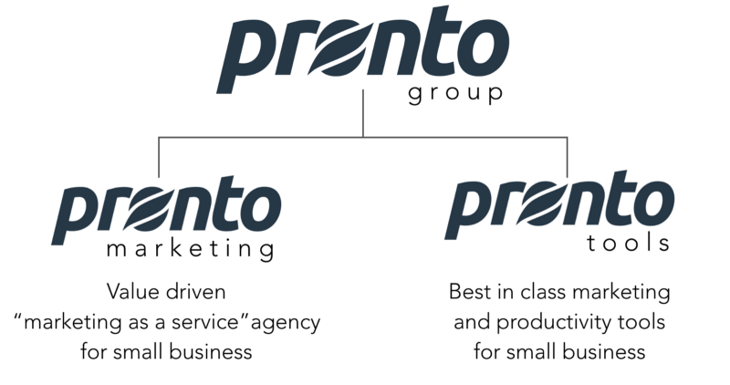

เมื่อ 2 เดือนก่อน ผมได้โอกาศไปฝึกงานที่บริษัทสายเทคโนโลยีที่เจ๋งมาก ๆ แห่งหนึ่งในประเทศไทย ทำไมผมถึงได้ไปฝึกงานที่ [**Pronto Tools**](http://prontotools.io) แล้วผมได้ทำได้ฝึกและเรียนรู้อะไรจากที่นี่บ้าง มาครับ! ผมจะเล่าให้ฟัง

### **Too Long; Don’t Read.**

-   จะฝึกงานให้ได้ดี ต้องมีการเตรียมตัวก่อน ตั้งแต่ดูความสนใจความชอบ หาบริษัทที่ใช่กับความชอบเรา และเตรียมพร้อมตัวเองให้ดี!
-   เราฝึกงานในทีม **Simplesat** เป้น Startup Product ตัวแรกของ **Pronto Tools** ซึ่งทำหน้าที่ในส่วนของ R&D และ Support ให้กับ **Pronto Marketing**
-   ทุกวันเราจะทำ **CodeKata**, มี **Code Review**, **Pair Programming** และที่เจ๋งมากที่สุดคือ **One to Many Meeting** กับ Manager ของทีม! (คืออะไร? ต้องอ่านต่อด้านล่าง)
-   …
-   **Pronto Tools & Pronto Marketing** เราใช้ **Agile** นะ, มีแบบแผนเป็น **Scrum Framework** แต่สิ่งที่เราให้ความสำคัญเหนือสิ่งอื่นใดและคำนึงถึงทุกครั้ง คือ **Agile Menifesto**

  

### **Kickoff** **_an internship_** **Day ~**

เรื่องมันเริ่มมาจากเป็นช่วงเดือนธันวาคมของปี 2560 ที่กำลังจะปิดเทอมเพื่อขึ้นปี 3 เทอม 2 เราตั้งคำถามตัวเองว่า “เชี้ย กุต้องฝึกงาน! เอาไงดีวะ” ประจวบเหมาะกับตอนนั้นมีกิจกรรม Give n’ Take | Agile for Software Development ที่คณะ SIT โดยพี่ ๆ จาก [สยามชำนาญกิจ](https://siamchamnankit.co.th/) พอดี

เราซึ่งกำลังอินกับ Agile และ กระบวนการพัฒนา Software ที่ดีนั้น .. ได้ตอบตัวเองว่าเราอยากฝึก 2 อย่างเป็นหลัก คือ Software Developmemnt Process, Software Testing!

ซึ่งผมก็ถามกับพี่หนุ่ม [Prathan D.](https://medium.com/u/66c931daf1da) ว่าถ้าอยากฝึกด้านนี้ .. _Pronto Tools เป็นที่จะตอบโจทย์ใช่ไหมครับ_ ซึ่งพี่หนุ่มตอบกลับมาว่า _“ถ้าในประเทศไทย, Pronto Tools ก็เป็น บ. นึงที่มีกระบวนการทำงานที่ดีเลยนะ โอเคเลย.”_

นั่นแหละครับ **Pronto Tools เป็น Final Choice ของผมแล้ว** (คาดหวังไว้ที่เดียวด้วย เค้าจะรับไม่รับยังไม่รู้เลย! 🤣)

> ผมเองหาข้อมูลบริษัทมาหลายอย่างมาก ๆ โดยเทียบว่าแต่ละ บ. เก่งด้านไหนหรือเด่นด้านไหน จากการที่เค้าออกงาน Conferrence, เขียนบทความ หรือแม้แต่สอบถามจากพี่ ๆ ที่ทำงานอยู่ในองค์กรนั้น ๆ แล้วมาเทียบกับสิ่งที่ผมอยากเรียนรู้

> ซึ่ง Top list ก็เป็น **“Pronto Tools”** มาตั้งแต่นั้น แต่ผมก็ยังไม่มั่นใจใน Poll ของตัวเอง .. เลยต้องสอบถามจากคนรู้จัก อาจารย์ และพี่ ๆ ในวงการอีกหลาย ๆ ท่านเพื่อยืนยันว่าผมไม่ได้เลือกผิดนะครับพี่ บริษัทเค้าจะให้อะไรผมได้อย่างที่ผมหวังจริง ๆ นะ อะไรแบบนั้นเป็นต้นครับ

หลังจากนั้นผมก็ทำงานติดต่อ Pronto Tools ผ่านพี่เคลวิน [Mahatthana Nomsawadi](https://medium.com/u/9bd2d746cd7a) ทำงานเป็น Software Engineer ที่ Pronto Tools ไป (ทัก Facebook Messenger ไปเลย) .. ซึ่งแกก็บอกรายละเอียดคร่าว ๆ และส่ง[ลิงค์](https://www.smartrecruiters.com/ProntoMarketing/743999672638450-junior-software-engineer-intern)ให้เพื่อไปกรอกใบสมัครเบื้องต้น

ขอบอกเลยใบสมัครออนไลน์ที่กรอก **ภาษาอังกฤษ** หมดเลยครับ ซึ่งภาษาอังกฤษตอนนั้นของผมง่อยมาก กรอกเป็นอาทิตย์ ๆ โดยก๊อปคำถามมาไว้ก่อน แล้วค่อย ๆ พิมพ์ใสคำตอบลงไป วันละข้อสองข้อ แก้แล้วแก้อีก พร้อมแล้วค่อยกลับเข้าลิงค์แล้วเอาคำตอบไปยัดใส่ลงไปพร้อมกับ Resume ที่เตรียมมา 😅

สุดท้าย ผมก็ได้ไปสัมภาษณ์ฝึกงานที่บริษัท และได้รู้ผลว่าตัวเองได้เข้า Internship Program นะ! ไม่นานหลังจากนั้น นี่ก็เป็นจุดเริ่มต้นของเรื่องราวทั้งหมดครับ 🎉

#### **การจะฝึกงานซักที่นึงอยากให้ทุกคนได้เตรียมตัวก่อนเสมอเลยว่า**

-   เราอยากฝึกเรื่องไหน สายงานไหนที่เราอยากจะไปทำเรียนจบ
-   หาบริษัทหรือองค์กรที่มีความเด่นด้านนั้นที่เราอยากจะฝึก
-   เตรียมตัวและเตรียมผลงาน, ค้นหาข้อมูลว่าองค์กรเป็นยังไงบ้าง, หาพวก Blog ของคนที่เคยฝึกที่นี่มาก่อนเพื่อดูว่าทักษะเค้าประมาณไหน เรายังขาดอะไรอยู่ ก็ไปเติม, อะไรที่ทำแล้วจะเพิ่ม Value ให้กับเรา, เค้าใช้ Technology อะไรอยู่ เราจะทำได้ไหม? เพราะถ้าได้จะได้ไม่ต้องเรียนรู้ใหม่ ไปฝึกไปทำงานได้เลย เพราะเราอยากได้กระบวนการทำงานนิ่เนอะ เป็นต้นครับ
-   สุดท้ายตอนส่งใบสมัครและสัมภาษณ์! ทำยังไงก็ได้ ให้ได้เข้าไปฝึกงาน! มีเท่าไหร่ใส่ให้หมด มี 100 ใส่ 100

ทั้งนี้ทั้งนั้นทุกอย่างต้องใช้เวลา … Candidate คู่แข่งที่มาสมัครฝึกงานที่ที่เราอยากไป มันมีอยู่แล้ว … เราเตรียมตัวพอรึเปล่า ลองคิดดูว่าเค้าเตรียมตัวมา 1 เดือน พยายามทำผลงานต่าง ๆ เขียนบล็อคมาเกือบ 1 ปี เผื่อสมัครฝึกงานที่นี่ที่นั่น กับเราเตรียมตัวแต่ 1 อาทิตย์ ผลงานที่เคยทำก็ยังไม่ชัดเจน บล็อคก็ไม่เคยเขียน ยังไม่ชัดเจนกับตัวเองเลย … แล้วมันมีที่ว่าแค่ 1 ที่ให้เค้าจะเลือก

เป็นเรา เราจะเลือกใคร? สำหรับผมเอง ผมก็จะเลือกคนที่เตรียมตัวมาครับ และผมก็อยากเป็นคนที่ถูกเลือกคนนั้นด้วย 🙂

---

### **Welcome to Pronto Tools! ✌🏻**

ก่อนจะเริ่มมารู้กันก่อนว่า Pronto Tools คืออะไร .. มารู้จักองค์กรเรากันก่อน!

ขอเริ่มจากภาพใหญ่ก่อนละกันครับ นั่นคือ **Pronto Group** เป็นบริษัทไอทีสัญชาติอเมริกันย่านสะพานควาย ที่ขับเคลื่อนด้วยการบริการลูกค้าด้วย WordPress เน้น SME ที่ต้องการมีตัวตนและเติบโตในโลกดิจิตอล

โดยทีมแบ่งออกเป็น 2 ส่วนหลักๆ คือ **Pronto Marketing** และ **Pronto Tools** นั้นเอง

-   [**Pronto Marketing**](https://prontomarketing.com/) จะทำทุกอย่างคล้าย ๆ Agency ตั้งแต่รับดูแลลูกค้า, ออกแบบ, ทำเว็บไซต์ด้วย Wordpress (ที่ถูก customized by Pronto Tools), ทำ Marketing, ทำ SEO, เขียน Content, และอีกมากมายหลายอย่าง
-   [**Pronto Tools**](http://prontotools.io) หรือคือ **R&D Team** ก่อนที่จะแยกตัวออกมา ซึ่งทีมนี้แหละครับ ที่ผมไปฝึกงาน เป็นทีมสุดเจ๋งที่คอยสร้างเครื่องมือต่างๆ ที่ Support ให้กับทีม Pronto Marketing อีกที และพร้อม Provide มิติใหม่ ๆ หาโอกาศใหม่ ๆ ทางดิจิตอล ทั้ง Data, ML จาก Resources ที่มีอยู่จาก Pronto Marketing นั่นเอง
-   ซึ่งจากการหาโอกาศใหม่ ๆ ทางดิจิตอลนั้น ทำให้ Pronto Tools เริ่มทำโปรดักส์ Startup ของตัวเองขึ้นมาด้วย ซึ่งนั่นก็คือ [**_Simplesat.io_**](https://simplesat.io)** !**

### **Simplesat ! Simple Satisfaction.**

ทีมที่ผมได้เข้ามาร่วมด้วย คือนี่ **Simplesat**!

**Simplesat** เป็นเครื่องมือที่ช่วยเก็บความพึงพอใจของลูกค้า จากประวัติที่ผมฟังมามันเริ่มมาจากลูกค้าของ Pronto Marketing มีเครื่องมือในการเก็บความพึงพอใจของลูกค้าหลากหลายมาก ๆ แต่ไม่มีอันไหนเลยที่ดีที่สุดหรือพึงพอใจมากที่สุด .. ฉะนั้น ทำเองแล้วกัน! น่ะครับ ตอบโจทย์ด้วยการใช้งานและเก็บ feedback จากลูกค้าของเราเองกว่า 1600+ รายทั่วโลก

> ความสำคัญของการเก็บความพึงพอใจของการบริการของเราทุก ๆ ครั้ง มันจะช่วยให้ feedback กับเราได้ว่า … สิ่งที่เราทำตรงนี้ตอนนี้มันดีหรือมันแย่ ถูกใจไม่ถูกใจ ควรจะปรับปรุงอะไรแล้วเริ่มจากตรงไหนดี

> ทั้งหมดจะทำให้ธุรกิจของพัฒนาขึ้นไปเรื่อย ๆ อีกทั้งยังช่วยให้การทำ **Customer Relationship Managment (CRM)** นั้นได้ผลมากขึ้นอีกด้วยจากการเข้าใจพฤติกรรมและความชอบและไม่ชอบของลูกค้า

ซึ่งระบบ Satisfaction นั้นมีหลายแบบ การทำ Survey ก็มีหลายแบบทั้ง

-   **CSAT** หรือ Customer Satisfaction Score ให้นึกถึง Survey ที่มีให้กดหรือเลือก 3 ช่อง เช่น “ไม่ชอบ” “เฉย ๆ ” และ “ ชอบ”
-   **NPS** หรือ Net Promoter Score อันนี้ให้นึกถึง พวก Survey ที่มีหน้าตาเป็น 0–10 เช่น ความพึงพอใจการใช้งานห้องน้ำของตึก ABC เป็นต้น
-   **RATER System** ซึ่งประกอบไปด้วย Metric ทั้ง 5 คือ **Reliability, Assurance, Tangibles, Empathy, Responsiveness**

สำหรับใครอยากเข้าใจมากขึ้น สามารถหาข้อมูลต่อได้ที่ [https://simplesat.io/blog/](https://simplesat.io/blog/) และ [https://www.prontotools.io/introducing-simplesat/](https://www.prontotools.io/introducing-simplesat/) นะครับ

แม้ยังไม่มีแผนใช้งานระบบนี้ แต่อยากให้อ่านไว้เพื่อเป็นความรู้สำหรับไปทำ Survey ในอนาคตนะครับ มีประโยชน์มากๆ สำหรับทุกเพศทุกวัยครับ :) และถ้าสนใจใช้งาน Simplesat ลองใช้งานได้เลยครับที่ [https://simplesat.io](https://simplesat.io)

---

### **Intern’s Routine.**

มาดูกันว่าว้น ๆ เราทำไรกันบ้าง..

#### **CodeKata Everyday at 9:30 AM**

เราทีมเด็กฝึกงานและพี่ ๆ ในทำงานด้วยกัน เราจะมาฝึกเขียนโค๊ดด้วยกันทุกวัน ๆ ซึ่ง Codekata นั้นความหมายของมันมาจากการฝึกของศิลปะป้องกันของตัวญี่ปุ่น คือ การฝึกซ้ำ ๆ ให้มันกลายเป็น Muscle Memory ไปเลย ! โดยเราทำโจทย์เดิม ๆ ซ้ำ ๆ ทุกวัน โดยเมื่อแก้โจทย์ได้แล้วเราก็จะเพิ่มความยากเข้าไปเรื่อย ๆ แล้วทำซ้ำ ๆ เข้าไปอีก

อยากรู้ว่ามันเป็นยังไง .. อ่านต่อได้ที่นี่เลย!

[**CodeKata สอนอะไรเราบ้าง ?**  
_หลายคนคงเคยได้ยินคำว่า CodeKata อยู่บ่อย ๆ ถ้าทำงานหรือศึกษาอยู่ใน track ของ programming นะครับ .. วันนี้จะมาแชร์ว่าที่…_medium.com](https://medium.com/prontotools/codekata-%E0%B8%AA%E0%B8%AD%E0%B8%99%E0%B8%AD%E0%B8%B0%E0%B9%84%E0%B8%A3%E0%B9%80%E0%B8%A3%E0%B8%B2%E0%B8%9A%E0%B9%89%E0%B8%B2%E0%B8%87-4ae7b07746c7 "https://medium.com/prontotools/codekata-%E0%B8%AA%E0%B8%AD%E0%B8%99%E0%B8%AD%E0%B8%B0%E0%B9%84%E0%B8%A3%E0%B9%80%E0%B8%A3%E0%B8%B2%E0%B8%9A%E0%B9%89%E0%B8%B2%E0%B8%87-4ae7b07746c7")

บอกเลยว่านี่เป็นภารฝึกอย่างนึงที่ผมภูมิใจนำเสนอมาก ๆ!

#### **Stand Up Meeting at** **10:00 AM**

ทุก ๆ วันเวลา 10 โมงตรง ทุกคนใน Pronto Tools จะมาอัพเดทเล่าสู่กันฟังว่า

-   เมื่อวานเราทำอะไรไป? ติดปัญหาอะไรไหม อยากได้ความช่วยเหลืออะไรรึเปล่า? แล้ววันนี้มีแพลนทำอะไร ให้ทุกคนรับทราบ .. แม้แต่แจ้งว่า วันนี้มีประชุมนะ วันนี้มีธุระช่วงเย็นจะต้องกลับก่อน วันพฤหัสหน้า Remote working นะคะ วันศุกร์มีไปงาน Confernece นะครับ เราจะใช้เวลานี้แจ้งให้ทุกคนในทีมรับทราบนั่นเอง
-   ตรงนี้ทำให้เราสามารถรับรู้ Status ของเพื่อน ๆ พี่ ๆ ในทีมได้ แล้วเตรียมพร้อมให้กับตัวเองได้ทันทีเลย โดยใช้เวลาแป๊ปเดียว ถือว่าเป็นเรื่องที่ง่าย ๆ แต่ได้ผลดีมหาศาลเลยจริง ๆ ครับ..
-   อีกอย่างที่มันชื่อว่า Stand Up Meeting นั้น จุดเด่นคือ มันต้องยืน ทำให้ทุกคนเมื่อย ฉะนั้นก่อนจะมาประชุมทุกคนจะเตรียมตัวและจดมาก่อนว่า จะพูดอะไรบ้าง ให้สั้น ๆ กระชับและเข้าใจ เพื่อให้มันใช้เวลาไม่นาน จะได้กลับไปนั่งทำงานต่อนั่นเอง เย้ !

#### **Code Reviews!**

ปกติวัฒนธรรมการเขียนโค๊ดของที่นี่ ก็จะมีความคล้าย ๆ กับ [GitHub Flow](https://guides.github.com/introduction/flow/) อยู่ แต่ก็ไม่เหมือนกัน 100% นะ

-   ซึ่งเมื่อเราทำงานกันเสร็จแล้วใน **Branch** ของตัวเองแล้ว..
-   เราจะกดสั่ง **Pull Request (PR)** ไป และเราจะต้องบอกทุกคนในทีมว่า _“พี่ค้าบบบบ ขอ Review หน่อยค้าบ เวลา 13:30 นะครับผม การ์ด #1970 ครับ”_ พร้อมแนบลิงค์ PR ของเราไปด้วย
-   ส่วนใหญ่แล้วทุกคนที่จะมา Review ก็จะอ่าน PR มาคร่าว ๆ ก่อน เพื่อให้เร็วในการ Review
-   ในการทำ **Code Review** ให้นึกถึงคนในทีมมาสุมหัวกันล้อมโต๊ะคอม และให้เจ้าของ PR เล่าให้ฟังว่าตัวเองทำอะไร เขียนโค๊ดอะไรไปบ้าง แล้วเป็นยังไง มีผลกระทบอะไรไหม
-   ทุกคนจะช่วยกัน **Comment** หาจุดผิดพลาด หรือ เพิ่ม **Code Quality** ให้แก่ **PR** นั้น เช่น _ชื่อ Method ไม่สื่อ อ่านยาก, เขียน Test ไม่ครอบคลุม, Reuseable ได้ไหม, ฯลฯ และท้ายที่สุดคือให้ทุกคนในทีมเข้าใจการทำงานของโค๊ดส่วนนั้นด้วย_
-   เมื่อ Code ผ่านตาของหลาย ๆ คนในทีม อย่างแรกคือ **จุดผิดพลาดจะน้อยลงแน่นอน**, คนในทีมรับรู้ว่าจะมีโค๊ดตัวนี้เข้ามาอยู่ใน Codebase แล้วนะ หรือมากกว่านั้นคือ คนในทีมเข้าใจ Code ที่จะเพิ่มเข้ามา

> **เพราะ Code มันเขียนเป็นทีม มันไม่ได้ทำคนเดียว …อย่าละเลยการ Code Reviews กันนะครับผม _💻_**

#### **Pair Programming** 👬

การเขียนโค๊ดด้วยกัน 2 คน นั่นแหละครับตามชื่อของมันเลย

ซึ่งข้อเสียหลักๆ คือ **งานจะช้าลง** เพราะใช้ 2 คน Coding ทำงานเดียวกันด้วยกัน มันช้าลงแน่นอนกว่า 2 คน 2 งานจริงไหม

แต่**ข้อดีเนี่ยมีมากมาย**จริง ๆ ครับ เช่น

-   เรามี 2 คนที่เข้าใจงานเดียวกันนั้น ทำให้เมื่อคนหนึ่งป่วย ลา ขาด ก็ยังมีอีกคนพร้อมทำงานต่อนั่นเอง
-   เป็นการถ่ายทอดความรู้จากคนที่เก่งสู่คนที่มาใหม่ **(Expert-to-Novice)** เช่น ผมเป็นเด็กฝึกงาน Pair Programming กับพี่ Software Eng. การทำงานกับเค้าทำให้เราค่อย ๆ ซึบซับ Culture การทำงาน, สไตล์การเขียนโค๊ด, เทคนิคพิเศษบางอย่างจากพี่คนนั้น
-   สนิทกันกับพี่ ๆ เพื่อน ๆ ที่ได้ Pair ด้วยกัน ถือเป็น **Team building** อย่างนึงนะ 🙂

อ่านต่อ wiki เลยย แท้จริงแล้วยังมีความหมายอีกหลายอย่างและข้อคิดอีกมากมายให้เรียนรู้เกี่ยว Pair Programming อยู่นะ [https://en.wikipedia.org/wiki/Pair\_programming](https://en.wikipedia.org/wiki/Pair_programming)

> ผมเรียนรู้ได้ไว เข้าใจการทำงานกับทีมได้ไวภายในอาทิตย์แรกอาทิตย์ ก็เพราะ Pair Programming นี่แหละครับ _😄_

#### **One to Many ! by Manager พี่เก๋**

บอกก่อนตรงนี้ว่าเป็นอะไรที่ไม่เคยเจอที่ไหนมาก่อนเลยครับ มันเป็นการที่เด็กฝึกงานเราจะมานั่งคุยกับพี่เก๋ Manager ของเรานั่นเอง (บางครั้งก็มีพี่ ๆ คนอื่นร่วมด้วย)

-   ซึ่งเป็นกิจกรรมที่จะเกิดขึ้นเดือนละครั้งเท่านั้น ผมฝึกงาน 2 เดือน จะเกิดแบบนี้เพียงแค่ 2 ครั้งเท่านั้น และครั้งแรกที่โดนทุกคนตบไหล่ผมเบา ๆ แล้วบอกว่า _สู้ ๆ นะ _… แต่จริง ๆ แล้วไม่มีอะไรหรอกครับ ฮ่า ๆๆ (มั้ง)
-   เป็นการคุยกับระหว่างเราเด็กฝึกงานทั้งหมดกับ Manager นั้น เค้าจะมาบอกเราว่า 1 เดือนที่ผ่านมามีอะไรที่เราโอเคไหม? … แล้วที่สำคัญกว่านั้น มีอะไรที่เราไม่โอเคหรือไม่เข้ากันกับทีมและเราควรจะปรับปรุงให้ดีขึ้น … มากไปกว่านั้นคือพี่เก๋และพี่ ๆ คนอื่น ๆ จะสอนอีกว่าบางครั้งกับสิ่งที่ไม่ดีที่เจอตอนนี้ในอนาคต เราอาจจะเจอเหตุการณ์แบบนี้เหมือนกัน พร้อมทั้งแนะนำแนวทางให้ลองเลือกแล้วไปปรับปรุงตัวเองอีกด้วย
-   โดยรุ่นผมมีเด็กฝึกงาน 4 คน ก็จะโดนพร้อมกัน ให้ทุกคนเจอข้อดีข้อเสียของกันและกันไปเลย ~ พีคมากมาก

เล่าให้ฟังเป็นประสบการณ์ สิ่งที่ผมโดนในเดือนแรกคือ .. 

-   เริ่มด้วยการโดนถามว่า มีอะไรจะพูดไหม ที่คิดว่าดีและไม่ดีตลอดเดือนที่ผ่านมา … ผมเองก็มีความรู้สึกผิดในตัวเองเหมือนกัน Pronto Tools เปิดกว้างมาก ๆ จึงบางครั้งผมก็เป็นตัวเองเกินไป เป็นคนกวนตีนเกินเบอร์ไปบ้าง มีความง้องแง้งอยู่ก็เยอะพอสมควร ก็บอกไป .. ซึ่งพี่ ๆ ก็ตอบรับมาในทางที่ดีบอกว่า ดีแล้วที่เป็นแบบนี้ ถือว่าเค้าก็ไม่ได้วางตัวให้เราเกร็งมากไป
-   แน่นอนครับมาแล้วถึงข้อเสียของผมที่เค้าบอกเราบ้าง พี่เค้าบอกว่า “เฟิสสุภาพเกินไป” 😥 เหตุผลเพราะบางครั้งผมยังติดภาพของรุ่นพี่รุ่นน้องอยู่ ทำให้บางครั้งผมไม่ค่อยกล้าที่จะออกความคิดเห็นทับกับความเห็นของรุ่นพี่ หรือแม้กระทั่งไม่กล้าตัดสินใจอะไรบางอย่าง ต้องถามรุ่นพี่ก่อนเพื่อ Confirm ซักครั้งนึงถึงจะทำ
-   ซึ่งพี่ ๆ ก็บอกว่า **การที่เราสุภาพเป็นสิ่งที่ดี แต่การที่อยู่ที่นี่ ในเวลาทำงานขอให้ออกความคิดเห็น หรือตัดสินใจไปเลย เรื่องนึงที่จะได้คือความมี Ownership กับสิ่งที่เราทำ** ถ้าเรามัวแต่ถามว่าผมทำแบบนี้ได้ไหม ๆ ๆ ๆ มันจะกลายเป็นการตัดสินใจของพี่ เราแค่ทำตาม .. พี่เค้าก็เสริมว่า “หลายครั้งพี่ ดูเหมือนว่าเราเองก็มี Solution ในใจอยู่แล้วที่อยากจะทำ ทำไปเลย ไม่ต้องมาถามบ่อย ๆ ก็ได้ .. ถ้ามันดีไม่ดี เดี๋ยวเรามาดูกันตอน Code Review ก็ได้ บางครั้ง Solution ที่น้องมี อาจจะดีกว่าที่พี่รู้ก็ได้จริงไหม ถ้าพี่มีเทคนิคที่ดีกว่า พี่ก็จะบอกน้องเช่นกัน ตัดสินใจมาได้เลย ที่นี่เราทุกคนเท่ากัน เราคือ Software Engineer เหมือนกัน เป็นคนที่ทำ Product ตัวนี้เหมือน ๆ กัน” 🙂 ตามนั้นเด้อ 
-   อีกเรื่องที่โดนบอกมาก็คือ **ผมไม่รอบคอบ และบางครั้งผมตัดสินใจเร็วเกินไป** เพราะความเคยชินในการทำงานตั้งแต่ก่อนจะมาฝึกงาน มักเผางานอยู่เสมอ .. เค้าบอกว่า เสียเวลาเชคให้มันเรียบร้อยนิดหน่อย ทั้งก่อน Save และก่อน Commit และก่อนกด Merge ! เพิ่มความรอบคอบเข้าไปอีกนะ หลังจากนี้

ส่วนเดือนที่ 2 ของผมเป็น **One to One** โดยพี่เก๋ Manager ของเรา

-   สำหรับอาทิตย์นี้ก็จะมานั่งคุยกันว่า **อาทิตย์นี้ก็จบฝึกงานแล้วนะ สองเดือนนี้เป็นยังไงบ้าง** อะไรที่ชอบ อะไรที่ไม่ชอบ อะไรที่เป็นโมเม้นที่ดี ๆ เวลาอยู่ที่นี่ แล้วจะกลับไปเรียนใช่ไหม หนึ่งปีนี้มีแพลนอะไรบ้าง ? ทั้งยังคุยกันเรื่องการทำงานในอนาคต, การหางานและตำแหน่งงานในอนาคต, การไปเรียนต่อต่างประเทศและทำงานต่างประเทศ, มีเรื่อง Work Life Balance ด้วย
-   เป็นการเล่าสู่กันฟัง ทั้งสิ่งที่ผมได้รับตลอด 2 เดือน แลกเปลี่ยนกับความรู้และมุมมองจากประสบการณ์ของพี่เก๋ ซึ่งมันมีค่าสำหรับผมมาก ๆ ครับ

ทั้งหมดมันเป็นกระบวนการที่ดีนะ .. สำหรับ **One to One** พี่เก๋เคยเล่าให้ฟังว่า เราจะทำ **One to Many** กับพนักงานประจำไม่ได้นะรู้ไหม เราจะมาด่ามาพูดข้อเสียของเพื่อนร่วมงานให้เพื่อนร่วมงานกันไม่ได้ มันไม่เหมือนเด็กฝึกงานที่ 2–3 เดือนแล้วก็กลับไปเรียนต่อให้จบ กลับไปพัฒนาตัวเอง

แต่สำหรับพนักงานประจำอย่างพี่ ๆ เค้ายังต้องอยู่กับบริษัทไปอีกเป็นหลาย ๆ ปี ก็เลยต้องเป็น **One to One** ที่จะให้พี่ ๆ พนักงานเหล่านั้นได้มาคุยมาเปิดใจกันกับพี่เก๋ Manager ของเรา Pronto Tools … ทุก ๆ อย่าง อะไรที่พอใจ อะไรที่เค้าไม่พอใจ อะไรที่เค้าอึดอัด สุขภาพจิตใจ ชีวิตประจำวัน ปัญหาในการทำงาน และปัญหาชีวิต แทบทุก ๆ ด้านเลยในตัวเค้า รวมถึงการพัฒนาตัวเค้าเอง เป้าหมายในอนาคตของเค้าด้วย เป็นหนึ่งในงานของพี่เก๋นี่แหละที่จะต้องดูแลและพาเค้าไปด้วยกันกับทีมและองค์กร

คนที่จัดการสิ่งเหล่านี้นี่แหละ คือ **Manager! 🎉**

บอกไปแล้วตั้งแต่ต้น ผมไม่เคยเจออะไรแบบนี้มาก่อน มันทำให้เราได้ reflect ตัวเองในสายตาของคนที่ทำงานด้วยกันกับเรา ทั้งระดับ Manager ระดับพี่ ๆ ที่ทำงานด้วยกัน และระดับ Product Owner / Co-Founder ถ้าได้ทำงานร่วมกับเค้า บางครั้งก็จะมี Comment มาจากเค้าเช่นกัน

ฟังเรื่องราวลึก ๆ เกี่ยวกับ **One to One / One to Many Meeting** ต่อได้ที่ [ครูเก๋สอนโค้ช](https://www.facebook.com/coachingtutor/) จ้า

[**ครูเก๋สอนโค้ช**  
_ครูเก๋สอนโค้ช. 690 likes. ความตั้งใจของเพจนี้คือ การส่งต่อพลังการใช้ชีวิตให้แก่ผู้คน_www.facebook.com](https://www.facebook.com/coachingtutor/ "https://www.facebook.com/coachingtutor/")

---

### **Walking As A Team Member.**

วิถีชีวิตที่นี่ค่อนข้างเรียบง่าย สนุกและท้าทายในทุก ๆ วันครับผม

ที่นี่เปิดกว้างมาก ๆ เพราะเปิดให้เด็กฝึกงานได้ Access ทุกอย่างเท่าที่พนักงานหนึ่งคนจะเข้าถึงได้ .. ตัวผมเอง ได้ทั้ง Email@prontomarketing.com ของตัวเอง, ได้เข้า Github Organization ที่เห็นทุก Private Repo ของออฟฟิส (เป็นแหล่งความรู้อันหาที่เปรียบไม่ได้!), Zeplin, Slack, ฯลฯ เยอะมาก ๆ 

จุดนี้ทำให้เราเอง ผมเองรู้สึกเหมือนเป็นหนึ่งในทีมจริง ๆ ที่นี่ไม่มีความลับ ทุกอย่างผมในฐานะเด็กฝึกงานสามารถเข้าถึงได้ ทุกอย่างที่นี่ Transparent มาก ๆ .. แน่นอนว่าเรื่องของ Role / Hierarchy ค่อนข้าง Flat สุด ๆ เช่นกัน 

ที่นี่เราค่อนข้าง Self Management สุด ๆ .. ทุกคนมีสิทธิ์เลือก Card เลือกงานของตัวเองที่จะทำใน Sprint นั้น ๆ ได้, จัดการตัวเอง, รับผิดชอบสิ่งที่ Commit กันไว้ ซึ่งผมค่อนข้างชอบเลย เราประชุมกันไม่ค่อยเยอะครับ แต่ว่าแต่ละครั้งที่ประชุมจะเน้นรายละเอียด ชัดเจน กระชับมาก ๆ ส่วนหนึ่งคือให้ความสำคัญกับเวลาของกันและกัน เพราะจะได้เอาเวลาไปทำงานงี้ ซึ่งเป็นสิ่งหนึ่งที่ผมชอบมาก ๆ เช่นกันครับ

> Don’t take your job too seriously. — Have fun, make friends, get to know your coworkers — work will be more enjoyable that way.

#### **Pronto Tools Monthly Policy**

ที่ Pronto มีกิจกรรมที่ทุกคนจริงจังกับมันมาก ๆ ที่จะทำกันในแต่ละเดือน คือเราเลือก Leader ขึ้นมา มีหน้าที่ตั้ง Policy ที่ทุกคนใน Pronto Tools จะต้องทำ เช่น เดือนนี้ทุกวันศุกร์เราจะกินข้าวด้วยกันที่ออฟฟิสนะ มีกิจกรรมให้ทำ มีของรางวัลเป็นต้น

  

Don’t Break the chain ก็เช่นกันจ้า

[**Don’t break the chain อย่าทำให้โซ่นั้นขาดไป**  
_วันนี้ผมจะมาเล่าให้ฟังเกี่ยวกับวิธิการหรือแนวทางหนึ่ง…_medium.com](https://medium.com/prontotools/dont-break-the-chain-%E0%B8%AD%E0%B8%A2%E0%B9%88%E0%B8%B2%E0%B8%97%E0%B8%B3%E0%B9%83%E0%B8%AB%E0%B9%89%E0%B9%82%E0%B8%8B%E0%B9%88%E0%B8%99%E0%B8%B1%E0%B9%89%E0%B8%99%E0%B8%82%E0%B8%B2%E0%B8%94%E0%B9%84%E0%B8%9B-95b7638384fe "https://medium.com/prontotools/dont-break-the-chain-%E0%B8%AD%E0%B8%A2%E0%B9%88%E0%B8%B2%E0%B8%97%E0%B8%B3%E0%B9%83%E0%B8%AB%E0%B9%89%E0%B9%82%E0%B8%8B%E0%B9%88%E0%B8%99%E0%B8%B1%E0%B9%89%E0%B8%99%E0%B8%82%E0%B8%B2%E0%B8%94%E0%B9%84%E0%B8%9B-95b7638384fe")

#### **_English Everyday_**

ก่อนจบฝึกงานประมาณ 2 อาทิตย์ ผมเผลอไปพูดกับพี่ในทีมว่า “ผมอยากไปเรียนต่อพี่! หนึ่งใน Goal ที่มาฝึก Pronto คือภาษาอังกฤษเลยนะ ที่นี่ทำให้ผมมีความมั่นใจเวลาพูดภาษาอังกฤษเยอะเลย” เท่านั้นแหละครับ

#### Lunch and learn!

  

### **Agile is here!**

สำหรับการทำงานที่นี่ พวกเราใช้ Agile Methodology เป็นหลักในการทำงาน ซึ่ง Pronto Tools เองใช้ Agile มามากกว่าครึ่งทศวรรตแล้ว .. คำว่า Agile ของที่นี่ ทุก ๆ คนเข้าใจและใช้อย่างเป็นเรื่องปกติกันเลย ตั้งแต่ระดับผู้บริหารลงมาถึงเด็กฝึกงานเลยครับ

ก็เราใช้ Scrum Framework เป็น 1 ในหลากหลายวิธีการใช้ Agile นั่นแหละครับ ซึ่งมันก็จะมีวิธีการต่าง ๆ ที่ใช้ในการบริหารโปรเจคอย่างพวก Sprint Planning Day, Sprint Review, Retrospective เดี๋ยวไว้อธิบายทีหลัง .. มาพูดถึงสิ่งที่เป็นหัวใจหลักจริง ๆ ที่ควรรู้จะดีกว่า

เพราะแต่จริง ๆ แล้วใจความสำคัญของมันคือ **Agile Manifesto!** ซึ่งที่นี่ย้ำนักย้ำหนา มันจะสอนให้เราเข้าใจ Context ของการคิด การอยู่ร่วมกัน อยู่ด้วยกันแบบ Agile นั่นเอง … 

](./asset-2.gif)

ทั้งหมดข้างบน 4 ข้อนี้ เป็นสิ่งสำคัญที่ควรนึกถึงเสมอ ไม่ว่าจะใช้ Scrum, Kanban, XP, ฯลฯ .. ซึ่งพอเข้าใจเรื่องเหล่านี้แล้วเนี่ย .. ค่อยกลับมาในส่วนของ Scrum Framework ที่ Pronto Tools ใช้กันอยู่นะครับ

เรามีกิจกรรมสำคัญ ๆ อยู่ทั้งหมดประมาณ 4 วัน ได้แก่

1.  **Sprint Planing** เป็นวันที่เราต้องวางแผนว่า Sprint นี้ระยะเวลา 2 week, เราจะทำอะไรกันบ้าง แล้วอะไรจะเสร็จ แล้วอะไรที่เราจะ Release บ้าง
2.  **Stand up Meeting** เป็นสิ่งที่เราทำกันทุกวัน ทุกเช้า เวลา 10:00 น. มาอัพเดทกันทุกวันว่า เมื่อวานเราทำอะไร ติดปัญหาอะไรไหม? Get help ป่าว​ ~ แล้วสุดท้ายวันนี้เราจะบ้าง มีอะไรที่ทีมควรจะรู้ก็บอกกันตรงนี้เลย เช่น _วันนี้มีคุยกับพี่ Manager ช่วง 14:00–15:00 น. นะครับ อาจจะหายไปช่วงหนึ่ง _… สรุปมันคือช่วงเวลานี้เอาไว้แสดง Status ของตัวเองในแต่ละวันนั่นเอง
3.  **Sprint Half-Review & Refinements** อันนี้เป็นวันที่เราจะมาวางแผนกันกลาง Sprint ซึ่งเราจะทำอยู่ 2 อย่าง ได้แก่..  
    **1.** **Sprint Half-Review** มาดู Card ใน Sprint Backlog ร่วมกันว่าผ่านมาครึ่ง Sprint แล้ว อะไรมีความเสี่ยงไหม? ปรับเปลี่ยนแผนกัน แต่ไม่ใช่ประเด็นหลัก :) เพราะส่วนสำคัญคือ   
    **2.** **Refinements** นั่นคือไปดู Product Backlog เพื่อเตรียมพร้อม Card ให้อนาคต เพื่อให้มี Card พร้อมหยิบมาไป 1–2 Week ล่วงหน้ากันเลย!  ทำให้หมด ถ้าไม่มี Mockup ก็ไปหามา, ไปหาของที่ต้องใช้มาใช้ ถ้ายังไม่มี, เติมสิ่งที่ขาดหาย, แตก Task งาน .. 🔥
4.  **Retrospective & Sprint Review** ที่ Pronto Tools ช่วงเช้าเราจะทำ Retrospective กันก่อน เราจะมาปรับความเข้าใจ ค้นหาสิ่งที่ดี สิ่งที่แย่และแนวทางแก้ไขเพื่อปรับปรุงให้ Sprint ต่อไปมันดียิ่งขึ้น .. ในช่วงบ่ายเราจะทำ Sprint Review โชว์ให้กับคนในทีมและ Product Owner ดูว่า เราได้ส่งมอบอะไรบ้างใน Sprint นี้ทั้งหมด.. โชว์บน Production เลยจ้า

ซึ่งหลาย ๆ องค์กรก็คงมี Method เหล่านี้ใช้กันอยู่แล้ว .. ลึก ๆ แล้วแต่ละองค์กรก็ไม่ได้มีวิธีการแบบนี้ทั้งหมด บางคนอาจจะ Retrospective หลัง Sprint Review ก็มี.. บางคน Sprint Planing 2 วันบ้าง ซึ่งทั้งหมดล้วนแล้วแต่วัฒนธรรมองค์กรครับผม ไม่มีสูตรตายตัวที่ดีที่สุด มีแต่แบบที่เหมาะกับองค์กรเราที่สุดมากกว่านั่นเองครับ

สุดท้ายทั้งหมดทั้งมวล ถึงแม้กระบวนการของแต่ละองค์กรไม่เหมือนกัน แต่อยากให้รู้ไว้ว่าสิ่งที่เหมือนกันในการใช้ Agile ท่ัวโลก .. นั่นก็คือ **Agile Manifesto** ชื่อนี้แน่นอน

### Learning like drinking water from A Fire truck.

ห้องทำงานของเรามีทุก ๆ คนอยู่ในนั้นครับตั้งแต่ Co-founder / Manager / Software Architect Dev Lead / Software Engineer / Intern ทุก ๆ คนสามารถชะโงกหัวแล้วเจอกันได้เลย .. ปกติแล้วเวลางานทุกคนก็พร้อมจะคุยงานกัน ก็เป็นเรื่องธรรมใช่ไหมครับ แต่สิ่งที่ผมชอบคือก่อน/หลังเวลางาน นั่นคือทุกคนพร้อมจะคุย พร้อมจะให้ความรู้ พร้อมจะสอนอะไรต่างๆ ให้เราครับ อันนี้เป็นสิ่งที่ผมได้อะไรกลับมาเยอะมาก ๆ

ทั้ง Co-founder/Product Owner แกก็เคยแชร์เรื่องของ Tools ต่าง ๆ ที่ใช้จัดการ Project/Product, แนวคิดการคิด Feature ที่มองไม่เหมือนกับ Developer, ทั้งพี่เก๋ Manager ที่แชร์เรื่องการจัดการทีม, การดูแลคนในทีม, Agile, พี่กาน Software Architect ที่จะแชร์เรื่อง S/W Development Process, Automation Tools ต่าง ๆ รวมถึง Machine Learning อีกด้วย, สุดท้ายพี่ ๆ Software Engineer ที่เคยแชร์ทุกอย่างทั้ง Python, Django (Best way), Heroku แบบจ่ายตัง, หนังสือต่าง ๆ, เทคนิคต่าง ๆ ทั้ง Soft Skill, Hard Skill ฯลฯ เยอะมาก ๆ เยอะจนพูดไม่หมด .. นี่แหละครับ Pronto Tools

### **Good Feeling when I deploy the first thing to production. So proud 🎉**

### **If you intern at Pronto, It’s hard to lose your weight.**

อยู่ Pronto Marketing & Pronto Tools จะไม่พูดเรื่องของกินก็คงไม่ได้ .. มันเป็นไปไม่ได้!! เป็นไปไม่ได้เลย ที่ผมจะลดน้ำหนัก ฮ่าๆๆๆ

### **Farewell Party ~ Goodbye Pronto!**
