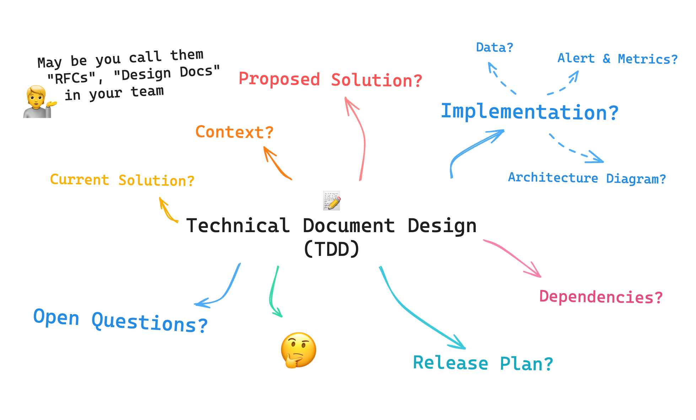

:::important
This article has been published at Substack. Read the full article there and to join the discussion.

[Read on Substack →](https://heyfirst.substack.com/p/done-on-paper-before-done-in-code)
:::

I learned a powerful practice when I worked at Unity, we called it the “Technical Design Document (TDD)”, not to be confused with test-driven development though.

Some companies may call it “RFCs (Request for Comments)”, while others shorten it to "Design Doc”. Usually, it pairs with the Product Requirement Document (PRD). Many tech companies use this approach because it solves many pain points. The meaning of these terms can vary widely, as every company has its own definition of how TDD or RFCs work. For us, we call it TDD because it captures what we intend.

In this blog, we will refer to it as “TDD”, and I’ll share my own version and key takeaways that I used at Unity and in other collaborations. So, let’s get started.

## What is TDD?
“TDD” or “Technical Design Document” is a practice where technical detail is documented first before starting to code. It helps us understand what, why, and how we’re going to tackle the requirement.

The main point is to put everything into a single document. This can be done using Google Docs, Confluence, Notion, etc. but for me, it is nice to use a tool that have collaboration features, like, comment, suggestion, tag team members.

> You may have heard of 'Architecture Decision Record (ADR)' as well. I would say TDD or RFCs are meant for collaboration, while ADR is meant to record the decisions already made.

## Meeting is not enough? Why Use TDD?

Meetings for technical discussions often end up being led by the person with the most context or the fastest thinker. This can make meetings ineffective because not everyone can contribute equally. This doesn’t mean others are less capable; they just need more time to digest the information.

TDD solves this by bring the problem and proposed solutions into one document at the very beginning. Participants can then contribute to the document over time.

We usually give 1 day to 1 week for team members and stakeholders to: thoroughly digest the context, understand its history and context, do some research or POC, and provide constructive comments.

If the requirements are complex, we might also have a short intro-to-requirement meeting.

This leads to more successful solutions.

## Benefits of TDD

* Equal Contribution: Gives everyone time to digest and contribute, regardless of their initial context or speed. This means that everyone, from new joiners to senior members, can collaborate effectively on everything.
* Asynchronous Communication: Meetings require everyone to be in the same room (or Zoom) at the same time. This allows team members to collaborate across time zones since you don’t need to be present simultaneously.
* Worklog: You write once, you don’t need to write it again. All information about context, implementation, decision, everything is there, helping new joiners onboard themselves easier and preventing the need to reinvent the wheel.

## Structure of a TDD
The format can vary depending on the project, but generally, it should include:

1. Objective/Impact: What’s the goal and why it matters.
2. Context: Current state and background.
3. Current Implementation: How things work now.
4. Proposed Solutions: Detailed solutions with pros and cons. Can be more than one.
5. Selected Solution: The chosen solution from the proposed options.
   1. Architecture Diagram: A picture is worth a thousand words, one diagram will tell people how this works in a glance
   2. Implementation Detail: information on how to implement in detail, including naming conventions.
   3. Data: Information about databases, messaging, cache, etc.
   4. Monitor/Alerts: Items you want to add to your observability platform.
   5. Test plan: Complex feature sometimes requires complex tests setup.
6. Dependencies: Service, team, or third-party dependencies.
7. Release Plan: Steps to implement the solution.
8. Open Question: any unclear aspects, questions, concerns or potential issues.
9. Appendix: everything else, meeting notes, references, something useful, etc..

For enablement, refactoring, or tech debt work, the format can be adjusted as needed. These 8 sections are usually enough for most projects.

## The Importance of Open Questions

This is a crucial part of the TDD. It helps uncover edge cases and limitations as teammates provide answers.

Open questions can be placed anywhere in the document, not just at the end. They might be under “Current Implementation” or “Release Plan”. The main point is to have a space for written down unclear aspects, questions, concerns or potential issues. And so we don’t forget it.

## TDD as a Worklog

One of the big benefits of writing TDDs I found is that, when we finish a feature or project and hold a demo session for the whole company, I can share the TDD link afterward. This allows everyone to read the history of the project as long-form content.

The TDD can become the worklog of each feature. If someone wants to understand what decisions were made and why, they can just read the TDD to understand the reason behind the decisions. This is also very useful for new joiners as well.

I also find this SUPER useful because it prevents us re-inventing the wheel. When every TDD is stored in one place (e.g., Notion), you can search (e.g., Notion Search) and research what actually exists in our company before starting something new. This can save days or even weeks by avoiding work that has already been done!

## Conclusion

TDD (Technical Design Document) or RFCs allow asynchronous, inclusive collaboration. They ensure everyone's thoughts and voices are heard, regardless of their speed, context, or timezone.

Additionally, TDDs serve as a valuable worklog, documenting the history of each feature or project. This helps new team members get up to speed and prevents the need to reinvent the wheel.

Lastly, by having all TDDs stored in one place, they become easily searchable, saving time and effort on future projects.

That’s how I do software engineering in my previous and current roles at Swarmia! 🧑‍💻