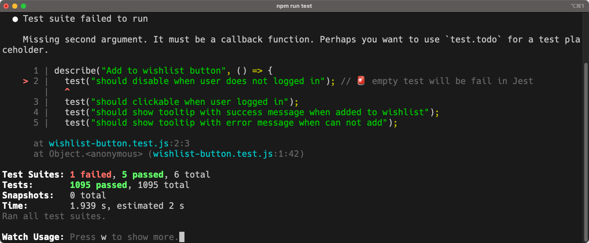
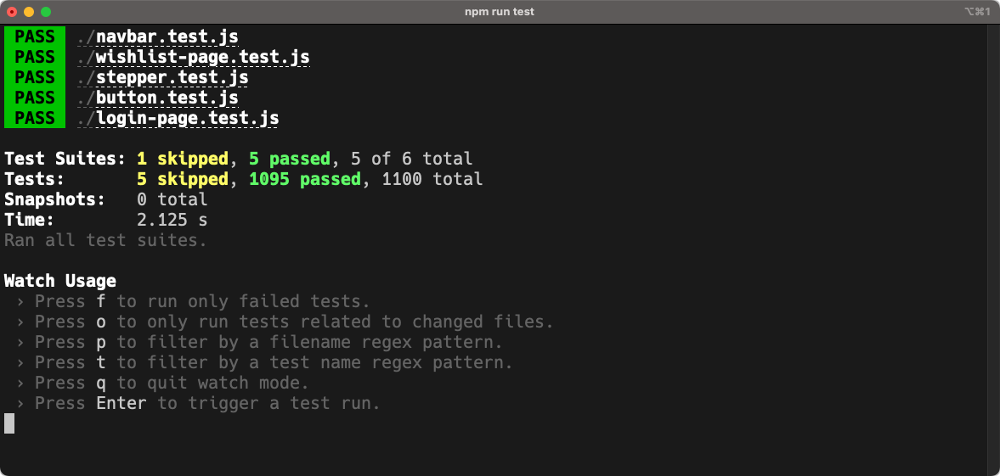

Heyo! I learn a cool thing when I do pair programming with my teammate. It's about writing Jest tests in a more make sense way.

Let's talk about it!

## Problem 🚨

Let's say, we have a **Add to wishlist** button component that will be disable if user is not logged in yet, and will be clickable when user logged in. then if user click a button, button will show a tooltips with **Added!** message and show **Try again!** when it's fail.

Now, you may have _4 testcases_ in mind. Imagine that you are going to **write test first** before write the components, and your simplest Jest test should be look like this below.

```js
describe("Add to wishlist button", () => {
  test("should disable when user does not logged in"); // 🚨 empty test will be fail in Jest
  test("should clickable when user logged in");
  test("should show tooltip with success message when added to wishlist");
  test("should show tooltip with error message when can not add");
  // I know this's impractical cuz' button component should be pure.
  // let's me explain further.
  test("should throw exception when can not add to wishlist", () => {}); // 🤯 pass but for what?
});
```



So, when you run this test suite, Jest will say fails to you because **empty test is a fail test**. But this is not a fail, right? We just want to take a note here! Even we have empty function in test, it's not help because Jest will show all green (for what!? 🤯)

In this cases we can fix with `test.skip()` which allow you to not run this testcase for now. **It's work!**

```js
describe("Add to wishlist button", () => {
  test.skip("should disable when user does not logged in", () => {});
  test.skip("should clickable when user logged in", () => {});
  test.skip("should show tooltip with success message when added to wishlist", () => {});
  test.skip("should show tooltip with error message when can not add", () => {});
  test.skip("should throw exception when can not add to wishlist", () => {});
});
```



But `test.skip()` is designed for skip running the test, but you don't want to delete this code because it's just temporarily broken for some reason, And you will look after somedays.

So! Let's talk about the `test.todo()` now.

## What is `test.todo()` 💡

Actually, this is **not a new thing**. the [`test.todo()` #6996 PR](https://github.com/facebook/jest/pull/6996) merged since Sep,
2018 and release at [Jest 24 Announcement](https://jestjs.io/blog/2019/01/25/jest-24-refreshing-polished-typescript-friendly#testtodo).
The idea came from [AVA](https://github.com/avajs/ava/blob/main/docs/01-writing-tests.md#test-placeholders-todo). But fews people knows this awesome thing.

I also know this since I use a lot of `test.skip()` for many years.

Well, Let's talk about how to use `test.todo()` is so simple. You just replace `test.skip()` with `test.todo()`.

```js
describe("Add to wishlist button", () => {
  test.todo("should disable when user does not logged in");
  test.todo("should clickable when user logged in");
  test.todo("should show tooltip with success message when added to wishlist");
  test.todo("should show tooltip with error message when can not add");
  test.todo("should throw exception when can not add to wishlist");
});
```

After you replace with `test.todo()`. the Jest console will show you how many `todo` in your entire testcases which separate from failed, passed, and skipped.


This is awesome right!?

<iframe
  src="https://giphy.com/embed/3ohzdIuqJoo8QdKlnW"
  width="480"
  height="222"
  frameBorder="0"
  className="giphy-embed mx-auto w-full"
  allowFullScreen
></iframe>

## When I use the `test.todo()`

Lets me tell you some usecases in my daily work.

1. When I start to do a task, I usually **write tests first** before code, So this is quite useful to help me remember what I plan to solve.
2. When I do **pair-programming with my teammate**, We are going to discuss about what we are going to solve today and we write down the `test.todo()` first before we start do pairing.
3. When I do not sure how to write the test at that time and I will figure out it in the future, I will use `test.todo()` rather than `test.skip()` because skipped tests were hard to discover and hard to track down. Sometimes, it was swallowed with others skipped tests.

For example, when I have to do **Add to wishlist** button component. When I pair programming or solo, I will write these testcases first, So I have a direction to go.

In case that, I am not sure how to `throw exception` in the component but I know this is a must have logic.

So I leave the `test.todo()` in testsuite and have a discussion with the team ASAP. Maybe? the team may suggest to move this test to container level, not in pure component.

🎉

Another real example, We need to test the component that appear difference between desktop and mobile, all testcases passed except the responsive because `react-testing-library` is not support `@media query` ([#113](https://github.com/testing-library/jest-dom/issues/113)). So we add `test.todo()` with TODO comment
and said that

```js
// TODO: As we know, RTL doesn't support media query, We may consider another way to test it or move it to E2E test on Cypress instead
// ref: #113 https://github.com/testing-library/jest-dom/issues/113
test.todo("should show 3 bullet in mobile");
test.todo("should show 3 bullet with description in desktop & tablet");
```

## Tips & Suggestion ✨

There have fews tips I use in the project. You may or may not know but I guess it's worth to share!

1. Install [`eslint-plugin-jest`](https://github.com/jest-community/eslint-plugin-jest/) because this plugin provide you a [`prefer-todo`](https://github.com/jest-community/eslint-plugin-jest/blob/main/docs/rules/prefer-todo.md) rule that will help you refactor your test easier.
2. There are still some issue that `beforeAll` and `afterAll` get executed if `test.todo()` is present in `describe.skip` ([#11006](https://github.com/facebook/jest/issues/11006))

## Conclusion

From what we learn here, `test.todo()` is a useful test helper which allow you to take like a todo or note in your testsuite.

Someone tell me about "todo comment"? Why don't we use it. I would said it also hard to track because it's just convention and also todo comment will visualize depends on IDE/editor you use. No official library/tools/cli. the built-in `test.todo()` would be a better choice for me.

I hope this will help you write the Jest test in much more make sense way which is also happened to me!

Hope you all enjoy with testing and may the test be with you!

<iframe
  src="https://giphy.com/embed/l1AsJoOWnvy0CuyFq"
  width="480"
  height="206"
  frameBorder="0"
  className="giphy-embed mx-auto w-full"
  allowFullScreen
></iframe>
