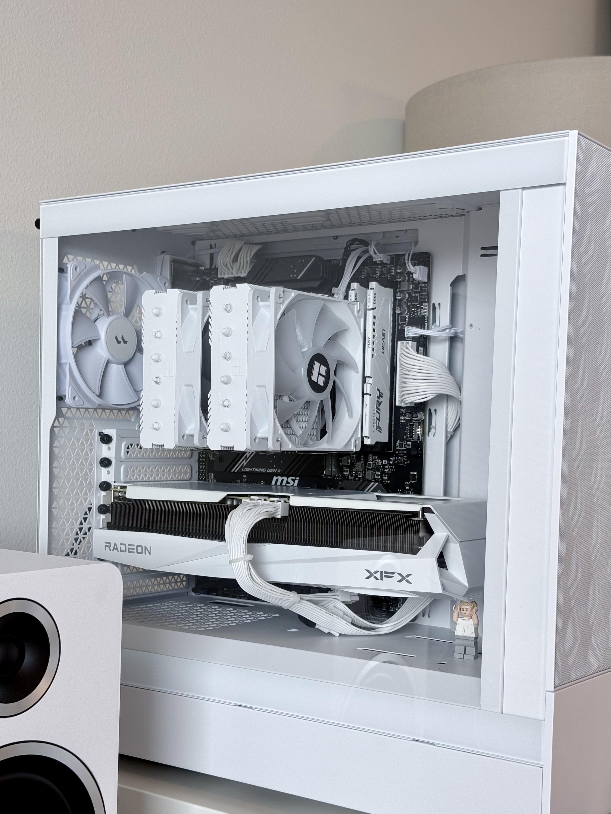

:::note
I also wrote about this story on [/r/radeon](https://www.reddit.com/r/radeon/comments/1mbd8eb/got_first_pc_in_my_life/) as well, but that one is for thanks the communities! I even get 400+ likes and many meaningful comments.
:::

## Prologue

When I moved to Finland almost 4 years ago in October 2021, I was really excited about everything as it was all new to me. First time living in a different country, thousands of kilometers from home (Thailand), but that excitement didn't last long.

In December of the same year, just 2 months after I arrived and started living and working there, I went through an extremely sad period (not sure if this was depression tho?). I was really unhappy and didn't want to do anything.

At that time, one suggested I maybe buy a Nintendo Switch — playing games might help a lot in Finland with this kind of depressing weather.

I ended up buying it, and that was the right decision! A 399 Euro Nintendo Switch OLED. That was the first time I was really into gaming. It helped me get through the brutal Finnish winter.

> a bit more context:
>
> I've been a Mac user since 2013, with a MacBook Air 2013, and ever since then, I never used Windows or played any games at all. Only coding as a hobby.

## Games I Love

Not just any game or competitive gaming — I'm a selective person. I used to read a lot back then, and when it comes to games that immerse me, it's the (J)RPG or story-rich games.

I worked at [Unity](https://unity.com) during that time in Helsinki, Finland. Everyone there really, really plays games. I got a lot of suggestions from colleagues, and there are 3 games that changed me forever:

1. Octopath Traveler 1 and 2
2. Witcher 3: Wild Hunt
3. Zelda: Breath of the Wild

They're ordered by my favorite games of all time, and they all started from this Nintendo Switch in 2021.

## Upgrade?

Fast forward to 2024-2025, there were more games I played, alone and with friends: the wave of Baldur's Gate 3, and recently, Clair Obscur: Expedition 33 (or E33), and Fortnite / Dota 2 with friends here in Helsinki.

Fortunately, GeForce Now allowed me to play these 3 games through my MacBook Air M1 on a 4K monitor with smooth 120fps.

But there's a downside to GeForce Now: It could play Baldur's Gate 3 very nicely as it's a turn-based game, but when it comes to E33 or Fortnite, a small input lag or network issue between me and the GeForce Now server could cause deadly penalties. Especially in E33 Act 3, where you're forced to "parry" only to win the game.

That's when I started thinking about upgrading, and you know what? PC wasn't on the list at all.

There were PS5 Slim Disc (519 Euro), Steam Deck (599 Euro), and Nintendo Switch 2 (569 Euro) on my list in March 2025. There were pros and cons for each one, but they were all affordable:

- **PS5** — They're powerful, ready to play at 4K/120FPS. I could be 100% sure that all games would work perfectly fine as they're optimized for this console. But I'd need to buy all the games I wanted again since some of my games are on Steam.

- **Steam Deck** — Good compromise. All my games are there, I have all communities, achievements, and more. But many recent RPG games won't be able to play _beautifully_ with Steam Deck due to its hardware limitations (of course, it's handheld).

- **Nintendo Switch 2** — At that time, we didn't know any details yet, but I thought I'd go with it because I had the Nintendo Switch OLED. But in the end, I didn't buy it on Day 1 even though I'd saved money for it 2 months before release. Same reason as the PS5 — it doesn't have all my games on Steam, or games I want to play.

On July 5th, 1 month after Nintendo Switch 2 was released, I went to one of our friend's housewarming party. After the party, that was the day I decided to buy a PC.

> At this moments, I play many games and I love many games so far including Personal 5 Royal, Xenoblade Chronicles 2 and 3, Chained Echoes, Zelda: Tears of the Kingdom, NieR: Automata, Sea of Stars, Unicorn Overlord, Death's Door, all the game I list here is my favorite games and they all have a really good story!
>
> Although, Octopath Traveler 2 is all-time my best and most-loved game 😬

## What? Where Did the PC Decision Come From? 😂

I had the same question too — why did PC come out of nowhere? It was because one of my friends who works at AMD also went to the housewarming party. He helped me walk through all PC hardware and helped me understand each part.

It felt like I was back 6 years ago when I first played PC in internet cafes. When I started playing Ragnarok and Pangya. Childhood nostalgia, right?

After that, I watched 20+ YouTube videos — many GPU+CPU combination performance reviews in real games. Until 3-4 days later, I found the good combination I wanted: AMD Ryzen 5 7600(X) CPU and AMD Radeon 9070 XT GPU.

This is for gaming and gaming alone. I do LLMs and AI stuff, but I mostly use OpenRouter for my side projects, so there's no need for an Nvidia GPU, which is 30-40% pricier with the same performance.

I planned to go with a white build as it would match the mood and tone of my room. But all white would be boring, so I tried to get all parts in 20% black and 80% white. The end result would be perfectly balanced.

The GPU was the hardest part because there are many manufacturers making them. I chose XFX because Redditors praised them (as well as Sapphire), and I got this XFX Quicksilver 9070 XT White Gaming Edition at a very good price (~650 Euro, originally 725 Euro). They're not pure white — there's some black color, which would be a good match in my imagination.

For the motherboard, I went with MSI B650 Gaming Plus WiFi as it has WiFi and Bluetooth modules. It works with my Logitech MX Master 3S (I use it for work but gaming too — it's fine), Nuphy Bluetooth keyboard, and 8BitDo Pro 2 Bluetooth Controller. And they're black and white colored too.

I also got a suggestion from a friend that AMD CPUs work well with 6000MHz DDR5 CL30 RAM, so I got Kingston Fury White because I think it's a good brand. Same with the M.2 SSD — WD_BLACK, as it's also a good brand.

The PSU (power supply unit) needed to be white so the cables would also be white. Lastly, for the CPU fan, I chose Thermalright Peerless Assassin 120 SE White as well.

Here's the end result — my current PC build:

And here's the list of prices for each component:

| Item                                                             | Price        | Seller                                            |
| ---------------------------------------------------------------- | ------------ | ------------------------------------------------- |
| Arctic MX-6 thermal paste, 4g + 6 pcs MX Cleaner cleaning cloths | 9.99€        | [verkkokauppa.com](https://www.verkkokauppa.com/) |
| Thermalright Peerless Assassin 120 SE ARGB, White                | 52.99€       | [verkkokauppa.com](https://www.verkkokauppa.com/) |
| XFX Quicksilver Radeon RX 9070 XT Gaming Edition, White          | 650.00€      | _special order_                                   |
| AMD Ryzen 5 7600 CPU (stock fan included)                        | 174.03€      | [amazon.de](https://www.amazon.de/)               |
| Thermaltake Toughpower GT 850W, Snow                             | 100.09€      | [amazon.de](https://www.amazon.de/)               |
| MSI B650 Gaming Plus WiFi Motherboard                            | 144.38€      | [amazon.de](https://www.amazon.de/)               |
| Kingston Fury Beast White DDR5 32GB (2x16GB)                     | 97.78€       | [amazon.de](https://www.amazon.de/)               |
| WD_BLACK SN7100 NVMe SSD 2TB                                     | 130.41€      | [amazon.de](https://www.amazon.de/)               |
| Fractal Design Pop Air White                                     | 85.31€       | [amazon.de](https://www.amazon.de/)               |
| **Total**                                                        | **1444.98€** |                                                   |

## Any Difficulties in Assembly and Setup?

Yes, there were quite a few, but not that hard. Thanks to many YouTubers, I successfully assembled everything without breaking any parts from all the tips I learned.

The difficulties came after assembly and installation, such as:

1. **CPU stock fan is terrible** — It doesn't cool down the CPU at all. The CPU ran at 70°C when idle, and when I started games, it hit 93°C within 5 minutes. I thought I installed it wrong, so I bought Arctic MX-6 to repaste again and again — 3 times! I almost gave up and returned the CPU as I thought it might be defective. Turns out it was the fan itself. After I decided to buy the Thermalright PA 120SE fan to replace the stock fan, my CPU never goes over 75°C and runs at 45°C when idle. Yeah, stock fan — you were the real culprit!

2. **GPU sagging** — The XFX GPU is huge by default, much bigger and heavier than other 9070 XT GPUs on the market. They provided an anti-sag bar, but unfortunately, the gap between the GPU and bottom of the case was small, so I needed to use Lego blocks to hold it instead. In the end, it works and gives some character to my PC too — I like it!

3. **MSI Motherboard driver installer** — It comes with a one-time driver installer software that, if you accidentally close it, will never show up again. This happened to me when I was installing many programs and drivers at the same time, and I accidentally restarted the PC while driver installation wasn't finished yet. I had to clean-install Windows once again to get the MSI driver installer to work 😂 For this PC build, I clean-installed Windows twice!

4. **Cable management** — It's a love-hate relationship. I love my current cable management, but it's never-ending. After watching other YouTubers, I redid cables 5 times in total, cutting lots of cable zip ties. But in the end, it was worth it.

5. **RGB situation** — I initially didn't want RGB fans because they're a waste of money, but the XFX Quicksilver GPU has a white light in the XFX logo that needs to be unplugged manually, and the Thermalright PA 120SE comes with ARGB fans. Now I need all fans to have ARGB 😂 This will be my next upgrade with good cable extensions and cable combs!

## Am I Happy or Do I Have Regrets About This Decision?

I'm definitely happy with this build! It allows me to play all the games I want, and now I'm exploring many games in 4K at 120-240Hz. I even replayed Octopath Traveler 2 on PC because it can run at 4K with 120Hz, so all the skills and effects look absolutely amazing.

I'm currently playing Ghost of Tsushima — a breathtakingly scenic game that's become my favorite of all time. It's like Witcher 3 + God of War (I played it for about 20 minutes on PS5 at the Unity office a while ago), and it's huge!

So overall, it's been a good decision so far 🙂

I wanted to write this here so I don't forget this experience. It's meaningful and fulfilling. This involved lots of friends in Finland and Thailand who helped make this possible. Thanks, everyone!
