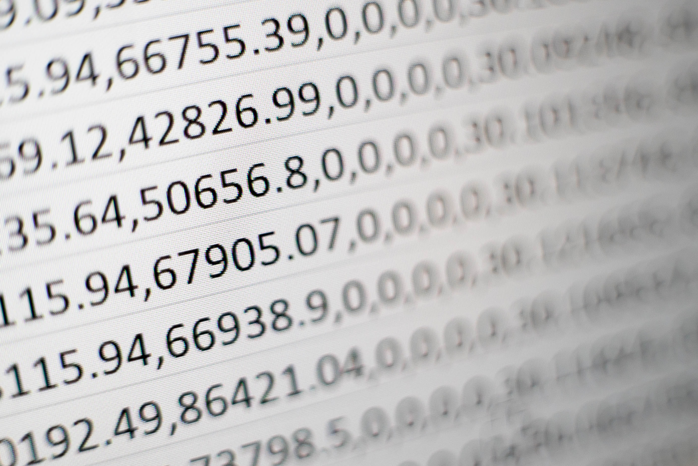

The easiest way to deal with decimal number in our application is "multiply by 1,000,000". such that using 6-digit decimal you won't make a mistake.

For example:

- USD$1.23 = 1230000 micro USD
- USD$0.01 = 10000 micro USD

I termed it the "micro-dollar," and we use this approach in almost our services, messaging, contracts as a standard for all monetary values.



## Why micro-dollar?

The benefits of this micro-dollar strategy are numerous. The advantages of this were stated in one of [Stackoverflow's answers](https://stackoverflow.com/questions/15726535/which-datatype-should-be-used-for-currency/51238749#51238749).

- Simple to use and compatible with every language.
- Enough precision to handle fractions of a cent.
- Works for very small per-unit pricing (like ad impressions or API charges).
- Easy to maintain accuracy through calculations and apply rounding at the final output.

Google are using this approach too (see in the [Google Standard Payment doc](https://developers.google.com/standard-payments/reference/glossary#micros))

> Monetary values in this API are represented using a format called "micros", a standard at Google. Micros are an integer based, fixed precision format. To represent a monetary value in micros, multiply the standard currency value by 1,000,000.

## How should it be implemented?

The two main things we do are.

1. In the application or service level, Use `microdollar` as a default, set an agreement between services and use it end-to-end. You may store these monetary values as `bigint` in database.
2. In User interfaces only, we do convert from the micro-dollar to the decimal dollar format. Only user need to see the actual value.

Yes! In UI, we may easily create a `utils/microdollar.js` that contains 2 functions.

```js
export const toMicrodollar = (dollar)
    => dollar * 1_000_000;

export const fromMicrodollar = (microdollar)
    => microdollar / 1_000_000;
```

You can add `Math.round()` or `Math.ceil()` as a safety net too.

## One caution in Javascript

According to [mozilla.org reference](https://developer.mozilla.org/en-US/docs/Web/JavaScript/Reference/Global_Objects/BigInt),
JavaScript itself supports integers up to 9,007,199,254,740,991 which is `Number.MAX_SAFE_INTEGER`. As a result, you should be aware that the maximum with Javascript and the micro-dollar approach is $9 billion, or roughly $9,007,199,254.

When you calculate this in as well, the outcome shouldn't total more than $9 billions.

The `bigint` are probably much more than that in other languages. Particularly, Golang's "big" package has an almost limitless 😂
