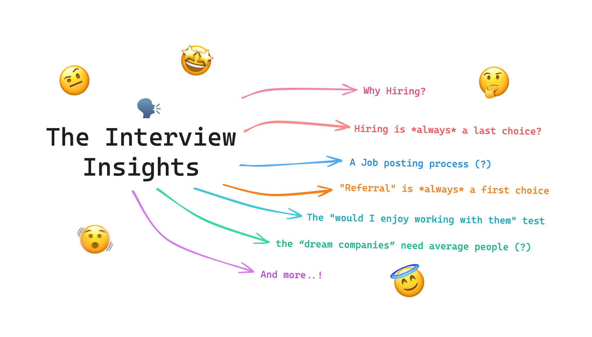
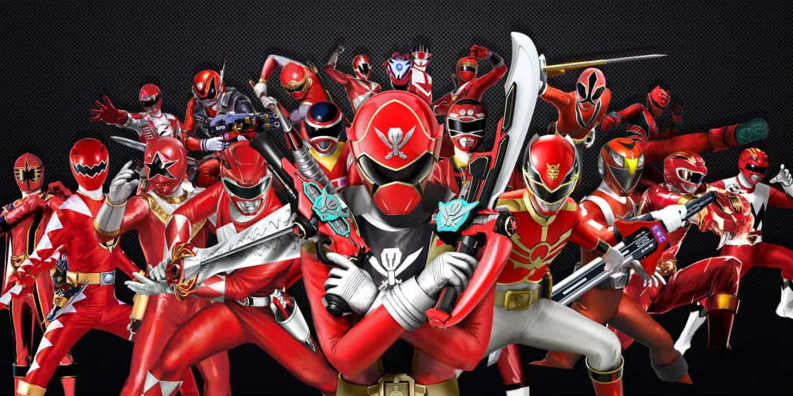
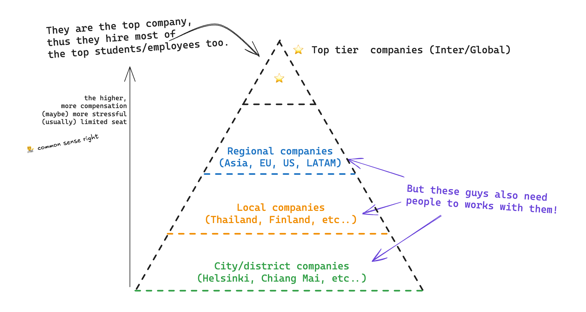

When we search for interviews, people suggest how to prepare a resume, how to get picked up by a recruiter, how to prepare for an interview, what is the STAR method, or in the software engineering world, what are the most asked leet code questions. These are the most common you may find online, and I think they are useful.

But is this really what the hiring manager is looking for? What an interviewer is looking for when they interview you.

Let me share some thoughts from my own experiences. The experience from another side of the chair.

First, Let’s go back from the root of all,

## 1. Why do Companies Hire in the First Place?
Behind all the job posts, there is always a “business needs”.

You need to remember this at all cost, when a company start looking for someone, it’s not a charity, they don’t give out money. they have A REASON. And hiring is not the first choice, and it’s almost always the last choice. That’s a fact.

Companies typically hire when:

* There's a skill gap that the current team can't fill.
* Workload exceeds current capacity (and can't be automated). This is important. Because companies always try to automate every single problem first.
* A new project/initiative requires dedicated ownership — a new team for a new thing; they may split the current team into small ones and hire more to fill in.
* The business is expanding into new markets/products — they need someone who will expand it while the current team can focus on what matters most.
* A team member left a company and created a critical vacancy. — This is also an important one; it creates a significant gap in the team's capabilities and affects ongoing projects or upcoming projects.

As you can see. There is a business need behind every single job post. And more than that, they also need to have a “budget” for it. We will talk about it later in this article

Now, let’s talk about a related topic from above, shall we?

## 2. Why hiring is almost always the last choice?
Hiring is expensive and risky, Think about how much a company need to spend time on this?

**Short Answer: The recruitment process, onboarding, salary, benefits, equipment, and especially the time spent.**

When hiring someone, many people need to do preparation and interviewing. In the software engineering world, team leads, or developers need to interview if it takes 1-2 hours of interviews + 1 hour for evaluation. They might be able to finish a small amount of work already with that time spent.

If the hiring does not go well, Well, that’s a waste of time (and money). Even worse, if the company hire the wrong or unfit person for the team, that’s a waste of time and money, and the current team might leave the company, too.

That’s why most companies try everything else first: redistributing work, automation, contractors, consulting or even dropping lower-priority projects.

Now that we understand what’s the reason for hiring, let’s go through the process of job posting

## 3. A Job posting process

We see “business needs” in (1) and (2). Now, let’s discuss how the business problem turns into a job post.

Enterprises or big companies usually have a **“budget”** and **“headcounts.”** Every year, they may give a “budget” to each team, which depends on **“business needs”** and the impact the team created.

If the team proposes a good impact on business needs, then the team will get money. They can decide what they are gonna do with that money, to promote current team members, buy more tools or software that help them automate, or the last choice we talk about.. hiring new people for their team.

Say easier; the team lead or manager usually proposes that they need 1-2 people on their team, gives the why to high up, and once they get approved with “budgets,” they can start working with HR to draft a job description. You need to understand here that they already have a budget for that position. That’s how salary comes.

In a small company or startup, the process is much faster from business needs to job posting because there is less hierarchy by nature. Usually, the business needs are just so obvious that “yeah, at this point, we need more people,” but they carefully hire people that are enterprise.

> 💡 Why a good Startup or SME are really careful in hiring new team members?
>
> It’s because they are small, and one person joining the team can affect a lot. One person not only brings expertise but also personality, background, and know-how, and it can affect greatly or badly to the team, and in this case, since they are small, it can affect the whole company. which means it’s super risky.
>
> So it’s better to be safe than sorry.

But that doesn’t mean the enterprise doesn’t care about hiring new team members. They care, and they care most that new team members must be able to work nicely and seamlessly with their team.

When I say nicely and seamlessly, it includes technical skills, yes, but also personality and background, or so-called attitudes and soft skills, that need to be matched with the team, too.

Like the phrase, “If you want to go fast, go alone, but if you want to go far, go together.” Managers are responsible for making sure the team can focus on work 100% and seamlessly; new team members MUST be able to join a ride with ease and no conflict

That’s why we talk about “referral” next,

## 4. Why “Referral” almost always be a first choice when hiring
Isn’t that obvious? the company wants someone to be able to work seamlessly with current team members, both technical skills, soft skills, and attitudes.

And if you have 3 constraints here.

1. You need to spend less time on hiring since it costs the company every second you spend hiring instead of getting the job done.
2. You need to make sure candidates are technically great enough for your team
3. You need to make sure candidates are a good fit for your team.

Then, “referral” from someone inside, from someone who knows how’s the team doing, how’s the work looks like, and how’s the vibe in the company feels. This is almost a low-hanging fruit for a company.

On the other hand, If they need to check 100+ resumes, have an educated guess from the resumes, or set up a phone screen interview to ensure everything is the same as written in the resume, that’s already lots of hours of work.

>💡 You may know a person called a “head hunter”; they also play an important role in this step; when the company has good headhunts, who knows exactly what kind of person the company wants? they will
>
>In return, headhunters will get 1-3 months' salary for candidates who pass and finally join the company, which is a lot of money if you see from candidate’s POV.
>
>That’s why some companies provide a “referral program.” Instead of giving money to head hunters, they give it to their employees.

But to be honest, it’s really, really hard to be a head hunter. They collaborate with candidates, give guidance, and even negotiate the salary for candidates, too. They deserve it, and it costs nothing to you. It costs the company, and if the hiring is a “success,” everybody wins! as everyone gets what they want!

So, from this point, you may know now why “referral” is important and crucial in the hiring process. Companies need the fastest way to get great and good-fit people; it’s not their job to do a charity and try to interview as much as they can; they hire people to get jobs done and then make money.

Hiring is on the opposite side; no works get done, and even when the interviews are done, they lose more money.

Before we all lose hope, let’s jump to the next topic.

## 5. What Really Gets You Hired
Everything you know above is a truth of reality; you can not avoid it, but you now understand the reason and process behind the hiring. From this point, you may think, “What could I have done to reduce their time spent, load, and stress?”

If you can make anything above faster or easier for a company to decide to hire you, that’s all mandatory. and that’s all about the interview preparation you found online.

Prepare a resume to be easy to read, one page, how to answer like the STAR method to get to the points as fast as you can, how to introduce yourself in a short paragraph so you can have time to talk about the roles and business needs, and lots more you can find in the internet nowadays.

But in this article, let’s discuss what they usually don’t include then.

### 5.1. The "Would I enjoy working with them" test
This is one question that all interviewers (including me) ask ourselves all the time when doing an interview. Not all the greatest engineers are easy to work with, and all business problems don’t need the greatest engineers.

We may want the person who makes us feel so nice that we want to work with them every single day from now on.

> 💡 Wait? Then what’s the point of evaluating technical skill?
>
> Yes, the interviewer still evaluate technical skills, and they are the most crucial ones, but they also want someone who has the same attitude and can work nicely / seamlessly with our team.
>
> That’s why some companies will have a team interview round, where candidates will meet with the team and discussed
>
> e.g. I interviewed at Unity.com in 2021 and in the team interview round, there is 8 people in the Zoom, they all questions me back-n-forth for 1:30 hours. Even one who is silent in Zoom, takes notes and also evaluates my personality.
>
> So do I, I also try to capture all the smile I have when I answer, if someone smile, then I can assume, I answer in the way they like. Yay! (a bit optimistic I know 😂)

### 5.2 Red flags that override technical excellence

There are some common red flags, and they are not necessarily true in all companies, but I could share some that I have experienced myself.

1. Lies — Yes, One lie the interviewer detected will blow the interviews and immediately get a red flag.
2. Inconsistencies in their story — Almost the same as above, e.g., details that don't add up about the experience. That could mean there is something candidates don’t tell us, and sometimes the interviewer might give a red flag on that.
3. Poor communication—If you can’t explain things well enough while interviewing, the interviewer can not truly evaluate you either.
4. Arrogance — Dismisses others' ideas or can't admit when they don't know something; if someone does that in interviews, it usually means you disrespect the interviewer, and you may, also will disrespect them when working together, too
5. Inflexibility—Some candidates show they are good at some tools or techniques, but their skills do not match those in the company. Then, candidates show they are not comfortable doing it without even trying. That might be a red flag, too, because even when they join, they might not happily working with us.
6. Negativity — The job is already hard, and the manager doesn’t want more people to throw gasoline on the fire.
7. Misalignment with company values — That might be a yellow flag because it also means you might not stay long (we will talk about it in the next one), or you might not be happy with our culture or our goal. Maybe it is good for both of us not to work together
8. Misalignment with a business needs and job description — This is not an immediate red flag if you really did an awesome job in the interview; the company or manager may try their best to get you in even if you didn’t fit with the role

### 5.3 A Red Power Ranger
A bit optional, but I have seen some examples of these, so it’s good to mention. Companies don't always seek out a "Red Power Ranger" type of personality. While many of these individuals are natural leaders who work hard (often putting in overtime) and take the initiative, they can sometimes unintentionally overwhelm the team.

Here are a few ways this can happen:
1. Become too controlling or micromanage their teammates, which can stifle creativity and independence.
2. Taking on lots of responsibilities might create bottlenecks, slowing down the team's overall progress.
3. Push their teammates too hard or set unrealistic expectations, leading to burnout.
4. Feel frustrated when others don't match their pace or level of intensity.

While having such traits can be beneficial in certain roles, it's crucial for these individuals to be self-aware to avoid these pitfalls.

In interviews, they often show confidence and capability; however, hiring managers will assess whether they can genuinely collaborate and support others effectively.

So, instead of always trying to be the "Red Power Ranger," focus on being a good collaborator and matching the team's energy.

they are great, but if energy overwhelms current team members, that might be not good.

So, these 3 things are really important in my opinion. Essentially, make sure you are nice and do not introduce any red flags. That would usually get you in the position where you can show 100% of your ability, skills, and personality already. And from that, it’s all up to you to get the job.

Now, let’s talk more about the company ecosystem. It would help you understand when researching a company; this is also a crucial point for when you should apply the company

## 6. How Does Company Size Affect Hiring?
Companies of different sizes are in different stages. Some are startups with a small group of people, some are SMEs, some are breakthroughs and enter enterprises at the country or regional level, and some are the highest-end enterprises at the global level.

They also have different needs in different stages, and let me explain why it’s important in interviews and actually, it will help you decide when you should apply to the company.

### 6.1 The pyramid tiers of companies

You need to know that the top-tier company in your city is also known as the one that hires the most from top universities. They get the cream! All the cream will always be there.

But what about other companies that are not in the top tier? The ecosystem is everyone. We have a top-tier company that operates globally, a mid-tier company that operates regionally or at the country level, and some local or city-tier company that serves local customers. They all play a role in our society.

And yes, they all need someone to work with them. If you only look for only top tier companies and always fail, it’s okay to build up your profile from the ground up,

Who knows? If you work with SMEs or Startups for 1-2 years, they might profit 10x or even 100x. Even if you go to a big tech company, their stock price could go down 80% after you join as well.

It’s about your journey and experiences, not about the company profile you should look for.

> 💡 A fun fact: LinkedIn Jobs are actually sometimes expensive for small companies, and that’s why they don’t advertise there. Most companies, especially local ones and good ones, only post on their job board on their website.
>
> Another reason is that when they post on LinkedIn, they often receive a large number of applications. For Startups and SME that don't have a dedicated recruiter team, this can make the hiring process a bit overwhelming. Reviewing so many resumes can take a lot of time!, like we mentioned in (4)
>
> And yes, most of them always try to find from a connection first because it’s cheaper in the way of time-consuming. That’s why many small companies don’t say they are hiring out loud at first. it’s just a lot of noise for them to screen out.

### 6.2 Peak time and downtime of the company
A company has “a bar” or a ruler to evaluate candidates, and those can be harsh sometimes. For example, a big tech company has a really high bar. You may need to be a genius or from the top-U to pass the interviews. However, there is another factor that changes this formula.

When they are in peak time, for example, they went public, got funded, made a ton of profits, and had a really high stock price. This is actually a good time to apply because they have a “budget” to expand their team (and you can know that). The bar will lower significantly most of the time.

The same goes for when they are in downtime. They will do a hiring freeze, lay off some people, and, if they are a big company, still hire at this point. But “the bar” will be set really high. Candidates must perform so well that they want to invest in you.

This formula could also apply to smaller companies, but it's a bit different. Smaller companies tend to only hire what they need. When they are in peak times, they will start hiring more for certain positions, but when they are in low times, they won’t be hiring anyone.

These information above could tell you why some big companies always have a position open all years, despite low or peak times, because they just raise or lower “the bar,” while small companies either stop hiring or start hiring.

> 💡 When you start looking for a job, if you don’t have a company in mind,
>
> Check out Crunchbase.com, an Investment platform, online newsletter or local startup hub, to see if some recently got funded or which stock performed nicely.
>
> In my opinion, this is often a much better indicator of who is hiring than LinkedIn, or Indeed.

### 6.3 Long-term potential vs. immediate capability

Companies in different stages also have different needs as well. Non-startup companies and big tech companies will essentially start hiring more for junior positions and open internship programs. Here’s why

1. **Cost-effective:** it’s a fact of the universe that interns or juniors is lower cost than seniors, in the meantime, but they require more guidance.

2. **Long-term potential:** with the right push from the existing team, seniors, and the company, they will become the most powerful team members in the near future.

This is also related to the company stage. As common sense suggests, when big companies are at their peak, they will invest more in people so they can ensure sustainable growth.

But in a big company's low time, they tend to aim for “immediate capability” to help the current team build up the product and make more profit.

> 💡 Why do I use the word “aims”, not “wants”?
>
> Actually, the truth is a company needs a person who has “Both” long-term potential and immediate capability. You, as a candidate, need to show that you have both to always get hired.
>
> But they may shift priority on one thing over another, depending on what they needed at the time.

Also, this is different from a startup. A Startup tends to use the smallest group of people to solve business needs. The smaller the group, the lower the communication cost, and they can focus more on developing the product to its best.

Therefore, in the startup stage, they mostly hire people aiming for “immediate capability” first, followed by “long-term potential” most of the time.

## 7. Why even “dream companies” need average people
This topic is crucial for someone think you are imposter syndrome, I think it’s a crucial knowledge I learned back when I worked at Thoughtworks in 2018.

Company does not necessarily hire only top talent people, they hires all kinds of people, including averages one. And here’s why:

1. T**he company knows that top talent is hard to maintain** — They pursue the best, the best work, the best compensation, and their own goals. Finally, they will leave the company.
2. **Companies need to stay operating for a very long period of time** — they need someone who takes ownership, holds the company's know-how, and is able to pass down the context and knowledge to new joiners.
3. **Business needs doesn’t necessarily hard or complex in technical** — they can be easy but have more step or workflows, those does not requires genius, they may requires other skillset instead, e.g. a person who rather thorough, percise or detail-oriented.

Therefore, if you have imposter syndrome, think that you might not be good enough for this or that company. I strongly suggest you try to apply for your dream, Read the job description, apply for a job, go through the phone screen interview, and discuss what the company actually needs from this role.

From my own experiences, I can confirm that you were surprised to learn that you are actually qualified for a lot of role.

Again, Most companies don’t always need genius-level people, and most of the time, they want only a person who can solve business needs. 80% of business needs don’t require genius either.

> 💡 Fun fact: one of a former VP at Unity Ads once shared his thought that during his visit to Unity Finland, he revealed that the job description of a CTO or Engineering leadership position is fundamentally simple: it is to retain top talent.
>
> By keeping them engaged, happy, and inspired, lowering their blockers, and clearing the path, they will enjoy their work and create fantastic things together. 🚀
>
> And he really means it! Though I just joined a few months ago, every one of his sessions is so inspiring, regardless of their level. Me and my teammates, we enjoyly working under him so much.

## 8. Turning Insights Into Interviews

Alright! It’s time to turn everything we talk above into actionable items.

Start by researching the job and the company. You may start with what your current competent, what kind of role you are looking for, and what kind of company you are looking for,

Then, start researching the company. It's better to find it from other sources than LinkedIn or Indeed. You may list all companies that interest you first. You check their performance in the last quarter or last year. Did they recently make a profit or pass any funding round? If they do, soon they might open some positions on a job board.

Start looking at the networking event meetups, and getting to know people are also most important,

Learning in public or sharing your work in public is also a good tool. It makes it easier for someone to understand your hard skills. Writing a blog to log what you have done is actually good.

All of the above give you an advantage in the interviews,

1. You know that the company has a “budget”, you know the stage of the company, you may also know their problem from details in the job description
2. You reduce their X by providing solid proof of work (blogs, posts, GitHub, etc..) that lets them know you have good technical skills already and are ready to work. — shows them you have “immediate capability”

Then, when you get the interview round, you can go straight to the point: what is actually a company problem they want you to solve? If they are aligned with your skills and your own goals, the technical skills have already been passed.

The next step is evaluating the attitude and personality of the team and you. Not only will the team or manager evaluate your personality and attitude, but you also need to evaluate. Question them about what you care about.

You won’t get a bad answer here; most interviewers will say a good thing almost always.

In my suggestions, you just throw the harsh question that they can’t easily ditch it e.g. What is the thing you don’t like the most”

> 💡 A Good answer from my previous senior at a tech consultancy firm, Thoughtworks, once said an honest answer ever in my career life.
>
> I asked him, “What is the bad thing you don’t like about working in this company?”
>
> He said, “This isn’t necessarily a bad thing or things I don’t like, but we are a consultancy company. Customers come to us because they have problems, either technical problems, staffing problems, management problems, or process problems. You should expect that things won’t be simple or easy here; there are some problems there, and we, consultants, will help solve them. Sometimes, you might not love it, and you need to live with it every day when working there.”
>
> He also says: “So, I like solving problems, but at the same time, I’m tired of process/staffing/management and political problems on the customer’s side. It’s a tradeoff for the chance to work on something impactful. It’s sometimes a love-hate relationship for me”
>
> I love that he’s being honest, many interviews I had they only told about good things — that’s why I down with them and end up working there for 3 years.

Once again, before we end this article.

_“Hiring isn’t a lottery. By understanding the company’s why, you can become their obvious choice.”_

---

This article was inspired by my countless discussions with friends both in Finland and Thailand about the challenges of finding jobs from 2023-2025, especially for new graduates. I hope these insights help you navigate the hiring process with confidence.

As a 28-year-old software engineer with experience in three companies, one from Thailand and two from Finland, I’ve shared what I’ve learned. While I may not have the perspective of actual founders or company owners, as they might have deeper contexts and knowledge than mine, I hope this article covers all the essentials.

If you see something I might miss or have any suggestions, please let me know or comment down below 🙂

I’d also appreciate it if someone could share more stories about these “stories from another side of the chair” too 😃