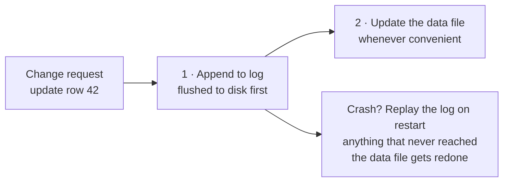
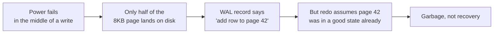
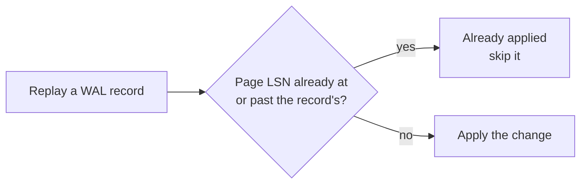
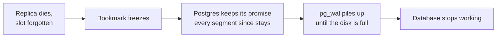
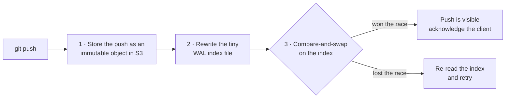

We were talking at the office this week about [Cursor's post on hosting Git at any scale](https://cursor.com/blog/git-at-any-scale), and one line stuck with me:

> The core primitive behind it is a write-ahead log, which we store in S3-compatible object storage.

Hmmmm, a write-ahead log. I know Postgres has been doing this since forever. And now it holds up Git hosting for millions of repositories.
So I spent an evening reading about it again. This post is my note to relearn it.

## The one-line idea

**Before changing stuff, write down what I'm about to do first.**

That's the whole idea. Simple as that.

Say I'm deploying a new app on my homelab: pull the image, run the db migration, repoint the proxy, restart. Halfway through, my SSH session drops. Did the migration run? I'm reconstructing what past-me did five minutes ago.

Instead, I write each step down _before_ I run it, "running the migration now", then run it. Session dies, I read my note, and I know exactly where I was.

That note is the write-ahead log. The "ahead" part is the whole point: the line goes down _before_ the real change, not after.



## It's not only about safety

The log is not just for safety. It also makes the database _fast_.

So now my data lives in pages scattered all over a file, and one transaction might touch a handful of them. Flushing all of that safely on every commit means many separate writes, right?

What if we use an append-only log? One file. Always write at the end. So a transaction commit becomes: append a small record, flush it, done.

Now it's one `fsync` (the "really write to disk now" call) instead of many. 10 transactions committing around the same time can share a single flush. Postgres calls this [group commit](https://www.postgresql.org/docs/current/wal-configuration.html). So 10 commits cost about the same as 1. The data pages get updated later, in the background, in bulk.

Log now, apply later. That's durability and speed, not just a safety net anymore.

Clever hah?

> "What is the data page?"
>
> A data page is the fixed-size block a database does all its I/O in. Postgres uses 8KB pages, and every row lives inside one.
>
> Updating a row means reading that page, modifying it in memory, and writing the whole page back later. So a transaction touching rows on 5 pages means 5 scattered writes. That is exactly the cost the WAL collapses into 1 append.

## The rule that makes it work

The log record has to physically hit the disk **before** the data page does.

If we break the order, the WAL is pointless. We get a half-baked data file, and no note explaining what was supposed to happen. That is worse than not having a log at all. Because now I think I'm safe, but I'm not.

The Cursor blog says one of the rules like this:

> We never acknowledge a push until it has been fully persisted.

There is one more subtlety inside that rule. Replaying the log is called **redo**. And a page write can be **torn**:



So Postgres goes further with [`full_page_writes`](https://www.postgresql.org/docs/current/runtime-config-wal.html#GUC-FULL-PAGE-WRITES):

- Right after a checkpoint, the _first_ change to every page writes the whole page image into the log.
- Later changes to the same page can be small diffs again.
- It makes the log fat right after a checkpoint. That is one reason checkpoint spacing is a tuning knob.
- But it is what makes "replay the log" actually sound.

And how does replay know what is already applied? Every WAL record and every page carry their position in the log. The **LSN (Log Sequence Number)**. During redo, Postgres just compares the two:



A position check, not a transaction-ID check. Remember this trick. It comes back later in this post.

## The checkpoint

If I keep appending, the log grows forever. Not ideal. So once in a while, the database marks a point: "everything up to here is safely in the data file now, these log records are not needed anymore". Then it truncates or recycles them.

That's **the checkpoint**.

One thing worth mentioning: "recycled" only happens once nothing still needs the segment. And it's not just the data files that need it. A lagging replica, or a failing `archive_command`, can pin the log in place:

> "What is the replica?"
>
> Two or more Postgres instances. One stays a live copy by replaying the log as it arrives. It's for availability across zones, or just for read scaling. In this context, the replica marks its position in the log with a "replication slot". A bookmark telling the main server: "don't recycle the past yet, I'm still reading!"

If we kill the replica and forget to drop its slot:



The checkpoint trims the _head_ of the log. But anything pinning the _tail_ wins. This is the classic "the log grew forever anyway" incident.

It's the piece everybody skips when they build this pattern themselves. I haven't had to handle this myself yet. But it's worth learning anyway.

## We use it everyday

WAL is in our everyday life more than we notice.

- **Postgres**: the `pg_wal/` directory. As we mentioned above, Postgres uses WAL to feed replicas and for point-in-time recovery. We can ask it to replay up to 3:45pm yesterday. Just like that.
- **SQLite**: `PRAGMA journal_mode=WAL`, and the `-wal` sidecar file next to the database. Most people flip this on because readers stop blocking writers, without ever asking _why_. So now we know!
- **ext4, NTFS**: I was surprised too when I learned this. They call it _journaling_, but it is more a close cousin than the same thing. By default they journal filesystem _metadata_, not file contents. So what we get is "the filesystem stays consistent", not "our data survives".
- **Kafka**: fundamentally a distributed write-ahead log. Consumers basically read the log directly.

## How do we use WAL in daily life?

WAL is a concept we usually see at the library or database level, deep down. But that does not mean we cannot apply it ourselves, right?

And we might be surprised that this kind of pattern already exists in the normal application level. Same shape but different name. We might already use it too.

At the app level, the "crash" can be many things:

- A process dying.
- A pod getting evicted.
- A timeout.
- A 500 on the request.
- Something lost on the network.
- Or an OOM (out-of-memory) kill.

### First, what "durable" means

Durable means: **it survives the process dying right now.** Not "I called the function". The bytes are somewhere that survives a hard power loss.

The trap is all the layers that _look_ durable and aren't:

- A variable in memory → gone on crash.
- An `INSERT` sent, transaction not committed → gone.
- Written to a file, sitting in the OS page cache → still gone on power loss. `write()` returned, but the disk never saw it.
- `COMMIT` returned successfully → durable. The database did the `fsync` for us. (Pedantic, in Postgres: true as long as nobody turned `synchronous_commit` off.)

For application code: **durable means the database transaction committed.** Until `await tx.commit()` returns, we have nothing. That's the D in ACID.

> Q: ACID what?
>
> A: Atomicity, Consistency, Isolation, and Durability

This is why the WAL rule is "the log entry must be durable before the side effect". It's not _before_ in the order my code reads. It's before in the order things land on disk.

### The problem: dual writes

This is when two systems cannot share a transaction. (Two-phase commit exists. But nobody actually reaches for it, least of all against someone else's API.)

```ts
await db.orders.update({ where: { id }, data: { status: "shipped" } }); // system A
await slack.chat.postMessage({
	channel: "#fulfillment",
	text: "Order shipped",
}); // system B  ← crash here
```

Two independent failure points, no atomicity. The order says `shipped`, but the #fulfillment channel never hears about it. Nobody packs the box, nobody ships it. Nobody finds out until the customer asks us where the order is.

We cannot reorder our way out of it either. Swap the two lines, and the bug just moves. Now we announce a shipment we never recorded. 😂

### The fix: make it a single write

We can't make 2 systems atomic but we _can_ make 2 tables **atomic**.

```ts
await db.$transaction(async (tx) => {
	await tx.orders.update({ where: { id }, data: { status: "shipped" } }); // ← system A
	await tx.outbox.create({
		data: { channel: "#fulfillment", text: `Order ${id} shipped` },
	}); // ← push to the outbox
});
```

Both rows now live in the same database. One `COMMIT` makes them atomic.

```ts
// Somewhere: the relay worker, on a cron.
const rows = await db.$queryRaw`
	SELECT * FROM outbox
	WHERE published_at IS NULL
	ORDER BY created_at
	LIMIT 100
	FOR UPDATE SKIP LOCKED`; // ← keyword

for (const row of rows) {
	await slack.chat.postMessage({ channel: row.channel, text: row.text });
	await db.outbox.update({
		where: { id: row.id },
		data: { published_at: new Date() },
	});
}
```

- `FOR UPDATE` takes a row lock on everything it selected.
- `SKIP LOCKED` makes a worker that hits an already-locked row skip past it instead of waiting.
- Two workers polling at the same moment each get a different batch. No duplicates, no double publishing. (Run the poll inside a transaction, or the locks release before we publish.)

One more trade-off worth naming. `SKIP LOCKED` gives us at-least-once delivery, not _ordering_:

- Two workers running in parallel can publish out of order. The ping for order 42 might land before order 41.
- For notifications, that's fine.
- For anything order-sensitive (payment events, state transitions), serialize per entity, or rebuild the sequence on the consumer side.

| Where the crash lands  | Dual write                       | Outbox                                      |
| ---------------------- | -------------------------------- | ------------------------------------------- |
| Between the two writes | Message lost forever, no trace   | Row sits unpublished; next poll picks it up |
| During the publish     | Half-sent, unknown state         | Relay retries until it's marked             |
| Delivery guarantee     | Best-effort: messages can vanish | At-least-once: messages can duplicate       |

We didn't remove the risk, we moved it. The new failure mode is duplication, not loss. The relay might post, then die before marking the row published, and post again.

So the receiving end has to be **idempotent**. A Kafka consumer dedupes. A Slack channel just sees the ping twice. The order here is deliberate. Mark first, and we trade duplicates for losses. And loss is the one failure we cannot recover from.

(And if polling a table offends us, there is another way. Tail Postgres' own WAL with logical decoding. Debezium, essentially. Lower latency, but we couple our delivery pipeline to database internals. Polling is boring and portable. Start there.)

Now the harder case.

> Q: Is this a queue? why call outbox, never heard of it
>
> A: When reading online, I found a cool Reddit thread: "Unpopular opinion: Queues are just specialised databases, and the Outbox pattern IS using a database as a queue"
> Or "it's just a database with a specific API on top". And I agreed. But we can call it whatever we like, as long as we're on the same page about what problem we're solving.
>
> r: https://www.reddit.com/r/dotnet/comments/1g9lit2/unpopular_opinion_queues_are_just_specialised/

### When the 2nd system is a 3rd-party service

Take the Slack notification from the relay above. A duplicate ping is not a double charge. But if it gets too annoying, the channel gets muted. And a muted channel is where the real alert gets missed. We don't build Slack notifications just to get them muted, right?

Okie, same shape of thought: LOG the intent, DO the post, APPLY the mark. We already have all 3 steps in the relay worker. The interesting part is what happens when the retry posts again. And that part is not ours to decide. It depends on whether the other side cooperates:

Slack does not cooperate. I checked the API docs for `chat.postMessage`. The args are `channel`, `text`, `blocks`, `metadata`, and friends. No idempotency key, no dedupe, nothing. So a crash between the post and the mark will double-post eventually. All I can do is make the duplicate harmless:

- Keep the text deterministic, so a repeat at least says the same thing.
- Tag retries, so the channel knows it's a resend.
- Or just accept it. Chat tolerates a repeat.

My approach: I hash the whole text and store it with a **unique index**. The same exact message never publishes twice. That's my way, and I can accept the loss. But let's be honest about what that loss is:

- Not just "a repeat does not happen".
- Also "a genuine event with identical text gets dropped". Two identical orders seconds apart? The second ping vanishes.
- Fine for chat. For anything near accounting, key on the event ID, not the text.

#### Q: What about payment? A double charge feels scarier than a duplicate ping

Same 3 steps. But here the other side cooperates, if we ask properly:

- **Idempotency key.** We generate it on the LOG step, before the side effect. Stripe (and Square, Adyen, PayPal, all the same shape) saves the first result for that key. So a retry gets the original charge, not a second one.
- **It's my "I already replayed this entry" marker.** Roughly the job an LSN does in a real WAL. The position check from earlier: compare the record's position with the page's to ask "already applied?". Not a transaction-ID check.
- **Keys expire.** [Stripe's](https://docs.stripe.com/api/idempotent_requests) after about 24 hours, [Adyen's](https://docs.adyen.com/development-resources/api-idempotency/) at least 7 days. So a retry that outlives the window charges twice. One more reason the retry cap matters.
- **APPLY usually arrives as a webhook.** The gateway calls us with `payment_intent.succeeded`. The retry worker is just the fallback for when webhooks are down. Which I find funny. The gateway's event log is a WAL too, and our webhook handler is the replay.

(The token I remembered from the gateway flow, Stripe's `pm_...`, is a different thing. That's the card itself, tokenized on the client side so raw card data never touches our server. Not a retry marker.)

### Where the analogy gets thin

Now the part that took me longest to get straight.

- A database WAL is idempotent **by construction**. Postgres owns both the log and the data file. One system, one authority, no negotiation. Replaying twice is safe by definition.
- The outbox has no such luxury. The side effect lives in someone else's system. So replay is only safe if _they_ cooperate. Stripe cooperates if I remember to pass the key. Slack cannot cooperate at all.

The safety isn't given to me by the pattern. It's homework.

Same shape, different mechanism. And the difference is exactly the part that pages me at 3am.

**Replay is the normal case, not the exception.** Design for it up front, not after the first duplicate message.

## Don't forget the checkpoint

My `outbox` table needs the equivalent. And this is the part people skip. I ship the happy path, and six months later there's a table with forty million rows in it and a handful of silent orphans.

The retry worker is not optional. Minimum viable version:

```sql
-- Find stuck notifications, safely, across multiple workers.
SELECT *
FROM outbox
WHERE published_at IS NULL
  AND created_at < now() - interval '2 minutes'
ORDER BY created_at
FOR UPDATE SKIP LOCKED
LIMIT 100;
```

(One caveat: a locking clause with `ORDER BY` at `READ COMMITTED` can return rows slightly out of order. Harmless for a retry worker. But don't build anything that needs strict ordering on this query.)

Checklist for anything I build in this shape:

- **Idempotency key** on every entry, generated _before_ the side effect, when the target supports one.
- **A retry worker**, with backoff and a cap on attempts.
- **A unique index on the idempotency key**, so two workers can't publish the same entry twice.
- **A terminal state**: `failed` after N tries, so rows can't retry forever.
- **Cleanup** of completed entries, or the table grows without limit.
- **An alert** on anything `pending` longer than it should be. This is the one that tells me the pattern is broken before a customer does.

## And then Cursor takes it further

Aha, finally done with the WAL basics. Back to the Cursor blog.

In a normal database, the data file is the truth, and the log protects it. Cursor inverted that. Their WAL lives in S3, and _that's_ the source of truth. The Git repositories on local NVMe disks (fast SSDs), in their words, are **"warm caches."**

Now the question I had to sit with. A WAL needs one strict, total order. But S3 has no `append()`. You cannot extend an object in place. Every write is a whole new object. So where does the order come from?

Cursor's answer (the system is called Continuity):



- Each push is an **immutable object**. The order lives in one tiny **WAL index file**.
- The rewrite is an atomic compare-and-swap (CAS). S3's [conditional writes](https://aws.amazon.com/about-aws/whats-new/2024/11/amazon-s3-functionality-conditional-writes/) make the `PUT` fail if someone else won the race. So two servers cannot publish at the same position. The loser re-reads and retries.
- The CAS _is_ the consensus.
- Replicas use the same trick for reads. A conditional `GET` with the ETag they expect (the object's version tag). A 304 means "nothing changed, serve from cache". A 200 means "catch up from the log first".

So the strict order is not a property of the storage. It is enforced at one point, the index object, on top of storage that is just a pile of immutable bytes. The 2024 `If-None-Match` feature, and its `If-Match` read-modify-write sibling, quietly turned object storage into a consensus primitive.

Once the log is the truth, a pile of hard problems disappear. There's no leader election, because there's no special server to elect:

> There's no state and no consensus here. Any server can be the primary.

**Any replica can be rebuilt by replaying the log.** Losing a machine stops being an incident and starts being a cache miss. And we get history for free:

> Since every push is in the WAL, we can look at every state a repository has ever been in.

That's the same "replay it somewhere else, replay it up to yesterday" bonus Postgres gets from `pg_wal/`. Just at a different altitude.

Once the log is durable, ordered, and complete, the "real" data structure is just a projection of it. We can throw it away and rebuild it.

And this shape is escaping into the wild now. [walgit](https://github.com/tobi/walgit), Tobi Lütke's Rust implementation of the same architecture:

- One binary in front of an S3/GCS bucket.
- No database, no leader, no local state that matters.
- Even fresh clones get served as static bundle files straight from the bucket.
- In their words: "Every machine that runs walgit is a disposable cache; the bucket is the repository."

Same idea, same WAL, all the way down.

Cool, right! 😆

## What I'm taking away

I think personally, it's good once in a while when a tech company writes a take-away or summary blog post on what they have done. It's a huge effort from many engineers involved, and I love to read it.

It also triggers me to look back at the fundamentals of systems we already have in the world and learn from them.

WAL (write-ahead log) is something I surely never learned in school or university (bachelor level). It was all pretty high-level there. But this Cursor blog made me go through a deep hole. Reading how Postgres works. Asking Claude to teach me the concept days over days. Experimenting locally. Digging into the log files.

Pretty valuable experience, IMHO. So yeah, seems like the evening well-spent.

Thanks everyone who read til this point. And yep, if I missed something (I'm sure I did), please let me know and I'll update the post.
