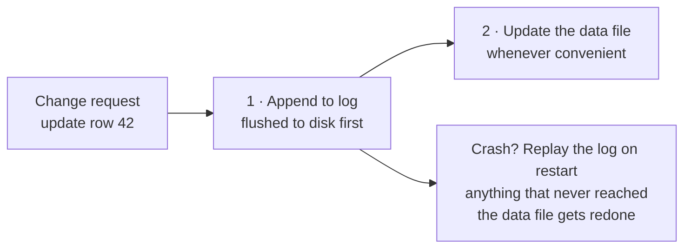

We were talking at the office this week about [Cursor's post on hosting Git at any scale](https://cursor.com/blog/git-at-any-scale), and one line stuck with me:

> The core primitive behind it is a write-ahead log, which we store in S3-compatible object storage.

Hmmmm, A write-ahead log. The same thing I know that Postgres has been doing since forever, holding up Git hosting for millions of repositories.
So I went sitting just read about this again for an evening, and this is a note for myself to relearn this once again.

## The one-line idea

**Before change stuff, first write down what I'm about to do.**

That's the whole idea. Simple as that.

Say I'm deploying a new app on my homelab: pull the image, run the db migration, repoint the proxy, restart. Halfway through, my SSH session drops. Did the migration run? I'm reconstructing what past-me did five minutes ago.

Instead, I write each step down _before_ I run it, "running the migration now", then run it. Session dies, I read my note, and I know exactly where I were.

That note is the write-ahead log. The "ahead" part is the whole point: the line goes down _before_ the real change, not after.



## It's not only about safety

The log is not just for safety, it's also what makes the database _fast_ as well

So now my data lives in pages scattered all over a file, and one transaction might touch a handful of them. Flushing all of that safely on every commit means many separate writes, right?

Imagine what if we utilize this append-only log? So one file, always writing at the end, so a transaction commit becomes: append a small record, flush that as batch, done.

And now One `fsync` instead of many, 10 transactions committing at roughly the same moment can share a single flush (So Postgres calls this [group commit](https://www.postgresql.org/docs/current/wal-configuration.html)), and
10 commits cost about as much as 1. The data pages get updated later, in the background, in bulk.

Log now and apply later. This is durability and speed, not just a safety-net alone anymore.

Clever hah?

> "What is the data page?"
>
> A data page is the fixed-size block a database does all its I/O in. Postgres uses 8KB pages, and every row lives inside one.
>
> Updating a row means reading that page, modifying it in memory, and writing the whole page back later, so a transaction touching rows on 5 pages means 5 scattered writes, which is exactly the cost the WAL collapses into 1 append.

## The rule that makes it work

The log record has to physically hit the disk **before** the data page does.

If we break the order, there is no point of WAL. We'll have a half-baked data file and no note explaining what was supposed to happen. and this is strictly bad-bad than not having a log at all, because I might think I are safe but I am not.

In the Cursor blog, they say one of the rule and we will talk about it next.

> We never acknowledge a push until it has been fully persisted.

## The checkpoint

If I keep appending, the log grows forever, this is not ideally good. Periodically checking the database and mark it as "everything up to this point is safely in the data file now, these log record aren't needed anymore", then we truncated or recycled them.

That's **the checkpoint**.

Another one worth mentioned is "Recycled," though, only once nothing still needs it and it's not just the data files that need it. A lagging replica, or a failing `archive_command`, can pin the log in place:

> "What is the replica?"
>
> A 2+ Postgres instances that stays a live copy by replaying the log as it arrives, it's for crash-recovery, or it's for availability, multiple zone. in this context, we talk about that it marks its position on the log file with "replication slot" a bookmark telling the main server that don't recycle the past yet, I'm reading!

If we kill the replica and forget it, and the bookmark freezes. Postgres keeps its promise: every segment since piles up in `pg_wal` until the disk fills and the database stop working.

Because the checkpoint trims the _head_ of the log but anything pinning the _tail_ win it. This is the classic "the log grew forever anyway" incident.

It's the piece everybody skips when they build this pattern themselves. So I myself haven't have chance handle this myself yet but worth learning anyway

## We use it everyday.

It's pretty common that WAL are in our everyday life and we might know that already.

- **Postgres**: the `pg_wal/` directory. and as we mentioned this thing above already, Postgres uses WAL for feed replicas and use it for point-in-time recovery, e.g. we can ask it to replay up to 3:45pm yesterday, just simple as that.
- **SQLite**: `PRAGMA journal_mode=WAL`, and the `-wal` sidecar file next to the database. Most people flip this on because readers stop blocking writers, without ever asking _why_. So now we know!
- **ext4, NTFS**: in this filesystem, I'm surprised too when I learned this. they call it _journaling_. but more like a close cousin rather than the same thing and by default, they journal filesystem _metadata_, not the file contents, so what we will get is "the filesystem stays consistent," not "our data survives."
- **Kafka**: fundamentally distributed write-ahead log (WAL) and consumer basically read log directly.

## How we use WAL in daily-life?

Because WAL is a concept we may see on the library, database, something in the depth level but it does not mean we can not apply it, right?

And we might be surprised that this kind of pattern already exists in the normal application level. Same shape but different name. We might already use it too.

So at the app level, the "crash" is a process dying, a pod getting evicted, a timeout, a 500 on the request, something loss along the network way or OOM (out-of-memory) occurs.

### First, what "durable" means

Durable means: **it survives the process dying right now.** Not "I called the function." The bytes are somewhere they'll still be after a hard power loss.

The trap is all the layers that _look_ durable and aren't:

- A variable in memory → they gone on crash.
- An `INSERT` sent, transaction not committed → gone.
- Written to a file, sitting in the OS page cache → still gone on power loss. `write()` returned, but the disk never saw it.
- `COMMIT` returned successfully → durable. The database did the `fsync` for us.

For application code: **durable means the database transaction committed.** Until `await tx.commit()` returns, we have nothing. That's the D in ACID.

> Q: ACID what?
>
> A: Atomicity, Consistency, Isolation, and Durability

This is why the WAL rule is "the log entry must be durable before the side effect." It's not _before_ in the order my code reads. It's before in the order things land on disk.

### The problem: dual writes

When two systems can't share a transaction. (2-phase commit exists, technically nobody reaches for it, least of all against someone else's API.)

```ts
await db.orders.update({ where: { id }, data: { status: "shipped" } }); // system A
await slack.chat.postMessage({
	channel: "#fulfillment",
	text: "Order shipped",
}); // system B  ← crash here
```

Two independent failure points, no atomicity. The order says `shipped`, but the #fulfillment channel never hears about it. Nobody packs the box, nobody ships it. Nobody finds out until the customer asks us where the order is.

And we can't reorder a way out of it. And then we try swapping the 2 lines, it just moves the bug and now we announce a shipment we never recorded. 😂

### The fix: make it a single write

We can't make 2 systems atomic but we _can_ make 2 tables **atomic**.

```ts
await db.$transaction(async (tx) => {
	await tx.orders.update({ where: { id }, data: { status: "shipped" } }); // ← system A
	await tx.outbox.create({
		data: { channel: "#fulfillment", text: `Order ${id} shipped` },
	}); // ← push to the outbox
});
```

So now both rows live in the same database, so one `COMMIT` makes them atomic. Either both exist or neither does. There is no in-between state to crash into.

```ts
// Somewhere: the relay worker, on a cron.
const rows = await db.$queryRaw`
	SELECT * FROM outbox
	WHERE published_at IS NULL
	ORDER BY created_at
	LIMIT 100
	FOR UPDATE SKIP LOCKED`; // ← keyword

for (const row of rows) {
	await slack.chat.postMessage({ channel: row.channel, text: row.text });
	await db.outbox.update({
		where: { id: row.id },
		data: { published_at: new Date() },
	});
}
```

- `FOR UPDATE` takes a row lock on everything it selected.
- `SKIP LOCKED` makes a worker that hits an already-locked row skip past it instead of waiting.
- Two workers polling at the same moment each get a different batch, get no duplicates, no outboxing on database. (Run the poll inside a transaction, or the locks release before we've published.)

| Where the crash lands  | Dual write                       | Outbox                                      |
| ---------------------- | -------------------------------- | ------------------------------------------- |
| Between the two writes | Message lost forever, no trace   | Row sits unpublished; next poll picks it up |
| During the publish     | Half-sent, unknown state         | Relay retries until it's marked             |
| Delivery guarantee     | Best-effort: messages can vanish | At-least-once: messages can duplicate       |

We didn't remove the risk, we moved it: the new failure mode is duplication, not loss. The relay might post, then die before marking the row published, and post again.

So the receiving end has to be **idempotent**. A Kafka consumer dedupes. A Slack channel just sees the ping twice. That ordering is deliberate: mark first, and we'd trade duplicates for losses, the one failure we can't recover from.

(And if polling a table offends us, the alternative is tailing Postgres' own WAL with logical decoding (Debezium, essentially) for lower latency, at the price of coupling our delivery pipeline to database internals. Polling is boring and portable. Start there.)

Now the harder case.

> Q: Is this a queue? why call outbox, never heard of it
>
> A: When I read online, I found one cool reddit saying that "Unpopular opinion: Queues are just specialised databases, and the Outbox pattern IS using a database as a queue"
> Or "it's just a database with a specific API on top" and I agreed. But we can call it whatever we like, as long as we are the same page on what problem we're solving.
>
> r: https://www.reddit.com/r/dotnet/comments/1g9lit2/unpopular_opinion_queues_are_just_specialised/

### When the 2nd system is a 3rd-party service

For example, the Slack notification from the relay above. A duplicate ping is not a double charge, but if it's too annoy, surely it gets muted, and the muted channel is where the real alert gets missed and we do not build the Slack notification for just get muted right?

Okie, same shape of thought: LOG the intent, DO the post, APPLY the mark. We already have all 3 steps in the relay worker. The interesting part is what happens when the retry posts again, and that part is not ours to decide. It depends on whether the other side cooperates:

Slack does not cooperate. I checked the API docs for `chat.postMessage`: the args are `channel`, `text`, `blocks`, `metadata`, and friends. No idempotency key, no dedupe, nothing. So a crash between the post and the mark will double-post eventually. All I can do is make the duplicate harmless:

- Keep the text deterministic, so a repeat at least says the same thing.
- Tag retries, so the channel knows it's a resend.
- Or just accept it. Chat tolerates a repeat.

With my approach, I hash the whole text and save it as a idempotent key, so we don't publish same exact message twice and that's my way. I can accept the loss.

#### Q: What about payment? A double charge feels scarier than a duplicate ping

A: Same 3 steps, but here the other side cooperates, if we ask properly:

- **Idempotency key.** We generate it on the LOG step, before the side effect. Stripe (and Square, Adyen, PayPal, all the same shape) saves the first result for that key, so a retry gets the original charge instead of a second one.
- **It's my "I already replayed this entry" marker**, roughly the job an LSN does in a real WAL: during redo, Postgres compares a record's LSN against the target page's to ask "already applied?", a position check, not a transaction-ID check.
- **Keys expire.** Stripe's after about 24 hours, Adyen's 7 to 14 days, so a retry that outlives the window charges twice. One more reason the retry cap matters.
- **APPLY usually arrives as a webhook**: the gateway calls us with `payment_intent.succeeded`, and the retry worker is just the fallback for when webhooks are down. Which I find funny, the gateway's event log is a WAL too, and our webhook handler is the replay.

(The token I remembered from the gateway flow, Stripe's `pm_...`, is a different thing: that's the card itself, tokenized on the client side so raw card data never touches our server. Not a retry marker.)

### Where the analogy gets thin

Now the part that took me longest to get straight.

- A database WAL is idempotent **by construction**: Postgres owns both the log and the data file, one system, one authority, no negotiation. Replaying twice is defined to be safe.
- The outbox has no such luxury. The side effect lives in someone else's system, so replay is only safe if _they_ cooperate: Stripe cooperates if I remember to pass the key, Slack can't cooperate at all.

The safety isn't given to me by the pattern. It's homework.

Same shape, different mechanism. And the difference is exactly the part that pages me at 3am.

**Replay is the normal case, not the exception.** Design for it up front, not after the first duplicate message.

## Don't forget the checkpoint

My `outbox` table needs the equivalent, and this is the part people skip: I ship the happy path, and six months later there's a table with forty million rows in it and a handful of silent orphans.

The retry worker is not optional. Minimum viable version:

```sql
-- Find stuck notifications, safely, across multiple workers.
SELECT *
FROM outbox
WHERE published_at IS NULL
  AND created_at < now() - interval '2 minutes'
ORDER BY created_at
FOR UPDATE SKIP LOCKED
LIMIT 100;
```

(One caveat: a locking clause combined with `ORDER BY` at `READ COMMITTED` can return rows slightly out of order, harmless for a retry worker, but don't build anything that needs strict ordering on this query.)

Checklist for anything I build in this shape:

- **Idempotency key** on every entry, generated _before_ the side effect, when the target supports one.
- **A retry worker**, with backoff and a cap on attempts.
- **A terminal state**: `failed` after N tries, so rows can't retry forever.
- **Cleanup** of completed entries, or the table grows without limit.
- **An alert** on anything `pending` longer than it should be. This is the one that tells me the pattern is broken before a customer does.

## And then Cursor takes it further

Aha, finally, out of the WAL topic and come back to the Cursor blog.

So in a normal database, the data file is the truth and the log protects it. Cursor inverted that. Their WAL lives in S3, and _that's_ the source of truth: the Git repositories on local NVMe disks are, in their words, **"warm caches."**

Once the log is the truth, a pile of hard problems disappear. There's no leader election, because there's no special server to elect:

> There's no state and no consensus here. Any server can be the primary.

**Any replica can be rebuilt by replaying the log.** Losing a machine stops being an incident and starts being a cache miss. And we get history for free:

> Since every push is in the WAL, we can look at every state a repository has ever been in.

That's the same "replay it somewhere else, replay it up to yesterday" bonus Postgres gets from `pg_wal/`, just at a different altitude.

Once the log is durable, ordered, and complete, the "real" data structure is only ever a convenient projection of it. We can throw it away and rebuild it.

Cool, right! 😆

## What I'm taking away

I think personally, It's good once in a while a tech company write a take-away or summary blog post on what they have done. It's a huge effort from many engineers involve and I love to read it.

It also trigger me as well to look back the fundamental and design system of what we already had in the world and learn from it.

WAL (write-ahead log) is something I am surely not learn from school or university (bechelor level), since they are all pretty high-level and yet, this Cursor blog make me go through to deep hole, reading how Postgres works, ask Claude to teach me the concept days over days and experiment it locally, dig into the log file.

It's pretty valuable experience, IMHO, so yeah seems like the evening well-spent.

Thanks everyone who read til this point and yep, if I miss something in the blog and I surely am, please let me know and I am sure updating it.
