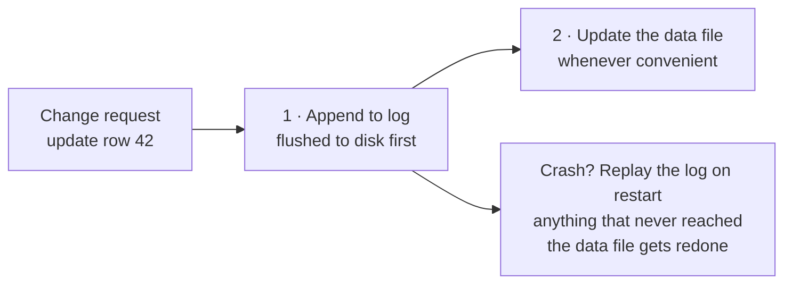
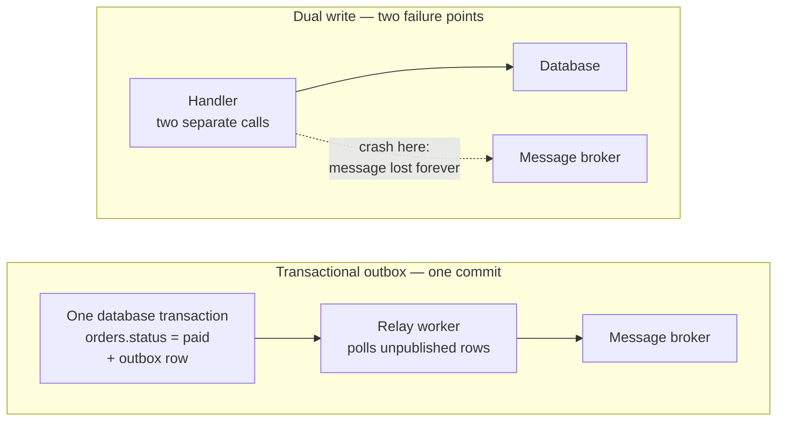

We were talking at the office today about [Cursor's post on hosting Git at any scale](https://cursor.com/blog/git-at-any-scale), and one line stuck with me:

> The core primitive behind it is a write-ahead log, which we store in S3-compatible object storage.

A write-ahead log. The same thing Postgres has been doing since forever, holding up Git hosting for millions of repositories. So I went down the hole for an evening, and this is what I came back with.

## The one-line idea

**Before you change your stuff, first write down what you're about to do.**

That's it. That's the whole thing.

Say you're about to deploy a new self-hosted app on your mini PC / homelab. You need to create an environment for it, pull the new image, run the database migration, point the reverse proxy at the new container, and restart it. Four steps, and a couple of them you really don't want to do twice by accident.

Halfway through, your SSH session drops. Did the migration run? Is the proxy pointing at the old container or the new one? You're now poking around trying to reconstruct what past-you did five minutes ago.

So instead, you keep a note as you go, and you write each line _before_ you run the command, "running the migration now", then run it. Session dies, you read the note, and you know exactly which step you were on. Worst case you redo one step you'd already finished.

That note is the write-ahead log. The "ahead" part is the whole point — the line goes down _before_ the real change, not after.



## It's not only about safety

The part I'd never really thought about: the log isn't just insurance, it's also what makes the database _fast_.

Your real data lives in pages scattered all over a file. A single transaction might touch a handful of them in completely different places. Flushing all of that to disk, safely, on every commit — that's a lot of separate writes to a lot of separate places, and you have to wait for each one to actually land.

The log is append-only. One file, always writing at the end. So a commit becomes: append a small record, flush _that_, done. One `fsync` on one file instead of many scattered ones. Better still, if ten transactions commit at roughly the same moment, the database can batch them into a single flush — Postgres calls this group commit — so ten commits cost about as much as one.

The data pages get updated later, in the background, in bulk, when it's convenient.

Log now, apply later. You get durability _and_ speed, which is not a trade you usually get to make.

## The rule that makes it work

The log record has to physically hit the disk **before** the data page does.

Break that ordering and you've built nothing. You'd have a half-changed data file and no note explaining what was supposed to happen — which is strictly worse than not having a log at all, because now you also think you're safe.

Cursor states their version of the rule about as bluntly as you can:

> We never acknowledge a push until it has been fully persisted.

## One more concept: the checkpoint

If you only ever append, the log grows forever.

So periodically the database says: everything up to _here_ is safely in the data file now. Those log records aren't needed for recovery anymore, so they get truncated or recycled. That's a checkpoint.

Keep this one in mind — it's the piece everybody skips when they build this pattern themselves.

## You've already been using this

- **Postgres** — the `pg_wal/` directory. That same log also feeds streaming replicas and point-in-time recovery, which is a nice bonus: once you have an ordered log of every change, "replay it somewhere else" and "replay it up to 3:47pm yesterday" both fall out for free.
- **SQLite** — `PRAGMA journal_mode=WAL`, and the `-wal` sidecar file next to your database. Most people flip this on because readers stop blocking writers, without ever asking _why_.
- **ext4, NTFS** — they call it journaling. A close cousin rather than the same thing: by default they journal filesystem _metadata_, not your file contents, so what you get is "the filesystem stays consistent," not "your data survives."
- **Kafka** — arguably just "what if the log _was_ the database." Hold that thought.

## Now the part I actually care about

Does this apply to normal application code? The stuff that touches end users?

Yes. Same shape, different name.

At the app level the "crash" isn't a power cut — it's a process dying, a pod getting evicted, a timeout, a 500 halfway through a request. And the "data file" is often some external system you have no way to roll back.

### First, what "durable" means

Durable means: **it survives the process dying right now.** Not "I called the function." The bytes are somewhere they'll still be after a hard power loss.

The trap is all the layers that _look_ durable and aren't:

- A variable in memory → gone on crash.
- An `INSERT` sent, transaction not committed → gone.
- Written to a file, sitting in the OS page cache → still gone on power loss. `write()` returned, but the disk never saw it.
- `COMMIT` returned successfully → durable. The database did the `fsync` for you.

For application code the practical rule is simple: **durable means the database transaction committed.** Until `await tx.commit()` returns, you have nothing. That's the D in ACID.

(With the usual asterisks — that assumes default `synchronous_commit`, and hardware that isn't lying to you about its write cache. Both are worth checking once, then mostly forgetting.)

This is why the WAL rule is "the log entry must be durable before the side effect." It's not _before_ in the order your code reads. It's before in the order things land on disk.

### The problem: dual writes

Two systems can't share a transaction. (Two-phase commit exists, technically — and approximately nobody reaches for it, least of all against someone else's payment API.)

```ts
await db.orders.update({ where: { id }, data: { status: "paid" } }); // system A
await kafka.publish("order.paid", { id }); // system B  ← crash here
```

Two independent failure points, no atomicity. The order says `paid`, but nothing downstream ever hears about it. Shipping never triggers. Nobody finds out until the customer emails you.

And you can't reorder your way out of it. Swapping the two lines just moves the bug — now you announce a payment you never recorded.

### The fix: make it a single write

You can't make two systems atomic. You _can_ make two tables atomic.

```ts
await db.$transaction(async (tx) => {
	await tx.orders.update({ where: { id }, data: { status: "paid" } });
	await tx.outbox.create({ data: { topic: "order.paid", payload: { id } } });
});
```

Both rows live in the same database, so one `COMMIT` makes them atomic. Either both exist or neither does. There is no in-between state to crash into.

```ts
// Elsewhere: the relay worker, on a timer.
const rows = await db.$queryRaw`
	SELECT * FROM outbox
	WHERE published_at IS NULL
	ORDER BY created_at
	LIMIT 100
	FOR UPDATE SKIP LOCKED`;

for (const row of rows) {
	await kafka.publish(row.topic, row.payload);
	await db.outbox.update({
		where: { id: row.id },
		data: { published_at: new Date() },
	});
}
```

`FOR UPDATE` takes a row lock on everything it selected; `SKIP LOCKED` makes a worker that hits an already-locked row skip past it instead of waiting. Two workers polling at the same moment each get a different batch — no duplicates, no queueing. (Run the poll inside a transaction, or the locks release before you've published.)



| Where the crash lands | Dual write | Outbox |
| --- | --- | --- |
| Between the two writes | Message lost forever, no trace | Row sits unpublished; next poll picks it up |
| During the publish | Half-sent, unknown state | Relay retries until it's marked |
| Delivery guarantee | Best-effort — messages can vanish | At-least-once — messages can duplicate |

You didn't remove the risk, you moved it somewhere recoverable. And the new failure mode is duplication, not loss: the relay might publish, then die before marking the row published, and publish again on the next poll. So consumers have to be idempotent.

Now the harder case.

### When the second system is one you don't control

Charging a card is not a message you can re-send casually. It's irreversible and it belongs to someone else.

Same shape though — write the intent first:

```ts
// 1. LOG — a durable record of what I'm about to do.
//    This commits on its own. Do NOT wrap all three steps in one transaction:
//    if you did, a crash would roll back the intent while Stripe still has the charge.
const attempt = await db.paymentAttempts.create({
	data: {
		orderId,
		idempotencyKey: crypto.randomUUID(),
		status: "pending",
		amountCents,
	},
});

// 2. DO — the irreversible part.
const charge = await stripe.paymentIntents.create(
	{ amount: amountCents, currency: "usd", confirm: true },
	{ idempotencyKey: attempt.idempotencyKey },
);

// 3. APPLY — record the outcome.
await db.paymentAttempts.update({
	where: { id: attempt.id },
	data: { status: "succeeded", chargeId: charge.id },
});
```

Crash after step 1? The retry worker finds the `pending` row and retries. The idempotency key means Stripe returns the _original_ charge instead of billing someone twice.

That key is your "I already replayed this entry" marker — doing roughly the job an LSN does in a real WAL.

### Where the analogy gets thin

Now the part that took me longest to get straight.

A database WAL is idempotent _by construction_. Postgres owns the log and the data file, so replaying a record twice is defined to be safe — one system, one authority, no negotiation. Your outbox has no such luxury. The side effect lives in someone else's system, so replay is only safe if _they_ cooperate, via an idempotency key you have to remember to pass. The safety isn't given to you by the pattern. It's homework.

Same shape, different mechanism. And the difference is exactly the part that pages you at 3am.

The practical version: **replay is the normal case, not the exception.** Design for it up front, not after the first duplicate charge.

## Same pattern, other names

Once you see it, it's everywhere:

- **Job queues** — enqueueing _is_ writing ahead. The job row is the log entry; running it is applying it.
- **Sagas / state machines** — persist each step's state before attempting it, so you know where to resume or what to compensate.
- **Offline-first mobile apps** — append mutations to a local queue, show the result optimistically, drain the queue when connectivity comes back. Literally a WAL in IndexedDB.

## Don't forget the checkpoint

The database truncates its log once the data file has caught up. Your `outbox` and `payment_attempts` tables need the equivalent, and this is the part people skip — you ship the happy path, it works, and six months later there's a table with forty million rows in it and a handful of silent orphans nobody ever looked at.

The retry worker is not optional. Minimum viable version:

```sql
-- Find stuck intents, safely, across multiple workers.
SELECT *
FROM payment_attempts
WHERE status = 'pending'
  AND created_at < now() - interval '2 minutes'
ORDER BY created_at
FOR UPDATE SKIP LOCKED
LIMIT 100;
```

One caveat worth knowing: at `READ COMMITTED`, an `ORDER BY` combined with a locking clause can hand you rows slightly out of order, because a row that changed while another session held it gets re-evaluated after the sort. For a retry worker that doesn't matter — oldest-first is a nicety, not a guarantee you're relying on — but don't build anything that needs strict ordering on top of this query.

Checklist for anything you build in this shape:

- **Idempotency key** on every entry, generated _before_ the side effect.
- **A retry worker**, with backoff and a cap on attempts.
- **A terminal state** — `failed` after N tries, so rows can't retry forever.
- **Cleanup** of completed entries, or the table grows without limit.
- **An alert** on anything `pending` longer than it should be. This is the one that tells you the pattern is broken before a customer does.

## And then Cursor takes it further

Here's what made me want to write this up.

In a normal database, the data file is the truth and the log protects it. Cursor inverted that. Their WAL lives in S3, and _that's_ the source of truth — the Git repositories on local NVMe disks are, in their words, **"warm caches."**

Once the log is the truth, a pile of hard problems disappear. There's no leader election, because there's no special server to elect:

> There's no state and no consensus here. Any server can be the primary.

Any replica can be rebuilt by replaying the log. Losing a machine stops being an incident and starts being a cache miss. And you get history for free:

> Since every push is in the WAL, we can look at every state a repository has ever been in.

That's the same "replay it somewhere else, replay it up to yesterday" bonus Postgres gets from `pg_wal/`, just at a different altitude.

So maybe the Kafka joke isn't a joke. Once the log is durable, ordered, and complete, the "real" data structure is only ever a convenient projection of it. You can throw it away and rebuild it.

## What I'm taking away

The question that matters isn't _"did this succeed?"_ It's _"do I have a durable record of what I intended, and can I safely do it again?"_

Concretely, for Monday: go find your dual writes. Grep for every place you write to your database and then call something else — a payment provider, a message broker, an email service, another team's API. Each one is a place where a crash in between leaves you inconsistent with no way to find out.

You probably can't fix all of them. But you can list them, and then you at least know where the bodies are.

You can't make two systems atomic. You _can_ make two tables atomic — so write the intent down next to the data, and let a worker carry it across the boundary.
